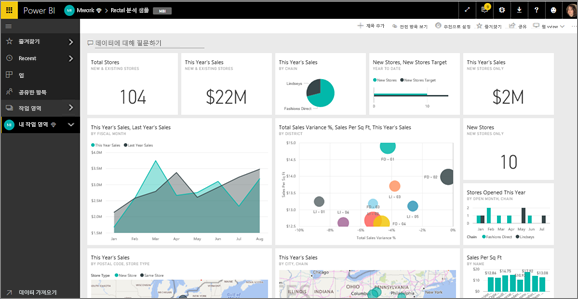
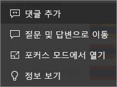
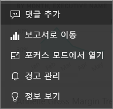

# Power BI의 대시보드 타일
타일은 *설계자*가 대시보드에 고정한 데이터에 대한 스냅숏입니다. 타일은 보고서, 데이터 집합, 대시보드, 질문 및 답변의 질문하기 상자, Excel 및 SSRS(SQL Server Reporting Services) 등에서 만들 수 있습니다.  이 스크린샷은 대시보드에 고정된 여러 타일을 보여 줍니다.

*설계자*는 **타일 추가**를 사용하여 보고서에 고정된 타일 외에 다른 독립 실행형 타일을 대시보드에 직접 추가할 수 있습니다. 독립 실행형 타일에는 텍스트 상자, 이미지, 동영상, 스트리밍 데이터 및 웹 콘텐츠가 포함됩니다.

Power BI의 구성 요소를 이해하는 데 도움이 필요한 경우  [Power BI - 기본 개념](end-user-basic-concepts.md)을 참조하세요.

## 대시보드에서 타일 조작

1. 타일을 가리켜서 줄임표을 표시합니다.
   
    
2. 줄임표를 선택하여 타일 동작 메뉴를 엽니다. 타일을 만드는 데 사용되는 시각적 개체 유형과 메서드에 따라 다른 옵션이 제공됩니다. 사용자에게 표시되는 옵션의 몇 가지 예는 다음과 같습니다.

    - 질문 및 답변을 사용하여 만든 타일
   
        

    - 통합 문서에서 만든 타일
   
        

    - 보고서에서 만든 타일
   
        
   
    여기에서 다음과 같은 작업을 할 수 있습니다.
   
   * [이 타일을 만드는 데 사용된 보고서 열기](end-user-reports.md)   
   
   * [타일을 만드는 데 사용된 질문 및 답변의 질문 열기 ](end-user-reports.md)   
   

   * [이 타일을 만드는 데 사용된 통합 문서 열기](end-user-reports.md)   
    * [포커스 모드로 타일 보기](end-user-focus.md)   
     * [정보 실행](end-user-insights.md) 
    * [댓글을 추가하고 토론 시작](end-user-comment.md)  

3. 동작 메뉴를 닫으려면 캔버스의 빈 영역을 선택합니다.

### 타일 선택(클릭)
타일을 선택하는 경우 다음 작업은 타일을 만든 방법 및 타일에 [사용자 지정 링크](../service-dashboard-edit-tile.md)가 있는지 여부에 따라 달라집니다. 사용자 지정 링크가 있는 경우 타일을 선택하면 해당 링크로 이동합니다. 링크가 없는 경우 타일을 선택하면 타일을 만드는 데 사용되는 보고서, Excel Online 통합 문서, 온-프레미스인 SSRS 보고서 또는 질문 및 답변의 질문으로 이동됩니다.

> [!NOTE]
> 이 동작의 예외는 **타일 추가**를 사용하여 대시보드에 직접 만든 동영상 타일입니다. 이러한 방식으로 만든 동영상 타일을 선택하면 동영상이 대시보드에서 바로 재생됩니다.   
> 
> 

## 고려 사항 및 문제 해결
* 시각화를 만드는 데 사용된 보고서를 저장하지 않은 경우 타일을 선택해도 어떤 동작도 수행되지 않습니다.
* 타일이 Excel Online의 통합 문서에서 만들어졌으며 해당 통합 문서에 대한 권한이 읽기 권한보다 낮은 경우 타일을 선택해도 Excel Online에서 통합 문서가 열리지 않습니다.
* **타일 추가**를 사용하여 대시보드에서 직접 만든 파일에서는, 사용자 지정 하이퍼링크가 설정된 경우 제목, 부제목 및/또는 타일을 선택하면 해당 URL이 열립니다.  그렇지 않은 경우 이미지, 웹 코드 또는 텍스트 상자에 대한 대시보드에서 직접 만든 다음 타일 중 하나를 선택하면 기본적으로 동작을 생성하지 않습니다.
* SSRS 내의 보고서에 대한 권한이 없는 경우 SSRS에서 만든 타일을 선택하면 액세스가 없음을 나타내는 페이지를 생성합니다(rsAccessDenied).
* SSRS 서버가 있는 네트워크에 대한 액세스가 없는 경우 SSRS에서 만든 타일을 선택하면 서버를 찾을 수 없음을 나타내는 페이지를 만듭니다(HTTP 404). 디바이스에서 보고서를 보려면 보고서 서버에 대한 네트워크 액세스가 있어야 합니다.
* 원래 시각화를 사용하여 타일을 변경한 경우 타일이 변경되지 않습니다.  예를 들어 *설계자*가 보고서에서 꺾은선형 차트를 고정한 다음, 꺾은선형 차트를 막대형 차트로 변경하면 대시보드 타일에 꺾은선형 차트가 계속 표시됩니다. 데이터는 새로 고쳐지지만 시각화 유형은 새로 고쳐지지 않습니다.

## 다음 단계
[데이터 새로 고침](../refresh-data.md)

[Power BI - 기본 개념](end-user-basic-concepts.md)
