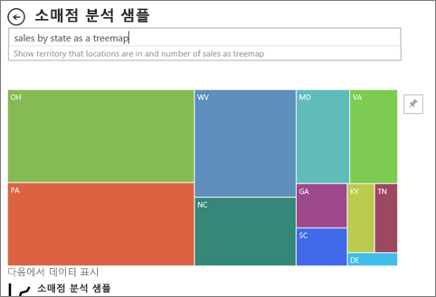

# Power BI의 시각적 개체 유형
시각화 개체는 보고서, 대시보드, 질문 및 답변에서 찾을 수 있습니다. 이러한 시각적 개체 유형 중 일부는 Power BI와 함께 패키지로 제공되고, 일부는 ‘사용자 지정 시각적 개체’입니다.  사용자 지정 시각적 개체는 Power BI 외부에서 ‘보고서 디자이너’가 Power BI 보고서 및 대시보드에 추가할 수 있는 방식으로 생성됩니다.  

이 문서에서는 Power BI 서비스와 함께 패키지로 제공되는 시각적 개체를 간략하게 설명합니다.  자주 사용되는 시각적 개체입니다. 이러한 시각적 개체에 대한 자세한 내용은 [시각적 개체 유형에 대한 Power BI 보고서 ‘디자이너’ 문서](../visuals/power-bi-visualization-types-for-reports-and-q-and-a.md)를 참조하세요. 

> [!NOTE]
> 사용자 지정 시각적 개체에 대해 알아보려면 [Microsoft AppSource](https://appsource.microsoft.com/marketplace/apps?product=power-bi-visuals)의 **Power BI 시각적 개체** 섹션에서 이를 검색합니다. 각 시각적 개체마다 설명, 작성자 정보, 스크린샷 또는 비디오를 찾을 수 있습니다. 

## Power BI에서 사용할 수 있는 시각적 개체 목록
이러한 모든 시각적 개체는 Power BI 대시보드와 보고서에서 찾을 수 있으며, [질문 및 답변에서 지정](end-user-q-and-a.md)할 수 있습니다. 시각적 개체를 조작하는 방법에 대한 자세한 내용은 [보고서, 대시보드 및 앱에서 시각적 개체 조작](end-user-visualizations.md)을 참조하세요.

### 영역형 차트: 기본(겹침) 및 누적

기본 영역 차트는 축과 선 사이의 영역이 채워진 꺾은선형 차트를 기반으로 합니다. 영역형 차트는 시간에 따른 변경 크기를 강조하며 추세 간의 총 가치에 주목하도록 하는 데 사용할 수 있습니다. 예를 들어, 시간에 따른 수익을 나타내는 데이터를 영역형 차트에 그려 총 수익을 강조할 수 있습니다.

### 가로 막대형 및 세로 막대형 차트

 

여러 범주의 특정 값을 살펴보는 데는 가로 막대형 차트가 표준입니다.

### 카드: 단일 숫자

단일 숫자 카드는 단일 팩트, 단일 데이터 포인트를 표시합니다. Power BI 대시보드 또는 보고서에서 총 매출, 연간 시장 점유율, 총 영업 기회와 같이 한 가지 가장 중요한 숫자만 추적하려는 경우가 있습니다.  

### 카드: 여러 행

여러 행 카드는 행마다 하나 이상의 데이터 포인트를 표시합니다.

### 콤보 차트

콤보 차트는 세로 막대형 차트와 꺾은선형 차트를 결합합니다. 두 개의 차트를 하나로 결합하면 데이터를 더 빠르게 비교할 수 있습니다. 콤보 차트는 하나 또는 두 개의 Y축이 있을 수 있으므로 신중히 검토해야 합니다. 

다음과 같은 경우 콤보 차트를 사용하는 것이 좋습니다.
- X축이 동일한 꺾은선형 차트와 세로 막대형 차트가 있는 경우
- 여러 값 범위와 여러 측정값을 비교하는 경우
- 두 측정값 간의 상관관계를 하나의 시각적 개체로 보여 주려는 경우
- 하나의 측정값이 다른 측정값으로 정의된 목표를 충족하는지 확인하는 경우
- 캔버스 공간을 절약하려는 경우

### 도넛형 차트

도넛형 차트는 원형 차트와 비슷합니다.  이 차트는 전체에 대한 부분의 관계를 보여 줍니다. 가운데가 비어 있고 레이블 또는 아이콘이 들어갈 공간이 있다는 점만 다릅니다.

### 깔대기형 차트

깔대기형은 단계와 항목이 한 단계에서 다음 단계로 순차적으로 흐르는 프로세스를 시각화하는 데 도움이 됩니다.  한 가지 예는 잠재 고객으로 시작하여 구매 이행으로 끝나는 영업 프로세스입니다.

예를 들어 다음 단계를 통해 고객을 추적하는 영업 깔때기가 있습니다. 잠재 고객 > 적격 잠재 고객 > 예측 > 계약 > 닫기. 깔때기의 모양은 추적 중인 프로세스의 상태를 한눈에 보여줍니다.
각 깔때기 단계는 합계의 백분율을 나타냅니다. 따라서 대부분의 경우 깔때기형 차트는 깔때기 모양으로, 첫 단계가 가장 크고 뒤로 갈수록 점점 작아집니다. 서양배 모양의 깔때기도 유용합니다. 프로세스의 문제를 식별할 수 있기 때문입니다. 하지만 일반적으로 첫 번째 단계인 "유입" 단계가 가장 큽니다.

### 계기 차트

방사형 계기 차트는 원호 형태로 목표/KPI에 대한 진행률을 측정하는 단일 값을 표시합니다. 목표 또는 목표값은 선(바늘)으로 표시됩니다. 목표에 대한 진행률은 음영으로 표시됩니다. 진행률은 나타내는 값은 호의 내부에 굵게 표시됩니다. 모든 가능한 값은 최소(맨 왼쪽 값)에서 최대 (맨 오른쪽 값)까지 호를 따라 균등하게 분배됩니다.

위의 예제에서는 월별 판매 팀의 평균 판매량을 추적하는 자동차 소매점입니다. 목표는 140이며 검정색 바늘로 표시됩니다. 가능한 최소 평균 판매량은 0이고 최고 200까지 설정했습니다. 파란색 음영은 이번 달의 현재 평균인 약 120대임을 나타냅니다. 다행히 목표 달성을 위해 아직 몇 주가 남았습니다.

방사형 계기는 다음에 매우 적합합니다.
- 목표에 대한 진행률 표시
- KPI와 같은 백분위수 측정값 표시
- 단일 측정값의 상태 표시
- 빠르게 훑어보고 이해할 수 있는 정보 표시

 ### 주요 영향 요인 차트

주요 영향 요인 차트는 선택한 결과 또는 값에 대한 주요 기여자를 표시합니다.

주요 영향 요인을 통해 주요 메트릭에 영향을 주는 요인을 이해하도록 도울 수 있습니다. 예: *두 번째 주문하는 고객에게 영향을 주는 요인* 또는 *지난 6월 매출이 높은 이유* 

### KPI

KPI(핵심 성과 지표)는 측정 가능한 목표에 대해 만든 진행률의 정도를 알리는 시각적 신호입니다. 

다음과 같은 경우 KPI를 사용하는 것이 좋습니다.
- 진행률 측정(앞 또는 뒤 개체 확인)
- 목표에 대한 거리 측정(초과 또는 미만 정도)

### 꺽은선형 차트

꺾은선형 차트는 일반적으로 시간 경과에 따른 전체 값의 전체적인 모양을 강조합니다.

### 지도: 기본 지도

기본 지도를 사용하여 공간 위치와 범주 및 정량 정보를 연결합니다.

### 지도: ArcGIS 맵

ArcGIS 지도와 Power BI의 조합은 지도에서 요소의 표현을 넘어서 완전히 새로운 수준으로 매핑합니다. 기본 지도, 위치 유형, 테마, 기호 스타일 및 참조 계층에 사용 가능한 옵션으로 멋진 정보 제공용 지도 시각적 개체를 만듭니다. 공간 분석과 지도의 신뢰할 수 있는 데이터 계층(예: 인구 조사 데이터)이 조합되어 시각적 개체에서 데이터에 대한 심도 깊은 지식이 제공됩니다.

### 지도: 등치 지역도

등치 지역도는 음영 또는 색조 또는 패턴을 사용하여 특정 값이 특정 지리 또는 지역을 기준으로 어떻게 다른지 표시합니다. 밝게(낮은 빈도/낮음)부터 어둡게(높은 빈도/높음)까지 다양한 음영으로 이러한 상대적 차이를 신속하게 표시합니다.

### 지도: 도형 맵

도형 맵은 색을 사용하여 맵의 영역을 비교합니다. 도형 맵은 데이터 요소의 정확한 지리적 위치를 맵에 표시할 수 없습니다. 대신, 색을 다르게 지정하여 맵 영역의 상대 비교를 표시하는 데 주로 사용됩니다.

### 행렬

행렬 시각적 개체는 계단형 레이아웃을 지원하는 테이블 시각적 개체의 한 유형(아래 "표" 참조)입니다. 종종 보고서 디자이너는 보고서 및 대시보드에 행렬을 포함하여 사용자가 행렬에서 하나 이상의 요소(행, 열, 셀)를 선택하여 보고서에서 다른 시각적 개체를 교차 강조 표시할 수 있도록 합니다.  

### 원형 차트

원형 차트는 전체에 대한 부분의 관계를 보여줍니다. 

### Power Apps 시각적 개체

보고서 디자이너는 Power App을 만들어 Power BI 보고서에 포함할 수 있습니다. 소비자는 Power BI 보고서 내에서 해당 시각적 개체와 상호 작용할 수 있습니다. 

### Q&A 시각적 개체

>[!TIP]
>[대시보드의 질문 및 답변 환경](../power-bi-tutorial-q-and-a.md)과 마찬가지로, 질문 및 답변 시각적 개체를 사용하면 자연어로 데이터에 대해 질문할 수 있습니다. 

자세한 내용은 [Power BI의 질문 및 답변 시각적 개체](../visuals/power-bi-visualization-types-for-reports-and-q-and-a.md)를 참조하세요.

### 리본 차트

리본 차트는 가장 높은 순위를 가지는 데이터 범주(가장 큰 값)를 보여줍니다. 리본 차트는 각 기간에 가장 높은 범위(값)가 항상 위쪽에 표시되어 순위 변경 내용을 효과적으로 표시합니다.

### 분산형, 거품형 및 점 그림 차트

분산형 차트에는 항상 가로 축을 따라 하나의 숫자 데이터 집합을 표시하고 세로 축을 따라 다른 숫자 값 집합을 표시하는 두 개의 값 축이 있습니다. 차트에서 x 및 y 숫자 값의 교차점에 점이 표시되고 이러한 값이 단일 데이터 요소로 결합됩니다. 데이터에 따라 가로 축에 균등 또는 불균등하게 이러한 데이터 요소를 배포할 수 있습니다.

거품형 차트는 데이터 요소를 거품으로 바꾸고 거품 크기로 데이터의 추가 차원을 나타냅니다.

X축을 따라 숫자 또는 범주 데이터를 그릴 수 있다는 점을 제외하면 점 그림 차트는 거품형 차트 및 분산형 차트와 비슷합니다. 이 예제에서는 원 대신 정사각형을 사용하고 X축에 판매량을 그립니다.

### 분산형-고밀도

정의에 따르면, 고밀도 데이터를 샘플링하여 대화형 작업에 응답하는 시각화 개체를 상당히 빠르게 만듭니다. 고밀도 샘플링은 겹치는 지점을 제거하고 데이터 세트의 모든 지점이 시각적 개체에 표시되도록 하는 알고리즘을 사용합니다. 단지 데이터의 대표적인 샘플만 플롯하지 않습니다.  

이를 통해 전반적인 데이터 세트에서 중요한 포인트에 대한 응답성, 표현 및 명확한 보존의 최적 조합을 보장할 수 있습니다.

### 슬라이서(Slicers)

슬라이서는 페이지의 다른 시각적 개체를 필터링하는 데 사용할 수 있는 독립 실행형 차트입니다. 슬라이서는 다양한 형식(범주, 범위, 날짜 등)으로 제공되며 사용 가능한 값 중 하나, 여러 가지 또는 모두를 선택할 수 있도록 형식을 지정할 수 있습니다. 

다음과 같은 경우 슬라이서를 사용하는 것이 좋습니다.
- 보고서 캔버스에서 자주 사용되거나 중요한 필터를 표시하여 더 쉽게 액세스할 수 있게 하려는 경우
- 드롭다운 목록을 열지 않고도 현재 필터링된 상태를 더 쉽게 보려는 경우
- 데이터 테이블에서 불필요하고 숨겨진 열을 필터링하는 경우
- 중요한 시각적 개체 옆에 슬라이서를 배치하여 더 집중된 보고서를 만드는 경우

### 독립 실행형 이미지

독립 실행형 이미지는 보고서 또는 대시보드에 추가된 그래픽입니다. 

### 테이블

테이블은 논리적으로 연속된 행과 열에서 관련된 데이터를 포함하는 표입니다. 머리글과 합계에 대한 행이 포함될 수도 있습니다. 테이블은 단일 범주에 대한 많은 값을 볼 수 있는 정량적 비교와 잘 작동합니다. 예를 들어 이 테이블은 범주에 대한 5개의 서로 다른 측정값을 표시합니다.

다음과 같은 경우 테이블은 좋은 선택입니다.
- 자세한 데이터 및 정확한 값을 보고 비교(시각적 표현 대신)
- 테이블 형식으로 데이터를 표시
- 숫자 데이터를 범주별로 표시

### 트리맵

트리맵은 값을 나타내는 크기와 색이 지정된 사각형으로 구성된 차트입니다.  이 차트는 사각형이 주 사각형 내에 중첩되는 계층 구조 형식일 수 있습니다. 각 사각형 내부의 공간은 측정되는 값을 기반으로 하여 할당됩니다. 사각형은 크기순으로 가장 큰 것이 왼쪽 위, 가장 작은 것이 오른쪽 아래에 정렬됩니다.

다음과 같은 경우 트리맵을 사용하는 것이 좋습니다.
- 많은 양의 계층적 데이터를 표시하는 경우
- 가로 막대형 차트로는 많은 수의 값을 효과적으로 처리할 수 없는 경우
- 각 부분과 전체 간의 비율을 표시하는 경우
- 계층 구조의 각 수준의 범주에 걸쳐 측정값이 분포되는 패턴을 표시하는 경우
- 크기 및 색 구분을 사용하여 특성을 표시하는 경우
- 패턴, 이상값, 가장 중요한 기여자 및 예외를 강조하는 경우

### 폭포 차트

폭포 차트는 값을 더하거나 뺄 때의 누계를 보여 줍니다. 초기 값(예: 순수입)이 일련의 양수 및 음수 변경에 어떻게 영향을 받는지 이해하는 데 유용합니다.

세로형 막대는 색으로 구분되어 증가 및 감소를 빠르게 구분할 수 있습니다. 중간 값 열이 부동 세로형 막대인 반면, 초기 및 최종 값 세로형 막대는 종종 가로축에서 시작합니다. 이러한 "모양" 때문에 폭포 차트를 브리지 차트라고도 합니다.

다음과 같은 경우 폭포 차트를 사용하는 것이 좋습니다.
- 시간과 범주에 따라 측정값이 변경되는 경우
- 합계 값에 영향을 주는 주요 변경을 감사하는 경우
- 다양한 수익원과 총 수익(또는 손실)을 표시하여 회사의 연간 수익을 계산하는 경우
- 1년 동안 회사의 시작 및 종료 인력을 나타내기 위해
- 매달 벌고 쓰는 금액이 얼마인지 그리고 계좌의 잔고가 얼마인지를 시각화하기 위해

## 질문 및 답변에 사용할 시각적 개체 알리기
Power BI 질문 및 답변을 사용하여 자연어 쿼리를 입력할 때 쿼리에 시각적 개체 유형을 지정할 수 있습니다.  다음은 그 예입니다.

"***sales by state as a treemap***"

## 다음 단계
[보고서, 대시보드 및 앱에서 시각적 개체 조작](end-user-visualizations.md)    
[sqlbi.com에서 올바른 시각적 개체 참조](https://www.sqlbi.com/wp-content/uploads/videotrainings/dashboarddesign/visuals-reference-may2017-A3.pdf)
