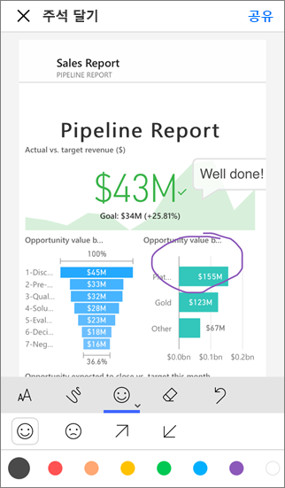
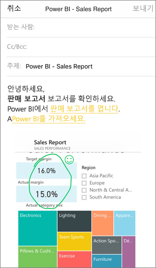

# Power BI 모바일 앱에서 타일, 보고서 또는 시각적 개체에 주석 달기 및 공유
적용 대상:

|  |  |  |  |
|:--- |:--- |:--- |:--- |
| iPhone |iPad |Android 휴대폰 |Android 태블릿 |

iOS 및 Android 디바이스용 Power BI 모바일 앱에서 타일, 보고서 또는 시각화 개체의 스냅숏에 주석을 달고 공유할 수 있습니다. 받는 사람은 링크와 함께 메일을 보낸 시점을 정확하게 볼 수 있습니다. 타일의 스냅숏은 동일한 전자 메일 도메인의 동료뿐 아니라 누구에게든 보낼 수 있습니다. 공유하기 전에 주석(줄, 텍스트 또는 스탬프)을 추가할 수 있습니다.

*주석이 달린 보고서*

타일, 보고서 또는 시각적 개체의 스냅숏을 사용한 메일에는 Power BI 서비스에 있는 실제 개체에 대한 링크가 포함되어 있습니다([https://powerbi.com](https://powerbi.com)). 사용자에게 Power BI Pro 라이선스가 있거나 콘텐츠가 [프리미엄 용량](../../service-premium.md)에 있고 이미 해당 항목을 공유한 경우 수신자가 링크를 클릭하여 해당 타일, 보고서 또는 시각적 개체로 바로 이동할 수 있습니다. 

[Windows 10 디바이스용 Power BI 모바일 앱에서 타일을 공유](mobile-windows-10-phone-app-get-started.md)할 수는 있으나 주석을 추가할 수는 없습니다.

## 주석을 추가할 타일 열기
1. 타일을 탭하여 포커스 모드로 엽니다.
2. 주석 달기 아이콘 탭  타일의 오른쪽 위 모퉁이에서.
3. [타일에 주석을 달고 공유](mobile-annotate-and-share-a-tile-from-the-mobile-apps.md#annotate-and-share-the-tile-report-or-visual)할 준비가 되었습니다.

## 주석을 추가할 보고서 열기
1. 보고서를 엽니다. 
2. 주석 달기 아이콘 탭  보고서의 오른쪽 위 모퉁이에서.
3. [보고서에 주석을 달고 공유](mobile-annotate-and-share-a-tile-from-the-mobile-apps.md#annotate-and-share-the-tile-report-or-visual)할 준비가 되었습니다.

## 주석을 추가할 시각적 개체 열기
1. 보고서에서 시각적 개체를 탭한 다음 확장 아이콘을 탭하여 포커스 모드로 엽니다. 
   
    
2. 주석 달기 아이콘 탭  시각적 개체의 오른쪽 위 모퉁이에서.
3. [시각적 개체에 주석을 달고 공유](mobile-annotate-and-share-a-tile-from-the-mobile-apps.md#annotate-and-share-the-tile-report-or-visual)할 준비가 되었습니다.

## 타일, 보고서 또는 시각적 개체 주석 달기 및 공유
1. 주석을 다는 방법은 다음과 같습니다.  
   
   
   
   *iPhone 및 iPad에서 주석 표시줄*
   
   
   
   *Android 디바이스에서 주석 표시줄*
   
   * 다양한 색과 두께의 줄을 그리려면 구불구불한 선 모양 아이콘을 탭하고 색과 너비를 선택한 다음 그립니다.  
   * 설명을 입력하려면 **AA**를 탭하고 텍스트 크기와 색을 선택한 다음 입력합니다.  
   * 타일에 스탬프(예: 이모티콘)를 붙여넣으려면 웃는 얼굴을 탭하고 색을 선택한 다음 원하는 위치를 탭합니다.   
2. 주석을 추가한 후 오른쪽 위 모서리에 있는 **공유**를 탭합니다.
3. 메일 앱을 열고 수신자의 이름을 입력하고 원하는 경우 메시지를 수정합니다.  
   
   
   
   메일에는 특정 타일, 보고서 또는 시각적 개체에 대한 이미지 및 링크가 있습니다. 
4. **송신**을 누릅니다.

## 다음 단계
* [Power BI 모바일 앱에서 대시보드 공유](mobile-share-dashboard-from-the-mobile-apps.md)
* 궁금한 점이 더 있나요? [Power BI 커뮤니티에 질문합니다.](http://community.powerbi.com/)

