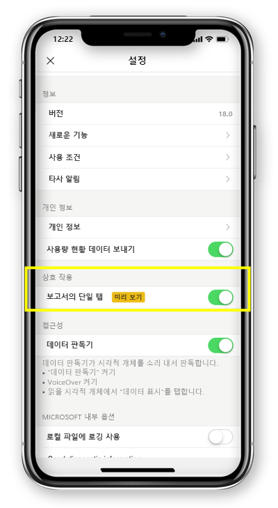

# 단일 탭 또는 이중 탭으로 보고서 상호 작용 구성
적용 대상:

|  |  | 
|:--- |:--- |
| iPhone |Android 휴대폰 |

Power BI 보고서는 해당 데이터의 다양한 결과 및 통찰력을 나타내는 시각적 개체가 포함된 데이터의 상호작용형 보기입니다.

데이터와 상호 작용하는 방법을 구성할 수 있습니다. 단일 탭 상호 작용 또는 이중 탭 상호 작용을 사용할지 여부를 결정할 수 있습니다.

* 이중 탭 상호 작용을 통해 시각적 개체의 첫 번째 탭을 선택하면 시각적 개체의 두 번째 탭만 슬라이서 항목 선택, 교차 강조 표시 또는 링크, 단추 등을 클릭하여 동작 자체를 수행합니다.

* 단일 탭 상호 작용을 사용하면 하나의 탭이 시각적 개체 선택 및 작업 실행 모두를 수행합니다.

iOS용 Power BI 앱 버전 18.0과 Android용 112540부터 모든 신규 설치는 기본 동작으로 단일 탭으로 구성됩니다.
이미 Power BI가 휴대폰에 설치되어 있으며 이러한 새 버전으로 업그레이드하려는 사용자는 단일 탭으로 전환할 수 있습니다.

## 상호 작용 동작 변경

상호 작용 동작을 변경하려면 앱 설정으로 이동하여 단일 탭 상호 작용을 설정/해제합니다.

이 문서는 가로 및 휴대폰 보고서 모두에 적용됩니다.

## 다음 단계
* [휴대폰에 최적화된 Power BI 보고서 보기 및 상호 작용](mobile-apps-view-phone-report.md)
* 궁금한 점이 더 있나요? [Power BI 커뮤니티에 질문합니다.](https://community.powerbi.com/)

