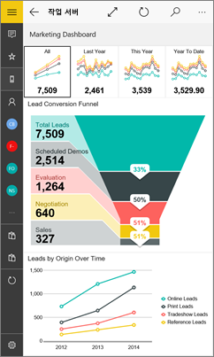
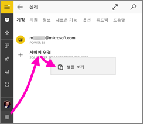
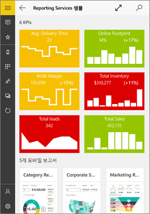
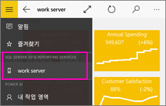
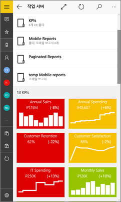
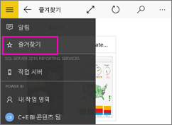
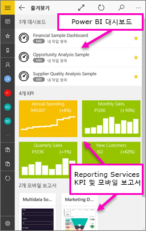
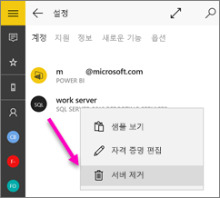

# Windows 10 Power BI 모바일 앱에서 Reporting Services(SSRS) 모바일 보고서 및 KPI 보기
SQL Server 2016 Reporting Services에서 Windows 10용 Power BI 모바일 앱은 중요한 온-프레미스 비즈니스 정보에 대한 터치 기반의 라이브 모바일 액세스를 제공합니다. 

## 먼저 수행할 중요한 작업
SQL Server 2016 Enterprise Edition 모바일 보고서 게시자를 사용하여 [Reporting Services 모바일 보고서를 만들고](https://msdn.microsoft.com/library/mt652547.aspx) [Reporting Services 웹 포털](https://msdn.microsoft.com/library/mt637133.aspx)에 게시합니다. 웹 포털에 KPI를 만듭니다. 폴더에 정리하고 쉽게 찾을 수 있도록 즐겨찾기를 표시합니다. 

그런 다음 Windows 10용 Power BI 모바일 앱에서, 폴더에 정리되어 있거나 즐겨찾기에 모아놓은 모바일 보고서와 KPI를 봅니다. 

> [!NOTE]
> 디바이스에서 Windows 10이 실행되고 있어야 합니다. RAM 1GB, 내부 저장소 8GB 이상인 디바이스에서 앱이 최적으로 작동합니다.
> 
> 

## SQL Server 2016 Reporting Services 서버 없이 샘플을 탐색합니다.
Reporting Services 웹 포털에 대한 액세스가 없더라도, Reporting Services 모바일 보고서의 기능을 탐색할 수 있습니다.

1. Windows 10 디바이스에서 Power BI 앱을 엽니다.
2. 왼쪽 위 모퉁이에서  전역 탐색 단추를 탭합니다.
3. **설정** 아이콘 을 탭하고 **서버에 연결**을 마우스 오른쪽 단추로 클릭하거나 탭한 채로 유지한 다음 **샘플 보기**를 탭합니다.
   
   
4. 소매 보고서 또는 판매 보고서 폴더를 열어 KPI 및 모바일 보고서를 탐색합니다.
   
   

KPI 및 모바일 보고서와 상호 작용할 샘플을 찾아봅니다.

## Reporting Services 보고서 서버에 연결
1. 왼쪽 탐색 모음의 맨 아래에 있는 **설정** 을 탭합니다.
2. **서버에 연결**을 탭합니다.
3. 서버 주소, 사용자 이름, 암호를 입력합니다. 서버 주소에 대해 다음 형식을 사용합니다.
   
     `http://<servername>/reports` 또는   `https://<servername>/reports`
   
   > [!NOTE]
   > 연결 문자열의 시작 부분에 **http** 또는 **https**를 포함합니다.
   > 
   > 
   
    원하는 경우, **고급 옵션**을 눌러서 서버에 이름을 지정합니다.
4. 확인 표시를 탭하여 연결합니다. 
   
   이제 왼쪽 탐색 모음에서 서버를 참조합니다.
   
   
   
   >[!TIP]
   >언제든지 전역 탐색 단추 를 탭하면 Power BI 서비스에서 Reporting Services 모바일 보고서와 대시보드 간에 이동할 수 있습니다. 
   > 

## Power BI 앱에서 Reporting Services KPI와 모바일 보고서 보기
Reporting Services KPI 및 모바일 보고서는 Reporting Services 웹 포털에 있을 때와 같은 폴더에 표시됩니다.

* 포커스 모드로 보려면 KPI를 누릅니다.
  
    
* 모바일 보고서를 눌러서 열고 Power BI 앱에서 상호 작용합니다.
  
    

## 즐겨찾는 KPI 및 보고서 보기
Reporting Services 웹 포털에 KPI와 모바일 보고서를 즐겨찾기로 표시해 놓으면 Windows 10 디바이스에서 Power BI 즐겨찾기 대시보드와 보고서를 통해 한 폴더에서 편리하게 볼 수 있습니다.

* **즐겨찾기**를 누릅니다.
  
   
  
   웹 포털의 즐겨찾기가 이 페이지에 모두 있습니다.
  
   

자세한 내용은 [Power BI 모바일 앱의 즐겨찾기](mobile-apps-favorites.md)를 읽어보세요.

## 보고서 서버에 대한 연결을 제거합니다.
Power BI 모바일 앱에서 한 번에 하나의 보고서 서버에 연결될 수 있습니다. 다른 서버에 연결하려는 경우 현재 서버에서 분리해야 합니다.

1. 왼쪽 탐색 모음의 맨 아래에 있는 **설정** 을 탭합니다.
2. 연결하지 않을 서버 이름을 탭한 채로 있습니다.
3. **서버 제거**를 탭합니다.
   
    

## Reporting Services 모바일 보고서 및 KPI 만들기
Power BI 모바일 앱에서 Reporting Services KPI와 모바일 보고서를 만들지 않습니다. SQL Server 모바일 보고서 게시자 및 SQL Server 2016 Reporting Services 웹 포털에서 만듭니다.

* [Reporting Services 모바일 보고서를 만들](https://msdn.microsoft.com/library/mt652547.aspx)어서, Reporting Services 웹 포털에 게시합니다.
* [Reporting Services 웹 포털에서 KPI](https://msdn.microsoft.com/library/mt683632.aspx)를 만듭니다.

## 다음 단계
* [Windows 10용 Power BI 모바일 앱 시작](mobile-windows-10-phone-app-get-started.md)  
* [Power BI란?](../../power-bi-overview.md)  
* 궁금한 점이 더 있나요? [Power BI 커뮤니티에 질문합니다.](http://community.powerbi.com/)

