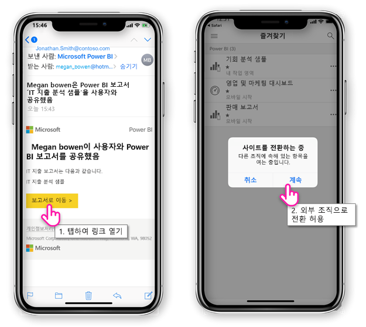
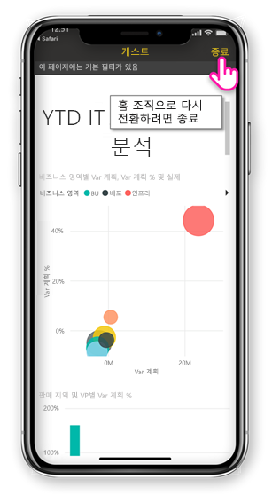
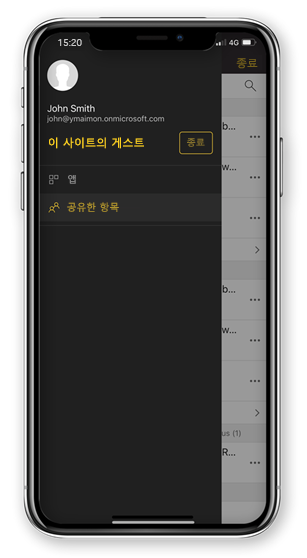

# 외부 조직의 사용자와 공유하는 Power BI 콘텐츠 보기

Power BI는 조직 외부의 게스트 사용자에게 Power BI 콘텐츠를 안전하게 배포할 수 있도록 Azure Active Directory B2B(Azure AD B2B)와 통합됩니다. 그리고 외부 게스트 사용자는 Power BI 모바일 앱을 사용하여 동료가 공유하는 Power BI 콘텐츠에 액세스할 수 있습니다. 

적용 대상:

|  |  |  |  |
|:--- |:--- |:--- |:--- |
| iPhone |iPad |Android 휴대폰 |Android 태블릿 |

## 공유 콘텐츠 액세스

**첫째, 사용자와 항목을 공유한 외부 조직의 사용자가 필요합니다.** 같은 조직 또는 외부 조직의 다른 사람이 [사용자와 항목을 공유](../../service-share-dashboards.md)할 때, 공유 항목에 대한 링크가 포함된 메일을 받게 됩니다. 모바일 장치에서 해당 링크를 따라 Power BI 모바일 앱을 엽니다. 앱이 외부 조직에서 공유된 항목이라는 것을 인식하는 경우, 앱은 사용자의 ID를 사용하여 해당 조직에 다시 연결합니다. 앱은 해당 조직에서 사용자와 공유한 모든 항목을 로드합니다.

> [!NOTE]
> 외부 게스트 사용자로 사용자와 공유하는 첫 번째 항목의 경우 브라우저에서 초대를 요청해야 합니다. Power BI 앱에서는 초대를 요청할 수 없습니다.

외부 조직에 연결되어 있는 동안 앱에 검은색 머리글이 표시됩니다. 이 머리글은 홈 조직에 연결되지 있지 않다는 것을 나타냅니다. 홈 조직에 다시 연결하려면 게스트 모드를 종료합니다.

외부 조직에 연결하려면 Power BI 아티팩트 링크가 필요하지만, 앱이 전환되면 공유되는 모든 항목(전자 메일에서 열린 항목 뿐만 아니라)에 액세스할 수 있습니다. 외부 조직에서 액세스할 수 있는 모든 항목을 보려면, 앱 메뉴로 이동하고 **공유한 항목**을 선택합니다. **앱** 아래에서 사용할 수 있는 앱도 찾을 수 있습니다.

## 제한 사항

- Power BI 모바일과 Azure AD B2B에서 조건부 액세스 및 기타 Intune 정책은 지원되지 않습니다. 즉, 정책이 있는 경우 앱은 홈 조직의 정책만 적용합니다.
- 푸시 알림은 홈 조직 사이트에서만 받습니다(사용자가 외부 조직에 게스트로 연결되어 있을 때라도). 알림을 열면 앱은 사용자의 홈 조직 사이트로 다시 연결합니다.
- 사용자가 앱을 종료하는 경우, 앱을 다시 열 때 사용자의 홈 조직으로 자동으로 연결합니다.
- 외부 조직에 연결하는 경우 일부 동작이 사용 중지됩니다: 즐겨찾기 항목, 데이터 경고, 댓글 달기 및 공유.
- 외부 조직에 연결되어 있는 동안에는 오프라인 데이터를 사용할 수 없습니다.
- 회사 포털 앱이 장치에 설치된 경우, 장치가 등록되어야 합니다.
