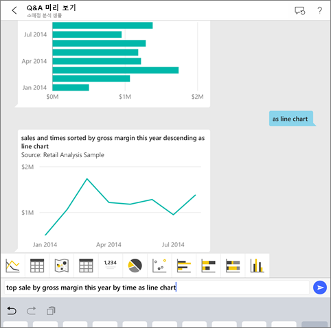
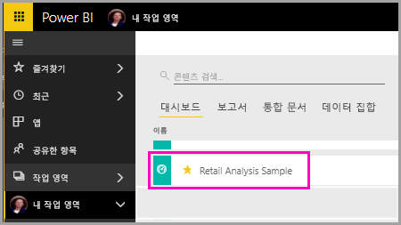
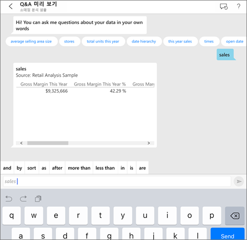
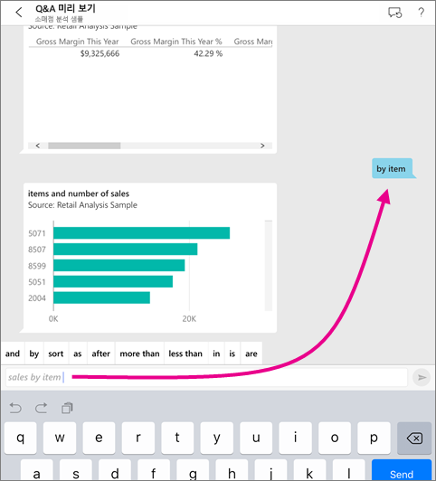
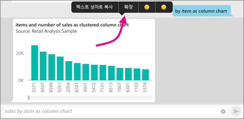
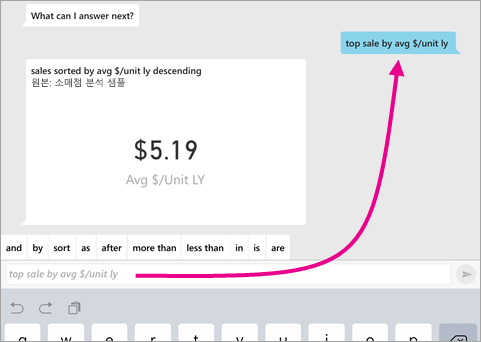
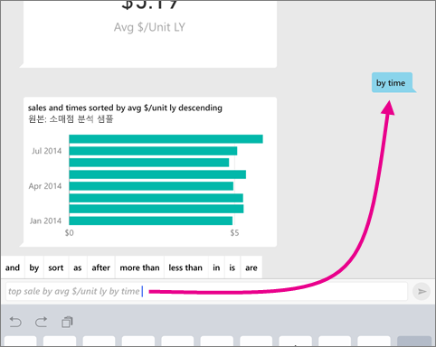
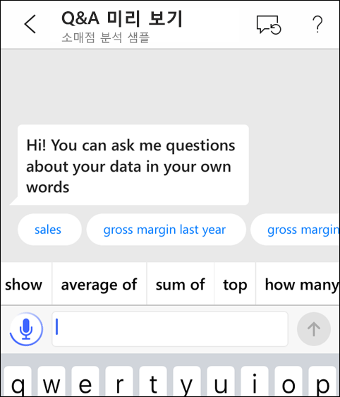
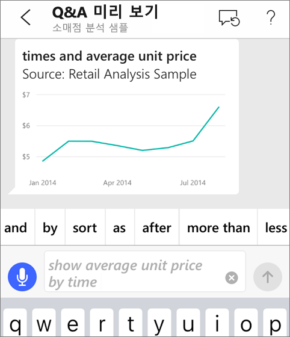
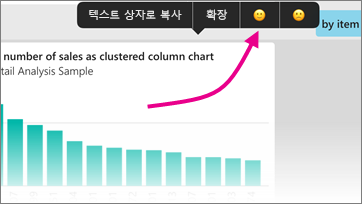

# iOS 앱의 질문 및 답변 가상 분석가 - Power BI

데이터에 대해 가장 쉽게 알 수 있는 방법은 고유한 단어로 질문하는 것입니다. 이 문서에서는 iPad, iPhone 및 iPod Touch의 Microsoft Power BI 모바일 앱에서 질문 및 답변 가상 분석가를 통해 샘플 데이터에 대해 질문을 하고 주요 인사이트를 확인합니다. 

적용 대상:

|  |  |
|:--- |:--- |
| iPhone |iPad |

질문 및 답변 가상 분석가는 Power BI 서비스[(https://powerbi.com)](https://powerbi.com)에서 기본 질문 및 답변 데이터에 액세스하는 기존 BI 환경입니다. 이 환경이 데이터 인사이트를 제안하면 사용자가 자신만의 질문을 입력하거나 말할 수 있습니다.

아직 Power BI에 등록하지 않은 경우 시작하기 전에 [평가판에 등록합니다](https://app.powerbi.com/signupredirect?pbi_source=web).

## 필수 조건

### iOS용 Power BI 앱 설치
Apple App Store에서 iPad, iPhone 또는 iPod Touch로 [iOS 앱을 다운로드](https://go.microsoft.com/fwlink/?LinkId=522062 "iPhone 앱 다운로드")합니다.

iOS용 Power BI 앱을 지원하는 버전은 다음과 같습니다.
- iOS 10 이상이 설치된 iPad.
- iOS 10 이상이 설치된 iPhone 5 이상. 
- iOS 10 이상이 설치된 iPod Touch.

### 샘플 다운로드
첫 번째 단계는 Power BI 서비스에 소매점 분석 및 기회 분석 샘플을 다운로드하는 것입니다.

**소매점 분석 샘플 가져오기**

1. Power BI 서비스(app.powerbi.com)를 열고 로그인합니다.

2. 탐색 창에서 **작업 영역**, **내 작업 영역**을 선택합니다.

3. 왼쪽 아래 모서리에서 **데이터 가져오기**를 선택합니다.
   
    

3. 데이터 가져오기 페이지에서 **샘플** 아이콘을 선택합니다.
   
   

4. **소매점 분석 샘플**을 선택합니다.
 
    
 
8. **연결**을 선택합니다.  
  
   
   
5. Power BI에서 콘텐츠 팩을 가져와 새 대시보드, 보고서 및 데이터 세트를 현재 작업 영역에 추가합니다.
   
   

**기회 분석 샘플 가져오기**

- 소매점 분석 샘플에 대해 수행한 것과 동일한 단계를 수행하되 4단계에서 **기회 분석 샘플**을 선택합니다.

    
  
iOS 디바이스에서 샘플을 볼 준비가 되었습니다.

## iPhone 또는 iPad에서 질문하기
1. 사용자의 iPhone 또는 iPad에서 전역 탐색 단추  > **작업 영역** > **내 작업 영역**을 탭하고 소매점 분석 샘플 대시보드를 엽니다.

2. 페이지 아래쪽(iPad의 경우 페이지 위쪽)에 있는 작업 메뉴에서 질문 및 답변 가상 분석가 아이콘 을 누릅니다.
     질문 및 답변 가상 분석가에서 시작하기 위한 몇 가지 제안을 제공합니다.
3. **Show**를 누르고, 제안 목록의 **Sales**, **보내기** 을 차례로 탭합니다.

    
4. 키워드에서 **by**을 누른 다음 제안 목록에서 **item** > **보내기** 를 탭합니다.

    
5. 키워드에서 **as**를 누르고 열 차트 아이콘 을 탭한 다음 **보내기** 를 누릅니다.
6. 결과 차트를 길게 누른 다음 **확장**을 누릅니다.

    

    차트는 앱의 포커스 모드에서 열립니다.

    
7. 왼쪽 위 모서리에 있는 화살표를 눌러 질문 및 답변 가상 분석가 채팅 창으로 돌아갑니다.
8. 텍스트를 삭제하고 다시 시작하려면 텍스트 상자의 오른쪽에 있는 X를 누릅니다.
9. 새 질문을 해 보세요. 키워드에서 **top**를 탭하고 **sale by avg $/unit ly** > **보내기** 를 탭합니다.

    
10. 키워드에서 **by**을 선택하여 맨 위에 있는 제안 목록에서 **time** > **보내기**를 누릅니다.

     
11. **as**를 입력하고, 제안 목록에서 꺾은선형 차트 아이콘  > **보내기** 를 선택합니다.

    

## 말하기로 질문 시도
이제 Power BI 모바일 앱에서 입력 대신 말하기로 데이터에 대한 질문을 할 수 있습니다.

1. 페이지 아래의 작업 메뉴에서 질문 및 답변 가상 분석가 아이콘 을 탭합니다(iPad 상에서 페이지 맨 위).
2. 마이크 아이콘 을 누릅니다.

    

1. 마이크 아이콘이 활성 상태가 되면 말합니다. 예를 들어 "average unit price by time"를 말한 후 **송신** 을 누릅니다.

    

### 음성을 텍스트로 변환을 사용할 때 개인 정보에 대한 질문은?
Apple iOS 개발자 가이드의 [iOS의 새로운 기능](https://go.microsoft.com/fwlink/?linkid=845624)(영문)에서 음성 인식 섹션을 참조하세요.

## 도움말 및 피드백
* 도움이 필요하십니까? "Hi" 또는 "Help"라고만 하면 새 질문 시작에 도움을 얻을 수 있습니다.
* 결과에 대한 피드백을 제공하시겠습니까? 차트나 기타 결과를 길게 누른 다음 웃는 얼굴이나 찡그린 얼굴을 누릅니다.

    

    사용자 피드백은 익명으로 개선 및 질문에 대한 대답에 도움이 됩니다.

## 질문 및 답변 가상 분석가 결과 향상
좀더 구체적인 질문을 하거나 데이터 세트를 향상시켜 데이터 세트에서 질문 및 답변 가상 분석가를 사용하는 경우 사용자와 고객이 얻는 결과를 향상시킬 수 있습니다.

### 질문하는 방법
* iOS 모바일 앱의 Power BI 서비스 또는 질문 및 답변 가상 분석가에서 이러한 [질문 및 답변에서 질문하기 팁](../end-user-q-and-a-tips.md)을 따르세요.

### 데이터 세트를 향상시키는 방법
* Power BI Desktop 또는 Power BI 서비스에서 데이터 세트를 향상시켜 [데이터가 질문 및 답변과 질문 및 답변 가상 분석가에서 잘 작동하도록](../../service-prepare-data-for-q-and-a.md) 합니다.

## 다음 단계
* [Power BI 서비스에서 Q&A](../end-user-q-and-a.md)
* 궁금한 점이 더 있나요? [Power BI 커뮤니티의 모바일 앱 섹션](https://go.microsoft.com/fwlink/?linkid=839277) 확인
