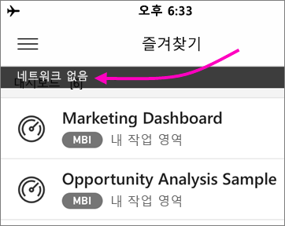

# Power BI 모바일 앱에서 오프라인 데이터 보기
적용 대상:

|  |  |  |  |  |
|:--- |:--- |:--- |:--- |:--- |
| iPhone |iPad |Android 휴대폰 |Android 태블릿 |Windows 10 디바이스 |

모바일 브라우저가 아닌 모바일 앱에서 Power BI 보기를 사용하는 이점은 네트워크에 연결되지 않을 때에도 데이터를 볼 수 있다는 점입니다. 

기본적으로 Power BI는 데이터를 자주 새로 고치므로 비즈니스 질문에 대해 통근이나 출장 중에도 언제든지 최신 답변을 얻을 수 있습니다.

## 오프라인 상태에서 데이터 액세스
오프라인 상태인 경우, 모바일 앱에서 이전에 액세스한 모든 대시보드에 액세스하고 상호 작용할 수 있습니다.

또한 모바일 앱에서 이전에 액세스한 모든 Power BI 보고서에 대한 읽기 전용 액세스 권한이 있습니다. 전체 보고서를 확인할 수 있지만 보고서에서 필터링이나 교차 필터링, 슬라이서를 사용할 수 없습니다.

## 백그라운드 데이터 새로 고침
백그라운드 새로 고침은 지난 2주 동안 보았던 대시보드와 보고서뿐만 아니라 즐겨찾는 대시보드도 Power BI 서비스(데이터 원본이 아님)의 데이터로 업데이트합니다. WiFi에 연결한 경우 백그라운드 새로 고침은 2시간마다 업데이트됩니다. 그렇지 않으면 3G 네트워크상에 있는 경우 Power BI는 콘텐츠를 24시간마다 업데이트합니다.

예를 들어 네트워크 사용량을 방지하기 위해 백그라운드 새로 고침을 끌 수 있습니다. 디바이스에서 설정을 확인합니다.

> [!NOTE]
> iOS 디바이스에서 Power BI 모바일 앱을 사용하고 조직에서 Microsoft Intune MAM을 구성한 경우 백그라운드 데이터 새로 고침이 해제됩니다. 다음 번에 앱을 시작하면 Power BI에서 웹의 Power BI 서비스로부터 데이터를 새로 고칩니다.
> 
> [Microsoft Intune을 사용하여 Power BI 모바일 앱 구성](../../service-admin-mobile-intune.md)에 대해 자세히 알아보세요. 
> 
> 

## 오프라인 표시기
Power BI는 오프라인으로 사용할 수 없는 대시보드, 보고서 및 타일이 누락된 표시기 뿐만 아니라 오프라인 모드에서 내부 및 외부로 이동하는 경우 지우기 표시기를 제공합니다.

## 제한 사항
모바일 디바이스의 Power BI가 오프라인 상태인 경우 다음과 같은 제한이 발생할 수 있습니다.

* Power BI는 최대 250MB의 데이터를 오프라인으로 캐시할 수 있습니다.
* Bing 지도 타일, 일부 사용자 지정 타일 등의 일부 타일 유형은 활성 서버 연결이 필요하므로 오프라인으로 사용할 수 없습니다.
* Power BI에서 전체 Excel 통합 문서는 오프라인으로 사용할 수 없습니다.
* 연결된 상태에서 해당 문서를 봤다면 오프라인으로도 Reporting Services 모바일 보고서 및 KPI를 볼 수 있습니다. 백그라운드에서 새로 고치지 않습니다. 열 때마다 새로 고칩니다.
* Power BI 모바일 앱에서 Power BI Report Server에 저장된 Power BI Desktop(.pbix) 파일을 볼 수 없습니다. 
* 네트워크가 오프라인 상태일 때는 페이지를 매긴 보고서(RDL)를 사용할 수 없습니다.

## 다음 단계
사용자 의견은 나중에 구현할 사항을 결정하는 데 도움이 됩니다. 따라서 Power BI 모바일 앱에서 참조하고자 하는 다른 기능에 대해 꼭 투표해주세요. 

* [모바일 디바이스용 Power BI 앱](mobile-apps-for-mobile-devices.md)
* Twitter에서 @MSPowerBI 팔로우
* [Power BI 커뮤니티](https://community.powerbi.com/)에서 대화에 참여
* [Power BI란?](../../fundamentals/power-bi-overview.md)