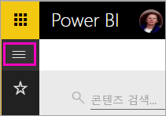
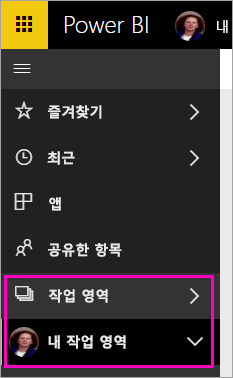
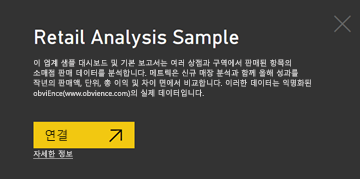
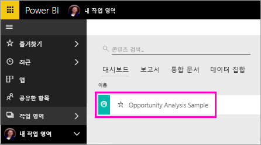
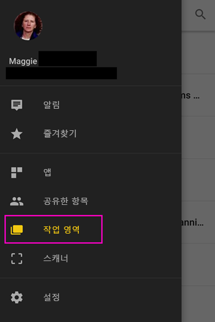
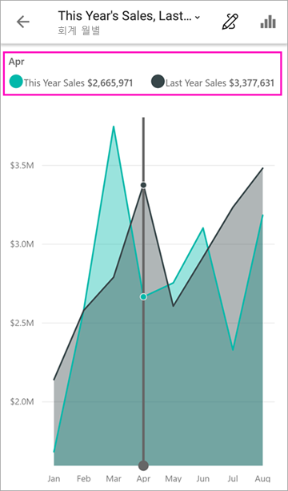
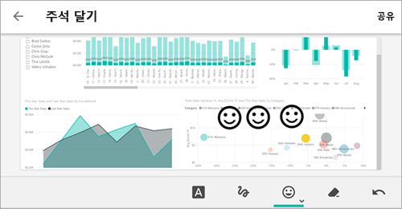
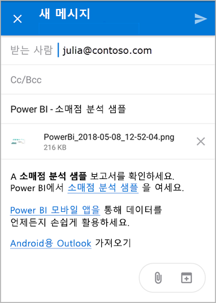
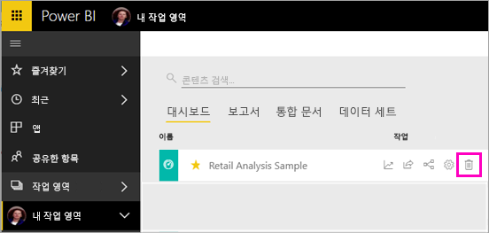

# 빠른 시작: Power BI 모바일 앱에서 대시보드 및 보고서 살펴보기
이 빠른 시작에서는 Android 휴대폰에서 Power BI 모바일 앱의 샘플 대시보드 및 보고서를 살펴봅니다. 다른 모바일 앱에서도 따라할 수 있습니다. 

적용 대상:

|  |  |  |  |
|:--- |:--- |:--- |:--- |
| iPhone | iPad | Android | Windows 10 |

대시보드는 귀사의 수명 주기 및 프로세스로 통하는 포털입니다. 대시보드는 비즈니스의 현재 상태를 한 곳에서 모니터링하는 개요입니다. 보고서는 해당 데이터의 다양한 결과 및 인사이트를 나타내는 시각적 개체가 포함된 데이터의 대화형 보기입니다. 

## 필수 조건

### Power BI에 등록
아직 Power BI에 등록하지 않은 경우 시작하기 전에 [평가판에 등록합니다](https://app.powerbi.com/signupredirect?pbi_source=web).

### Android용 Power BI 앱 설치
Google Play에서 [Android용 Power BI 앱](http://go.microsoft.com/fwlink/?LinkID=544867)을 다운로드합니다.

Power BI는 Android 5.0 이상 운영 체제를 실행하는 Android 디바이스에서 작동합니다. 디바이스를 확인하려면 **설정** > **디바이스 정보** > **Android 버전**으로 이동합니다.

### 분석 샘플 정보
빠른 시작의 첫 번째 단계는 Power BI 서비스에 소매점 분석 샘플을 다운로드하는 것입니다.

1. 브라우저에서 Power BI 서비스(app.powerbi.com)를 열고 로그인합니다.

1. 전역 탐색 아이콘을 선택하여 왼쪽 탐색을 엽니다.

    

2. 왼쪽 탐색 창에서 **작업 영역** > **내 작업 영역**을 선택합니다.

    

3. 왼쪽 아래 모서리에서 **데이터 가져오기**를 선택합니다.
   
    

3. 데이터 가져오기 페이지에서 **샘플** 아이콘을 선택합니다.
   
   

4. **소매점 분석 샘플**을 선택합니다.
 
    
 
8. **연결**을 선택합니다.  
  
   
   
5. Power BI가 샘플을 가져와 새 대시보드, 보고서 및 데이터 세트를 내 작업 영역에 추가합니다.
   
   

Android 디바이스에서 샘플을 볼 준비가 되었습니다.

## Android 디바이스에서 대시보드 보기
1. Android 디바이스에서 Power BI 앱을 열고, 브라우저에서 Power BI 서비스에 사용한 것과 동일한 Power BI 계정 자격 증명으로 로그인합니다.

1.  왼쪽 위 모퉁이에서 .

2.  **작업 영역** > **내 작업 영역**을 탭합니다.

    

3. 소매점 분석 샘플 대시보드를 탭하여 엽니다.
 
    
   
    대시보드 이름 아래의 표기법(이 예의 경우 “C”)은 각 대시보드의 데이터를 분류하는 방법을 나타냅니다. 자세한 내용은 [Power BI 데이터 분류](../../service-data-classification.md)를 참조하세요.

    Android 휴대폰에서는 Power BI 대시보드가 약간 다르게 보입니다. 모든 타일이 동일한 너비로 나타나며, 위에서 아래로 하나씩 정렬됩니다.

4. 별모양 아이콘을 탭합니다.  이 대시보드를 자주 사용하는 대시보드로 설정합니다.

    모바일 앱에서 즐겨찾기를 설정하면 Power BI 서비스의 즐겨찾기가 되고 그 반대의 경우도 마찬가지입니다.

4. 아래로 스크롤하여 “올해 판매액, 작년 판매액” 채워진 꺾은선형 차트를 탭합니다.

    

    타일이 포커스 모드로 열립니다.

7. 포커스 모드에서 차트의 4월을 탭합니다. 차트의 맨 위에 표시되는 4월에 대한 값을 확인합니다.

    

8. 오른쪽 위 모서리에서 보고서 아이콘  을 탭합니다. 이 타일과 관련된 보고서가 가로 모드로 열립니다.

    

9. 거품형 차트에서 노란색 “040 - Juniors” 풍선을 탭합니다. 다른 차트에서 관련 값이 어떻게 강조 표시되는지 알아볼까요? 

    

10. 위로 살짝 밀어 아래쪽에 도구 모음을 표시하고 연필 아이콘을 탭합니다.

    

11. 주석 도구 모음에서 웃는 얼굴 아이콘을 탭하고 몇 개의 웃는 얼굴을 보고서 페이지에 추가합니다.
 
    

12. 오른쪽 위 모서리에서 **공유**를 탭합니다.

1. 해당 메일 주소를 입력하고 원하는 경우 메시지를 추가합니다.  

    

    이 스냅숏을 조직 내부 또는 외부의 모든 사용자와 공유할 수 있습니다. 조직 내부에 있고 자체 Power BI 계정을 가지고 있는 사용자는 소매점 분석 샘플 보고서도 열 수 있습니다.

## 리소스 정리

이 빠른 시작을 완료한 후 원하는 경우 소매점 분석 샘플 대시보드, 보고서 및 데이터 세트를 삭제할 수 있습니다.

1. Power BI 서비스(app.powerbi.com)를 열고 로그인합니다.

2. 왼쪽 탐색 창에서 **작업 영역** > **내 작업 영역**을 선택합니다.

    즐겨찾기를 나타내는 노란색 별모양이 보이나요?

3. **대시보드** 탭에서 소매점 분석 대시보드 옆에 있는 휴지통 **삭제** 아이콘을 선택합니다.

    

4. **보고서** 탭을 선택하고 소매점 분석 보고서에 대해 동일한 작업을 수행합니다.

5. **데이터 세트** 탭을 선택하고 소매점 분석 데이터 세트에 대해 동일한 작업을 수행합니다.

## 다음 단계

이 빠른 시작에서는 Android 디바이스의 샘플 대시보드 및 보고서를 살펴보았습니다. Power BI 서비스 작업에 대해 자세히 알아보세요. 

> [!div class="nextstepaction"]
> [빠른 시작: Power BI 서비스 살펴보기](../end-user-experience.md)

