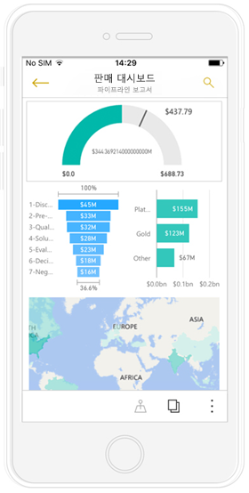
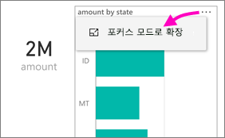
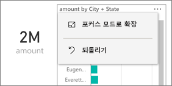
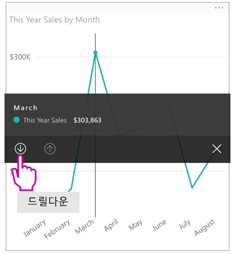
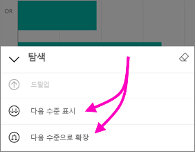
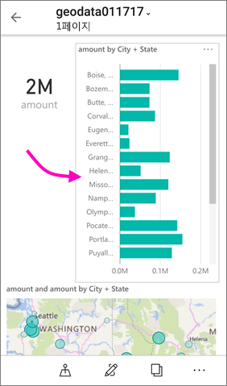
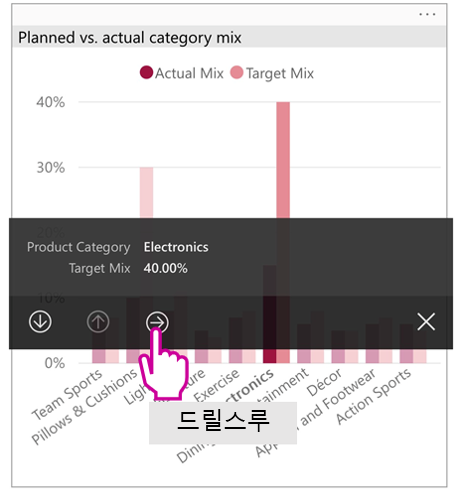
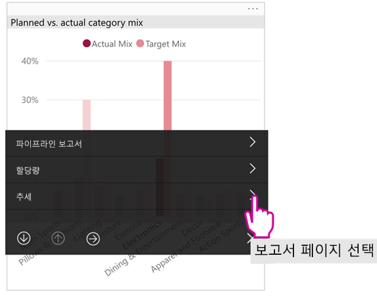

# 전화에 대해 최적화된 Power BI 보고서 보기

적용 대상:

|  |  |
|:--- |:--- |
| iPhone |Android 휴대폰 |

휴대폰에서 Power BI 보고서를 보면 Power BI는 보고서가 휴대폰용으로 최적화되었는지 검사합니다. 최적화되었다면 Power BI는 최적화된 보고서를 자동으로 세로 보기로 엽니다.

전화에 최적화 보고서 없다면 보고서는 열리지만 최적화되지 않은 가로 보기 화면으로 열립니다. 휴대폰에 최적화된 보고서에서도 휴대폰를 옆으로 돌리면 보고서는 최적화 되지 않은 보기에서 원본 보고서 레이아웃으로 열립니다. 일부 페이지만 최적화된 경우, 사용자는 세로 보기 메시지를 보게 될 것이며 이는 보고서가 가로 보기로 사용 가능하다는 것을 의미합니다.

Power BI 보고서의 다른 모든 기능은 휴대폰에 최적화된 보고서에서 여전히 작동합니다. 다음의 경우 무엇을 할 수 있는지에 관해 자세히 알아봅니다.

* [Iphone 상의 보고서](mobile-reports-in-the-mobile-apps.md). 
* [안드로이드 폰 상의 보고서](mobile-reports-in-the-mobile-apps.md).

## 휴대폰에서 보고서 페이지 필터링
휴대폰에 최적화된 보고서에 정의된 필터가 있는 경우 휴대폰에서 보고서를 볼 때 해당 필터를 사용할 수 있습니다. 보고서는 웹의 보고서에서 필터링되는 값으로 필터링되어 휴대폰에서 열립니다. 페이지에 활성 필터가 있다는 메시지가 표시됩니다. 휴대폰에서 필터를 변경할 수 있습니다.

1. 필터 아이콘을 탭합니다.  휴대폰 필터 아이콘을 탭합니다. 
2. 기본 또는 고급 필터링을 사용하여 원하는 결과를 확인합니다.
   
    

## 시각적 개체을 강조 표시합니다.
세로 보기에서 시각적 개체를 강조 표시하면 Power BI 서비스 및 휴대폰 가로 보기에서와 동일하게 작동합니다. 한 시각적 개체에서 데이터를 선택하면 그 페이지의 다른 시각적 개체에 있는 관련 데이터도 강조 표시됩니다.

[Power BI에서 필터링 및 강조 표시](../../power-bi-reports-filters-and-highlighting.md)에 대해 자세히 알아보세요.

## 시각적 개체 선택
휴대폰 보고서에서 시각적 개체를 선택하면 휴대폰 보고서는 그 시각적 개체를 강조 표시하고, 그것에 초점을 맞추고, 캔버스 제스처를 무효화합니다.

선택된 시각적 개체를 사용하여 시작적 개체 내에서 스크롤하기와 같은 작업을 수행할 수 있습니다. 시각적 개체를 선택 취소하려면, 시각적 개체 영역 밖 아무 곳이나 그냥 터치합니다.

## 시각적 개체를 포커스 모드로 열기
휴대폰 보고서에서는 포커스 모드도 제공됩니다. 시각적 개체 하나를 더 크게 보고 더 쉽게 살펴볼 수 있습니다.

* 휴대폰 보고서에서 시각적 개체의 오른쪽 위 모서리에 있는 줄임표( **...** ) > **포커스 모드로 확장**을 누릅니다.
  
    

포커스 모드에서 수행하는 작업은 보고서 캔버스로 이어지며, 그 반대도 마찬가지입니다. 예를 들어 시각적 개체에서 한 값을 강조 표시한 다음 전체 보고서로 돌아가면 전체 보고서가 시각적 개체에서 강조 표시한 값으로 필터링 됩니다.

일부 작업은  화면 크기 제약 때문에 포커스 모드에서만 가능합니다.

* 시각적 개체에 표시되는 정보를 **드릴다운**합니다. 휴대폰 보고서에서 [드릴업 및 드릴다운](mobile-apps-view-phone-report.md#drill-down-in-a-visual)하는 방법은 아래에서 자세히 알아보세요.
* 시각적 개체의 값을 **정렬**합니다.
* **되돌리기**: 시각적 개체에서 수행한 탐색 과정을 지우고 보고서가 만들어졌을 때 설정된 정의로 되돌립니다.
  
    시각적 개체에서 모든 탐색을 지우려면 줄임표( **...** ) > **되돌리기**를 누릅니다 .
  
    
  
    되돌리기는 보고서 수준에서 모든 시각적 개체로부터 탐색을 지우거나 또는 시각적 개체 수준에서 선택된 시각적 개체로부터 모든 탐색을 지웁니다.   

## 시각적 개체에서 드릴 다운
시각적 개체에 계층 수준이 정의된 경우 시각적 개체에 표시되는 자세한 정보를 드릴다운한 후 백업할 수 있습니다. Power BI 서비스 또는 Power BI Desktop에서 [시각적 개체에 드릴다운을 추가](../end-user-drill.md)할 수 있습니다.

다음과 같은 몇 가지 유형의 드릴다운이 있습니다.

### 값 드릴다운
1. 시각적 개체에서 데이터 요소를 길게 탭합니다.
2. 도구 설명이 표시됩니다. 계층이 정의되어 있다면 도구 설명 바닥글에 드릴다운 및 드릴업 화살표가 표시됩니다.
3. 아래쪽 화살표를 탭하여 드릴다운합니다.

    
    
4. 위쪽 화살표를 탭하여 드릴업합니다.

### 다음 수준으로 드릴
1. 휴대폰 보고서에서 오른쪽 위 모서리에 있는 줄임표( **...** ) > **포커스 모드로 확장**을 누릅니다.
   
    
   
    이 예제에서 막대는 시/도 값을 보여줍니다.
2. 탐색 아이콘을 탭합니다  왼쪽 아래에 있는 아이콘입니다.
   
    
3. **다음 수준 표시** 또는 **다음 수준으로 확장**을 누릅니다.
   
    
   
    이제 막대는 구/군/시 값을 보여줍니다.
   
    
4. 왼쪽 위 모서리에 있는 화살표를 누르면 하위 수준으로 값이 여전히 확장되어 있는 휴대폰 보고서로 돌아갑니다.
   
    
5. 원래 수준으로 다시 올라가려면 줄임표( **...** )를 다시 누르고 **되돌리기**를 누릅니다.
   
    

## 값에서 드릴스루
드릴스루는 하나의 보고서 페이지에 있는 값을 다른 보고서 페이지에 연결합니다. 하나의 데이터 요소에서 다른 보고서 페이지로 드릴스루하면, 데이터 요소 값이 드릴스루된 페이지를 필터링하는 데 사용되거나 선택한 데이터의 컨텍스트에서 표시됩니다.
보고서 작성자는 보고서를 만들 때 [드릴스루를 정의](https://docs.microsoft.com/power-bi/desktop-drillthrough)할 수 있습니다.

1. 시각적 개체에서 데이터 요소를 길게 탭합니다.
2. 도구 설명이 표시됩니다. 드릴스루가 정의되어 있다면 도구 설명 바닥글에 드릴스루 화살표가 표시됩니다.
3. 화살표를 탭하여 드릴스루합니다.

    

4. 드릴스루할 보고서 페이지를 선택합니다.

    

5. 앱 헤더에 있는 뒤로 단추를 사용하여 시작한 페이지로 돌아갑니다.

## 다음 단계
* [Power BI 휴대폰 앱에 대해 최적화된 보고서 만들기](../../desktop-create-phone-report.md)
* [Power BI에서 대시보드 휴대폰 보기 만들기](../../service-create-dashboard-mobile-phone-view.md)
* [모든 크기에 최적화된 반응형 시각적 개체 만들기](../../visuals/desktop-create-responsive-visuals.md)
* 궁금한 점이 더 있나요? [Power BI 커뮤니티에 질문합니다.](https://community.powerbi.com/)

