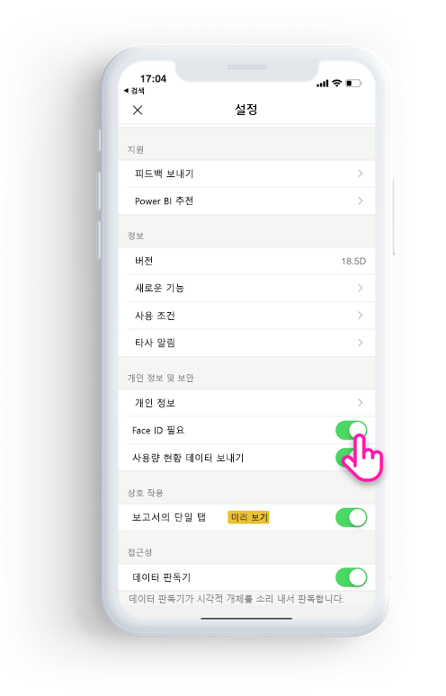

# Face ID, Touch ID 또는 암호로 Power BI 앱 보호 

대부분의 경우 Power BI에서 관리되는 데이터는 기밀이므로 권한이 부여된 사용자만 보호하고 액세스해야 합니다. 

Power BI iOS 앱을 사용하면 추가 ID를 구성하여 데이터를 보호할 수 있습니다. 앱을 시작할 때마다 또는 백그라운드에서 포그라운드로 앱을 가져올 때마다 Face ID, Touch ID 또는 암호를 제공해야 합니다.

|  |  |
|:--- |:--- |
| iPhone |iPad |

## 앱 설정에서 Face ID, Touch ID 또는 암호 설정

Power BI에서 추가 ID를 사용하려면 **개인 정보 보호 및 보안** 아래의 앱 설정으로 이동합니다. 디바이스 기능에 따라 Face ID, Touch ID 또는 암호를 설정하는 옵션이 표시됩니다.

이 설정이 켜지면 Power BI를 시작하거나 백그라운드에서 가져올 때마다, 앱에 액세스하기 전에 ID를 제공하라는 메시지가 표시됩니다. 

Face ID, Touch ID 또는 암호를 요청하기 위한 결정은 디바이스 기능에 따라 iOS에 의해 수행됩니다. 디바이스가 Face ID를 지원하는 경우 Face ID를 사용해야 합니다. Touch ID를 지원하는 경우 Touch ID를 사용해야 합니다. 둘 다 지원되지 않으면 암호를 제공해야 합니다.

## MDM를 사용하여 Face ID, 터치 ID 또는 암호 적용

일부 조직에는 비지니스에 중요한 데이터에 액세스하기 전에 추가 식별을 강제하는 보안 정책 및 규정 준수 요구 사항이 있습니다. 

Power BI 모바일 iOS 앱을 사용하면 관리자가 Microsoft Intune 및 기타 MDM(모바일 디바이스 관리) 솔루션에서 앱 구성 설정을 푸시하여 해당 설정을 제어할 수 있습니다. 관리자는 앱 보호 정책을 사용하여 모든 사용자 또는 사용자 그룹에 대해 이 설정을 사용하도록 설정할 수 있습니다.

|키  |형식  |설명  |
|---------|---------|---------|
| com.microsoft.powerbi.mobile.ForceDeviceAuthentication | Boolean | 기본값은 False입니다.  True로 설정하면 앱에서 Power BI 데이터를 보기 전에 사용자가 Face ID, Touch ID 또는 암호로 자신을 식별하도록 합니다. 디바이스에 Face ID, Touch ID 또는 암호가 구성되어 있지 않은 사용자는 Power BI에 액세스하기 전에 구성해야 합니다.  |

## 다음 단계

[MDM을 사용하여 Power BI iOS 앱을 원격으로 구성](mobile-app-configuration.md)
