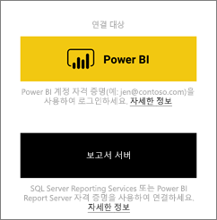
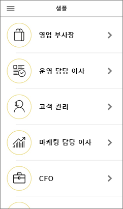
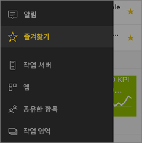
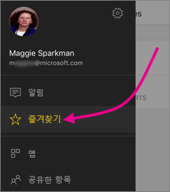
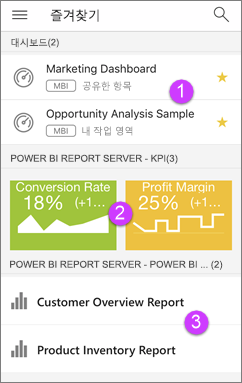

# iOS 디바이스에서 Power BI 모바일 앱 시작
iPhone, iPad 또는 iPod Touch의 iOS 앱용 Microsoft Power BI는 Power BI, Power BI Report Server 및 Reporting Services에 대한 모바일 BI 환경을 제공합니다. 어디서나 터치 사용 라이브 모바일 액세스를 사용하여 온-프레미스 및 클라우드에 있는 회사 대시보드를 쉽게 보고 조작할 수 있습니다. 대시보드의 데이터를 살펴보고 메일 또는 문자 메시지로 동료와 공유합니다. 그리고 [Apple Watch](mobile-apple-watch.md)에서 가장 시기 적절한 데이터를 최신 상태로 유지합니다.  

Power BI Desktop에서 Power BI 보고서를 만들고 게시합니다.

* [보고서를 Power BI 서비스에 게시](../../service-get-started.md)하고 대시보드를 만듭니다.
* [온-프레미스 보고서를 Power BI Report Server로 게시합니다](../../report-server/quickstart-create-powerbi-report.md).

그런 다음, 온-프레미스 또는 클라우드에 있는지와 상관 없이 iOS용 Power BI 모바일 앱에서 대시보드 및 보고서를 조작합니다.

[Power BI 모바일 앱의 새로운 기능](mobile-whats-new-in-the-mobile-apps.md)을 알아보세요.

## 앱 다운로드
[iOS 앱 다운로드]Apple 앱 스토어에서 iPhone, iPad 또는 iPod Touch로 (http://go.microsoft.com/fwlink/?LinkId=522062 "iOS 앱을 다운로드")합니다.

iOS용 Power BI 앱은 iOS 10 이상이 설치된 iPhone 5 이상에서 실행할 수 있습니다. iOS 10 이상이 설치된 iPad 또는 iPod Touch에서도 실행할 수 있습니다. 

## Power BI 서비스에 등록
등록하지 않은 경우 [powerbi.com](https://powerbi.microsoft.com/get-started/)으로 이동하여 **Power BI - 클라우드 협업 및 공유**에서 **무료 체험**을 선택합니다.

## Power BI 앱 시작
1. iOS 디바이스에서 Power BI 앱을 엽니다.
2. Power BI 대시보드를 보려면 **Power BI**를 누릅니다.  
   Reporting Services 모바일 보고서 및 KPI를 보려면 **SQL Server Reporting Services**를 누릅니다.
   
   
   
   앱에 있을 때 왼쪽 위 모서리에 있는 전역 탐색 단추  를 탭하여 두 서비스 사이를 이동합니다. 

## Power BI 및 Reporting Services 샘플 시도
등록하지 않고도 Power BI 및 Reporting Services 샘플을 사용할 수 있습니다. 앱을 다운로드하면 샘플을 보거나 시작할 수 있습니다. 원할 때는 언제든지 전역 탐색에서 샘플로 돌아갈 수 있습니다.

### Power BI 샘플
Power BI 대시보드 샘플을 검토하고 이와 상호 작용할 수 있지만 이 샘플로 처리할 수 없는 몇 가지 작업이 있습니다. 즉 대시보드 뒤에 있는 보고서를 열 수 없거나, 다른 사용자와 샘플을 공유할 수 없거나, 이 샘플의 즐겨찾기를 만들 수 없습니다.

1. 왼쪽 위 모퉁이에서  전역 탐색 단추를 탭합니다.
2. 오른쪽 위에서 기어 아이콘 을 탭한 다음 **Power BI 샘플**을 탭합니다.
3. 역할을 선택하고 해당 역할에 대한 샘플 대시보드를 탐색합니다.  
   
   
   
   > [!NOTE]
   > 일부 기능은 샘플에서 사용할 수 없습니다. 예를 들어 대시보드의 기반이 되는 샘플 보고서는 볼 수 없습니다.  
   > 
   > 

### Reporting Services 모바일 보고서 샘플
1. 왼쪽 위 모퉁이에서  전역 탐색 단추를 탭합니다.
2. 오른쪽 위에서 기어 아이콘 을 탭한 다음 **Reporting Services 샘플**을 탭합니다.
3. 소매 보고서 또는 판매 보고서 폴더를 열어 KPI 및 모바일 보고서를 탐색합니다.
   
   

## Power BI 모바일 앱에서 콘텐츠 찾기
대시보드 및 보고서는 Power BI 모바일 앱에서 출처에 따라 다른 위치에 저장됩니다. [모바일 앱에서 콘텐츠 찾기](mobile-apps-quickstart-view-dashboard-report.md)에 대해 읽습니다. 또한 Power BI 모바일 앱에 있는 항목에 대해 항상 검색할 수 있습니다. 

[모바일 앱에서 콘텐츠 찾기](mobile-apps-quickstart-view-dashboard-report.md)에 대해 읽습니다.

## 즐겨찾는 대시보드, KPI 및 보고서 보기
모바일 앱의 즐겨찾기 페이지에서 Power BI Report Server 및 Reporting Services KPI와 보고서와 함께 즐겨 찾는 모든 Power BI 대시보드를 볼 수 있습니다. Power BI 모바일 앱에서 대시보드를 즐겨찾기로 만들면 브라우저의 Power BI 서비스를 포함한 모든 디바이스에서 액세스할 수 있습니다. 

* **즐겨찾기**를 누릅니다.
  
   
  
   이 페이지에 모든 즐겨찾기를 함께 표시합니다.
  
   
  
  1. Power BI 서비스의 대시보드
  2. Power BI Report Server의 KPI
  3. Power BI Report Server의 Power BI 보고서

자세한 내용은 [Power BI 모바일 앱의 즐겨찾기](mobile-apps-favorites.md)를 읽어보세요.

## Power BI 모바일 앱에 대한 Enterprise 지원
조직에서 Microsoft Intune을 사용하여 Android 및 iOS용 Power BI 모바일 앱을 포함한 장치 및 애플리케이션을 관리할 수 있습니다.

Microsoft Intune을 사용하면 액세스 핀이 필요하고, 애플리케이션에서 데이터를 처리하는 방법을 제어하며, 앱을 사용하지 않을 때 애플리케이션 데이터를 암호화하는 것과 같은 항목을 조직에서 제어할 수 있습니다.

> [!NOTE]
> iOS 디바이스에서 Power BI 모바일 앱을 사용하고 조직에서 Microsoft Intune MAM을 구성한 경우 백그라운드 데이터 새로 고침이 해제됩니다. 다음 번에 앱을 시작하면 Power BI에서 웹의 Power BI 서비스로부터 데이터를 새로 고칩니다.
> 

[Microsoft Intune을 사용하여 Power BI 모바일 앱 구성](../../service-admin-mobile-intune.md)에 대해 자세히 알아보세요. 

## 다음 단계

* [Power BI란?](../../power-bi-overview.md)
* 궁금한 점이 더 있나요? [Power BI 커뮤니티에 질문합니다.](http://community.powerbi.com/)

