# <a name="using-oauth-to-connect-to-power-bi-report-server-and-ssrs"></a>OAuth를 사용하여 Power BI Report Server 및 SSRS에 연결

OAuth를 통해 Power BI Report Server 및 Reporting Services에 연결하여 모바일 보고서 또는 KPI를 표시할 수 있습니다. Power BI Report Server 및 SQL Server Reporting Services 2016 이상에 연결하기 위해 Power BI 모바일 앱에서 OAuth 인증을 지원하도록 환경을 구성하는 방법을 알아봅니다.

Adam이 OAuth를 사용하여 Power BI Mobile에서 SSRS에 연결하는 것을 확인합니다.


<iframe width="560" height="350" src="https://www.youtube.com/embed/okzPAI2uUek" frameborder="0" allowfullscreen></iframe>


> [!NOTE]
> 인증을 위해 WAP를 사용하여 Power BI Report Server에서 호스팅되는 Power BI 보고서 보기는 이제 iOS 및 Android 앱에서 지원됩니다.

## <a name="requirements"></a>요구 사항

Windows Server 2016은 WAP(웹 애플리케이션 프록시) 및 ADFS(Active Directory Federation Services) 서버에 필요합니다. Windows 2016 기능 수준 도메인이 있어야 할 필요가 없습니다.

## <a name="domain-name-services-dns-configuration"></a>DNS(도메인 이름 서비스) 구성

Power BI 모바일 앱을 연결할 공용 URL입니다. 예를 들어 다음과 유사하게 표시될 수 있습니다.

```https
https://reports.contoso.com
```

WAP(웹 애플리케이션 프록시) 서버의 공용 IP 주소에 대한 **보고서**의 DNS 레코드입니다. ADFS 서버에 대한 퍼블릭 DNS 레코드도 구성해야 합니다. 예를 들어, 다음 URL로 ADFS 서버를 구성했습니다.

```https
https://fs.contoso.com
```

WAP 애플리케이션의 일부로 게시되므로, WAP(웹 애플리케이션 프록시) 서버의 공용 IP 주소에 대한 **fs**의 DNS 레코드

## <a name="certificates"></a>인증서

WAP 애플리케이션과 ADFS 서버에 대한 인증서를 구성해야 합니다. 이러한 인증서는 둘 다 모바일 디바이스가 인식하는 유효한 인증서 기관의 일부여야 합니다.

## <a name="reporting-services-configuration"></a>Reporting Services 구성

Reporting Services 쪽에서 구성할 항목이 많지 않습니다. 적절한 Kerberos 인증을 사용하기 위해 유효한 SPN(서비스 주체 이름)을 생성하고 협상 인증에 Reporting Services 서버를 사용할 수 있도록 해야 합니다.

### <a name="service-principal-name-spn"></a>SPN(서비스 주체 이름)

SPN은 Kerberos 인증을 사용하는 서비스에 대한 고유한 식별자입니다. 보고서 서버에 대한 적절한 HTTP SPN이 있는지 확인해야 합니다.

보고서 서버에 대한 적절한 SPN(서비스 주체 이름)을 구성하는 방법에 대한 자세한 내용은 [보고서 서버에 SPN(서비스 주체 이름) 등록](https://msdn.microsoft.com/library/cc281382.aspx)을 참조하세요.

### <a name="enabling-negotiate-authentication"></a>협상 인증 사용

Kerberos 인증을 사용하는 보고서 서버를 사용하려면 보고서 서버의 인증 유형이 RSWindowsNegotiate이 되도록 구성해야 합니다. rsreportserver.config 파일 내에서 이 작업을 수행합니다.

```xml
<AuthenticationTypes>  
    <RSWindowsNegotiate />  
    <RSWindowsKerberos />  
    <RSWindowsNTLM />  
</AuthenticationTypes>
```

자세한 내용은 [Reporting Services 구성 파일 수정](https://msdn.microsoft.com/library/bb630448.aspx) 및 [보고서 서버에서 Windows 인증 구성](https://msdn.microsoft.com/library/cc281253.aspx)을 참조하세요.

## <a name="active-directory-federation-services-adfs-configuration"></a>ADFS(Active Directory Federation Services) 구성

사용자 환경 내의 Windows 2016 서버에서 ADFS를 구성해야 합니다. [서버 관리자] 및 [관리] 아래의 [역할 및 기능 추가]를 선택하여 이 구성을 수행할 수 있습니다. 자세한 내용은 [Active Directory Federation Services](https://technet.microsoft.com/windows-server-docs/identity/active-directory-federation-services)를 참조하세요.

### <a name="create-an-application-group"></a>애플리케이션 그룹 만들기

AD FS 관리 화면 내에 Power BI 모바일 앱에 대한 정보가 포함된 Reporting Services의 애플리케이션 그룹을 만들려고 합니다.

다음 단계를 통해 애플리케이션 그룹을 만들 수 있습니다.

1. AD FS 관리 앱 내에서 **애플리케이션 그룹**을 마우스 오른쪽 단추로 클릭하고 **애플리케이션 그룹 추가...** 를 선택합니다.

   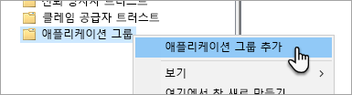

2. 애플리케이션 그룹 추가 마법사 내에서 애플리케이션 그룹의 **이름**을 제공하고 **Web API에 액세스하는 네이티브 애플리케이션**을 선택합니다.

   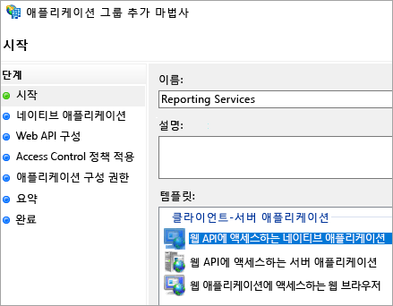

3. **다음**을 선택합니다.

4. 추가하는 애플리케이션의 **이름**을 제공합니다. 

5. **클라이언트 ID**가 자동으로 생성되는 반면 iOS 및 Android에 대해 484d54fc-b481-4eee-9505-0258a1913020을 입력합니다. 

6. 다음 **리디렉션 URL**을 추가하려고 합니다.

   **Power BI Mobile – iOS에 대한 항목:** 
   msauth://code/mspbi-adal://com.microsoft.powerbimobile  
   msauth://code/mspbi-adalms://com.microsoft.powerbimobilems  
   mspbi-adal://com.microsoft.powerbimobile  
   mspbi-adalms://com.microsoft.powerbimobilems

   **Android 앱에만 다음 단계가 필요합니다.**  
   urn:ietf:wg:oauth:2.0:oob

   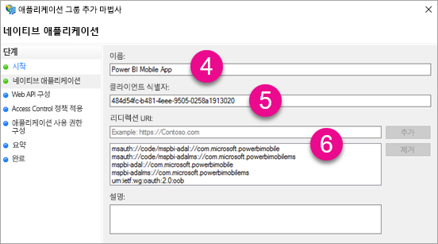
7. **다음**을 선택합니다.

8. 보고서 서버에 대한 URL을 제공합니다. URL은 웹 애플리케이션 프록시에 도달하는 외부 URL입니다. 다음과 같은 형식이어야 합니다.

   > [!NOTE]
   > 이 URL은 대/소문자를 구분합니다.

   *https://< report server url >/*

   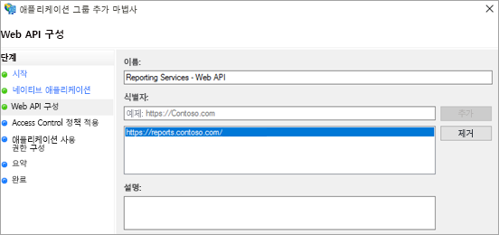
9. **다음**을 선택합니다.

10. 조직의 요구 사항을 충족하는 **액세스 제어 정책**을 선택합니다.

    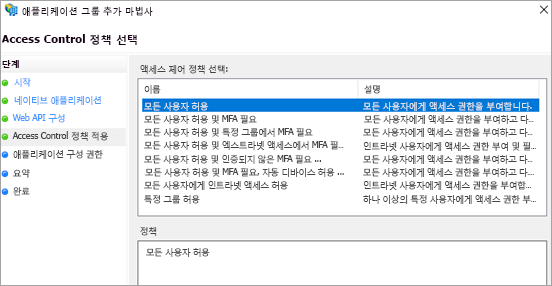

11. **다음**을 선택합니다.

12. **다음**을 선택합니다.

13. **다음**을 선택합니다.

14. **닫기**를 선택합니다.

완료되면 애플리케이션 그룹의 속성이 다음과 유사하게 표시되어야 합니다.

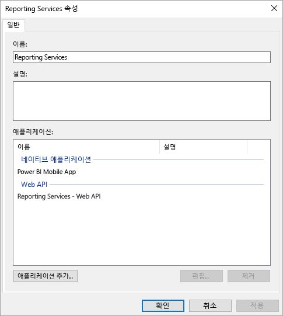

## <a name="web-application-proxy-wap-configuration"></a>WAP(웹 애플리케이션 프록시) 구성

사용자 환경의 서버에서 웹 애플리케이션 프록시(역할) Windows 역할을 사용하도록 설정하려고 합니다. Windows 2016 서버에 있어야 합니다. 자세한 내용은 [Windows Server 2016의 웹 애플리케이션 프록시](https://technet.microsoft.com/windows-server-docs/identity/web-application-proxy/web-application-proxy-windows-server) 및 [AD FS 사전 인증을 사용하여 애플리케이션 게시](https://technet.microsoft.com/windows-server-docs/identity/web-application-proxy/publishing-applications-using-ad-fs-preauthentication#a-namebkmk14apublish-an-application-that-uses-oauth2-such-as-a-windows-store-app)를 참조하세요.

### <a name="constrained-delegation-configuration"></a>제한된 위임 구성

OAuth 인증에서 Windows 인증으로 전환하기 위해 프로토콜 전환을 포함한 제한된 위임을 사용해야 합니다. Kerberos 구성 중 일부입니다. Reporting Services 구성 내에서 Reporting Services SPN을 이미 정의했습니다.

Active Directory 내의 WAP 서버 컴퓨터 계정에서 제한된 위임을 구성해야 합니다. Active Directory에 대한 권한이 없는 경우 도메인 관리자 권한으로 작동하도록 해야 합니다.

제한된 위임을 구성하기 위해 다음 단계를 수행하려고 합니다.

1. Active Directory 도구가 설치되어 있는 컴퓨터에서 **Active Directory 사용자 및 컴퓨터**를 시작합니다.

2. WAP 서버에 대한 컴퓨터 계정을 찾습니다. 기본적으로 컴퓨터 컨테이너에 위치합니다.

3. WAP 서버를 마우스 오른쪽 단추로 클릭하고 **속성**으로 이동합니다.

4. **위임** 탭을 선택합니다.

5. **지정한 서비스에 대한 위임의 경우 이 컴퓨터 신뢰** 및 **모든 인증 프로토콜 사용**을 차례로 선택합니다.

   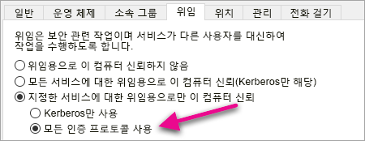

   그러면 이 WAP 서버 컴퓨터 계정에 대한 제한된 위임을 설정하게 됩니다. 그런 다음 이 컴퓨터가 위임할 수 있는 서비스를 지정해야 합니다.

6. 서비스 상자 아래에서 **추가...** 를 선택합니다.

   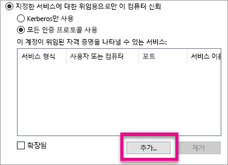

7. **사용자 또는 컴퓨터...** 를 선택합니다.

8. Reporting Services에 사용하는 서비스 계정을 입력합니다. 이 계정은 Reporting Services 구성 내에서 SPN을 추가할 계정입니다.

9. Reporting Services에 대한 SPN을 선택한 다음 **확인**을 선택합니다.

   > [!NOTE]
   > NetBIOS SPN만 표시될 수 있습니다. 실제로 NetBIOS와 FQDN SPN이 모두 있는 경우 둘 다 선택합니다.

   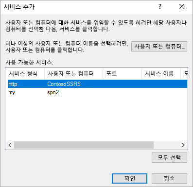

10. **확장됨** 확인란을 선택한 경우 결과는 다음과 유사해야 합니다.

    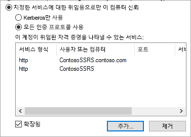

11. **확인**을 선택합니다.

### <a name="add-wap-application"></a>WAP 애플리케이션 추가

보고서 액세스 관리 콘솔 내에서 애플리케이션을 게시하는 동안 PowerShell을 통해 애플리케이션을 만들고자 합니다. 애플리케이션을 추가하는 명령은 다음과 같습니다.

```powershell
Add-WebApplicationProxyApplication -Name "Contoso Reports" -ExternalPreauthentication ADFS -ExternalUrl https://reports.contoso.com/ -ExternalCertificateThumbprint "0ff79c75a725e6f67e3e2db55bdb103efc9acb12" -BackendServerUrl https://ContosoSSRS/ -ADFSRelyingPartyName "Reporting Services - Web API" -BackendServerAuthenticationSPN "http/ContosoSSRS.contoso.com" -UseOAuthAuthentication
```

| 매개 변수 | 주석 |
| --- | --- |
| **ADFSRelyingPartyName** |ADFS 내에서 애플리케이션 그룹의 일부로 만든 Web API 이름입니다. |
| **ExternalCertificateThumbprint** |외부 사용자에 사용할 인증서입니다. 이 인증서가 모바일 디바이스에서 유효하고 신뢰할 수 있는 인증 기관에서 제공되는 것이 중요합니다. |
| **BackendServerUrl** |WAP 서버의 보고서 서버에 대한 URL입니다. WAP 서버가 DMZ에 있으면 정규화된 도메인 이름을 사용해야 합니다. WAP 서버의 웹 브라우저에서 이 URL을 누를 수 있는지 확인합니다. |
| **BackendServerAuthenticationSPN** |Reporting Services 구성의 일부로 만들어진 SPN입니다. |

### <a name="setting-integrated-authentication-for-the-wap-application"></a>WAP 애플리케이션에 대한 통합된 인증 설정

WAP 애플리케이션을 추가한 후에 IntegratedWindowsAuthentication을 사용하도록 BackendServerAuthenticationMode를 설정해야 합니다. 이를 설정하기 위해 WAP 애플리케이션에서 ID가 필요합니다.

```powershell
Get-WebApplicationProxyApplication “Contoso Reports” | fl
```


WAP 애플리케이션의 ID를 사용하여 BackendServerAuthenticationMode를 설정하려면 다음 명령을 실행합니다.

```powershell
Set-WebApplicationProxyApplication -id 30198C7F-DDE4-0D82-E654-D369A47B1EE5 -BackendServerAuthenticationMode IntegratedWindowsAuthentication
```


## <a name="connecting-with-the-power-bi-mobile-app"></a>Power BI 모바일 앱과 연결

Power BI 모바일 앱 내에서 Reporting Services 인스턴스에 연결하려고 합니다. 그렇게 하려면 WAP 애플리케이션에 대한 **외부 URL**을 제공합니다.

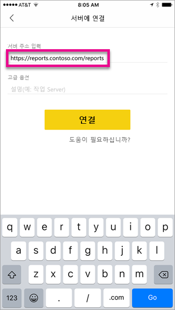

**연결**을 선택하면 ADFS 로그인 페이지로 이동합니다. 도메인에 대한 유효한 자격 증명을 입력합니다.

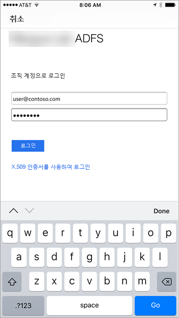

**로그인**을 선택한 후에 Reporting Services 서버의 요소가 표시됩니다.

## <a name="multi-factor-authentication"></a>Multi-Factor Authentication

Multi-Factor Authentication을 사용하여 사용자 환경에 대한 추가 보안을 사용할 수 있습니다. 자세한 내용은 [AD FS 2016 및 Azure MFA 구성](https://technet.microsoft.com/windows-server-docs/identity/ad-fs/operations/configure-ad-fs-2016-and-azure-mfa)을 참조하세요.

## <a name="troubleshooting"></a>문제 해결

### <a name="you-receive-the-error-failed-to-login-to-ssrs-server"></a>“SSRS 서버에 로그인하지 못했습니다”라는 오류를 받았습니다.

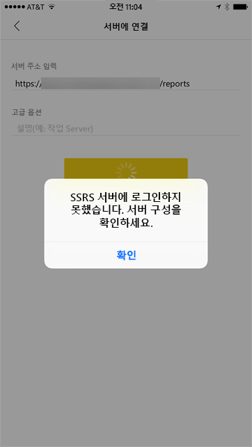

요청이 수행한 정도를 확인하기 위해 모바일 디바이스에 대한 프록시 역할을 하도록 [Fiddler](https://www.telerik.com/fiddler)를 설정할 수 있습니다. 휴대폰 디바이스에 Fiddler 프록시를 사용하려면 Fiddler를 실행하는 컴퓨터에 [iOS 및 Android용 CertMaker](https://www.telerik.com/fiddler/add-ons)를 설정해야 합니다. 이 추가 기능은 Fiddler에 대한 Telerik에서 제공됩니다.

Fiddler를 사용할 경우 로그인이 성공적으로 작동하면 WAP 애플리케이션 또는 ADFS 서버의 인증서 문제가 발생할 수 있습니다. [Microsoft Message Analyzer](https://www.microsoft.com/download/details.aspx?id=44226)와 같은 도구를 사용하여 인증서가 유효한지 확인할 수 있습니다.

## <a name="next-steps"></a>다음 단계

[보고서 서버에 SPN(서비스 주체 이름) 등록](https://msdn.microsoft.com/library/cc281382.aspx)  
[Reporting Services 구성 파일 수정](https://msdn.microsoft.com/library/bb630448.aspx)  
[보고서 서버에서 Windows 인증 구성](https://msdn.microsoft.com/library/cc281253.aspx)  
[Active Directory Federation Services](https://technet.microsoft.com/windows-server-docs/identity/active-directory-federation-services)  
[Windows Server 2016의 웹 애플리케이션 프록시](https://technet.microsoft.com/windows-server-docs/identity/web-application-proxy/web-application-proxy-windows-server)  
[AD FS 사전 인증을 사용하여 애플리케이션 게시](https://technet.microsoft.com/windows-server-docs/identity/web-application-proxy/publishing-applications-using-ad-fs-preauthentication#a-namebkmk14apublish-an-application-that-uses-oauth2-such-as-a-windows-store-app)  
[AD FS 2016 및 Azure MFA구성](https://technet.microsoft.com/windows-server-docs/identity/ad-fs/operations/configure-ad-fs-2016-and-azure-mfa)  
궁금한 점이 더 있나요? [Power BI 커뮤니티를 이용하세요.](https://community.powerbi.com/)
