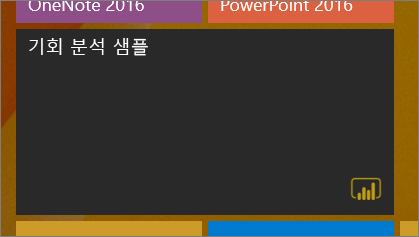
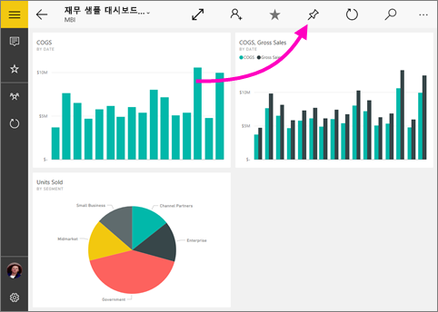
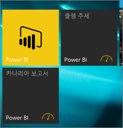

# Power BI 모바일 앱에서 대시보드를 Windows 10 시작 화면에 고정
Windows 10용 Power BI 모바일 앱에서 Power BI 대시보드를 Windows 시작 화면에 고정할 수 있습니다. 고정된 대시보드는 ‘라이브 타일’이 됩니다. 시작 화면에서 타일을 누르면 대시보드가 Windows 10용 Power BI 모바일 앱에서 열립니다.

## 대시보드를 시작 화면에 라이브 타일로 고정합니다
1. 대시보드를 엽니다.
2. **시작 화면에 고정** 을 탭합니다.
   
   
   
   라이브 타일을 보려면 디바이스 시작 화면으로 이동합니다.
   
   

## 다음 단계
* Windows 스토어에서 [Windows 10용 Power BI 모바일 앱 다운로드](http://go.microsoft.com/fwlink/?LinkID=526478)  
* [Windows 10용 Power BI 모바일 앱 시작](mobile-windows-10-phone-app-get-started.md)  
* [Power BI란?](../../power-bi-overview.md)
* 궁금한 점이 더 있나요? [Power BI 커뮤니티에 질문합니다.](http://community.powerbi.com/)

