# Power BI 모바일 앱에서 보고서 탐색
적용 대상:

|  |  |  |  |  |
|:--- |:--- |:--- |:--- |:--- |
| iPhone |iPad |Android 휴대폰 |Android 태블릿 |Windows 10 디바이스 |

Power BI 보고서는 해당 데이터의 다양한 결과 및 통찰력을 나타내는 시각적 개체가 포함된 데이터의 상호작용형 보기입니다. 3단계 프로세스의 세 번째 단계는 Power BI 모바일 앱에서 보고서 보기입니다.

1. [Power BI Desktop에서 보고서를 만듭니다](../../desktop-report-view.md). Power BI Desktop에서도 [휴대폰용 보고서를 최적화](mobile-apps-view-phone-report.md)할 수 있습니다. 
2. 이 보고서를 Power BI 서비스[(https://powerbi.com)](https://powerbi.com)) 또는 [Power BI Report Server](../../report-server/get-started.md)에 게시합니다.  
3. 그런 다음 Power BI 모바일 앱에서 이 보고서를 조작할 수 있습니다.

## 모바일 앱에서 Power BI 보고서 열기
Power BI 보고서는 가져온 위치에 따라 모바일 앱의 다른 위치에 저장됩니다. 이는 앱, 공유한 항목, 작업 영역(내 작업 영역 포함) 또는 보고서 서버에 있을 수 있습니다. 보고서로 가져오려는 관련 대시보드를 거치거나 나열되기도 합니다.

* 대시보드에서 타일의 오른쪽 상단 모퉁이에 있는 줄임표(...) > **보고서 열기**를 탭합니다.
  
  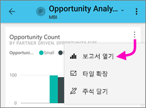
  
  모든 타일에 보고서에서 열 수 있는 옵션이 있는 것은 아닙니다. 예를 들어, 질문 및 답변 상자에서 질문하여 만든 타일을 탭해도 보고서가 열리지 않습니다. 
  
  [휴대폰에서 보기에 최적화](mobile-reports-in-the-mobile-apps.md#view-reports-optimized-for-phones)되지 않은 경우 보고서는 휴대폰에서 가로 모드로 열립니다.
  
  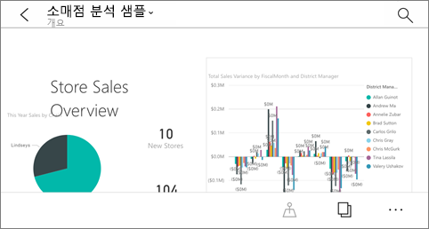

## 휴대폰에 최적화된 보고서 보기
Power BI 보고서 작성자는 휴대폰에서 특별히 최적화된 보고서 레이아웃을 만들 수 있습니다. 휴대폰에 최적화된 보고서 페이지를 통해 기능이 추가되었습니다. 예를 들어 시각적 개체를 드릴다운하여 정렬하고, [보고서 작성자가 보고서 페이지에 추가한 필터](mobile-apps-view-phone-report.md#filter-the-report-page-on-a-phone)에 액세스할 수 있습니다. 보고서는 웹의 보고서에서 필터링되는 값으로 필터링되어 휴대폰에서 열리고, 페이지에 활성 필터가 있다는 메시지가 표시됩니다. 휴대폰에서 필터를 변경할 수 있습니다.

보고서의 목록에서 최적화된 보고서에는 특수 아이콘이 있습니다. :

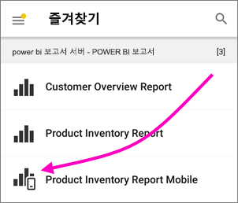

휴대폰에서 해당 보고서를 볼 때 이는 세로 보기로 열립니다.

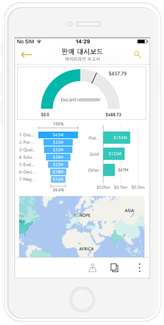

 보고서에는 다양한 페이지가 있을 수 있으며 휴대폰에 최적화되지 않을 수 있습니다. 그런 경우 보고서를 넘길 때 각 페이지에 맞게 세로에서 가로로 보기가 전환됩니다.

[모바일 보기에 최적화된 보고서](mobile-apps-view-phone-report.md)에 대해 자세히 알아보세요.

## 슬라이서를 사용하여 보고서 필터링
Power BI Desktop 또는 Power BI 서비스에서 보고서를 디자인할 때 [보고서 페이지에 슬라이서를 추가](../../visuals/power-bi-visualization-slicers.md)해 보세요. 사용자와 동료가 슬라이서를 사용하여 브라우저와 모바일 앱에서 페이지를 필터링할 수 있습니다. 휴대폰에서 보고서를 볼 때 휴대폰의 세로 모드에 최적화된 페이지와 가로 모드에서 슬라이서를 보고 조작할 수 있습니다. 브라우저에서 슬라이서 또는 필터의 값을 선택하면 모바일 앱에서 페이지를 볼 때도 값이 선택됩니다. 페이지에 활성 필터가 있다는 메시지가 표시됩니다.  

* 보고서 페이지에서 슬라이서의 값을 선택하면 페이지에서 다른 시각적 개체를 필터링합니다.
  
  
  
  이 그림에서 슬라이서는 세로 막대형 차트를 필터링하여 7월 값만 표시합니다.

## 보고서 교차 필터링 및 강조 표시
시각적 개체에서 값을 선택하면 다른 시각적 개체를 필터링하지 않습니다. 다른 시각적 개체의 관련된 값을 강조 표시합니다.

* 시각적 개체의 값을 탭합니다.
  
  
  
  하나의 시각적 개체 차트의 큰 열을 탭하면 다른 시각적 개체의 관련된 값을 강조 표시됩니다. 

## iPad 또는 태블릿에서 시각적 개체 정렬
* 차트, 줄임표(**...**) 및 필드 이름을 차례로 탭합니다.
  
   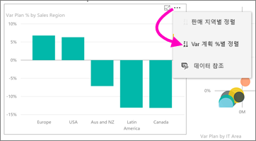
* 정렬 순서를 반대로 바꾸려면 줄임표(**...**)를 다시 탭한 다음 동일한 필드 이름을 다시 탭합니다.

## 시각적 개체에서 드릴다운 및 드릴업
보고서 작성자가 시각적 개체에 드릴다운 기능을 추가하면 시각적 개체에 드릴다운하여 그 일부를 구성하는 값을 볼 수 있습니다. Power BI Desktop 또는 Power BI 서비스에서 [시각적 개체에 드릴다운을 추가](../end-user-drill.md)할 수 있습니다. 

* 시각적 개체의 특정 막대 또는 지점을 누르면 해당 도구 설명이 표시됩니다. 드릴다운한 경우 도구 설명의 맨 아래에서 화살표를 누를 수 있습니다. 
  
  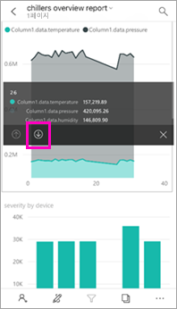

* 다시 드릴업하려면 도구 설명의 위쪽 화살표를 누릅니다.
  
  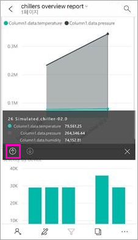

* 시각적 개체의 모든 데이터 요소에서 드릴다운할 수도 있습니다. 포커스 모드에서 열고, 탐색 아이콘을 누른 다음, 다음 모든 수준을 표시하도록 선택하거나 현재 및 다음 수준을 표시하도록 확장합니다.

   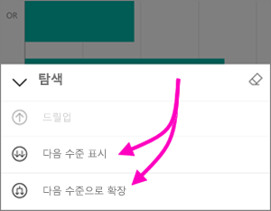

## 페이지 간의 드릴스루

*드릴스루*에서 시각적 개체의 특정 부분을 누를 때 Power BI는 보고서의 다른 페이지로 이동하고 누른 값으로 필터링합니다. 보고서 작성자는 하나 이상의 드릴스루 옵션을 정의할 수 있으며 각각 다른 페이지로 이동합니다. 이 경우에는 드릴스루하려는 항목을 선택할 수 있습니다. 다음 예제에서 계기의 값을 누를 때 **비즈니스 영역에서 사용** 또는 **비즈니스 영역에서 계획**에 대한 드릴스루 중에 하나를 선택할 수 있습니다.

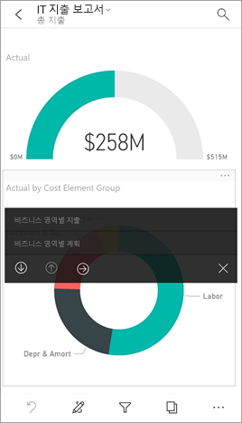

드릴스루할 때 뒤로 단추를 누르면 다시 이전 보고서 페이지로 이동합니다.

[Power BI Desktop에서 드릴스루를 추가](../../desktop-drillthrough.md)하는 방법에 대해 알아봅니다.

## 데이터 표시 및 값 복사

휴대폰 보고서에 있는 시각화의 오른쪽 위 모서리에서 메뉴 옵션 줄임표(**...**)를 선택한 후 **데이터 표시**를 선택하여 시각화를 구성하는 데이터를 볼 수 있습니다.

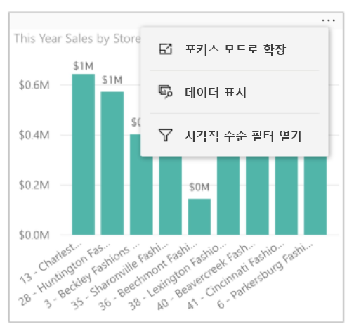

제공된 테이블의 셀을 길게 탭하면 기본 선택 및 복사 메뉴가 표시되므로 테이블(또는 전체 테이블)에서 데이터 복사를 선택할 수 있습니다.

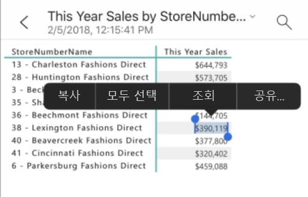

## 다음 단계
* [휴대폰에 최적화된 Power BI 보고서 보기 및 상호 작용](mobile-apps-view-phone-report.md)
* [휴대폰에 최적화된 보고서 버전 만들기](../../desktop-create-phone-report.md)
* 궁금한 점이 더 있나요? [Power BI 커뮤니티에 질문합니다.](http://community.powerbi.com/)

