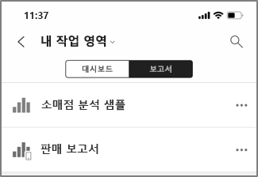
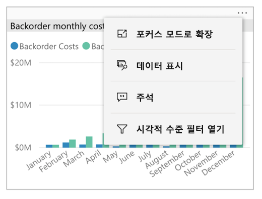
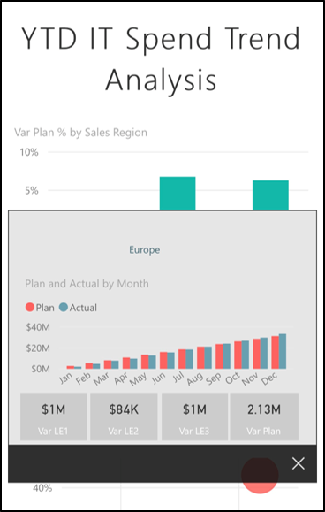
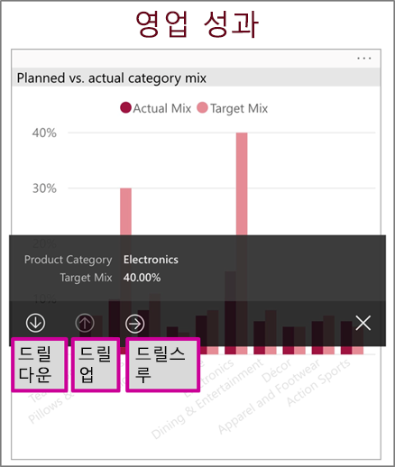
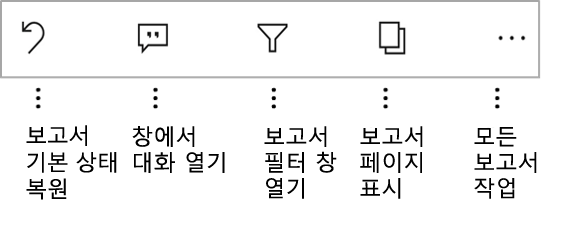
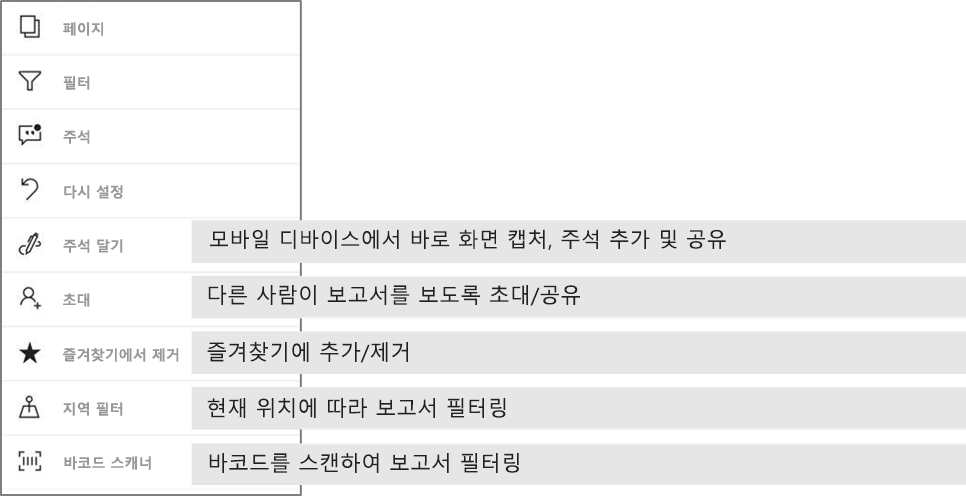

# Power BI 모바일 앱에서 보고서 탐색
적용 대상:

|  |  |  |  |  |
|:--- |:--- |:--- |:--- |:--- |
| iPhone |iPad |Android 휴대폰 |Android 태블릿 |Windows 10 디바이스 |

Power BI 보고서는 해당 데이터의 다양한 결과 및 통찰력을 나타내는 시각적 개체가 포함된 데이터의 상호작용형 보기입니다. 3단계 프로세스의 세 번째 단계는 Power BI 모바일 앱에서 보고서 보기입니다.

1. [Power BI Desktop에서 보고서를 만듭니다](../../desktop-report-view.md). Power BI Desktop에서도 [휴대폰용 보고서를 최적화](mobile-apps-view-phone-report.md)할 수 있습니다. 
2. 이 보고서를 Power BI 서비스[(https://powerbi.com)](https://powerbi.com)) 또는 [Power BI Report Server](../../report-server/get-started.md)에 게시합니다.  
3. 그런 다음 Power BI 모바일 앱에서 이 보고서를 조작할 수 있습니다.

## 모바일 앱에서 Power BI 보고서 열기
Power BI 보고서는 가져온 위치에 따라 모바일 앱의 다른 위치에 저장됩니다. 이는 앱, 공유한 항목, 작업 영역(내 작업 영역 포함) 또는 보고서 서버에 있을 수 있습니다. 관련 대시보드를 통해 보고서에 액세스하는 경우도 있고, 보고서가 나열되는 경우도 있습니다.

목록 및 메뉴에서 보고서 이름 옆의 아이콘을 통해 항목이 보고서인지 파악할 수 있습니다. 

 

Power BI Mobile 앱의 보고서에 대한 두 가지 아이콘이 있습니다.

*  앱에서 가로 방향으로 제공되고 브라우저와 동일하게 표시되는 보고서를 나타냅니다.

*  하나 이상의 휴대폰 최적화 보고서 페이지가 있고 세로로 제공되는 보고서를 나타냅니다. 

> [!NOTE]
> 휴대폰을 가로로 들면, 보고서 페이지가 휴대폰 레이아웃인 경우에도 항상 가로 레이아웃으로 표시됩니다. 

대시보드에서 보고서로 이동하려면 타일의 오른쪽 위에 있는 줄임표(...) > **보고서 열기**를 탭합니다.
  
  
  
  모든 타일에서 보고서를 열 수 있는 것은 아닙니다. 예를 들어, 질문 및 답변 상자에서 질문하여 만든 타일을 탭해도 보고서가 열리지 않습니다. 
  
## 보고서 조작
앱에서 보고서를 열면 보고서 작업을 시작할 수 있습니다. 보고서 및 해당 데이터로 수행할 수 있는 많은 작업이 있습니다. 보고서 바닥글에서 보고서에 대해 수행할 작업을 찾을 수 있습니다. 보고서에 표시된 데이터를 탭하거나 길게 탭하면 데이터를 조각화하고 분석할 수 있습니다.

### 탭 및 길게 탭 사용
탭하는 동작은 마우스 클릭과 같습니다. 따라서 데이터 요소에 따라 보고서를 교차 강조 표시하려면 해당 데이터 요소를 탭합니다.
슬라이서 값을 탭하면 해당 값이 선택되고 보고서의 나머지 부분이 해당 값으로 조각화됩니다. 링크, 단추 또는 책갈피를 탭하면 작성자가 정의한 작업에 따라 활성화됩니다.

시각적 개체를 탭하면 테두리가 표시되는 것을 알 수 있습니다. 테두리의 오른쪽 위에 줄임표(...)가 표시됩니다. 줄임표를 탭하면 해당 시각적 개체에서 수행할 수 있는 작업이 포함된 메뉴가 표시됩니다.

### 도구 설명 및 드릴 작업

데이터 요소를 길게 탭(탭하고 유지)하면 이 데이터 요소가 나타내는 값을 제공하는 도구 설명이 표시됩니다. 

보고서 작성자가 보고서 페이지 도구 설명을 구성한 경우 기본 도구 설명이 보고서 페이지 도구 설명으로 바뀝니다.

> [!NOTE]
> 보고서 도구 설명은 640픽셀 크기 및 320 뷰포트보다 큰 디바이스에서 지원됩니다. 디바이스가 더 작은 경우 앱은 기본 도구 설명을 사용합니다.

보고서 작성자는 데이터의 계층 구조 및 보고서 페이지 간 관계를 정의할 수 있습니다. 계층 구조를 사용하여 시각적 개체 및 값에서 다른 보고서 페이지를 드릴다운, 드릴업 및 드릴스루할 수 있습니다. 따라서 도구 설명 외에도 값을 길게 탭하면 관련 드릴 옵션이 바닥글에 표시됩니다. 

*드릴스루*에서 시각적 개체의 특정 부분을 누를 때 Power BI는 보고서의 다른 페이지로 이동하고 누른 값으로 필터링합니다. 보고서 작성자는 하나 이상의 드릴스루 옵션을 정의할 수 있으며 각각 다른 페이지로 이동합니다. 드릴스루하려는 항목을 선택할 수 있습니다. 뒤로 단추를 누르면 다시 이전 보고서 페이지로 이동합니다.

[Power BI Desktop에서 드릴스루를 추가](../../desktop-drillthrough.md)하는 방법에 대해 알아봅니다.
   
   > [!IMPORTANT]
   > Power BI Mobile 앱에서 행렬 및 테이블 시각적 개체는 열 및 행 머리글이 아닌 셀 값을 통해서만 사용하도록 설정됩니다.
   
   
   
### 보고서 바닥글에서 작업 사용
보고서 바닥글에는 현재 보고서 페이지나 전체 보고서에서 수행할 수 있는 작업이 있습니다. 바닥글에는 가장 유용한 작업에 대한 빠른 액세스가 있고 모든 작업은 줄임표(...)에서 액세스할 수 있습니다.

바닥글에서 수행할 수 있는 작업은 다음과 같습니다.
1) 보고서 필터를 다시 설정하고 선택 항목을 원래 상태로 다시 교차 강조 표시합니다.
2) 대화 창을 열어 이 보고서에 대한 의견을 보거나 추가합니다.
3) 필터 창을 열어 보고서에 현재 적용된 필터를 보고 수정합니다.
4) 이 보고서에 모든 페이지를 나열합니다. 페이지 이름을 탭하면 해당 페이지가 로드되고 표시됩니다.
화면 가장자리에서 가운데로 살짝 밀면 보고서 페이지 간에 이동할 수 있습니다.
5) 모든 보고서 작업을 봅니다.

#### 모든 보고서 작업
보고서 바닥글에서 ... 옵션을 탭하면 보고서에서 수행할 수 있는 모든 작업이 표시됩니다. 

일부 작업은 특정 보고서 기능에 종속되므로 사용하지 않도록 설정될 수 있습니다.
예:
1) 작성자가 보고서의 데이터를 지리 데이터로 분류한 경우 **현재 위치로 필터링**이 사용하도록 설정됩니다. [보고서에서 지리 데이터를 식별하는 방법을 알아봅니다](https://docs.microsoft.com/power-bi/desktop-mobile-geofiltering).
2) 보고서의 데이터 세트에 바코드 태그가 지정된 경우 **바코드로 보고서를 필터링하려면 검사**가 사용하도록 설정됩니다. [Power BI Desktop에서 바코드에 태그를 지정하는 방법](https://docs.microsoft.com/power-bi/desktop-mobile-barcodes). 
3) 다른 사용자와 이 보고서를 공유할 권한이 있는 경우에만 **초대**를 사용할 수 있습니다. 보고서 소유자이거나 소유자로부터 다시 공유 권한을 부여받은 경우에만 권한이 있습니다.
4) Power BI Mobile 앱의 공유를 금지한 [Intune 보호 정책](https://docs.microsoft.com/intune/app-protection-policies)이 조직에 있는 경우 **주석 달기 및 공유**가 사용하지 않도록 설정될 수 있습니다. 

## 다음 단계
* [휴대폰에 최적화된 Power BI 보고서 보기 및 상호 작용](mobile-apps-view-phone-report.md)
* [휴대폰에 최적화된 보고서 버전 만들기](../../desktop-create-phone-report.md)
* 궁금한 점이 더 있나요? [Power BI 커뮤니티에 질문합니다.](http://community.powerbi.com/)

