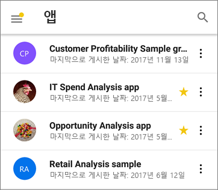

# Power BI용 모바일 앱의 새로운 기능
관련된 "새로운 기능"은 다음을 참조하세요.

* [모바일 앱에 대한 Power BI 팀 블로그](https://powerbi.microsoft.com/blog/tag/mobile/)
* [Power BI Desktop의 새로운 기능](../../desktop-latest-update.md)  
* [Power BI 서비스의 새로운 기능](../../service-whats-new.md)  

## 2018년 11월

### 최신 시각적 머리글 

새로운 '최신 시각적 머리글’을 사용하는 보고서에서는 더 이상 머리글 공간이 할당되지 않으므로 빈 공간이 줄어들고 시각화할 수 있는 공간이 늘어납니다.

### 프레젠테이션 모드(Windows)를 개선합니다.

Surface Hub 및 Windows 10 디바이스에 대해 향상된 프레젠테이션 모드입니다.  개선된 프레젠테이션 및 협업 도구와 크롬을 사용하지 않고 최적화된 대형 화면 보기를 제공하는 향상된 Surface Hub 회의실을 사용하여, 데이터에 집중할 수 있습니다. 또한 프레젠테이션 모드는 데이터를 효과적으로 제시하고 데이터에 대해 토론하는 데 도움이 되는 도구를 제공합니다. [여기](https://powerbi.microsoft.com/en-us/blog/presentation-mode-in-power-bi-windows-app/)에서 프레젠테이션 모드에 대한 자세한 내용을 알아보세요.

### 태블릿의 세로 보고서 레이아웃(iOS 및 Android)

이제 휴대폰 보고서 레이아웃이 있는 경우 이를 사용하여 태블릿에서 보고서를 세로 모드 방향으로 표시할 수 있습니다. [Power BI 서비스 또는 데스크톱에서 휴대폰 레이아웃을 만드는 방법](https://docs.microsoft.com/en-us/power-bi/desktop-create-phone-report/)에 대해 자세히 알아보세요.

### 보고서 쿼리 문자열 지원 

쿼리 문자열이 포함된 보고서 열기 링크가 모바일 앱에서 열리고 쿼리 문자열에 정의된 조건에 따라 미리 필터링됩니다. [쿼리 문자열을 사용하여 보고서 URL을 만드는 방법](https://docs.microsoft.com/en-us/power-bi/service-url-filters/)에 대해 자세히 알아보세요.  

### 공유 자격 증명(현재 Android)

모바일 앱에서 Power BI에 로그인하는 것은 간편하지 않습니다. 공유 자격 증명을 통해 디바이스에서 다른 Office 365 앱 자격 증명을 사용하여 Power BI 서비스에서 사용자를 인증하는 방식으로 로그인 프로세스를 단순화했습니다.

### 앱 내 URL(현재 Android) 

이제 다른 Power BI 아티팩트를 가리키는 보고서의 링크가 앱 내에서 바로 열립니다. 이를 통해 사용자 지정 탐색 흐름(예: 보고서에서 대시보드로 연결)을 빌드할 수 있습니다.

### 데이터 표시 및 값 복사

보고서 시각화 작업 메뉴(...)에는 기본 데이터를 표 형식으로 표시할 수 있는 옵션이 있습니다. 표에 있는 경우, 표(Intune 정책이 복사를 제한하지 않는다고 가정할 때)에서 선택하고 길게 탭할 수 있습니다.

## 2018년 10월

### 페이지를 매긴 보고서 미리 보기(모든 디바이스)

이제 Power BI 서비스에서 페이지를 매긴 보고서를 사용할 수 있습니다. Power BI 서비스에서 페이지를 매긴 보고서에 액세스할 수 있는 사용자는 모바일 앱에서도 이러한 보고서에 액세스할 수 있습니다. 

[모바일의 페이지를 매긴 보고서에 대한 Power BI 블로그 게시물](https://powerbi.microsoft.com/en-us/blog/power-bi-paginated-reports-also-available-in-power-bi-mobile-apps-preview/)을 참조하세요.

### 공유 자격 증명(iOS)

모바일 앱에서 Power BI에 로그인하는 것은 간편하지 않습니다. 공유 자격 증명을 통해 디바이스에서 다른 Office 365 앱 자격 증명을 사용하여 Power BI 서비스에서 사용자를 인증하는 방식으로 로그인 프로세스를 단순화했습니다.

### 앱 내 URL(iOS) 

이제 다른 Power BI 아티팩트를 가리키는 보고서의 링크가 앱 내에서 바로 열립니다. 이를 통해 사용자 지정 탐색 흐름(예: 보고서에서 대시보드로 연결)을 빌드할 수 있습니다.

### iOS12 및 watchOS 5 지원 

모바일 디바이스 및 시계의 새로운 OS에서 원활하게 작동하도록 iOS용 Power BI 앱을 업데이트했습니다.

## 2018년 9월

### 브라우저에서 휴대폰 보고서 편집(모든 디바이스)

이제 단지 Power BI Desktop뿐만 아니라 Power BI 서비스에 이미 게시된 보고서에 대해 휴대폰 보고서 레이아웃을 만들 수 있습니다. 브라우저의 편집 모드에서 이러한 레이아웃을 만듭니다.

### 대시보드에 의견 달기(iOS 및 Android) 

대시보드 및 특정 타일에 직접 의견을 추가하여 데이터에 대해 논의할 수 있으며, 대시보드를 보는 모든 사람이 여러분의 의견을 볼 수 있습니다. 조직의 다른 사람들을 @mentioning하여 대화로 끌어올 수도 있습니다. 여러분이 @mentioned한 사용자는 휴대폰으로 메시지에 대한 푸시 알림을 받게 됩니다.

현재 iOS 및 Android 디바이스에서 사용할 수 있습니다. Windows 지원도 곧 제공될 예정입니다.

[대시보드 의견에 대한 Power BI 블로그 게시물](https://powerbi.microsoft.com/blog/announcing-dashboard-comments-in-power-bi/)을 읽어보세요.

### Single Sign-On(Windows)

SSO(Single Sign-On)는 Windows용 Power BI Mobile에서 가장 많이 요청된 기능 중 하나입니다. 이제 기본 조직 계정을 사용하여 도메인에 가입된 Windows 모바일 디바이스에 로그인할 뿐 아니라 Power BI 서비스에도 원활하게 로그인할 수 있습니다. [SSO 및 Windows 모바일 앱](mobile-windows-10-app-single-sign-on-sso.md)에 대해 자세히 알아보세요.

## 이전 달

### 2018년 7월

#### iOS 및 Android만 해당

**공유 필터**

이제 공유 필터 및 슬라이서를 사용하여 보고서를 받을 수 있습니다.

**배경 이미지 지원**

모바일 디바이스에서 가로 모드로 보고서를 볼 때 웹용 Power BI에 표시되는 것과 동일한 배경 이미지를 볼 수 있습니다.

### 2018년 6월

#### 전체 캔버스 보고서

이제 보고서가 로드된 후에 위쪽 및 아래쪽 작업 막대가 바로 사라지므로 보고서를 한 번에 좀 더 자세히 볼 수 있습니다.

#### 전화 보고서 캔버스 크기 증가

전화 보고서 캔버스 크기가 증가하여 이전보다 시각적 개체를 위한 공간이 추가되었습니다.

### 2018년 5월

#### 모바일 드릴스루: 모든 모바일 앱

보고서 작성자가 해당 동작을 정의한 경우, 모바일 앱에서 선택한 데이터 요소에서 다른 보고서 페이지로 드릴스루할 수 있습니다. 

#### 뒤로 단추: 모든 모바일 앱

이제 살짝 밀기, 작업 모음에서 보고서 페이지 선택 또는 드릴스루 사용을 통해 보고서를 탐색할 때 뒤로 단추를 사용하여 보고 있었던 이전 페이지로 돌아갈 수 있습니다. 

#### 대시보드 테마: 모든 모바일 앱

보고서 작성자가 Power BI 서비스에서 대시보드 테마를 사용자 지정하면 대시보드의 모양과 느낌이 모바일 앱에서도 변경됩니다. 그러나 배경 이미지는 표시되지 않습니다.

#### iOS: 원격으로 보고서 서버에 대한 Power BI iOS 모바일 앱 액세스 권한 구성

이제 IT 관리자는 MDM 도구를 사용하여 보고서 서버에 대한 Power BI iOS 모바일 앱 액세스 권한을 구성할 수 있습니다. 자세한 내용은 [원격으로 보고서 서버에 대한 Power BI iOS 모바일 앱 액세스 권한 구성](../../report-server/configure-powerbi-mobile-apps-remote.md)을 참조하세요.

#### 혼합 현실용 Power BI 앱(미리 보기)

혼합 현실을 위한 Power BI 앱이 지금 Microsoft Store에서 제공됩니다. 가상 환경을 사용하는 동안 대시보드 및 보고서를 확인하거나 사용자 환경 컨텍스트의 특정 위치에 배치하고 봅니다. 새 [Introducing Power BI on Hololens](https://www.youtube.com/watch?v=J_X_nOFUBss)(Hololens의 Power BI 소개) 동영상 또는 새 [혼합 현실을 위한 Power BI 앱](mobile-mixed-reality-app.md)에 대한 문서를 참조하세요.

### 2018년 4월

#### 모바일 드릴다운 및 드릴업

이제 드릴다운 및 드릴업을 사용하여 보고서 모바일 디바이스에서 시각적 개체를 자세히 살펴볼 수 있습니다. 이 새로운 기능에 액세스하려면 보고서 시각적 개체에서 도구 설명 메뉴를 길게 눌러서 연 다음, 드릴 단추를 탭하여 데이터를 자세히 살펴봅니다. [모바일 앱에서 드릴업 및 드릴다운](https://powerbi.microsoft.com/blog/drill-down-up-in-power-bi-mobile-apps/)하는 방법을 알아보세요.

#### 영구 필터

보고서 필터와 슬라이서가 최근에 업데이트되어 웹용 Power BI에서 Power BI 모바일 앱으로 자동으로 저장됩니다. 이제 모바일 앱에서 설정한 필터와 슬라이서가 웹용 Power BI에 자동으로 저장됩니다.

### 2018년 3월

#### 혼합 현실용 Power BI 앱(미리 보기)

사용자가 위치한 데이터를 가져오는 최신 변경 사항에서 혼합 현실용 Power BI 앱을 만들었습니다. 가상 환경을 사용하는 동안 대시보드 및 보고서를 확인하거나 사용자 환경 컨텍스트의 특정 위치에 배치하고 봅니다. 새로운 [혼합 현실용 Power BI 앱](mobile-mixed-reality-app.md)에 대해 자세히 읽어보세요.

#### 외부에서 보고서 및 대시보드 공유

앱에서 바로 조직 외부의 사용자와 대시보드 및 보고서를 공유합니다. 외부 공유는 조직 및 소셜 계정 모두에 대해 사용할 수 있습니다. 

#### 영구 필터

웹의 Power BI에서 필터 및 슬라이서를 설정하면 필터 선택 사항이 모바일 앱에도 적용되어 중단했던 위치를 선택할 수 있습니다.

#### iPad의 보고서 새로 고침

Power BI 보고서에는 이제 iPad 앱의 새로 고침 단추가 있습니다.

### 2018년 2월

#### 보고서 공유

이제 모바일 앱에서 직접 보고서를 공유할 수 있습니다. [모바일 앱에서 대시보드 및 보고서 공유](mobile-share-dashboard-from-the-mobile-apps.md)에 대해 자세히 알아보세요.

#### 도구 설명 향상

보고서 시각적 개체를 누른 상태로 잠시 기다려서 도구 설명에 액세스하는 경우 시각적 개체를 손가락으로 끌어와서 각 데이터 요소에 대한 세부 정보를 탐색할 수 있습니다.

### 2018년 1월

#### 보고서 즐겨찾기

**즐겨찾기** 페이지에 나타나도록 보고서를 즐겨찾기로 태그를 지정하세요. 자세한 내용은 [Power BI 모바일 앱의 즐겨찾기](mobile-apps-favorites.md)를 읽어보세요.

#### 공유 보고서 보기

이제 다른 사람이 사용자와 보고서를 공유하면 대시보드와 함께 **공유한 항목** 페이지에 표시됩니다.

#### 하이퍼링크 지원 개선

이제 사용자 지정 시각적 개체의 링크를 탭하여 모바일 브라우저에서 열 수 있습니다.

#### Intune 통합(Android)

Intune 모바일 디바이스 관리를 사용하여 조건부 액세스를 지원합니다.

### 2017년 12월

#### 향상된 보안 관리 

조직의 데이터를 보다 효과적으로 보호할 수 있도록 Android 디바이스에서 CA(조건부 액세스) 및 Microsoft Intune MDM(모바일 디바이스 관리)에 대한 지원이 추가되었습니다. iOS에는 이미 사용 가능합니다.

#### 향상된 사용 권한 관리

데이터 세트, 대시보드 및 보고서에 대한 사용자 권한을 보다 정밀하게 관리할 수 있도록 몇 가지 기능이 변경되었습니다.

#### 자동 설치된 앱

일부 앱은 Power BI에 설치할 필요가 없습니다. 조직의 Power BI 응용 프로그램 작성자는 대시보드 및 보고서 컬렉션을 포함하는 *앱*을 만들 수 있습니다. 그런 다음 앱을 게시하여 Power BI 서비스 및 Power BI 모바일 앱에 자동으로 설치하도록 설정할 수 있습니다. 앱이 설치되도록 설정되면 **앱** 메뉴에 앱이 자동으로 표시됩니다.

### 2017년 11월
#### iPhone X 최적화

iPhone X용 앱 레이아웃을 최적화하여 모든 디바이스의 스타일에 맞게 데이터를 탐색할 수 있습니다.

### 2017년 10월
#### Android에서 휴대폰 보고서에 대한 필터

Power BI Desktop에서 휴대폰에 최적화된 페이지가 있는 보고서를 만들고 보고서에 필터가 있는 경우 이제 Android에서 휴대폰 보고서에 이러한 필터를 적용할 수 있습니다. Android의 Power BI 보고서에 대한 필터에서 자세히 알아봅니다.

#### 보고서에 데이터 표시

이제 보고서의 시각적 개체를 테이블 보기로 전환하여 데이터 뒤의 숫자를 볼 수 있습니다. 이 기능에 액세스하려면 보고서의 시각적 개체 메뉴의 "데이터 표시" 또는 확장된 시각적 개체의 작업 메뉴에 있는 새 아이콘을 탭합니다.

### 2017년 9월
#### iPhone에서 휴대폰 보고서에 대한 필터
Power BI Desktop에서 휴대폰에 최적화된 페이지가 있는 보고서를 만들고 보고서에 필터가 있는 경우 이제 iPhone에서 휴대폰 보고서에 이러한 필터를 적용할 수 있습니다. [iPhone의 Power BI 보고서에 대한 필터](https://powerbi.microsoft.com/blog/filters-coming-for-phone-reports-on-ios/)에서 자세히 알아봅니다.

### 2017년 8월
#### iOS 프록시 설정 지원
이제 Power BI iOS 모바일 앱에서 프록시 설정을 지정할 수 있습니다. 즉, Power BI는 이제 모바일 디바이스에서 VPN 연결을 통해 더 많은 사용자와 조직이 이동 중에 Power BI의 능력을 안전하게 활용할 수 있도록 합니다.

### 2017년 7월
[2017년 7월 모바일 앱 기능 요약](https://powerbi.microsoft.com/blog/power-bi-service-and-mobile-july-feature-summary/#ios-preview)을 읽어보세요.

#### iOS 디바이스
**iOS에서 새로운 질문 및 답변 환경(미리 보기)** 이제 단순히 질문에 대한 답변을 받는 대신, 자연어를 사용하여 지정된 범위의 신속한 정보 활용이 가능합니다. 원하는 정보가 확실하지 않더라도 질문 및 답변은 사용자 데이터와 관련된 유용한 정보를 사전에 노출합니다. Microsoft Research 팀과 공동 작업으로 개발된 모바일 기반 새로운 질문 및 답변 환경은 제품 내에서 강력한 기술을 선보입니다. [iOS 모바일 앱의 데이터에 대해 질문하기(자습서)](mobile-apps-ios-qna.md)를 시도해 보세요.

### 반응형 시각적 개체
**휴대폰 보고서 및 대시보드를 위한 반응형 시각적 개체**대시보드 또는 보고서에서 시각적 개체를 *반응형*으로 설정하여 화면 크기와 상관없이 최대 데이터 양 및 정보를 표시하도록 동적으로 변경할 수 있습니다. [반응형 시각적 개체에 대한 블로그](https://powerbi.microsoft.com/blog/power-bi-desktop-july-feature-summary-2/#responsiveVisuals)를 읽어 보세요.

### 2017년 6월
#### All 디바이스
**앱 즐겨찾기 만들기** 대시보드를 즐겨찾기로 만들 수 있습니다. 최근에는 [Power BI에서 앱을 추가했으며](../../service-create-distribute-apps.md) 이제 앱 즐겨찾기 만들기도 수행할 수 있습니다. 

### 2017년 5월
#### All 디바이스
**새 메뉴: 나와 공유** 사용자와 공유되는 모든 콘텐츠를 보려면 모바일 앱 메뉴에서 나와 공유로 이동합니다.

**새 메뉴: 앱** 앱은 더 빠르고 쉬운 데이터 기반 결정을 위한 핵심 메트릭을 제공하기 위해 조직에서 작성한 대시보드 및 보고서 컬렉션입니다.

[Power BI 콘텐츠가 구성되는 방식](mobile-apps-quickstart-view-dashboard-report.md)에 대해 자세히 알아봅니다.

#### iOS 및 Android 디바이스
**Power BI Report Server 미리 보기** 온-프레미스에서 Power BI 보고서를 만들고 게시합니다. 그런 다음 [iOS 또는 Android 모바일 디바이스에서 보고 상호 작용합니다](mobile-app-ssrs-kpis-mobile-on-premises-reports.md). 

### 2017년 4월
[2017년 4월 모바일 앱 기능 요약](https://powerbi.microsoft.com/blog/power-bi-mobile-apps-feature-summary-march-april-2017/)을 참고하세요.

#### All 디바이스
**전화 보고서에 대한 배경색** Power BI Desktop에서 보고서에 대한 배경색을 정의하는 경우 전화 보고서는 동일한 배경색을 갖게 됩니다. [전화에 대한 보고서 페이지 최적화](../../desktop-create-phone-report.md)에 대해 자세히 알아봅니다.

**모바일 친화적 사용자 지정 시각적 개체 개발** 모바일 장치에 잘 어울리고 제대로 작동하는 사용자 지정 시각적 개체 만들기 팁에 대해 이 [개발자 가이드](https://github.com/Microsoft/PowerBI-visuals/blob/master/Tutorial/MobileGuideline.md)를 참조하세요.

#### iOS 디바이스
**데이터와 통신: 말로 질문** 이제 입력하지 않고 이야기하여 [질문 및 답변으로 데이터에 대해 질문](mobile-apps-ios-qna.md)할 수 있습니다. 

### 2017년 3월
[2017년 3월 모바일 앱 기능 요약](https://powerbi.microsoft.com/blog/power-bi-mobile-apps-feature-summary-march-2017/)을 참고하세요.

#### All 디바이스
**슬라이서 상호 작용**

시간 슬라이서에 대한 터치 상호 작용이 향상되었습니다.

#### iOS 디바이스
**질문 및 답변으로 데이터에 대해 질문하고 의견 제출** 질문 및 답변으로 데이터에 대해 질문한 후 웃거나 찡그린 얼굴로 평가해 주세요.

**일반적인 작업에 3D 터치 사용** iPhone 6s 이상의 홈 화면에서 Power BI 앱 아이콘을 깊게 눌러 알림, 검색 및 최근 사용한 대시보드에 액세스할 수 있습니다.

**오른쪽에서 왼쪽으로 쓰기 언어 지원** Power BI 모바일 앱은 이제 오른쪽에서 왼쪽으로 쓰기 언어를 지원합니다. 이 컨텍스트에서 "오른쪽에서 왼쪽으로 쓰기 언어"는 오른쪽에서 왼쪽으로 작성되며 컨텍스트에 따른 모양 처리를 필요로 하는 히브리어 및 아랍어 쓰기 시스템을 가리킵니다. [Power BI 모바일 앱에서 지원되는 언어](mobile-apps-supported-languages.md) 목록을 참조하세요.

#### Android 디바이스
**둘 이상의 SSRS 서버에 연결** 

이제 최대 5개의 SQL Server Reporting Services(SSRS) 서버에 동시에 연결할 수 있습니다.

**대시보드에 대한 액세스 요청** 

액세스 권한이 없는 대시보드에 대한 QR 코드를 스캔하는 경우 이제 모바일 앱에서 직접 액세스에 대한 요청을 제출할 수 있습니다.

### 2017년 2월
#### All 디바이스
**더욱 간편해진 스크롤** 

이제 보고서의 막대형 및 세로 막대형 차트에서 측면의 스크롤 막대를 터치하는 것이 아니라 차트 자체를 터치하여 스크롤할 수 있습니다.

#### iOS 디바이스
**질문 및 답변 미리 보기로 데이터에 대해 질문하기** 

질문 및 답변을 사용하여 데이터에 관해 직접 질문을 하면 Power BI에서 답변을 제공합니다. 질문 및 답변은 이미 http://powerbi.com의 Power BI 서비스입니다. 이제 [iPhone 또는 iPad의 모바일 앱에서도 사용 가능](mobile-apps-ios-qna.md)합니다.

**둘 이상의 SSRS 서버에 연결** 

이제 최대 5개의 SQL Server Reporting Services(SSRS) 서버에 동시에 연결할 수 있습니다.

#### Android 태블릿
이제 전 세계에서 Android 태블릿용 **Power BI 모바일 앱**을 사용할 수 있습니다. [Android 태블릿에서 Power BI](mobile-android-app-get-started.md)를 시작합니다.

#### iOS 및 Android 디바이스
**대시보드 타일의 새 메뉴** 대시보드의 타일에 있는 메뉴에서 직접 원본 보고서로 이동하거나 타일을 확장하거나 경고를 관리하세요. 

이 메뉴는 iOS, 가로 모드의 Android 휴대폰 및 Android 태블릿에 새로 추가되었습니다. 세로 모드의 Windows 및 Android 휴대폰에는 이미 있던 기능입니다.

### 2017년 1월
[2017년 1월 모바일 앱 블로그 기능 요약](https://powerbi.microsoft.com/blog/power-bi-mobile-apps-feature-summary-january-2017)을 참조하세요.

#### All 디바이스
**테이블 및 행렬에서 100개 이상의 행 로드** 이제 대시보드 또는 보고서에 큰 테이블 또는 행렬이 있는 경우 타일에 가능한 한 많은 데이터를 표시합니다. 그런 다음 포커스 모드에서 아래로 스크롤하여 추가 행을 로드할 수 있습니다.

**전화 보고서 - 일반 가용성** 이제 Power BI 전화 보고서를 일반적으로 사용할 수 있습니다. Power BI Desktop에서 모바일 뷰어를 위해 기존 보고서를 세로로 조정하여 볼 수 있습니다. [Power BI Desktop에서 전화 보고서 작성](../../desktop-create-phone-report.md) 및 [휴대폰에서 보고서 경험](mobile-apps-view-phone-report.md)에 대해 자세히 알아보세요.

#### iOS
**ADFS(Active Directory Federation Services) 미리 보기를 사용한 SSRS 인증** 이제 모바일 장치에서 조직 계정으로 온-프레미스 SQL Server Reporting Services 서버에 로그인할 수 있습니다. [OAuth를 사용하여 SSRS 서버에 연결](mobile-oauth-ssrs.md)에 대해 자세히 알아보세요.

#### Android
**ADFS(Active Directory Federation Services) 미리 보기를 사용한 SSRS 인증** 이제 모바일 장치에서 조직 계정으로 온-프레미스 SQL Server Reporting Services 서버에 로그인할 수 있습니다. [OAuth를 사용하여 SSRS 서버에 연결](mobile-oauth-ssrs.md)에 대해 자세히 알아보세요.

**새 기능 및 향상된 기능: 신속한 정보 주석 달기 및 공유** 이제 Android 디바이스에서 공유 및 주석 달기가 완벽하게 작동합니다. 향상된 메뉴를 사용하면 쉽고 빠르게 정보에 주석을 달고 공유할 수 있고 주석이 추가된 보고서를 Power BI 앱에서 바로 공유할 수도 있습니다.

### 2016년 12월
[2016년 12월 모바일 앱 블로그 기능 요약](https://powerbi.microsoft.com/blog/power-bi-mobile-apps-feature-summary-december-2016)을 참조하세요.

#### All 디바이스
**오프라인 배경 새로 고침**

오프라인에서 최신 데이터에 액세스할 수 있도록 하기 위해 앱의 배경에서 새로 고침을 수행하여 잠시 동안 액세스하지 않은 경우에도 비즈니스 정보를 최신으로 유지합니다. 특정 대시보드를 항상 최신으로 유지할 수 있도록 즐겨찾기로 표시합니다. [Power BI 모바일 앱의 오프라인 기능](mobile-apps-offline-data.md)에 대해 자세히 알아봅니다.

#### iOS 디바이스
**주석 달기 및 공유**

이제 iOS용 Power BI 모바일 앱에서 타일, 보고서 또는 시각화에 주석을 달고 공유할 수 있습니다. 

* [iPhone에서](mobile-annotate-and-share-a-tile-from-the-mobile-apps.md)
* [iPad에서](mobile-annotate-and-share-a-tile-from-the-mobile-apps.md)

**대시보드에 대한 액세스 요청**

액세스 권한이 없는 대시보드에 대한 QR 코드를 스캔하는 경우 이제 모바일 앱에서 직접 액세스에 대한 요청을 제출할 수 있습니다.

**이미지 타일의 사용자 지정 URL**

이미지 타일에 대시보드 소유자에 의해 정의된 사용자 지정 URL이 있는 경우 타일을 탭하면 포커스 모드에서 타일을 열지 않고 해당 URL로 직접 이동합니다. 

#### iPhone
**Apple Watch 개선 기능**

이제 Watch 앱에서 직접 Apple Watch 데이터를 새로 고칠 수 있습니다. 대시보드 인덱스 페이지에서 전체 키를 눌러 데이터를 새로 고칩니다. (Power BI 모바일 앱은 이 작업을 수행하기 위해 iPhone의 배경에서 실행되어야 합니다.)

#### Android
**이미지 타일의 사용자 지정 URL**

이미지 타일에 대시보드 소유자에 의해 정의된 사용자 지정 URL이 있는 경우 타일을 탭하면 포커스 모드에서 타일을 열지 않고 해당 URL로 직접 이동합니다. 또한 미리 정의된 사용자 지정 URL을 포함하는 대시보드 타일은 이제 앱 내에서 보고서에 판독기를 리디렉션할 수 있습니다.

### 2016년 11월
[2016년 11월 Power BI 모바일 앱 기능 요약](https://powerbi.microsoft.com/blog/power-bi-mobile-apps-feature-summary-november-2016/)을 참고하세요.

#### Android 태블릿
**Android 태블릿용 Power BI 모바일 앱** 예. 미리 보기는 여기에 있습니다.

* [Android 태블릿에서 Power BI](mobile-android-app-get-started.md) 경험해보기
* [Android 태블릿에서 Reporting Services 모바일 보고서 및 KPI](mobile-app-ssrs-kpis-mobile-on-premises-reports.md) 탐색

#### Android 디바이스
**미리 보기: Intune 모바일 애플리케이션 관리** Microsoft Intune MAM(모바일 애플리케이션 관리자)에 대한 Power BI 지원은 이제 Android 디바이스에서 Power BI Pro 사용자를 위한 미리 보기에 있습니다. 

**즐겨찾기** Android 장치에서 즐겨 찾는 대시보드 태그를 지정하고 한 곳에 수집된 [즐겨 찾는 Power BI 대시보드와 Reporting Services 모바일 보고서 및 KPI](mobile-android-app-get-started.md#view-your-favorite-dashboards-kpis-and-reports)를 모두 보세요. 

#### iOS 디바이스
**링크** 타일 및 시각화의 URL은 이제 클릭 가능하며 브라우저에서 열립니다.

#### Windows 디바이스
**지도를 가운데에 맞추어** 현재 위치 주변의 데이터에 초점을 맞출 수 있습니다.

### 2016 년 9 월/10 월
[2016년 10월 Power BI 모바일 앱 기능 요약](https://powerbi.microsoft.com/blog/power-bi-mobile-apps-feature-summary-october-2016/)을 참고하세요.

#### All 디바이스
**방문 페이지로 즐겨찾기** 즐겨찾기로 대시보드 중 하나를 표시한 경우 방문 페이지가 즐겨찾기 항목이 됩니다. 

**향상된 탐색** 주 탐색의 모습이 새롭게 바뀌었고 그룹 탐색이 그룹 카탈로그로 이동되었습니다. 

**보고서 및 대시보드 성능 향상** Power BI 모바일 앱에서 보고서 및 대시보드를 로드하는 환경이 향상됨

**향상된 경고 알림** 데이터 기반 경고에 대한 알림에는 이제 경고를 트리거한 항목과 이유에 대한 자세한 내용이 포함됩니다.

#### iPhone의 iOS
**Apple Watch 새로 고침 기능 향상** Apple Watch OS3을 위해 Apple Watch 모바일 앱이 향상됨

#### Android 휴대폰
**추가된 수동 타일 새로 고침** 이제 대시보드 타일을 수동으로 새로 고칠 수 있습니다. DirectQuery 쿼리를 기반으로 하는 타일의 경우 데이터 세트에서 최신 데이터를 검색합니다.

#### Windows 10 휴대폰
**지리적 필터링** Windows 10 휴대폰에서 현재 위치에 따라 보고서를 필터링하고 필요한 데이터만 참조하세요.

**SandDance 시각화** 이 사용자 지정 시각화는 이제 Surface Hub에서 사용할 수 있게 되었습니다.

### 2016년 8월
#### 모든 전화
**즐겨찾기** 모든 Power BI 모바일 앱에서 즐겨 찾는 대시보드를 보고 iOS 및 Windows 10 장치용 Power BI 모바일 앱에서 즐겨찾기 목록을 관리할 수 있습니다. 자세한 내용은 [Power BI 모바일 앱의 즐겨찾기](mobile-apps-favorites.md)를 읽어보세요.

**대시보드 데이터 분류** 대시보드 소유자가 자신의 대시보드를 할당한 데이터 분류를 확인할 수 있습니다. 자세한 내용은 [대시보드 분류](../../service-data-classification.md)를 읽어보세요.

**데이터 기반 경고** KPI, 계기 및 카드 타일에 대한 미리 설정된 방법으로 데이터가 변경될 때 경고 알림을 받습니다. 다음에 대해 자세히 알아보세요.

* [Android 휴대폰용 Power BI 앱에 대한 경고](mobile-set-data-alerts-in-the-mobile-apps.md) 
* [iOS용 Power BI 앱에 대한 경고](mobile-set-data-alerts-in-the-mobile-apps.md) 
* [Windows 10 장치용 Power BI 앱에 대한 경고](mobile-set-data-alerts-in-the-mobile-apps.md)

#### iPhones 및 iPads의 iOS
**iPad에서 포커스 모드의 전체 화면 타일** iPad에서 타일을 탭하면 이제 타일이 포커스 모드에서 전체 화면으로 열리므로 iPad 화면 전체를 활용할 수 있습니다.

**타일 수동으로 새로 고침** iOS용 Power BI 모바일 앱에서 대시보드를 열고 화면 맨 위에서 아래로 끌어서 타일을 수동으로 새로 고칠 수 있습니다. 

**Intune MAM에 대한 지원** Microsoft Intune 모바일 응용 프로그램 관리(MAM) 기능에 대한 지원을 추가합니다.

자세한 내용은 [Power BI 모바일 앱에서 Microsoft Intune](../../service-admin-mobile-intune.md)을 읽어보세요.

#### Windows 10 디바이스
**전체 화면 및 프레젠테이션 모드** Surface Hub에서 보고서를 프레젠테이션 모드로 표시하고 Windows 10 장치에서 대시보드, 보고서 및 타일을 전체 화면 모드로 표시할 수 있습니다.

### 2016년 7월
#### 모든 전화
이제 Power BI 서비스에서 세로 모드로 [휴대폰에 맞게 대시보드 보기를 만들](../../service-create-dashboard-mobile-phone-view.md) 수 있습니다. 

#### Android 휴대폰
**즐겨찾기 탭** 단일 위치에서 즐겨 찾는 모든 대시보드에 액세스할 수 있습니다.

**향상된 보안 관리** 특정 대시보드에 표시되는 비즈니스 데이터에 대한 위험 분류를 선택합니다.

**향상된 경고 및 배너** 모바일 앱에 대한 경고 및 배너가 향상되었습니다.

**보고서 페이지에 대한 QR 코드** 서비스에서 생성된 QR 코드는 전체 보고서가 아닌 특정 페이지에 연결됩니다.

**향상된 경고** 데이터 기반 경고는 이제 장치의 로캘에 따라 포맷됩니다.

#### iPhones 및 iPads의 iOS
**향상된 보안 관리** 특정 대시보드에 표시되는 비즈니스 데이터에 대한 위험 분류를 선택합니다.

**모바일 insights** 묶은 세로 막대형 차트 타일에서 요약 데이터(최대, 최소 및 모든)를 봅니다.

**향상된 수동 새로 고침** 이제 대시보드 타일을 수동으로 새로 고칠 수 있습니다. 직접 쿼리를 기반으로 하는 타일의 경우 데이터 모델에서 최신 데이터를 검색합니다.

**향상된 경고 및 배너** 모바일 앱에 대한 경고 및 배너가 향상되었습니다.

**보고서 페이지에 대한 QR 코드** 서비스에서 생성된 QR 코드는 전체 보고서가 아닌 특정 페이지에 연결됩니다.

**일반 개선 사항** 모바일 앱에서 타일에 대한 오류 메시지가 개선되었습니다.

#### Windows 10 디바이스
**향상된 보안 관리** 특정 대시보드에 표시되는 비즈니스 데이터에 대한 위험 분류를 선택합니다.

**향상된 경고 및 배너** 모바일 앱에 대한 경고 및 배너가 향상되었습니다.

### 2016년 6월
자세한 내용은 [6월 Power BI 모바일 앱 블로그 게시물](https://powerbi.microsoft.com/blog/power-bi-mobile-apps-update-june-2016/)을 참조하세요.

#### 이제 QR 코드는 보강된 현실에 표시됨(iOS)
이제 Power BI 서비스에서 생성한 QR 코드를 스캔할 때 타일은 보강된 현실에서 렌더링됩니다. 

[실제 환경에서 데이터 연결](mobile-apps-data-in-real-world-context.md)에 대한 추가 정보입니다.

#### 바코드를 사용하여 데이터 필터링(iPhone)
이제 스캔한 값으로 필터링된 관련된 Power BI 보고서를 표시하기 위해 저장소에서 제품 또는 선반에 인쇄된 바코드를 스캔할 수 있습니다. 

[바코드를 사용하여 데이터 필터링](mobile-apps-scan-barcode-iphone.md)에 대한 추가 정보입니다.

#### SQL Server 2016 Reporting Services 모바일 보고서
이제 Reporting Services KPI 또는 모바일 보고서에서 다른 모바일 보고서 또는 모든 사용자 지정 URL로 드릴스루할 수 있습니다.

#### 알림 센터
Power BI 모바일 앱의 알림 센터에서는 사용자와 공유한 새 데이터나 대시보드 또는 사용자가 속한 그룹에 대한 변경 내용을 보여 줍니다.

### 2016년 5월
#### iOS 디바이스 및 Android 휴대폰
* **QR 코드**는 **보고서에**도 제공됩니다. 관련된 보고서도 직접 이동하려면 탐색 또는 검색이 필요 없이 Power BI 앱을 사용하여 코드를 스캔합니다.
* SQL Server 2016 Reporting Services에 대한 **데이터 관리 개선**: 디바이스의 로드 시간 및 데이터 사용이 감소되었습니다.
* **SQL Server 2016 테마가 지정된 모바일 보고서**: 디바이스에서 모바일 보고서에 대한 테마를 확인합니다.
* **Geofiltering**: 현재 위치에 따라 보고서를 필터링합니다.

### 2016년 4월
자세한 내용은 [4월 Power BI Mobile Apps 블로그](https://powerbi.microsoft.com/blog/power-bi-mobile-apps-update-april-2016/)를 참조하세요.

#### 모든 앱
* 보고서 슬라이서에서 둘 이상의 옵션을 선택합니다.

#### Android 모바일 앱
* **SQL Server 2016 [Reporting Services 모바일 보고서](mobile-app-ssrs-kpis-mobile-on-premises-reports.md)** 가 이제 Android 장치에 제공됩니다.
* **보고서 갤러리** 보고서 갤러리에서 직접 보고서를 엽니다.
* **NTLM 인증**은 SQL Server 2016 Reporting Services에서 모바일 보고서를 지원합니다.

#### Windows 10 디바이스용 Power BI 앱
* **프레젠테이션 모드** Power BI 대시보드 및 보고서를 Power BI 앱의 프레젠테이션 모드로 표시합니다.
* **SQL Server 2016 [Reporting Services 모바일 보고서](mobile-app-windows-10-ssrs-kpis-mobile-reports.md)** 가 이제 Windows 10 장치에 제공됩니다.
* 대시보드 타일 위에 마우스를 가져가면 **데이터 도구 설명**이 표시됩니다.

### 2016년 3월
[2016년 3월에 대한 Power BI Mobile Apps 블로그](https://powerbi.microsoft.com/blog/power-bi-mobile-apps-update-march-2016/)를 참고합니다.

#### iPhone 모바일 앱
**Apple Watch** [Apple Watch](mobile-apple-watch.md)의 Power BI 타일 및 KPI 보기

**iOS 9.0 이상** Power BI에 대한 가능한 최상의 환경 및 새로운 기능을 수용하기 위해 iOS 9.0 이상을 실행하는 장치를 지원하고 있습니다.

**전체 검색** 필요한 데이터를 신속하게 찾을 수 있도록 새 "최근에 본" 목록 및 전체 검색을 추가합니다.

**보고서 갤러리** 보고서 갤러리에서 직접 보고서를 엽니다.

**새로운 데이터 오프라인** 새 백그라운드 새로 고침은 온라인 상태인 경우 자동으로 캐시된 데이터를 업데이트하므로 [오프라인인 경우에도](mobile-apps-offline-data.md) 최신 데이터를 보유합니다. 

**Bing 및 R 타일** 포커스 모드에서 Bing 및 R 타일을 엽니다.

#### Android 모바일 앱
**SQL Server 2016 모바일 보고서 및 KPI** [SQL Server 2016 모바일 보고서 및 KPI를 보고](mobile-app-ssrs-kpis-mobile-on-premises-reports.md) SSRS 폴더 간을 이동합니다.

**보고서 보기** 대시보드의 타일에서 보고서를 엽니다.

**새로운 데이터 오프라인** 새 백그라운드 새로 고침은 온라인 상태인 경우 자동으로 캐시된 데이터를 업데이트하므로 [오프라인인 경우에도](mobile-apps-offline-data.md) 최신 데이터를 보유합니다. 

#### Windows 10 디바이스용 Power BI 앱
**빠른 액세스** 새 "최근에 본" 목록 및 전체 검색으로 대시보드, 보고서 및 그룹에 신속하게 액세스할 수 있으므로 필요한 데이터를 찾을 수 있습니다.

**Bing 및 R 타일** 포커스 모드에서 Bing 및 R 타일을 엽니다.

**시작 화면의 더 많은 라이브 타일** [시작 화면에서 KPI 및 행 카드를 라이브 타일로 고정](mobile-pin-dashboard-start-screen-windows-10-phone-app.md)하므로 중요한 메트릭을 모두 한 눈에 볼 수 있습니다.

**두 손가락을 오므리거나 펴서 확대/축소** 태블릿에서 축소/확대를 사용하여 대시보드를 더 자세히 검사합니다.

**알림** 데이터 집합, 보고서 및 대시보드를 새 데이터로 업데이트하는 경우 알림을 받습니다.

**보고서 갤러리** 보고서 갤러리에서 직접 보고서를 엽니다.

### 2016년 2월
#### Android
[Android 휴대폰에서 가로 모드](mobile-apps-view-dashboard.md#view-dashboards-on-your-android-phone)로 대시보드를 봅니다. 

#### Windows 10 디바이스용 Power BI 앱
[Windows 10 휴대폰에서 가로 모드](mobile-apps-view-dashboard.md#view-dashboards-on-your-windows-10-device)로 대시보드를 봅니다.

[Windows 10 Phone에서 보고서](mobile-reports-in-the-mobile-apps.md)를 봅니다.

[Windows 10 모바일 대시보드에서 인사이트](mobile-tiles-in-the-mobile-apps.md)에 더 신속하게 접근: 타일 스냅숏을 공유하거나 대시보드에서 직접 보고서를 엽니다.

### 2016년 1월
모든 1월 개선 사항은 2015년 12월에 출시된 새로운 [Windows 10 Phone용 Power BI 앱](mobile-windows-10-phone-app-get-started.md)에 이미 있습니다. 현재 모바일 디바이스에 사용할 다른 Power BI 앱에 롤아웃하고 있습니다. 이러한 향상된 기능에 대한 자세한 내용은 블로그 게시물을 읽어보세요.

**실시간 데이터 지원** 대시보드가 실시간으로 새로 고쳐지므로 수동으로 새로 고칠 필요가 없습니다.

**오프라인 표시기** 신호가 없는 경우 대시보드 위쪽에 있는 오프라인 표시기를 확인합니다.

**캐시된 데이터 액세스** 캐시된 데이터가 더 이상 만료되지 않으므로 오프라인 상태에서 제한 없이 캐시된 데이터에 액세스할 수 있습니다.

**R 타일 및 웹 위젯** 모바일 장치의 대시보드에서 이러한 새 타일 유형을 볼 수 있습니다.

**Bing 대시보드** 이제 Power BI 서비스에서 [Bing 검색 결과로 대시보드](../../service-connect-to-services.md)를 만든 후 모바일 장치에서 볼 수 있습니다.

**대시보드에 타일로 고정되는 보고서 페이지** 이제 Power BI 서비스의 대시보드에 전체 보고서 페이지를 고정할 수 있어, iPhone 또는 Android 휴대폰의 Power BI 앱에서 보고서 페이지를 볼 수 있습니다.

### 2015년 12월
Power BI 팀은 여러 주요 추가 기능과 업데이트를 포함하여 2015년을 보람 있게 마무리했습니다.

#### IOS의 SQL Server 2016 Reporting Services 모바일 보고서
이제 iPad나 iPhone과 같은 IOS 디바이스의 Power BI 앱에서 SQL Server 모바일 보고서를 볼 수 있습니다. 자세한 내용은 다음을 참조하세요.

* [iOS용 Power BI 앱의 SQL 16 SSRS SQL](http://blogs.msdn.com/b/powerbi/archive/2015/12/30/sql-16-ssrs-on-power-bi-app-for-ios.aspx) 블로그 게시물
* [iPhone 및 iPad 앱에서 SQL Server 모바일 보고서 및 KPI](mobile-app-ssrs-kpis-mobile-on-premises-reports.md) 보기 설명서

#### Windows 10 Phone용 Power BI 앱
새 Windows 10 Phone용 Power BI 앱이 터치 및 모바일 생산성에 대해 최적화되어 있습니다. 대시보드 및 보고서를 탐색하고, 데이터를 보도록 동료를 초대하고, 메일을 통해 정보를 공유하여 팀의 참여도를 높이세요. 또한 [Power BI 대시보드를 Windows Phone 시작 화면에 고정](mobile-pin-dashboard-start-screen-windows-10-phone-app.md)할 수도 있습니다.

* [Windows 10 Phone용 Power BI 앱 블로그 게시물](http://blogs.msdn.com/b/powerbi/archive/2015/12/30/announcing-the-power-bi-app-for-windows-10-mobile.aspx)을 참고하세요.
* [Windows 10 Phone용 Power BI 앱 시작합니다](mobile-windows-10-phone-app-get-started.md).

#### 기타 추가 기능
자세한 내용은 [Power BI 모바일 앱 12월 블로그 게시물](http://blogs.msdn.com/b/powerbi/archive/2015/12/30/power-bi-mobile-apps-update-_2d00_-december-2015.aspx)을 참고하세요.

* 동료가 대시보드를 공유할 경우 알림을 받습니다. (iOS)
* 대시보드에서 고정된 보고서 페이지 전체를 봅니다. (iOS 및 Android)
* Android 휴대폰에서 [QR 코드를 스캔](http://blogs.msdn.com/b/powerbi/archive/2015/12/08/bridge-the-gap-between-your-physical-world-and-your-bi-using-qr-codes.aspx)하고 관련 타일로 바로 이동합니다.

### 2015년 11월
[2015년 11월 Power BI 모바일 블로그 게시물](http://blogs.msdn.com/b/powerbi/archive/2015/11/24/power-bi-mobile-apps-update-_2d00_-november-2015.aspx)을 참고하세요.

#### 모든 Power BI 모바일 앱
* 새로운 시작 환경
* 향상된 차트 데이터 용량

#### iOS 및 Android 모바일 앱
* 기업에서는 이제 디바이스 및 응용 프로그램을 관리하도록 [Microsoft Intune로 iOS 및 Android 용 Power BI 모바일 앱을 구성](../../service-admin-mobile-intune.md)할 수 있습니다.

#### iPhone 모바일 앱
* iPhone에서 직접 [대시보드에 그림 타일을 추가](mobile-iphone-app-get-started.md)합니다.
* [Power BI 서비스에서 QR 코드를 만든](../../service-create-qr-code-for-tile.md) 후 iPhone에서 스캔하여 Power BI 앱을 특정 타일로 엽니다.

#### Windows 디바이스용 Power BI 앱
* [타일에서 특정 URL로 직접 연결](../../service-dashboard-edit-tile.md#hyperlink)합니다.

### 2015년 10월
[10월 중순 Power BI 모바일 블로그 게시물](http://blogs.msdn.com/b/powerbi/archive/2015/10/21/power-bi-mobile-mid-october-updates-are-here.aspx)을 읽습니다.

#### 모든 Power BI 모바일 앱
* 백분율 기반 Y축이 있는 꺾은선형 차트는 이제 실제 데이터에 따라 시각적 범위를 계산합니다. 그래프는 이제 기본 값 대신 차트에서 가장 낮은 데이터 요소부터 시작합니다.
* 꺾은선형, 세로 막대형 및 가로 막대형 차트에는 이제 데이터 레이블이 있습니다. 
  
    

#### iPhone
* 그룹의 최신 대시보드를 최신 상태로 유지합니다. - 팀 멤버가 그룹 중 하나에 대시보드를 추가할 때마다 iPhone에서 알림을 수신합니다.
  
    
* 이제 바로 전화를 돌려서 대시보드를 가로로 볼 수 있습니다. [iPhone 앱에서 가로 모드](http://blogs.msdn.com/b/powerbi/archive/2015/11/02/enjoy-the-landscape-with-the-power-bi-iphone-app.aspx)에 대해 자세히 읽습니다.
  
    

### 2015년 9월
Power BI 모바일 앱의 개선된 점 -- Android, iOS(iPhone 및 iPad) 및 Windows. [9월 중순 Power BI 모바일 블로그 게시물](http://blogs.msdn.com/b/powerbi/archive/2015/09/23/power-bi-mobile-mid-september-updates-are-here.aspx)을 읽습니다.

#### Android
* 그룹 작업 영역 지원: 그룹 작업 영역에서는 동료와 공동 작업을 수행합니다. 
* 인증되지 않은 사용자 지원:  사용자 인증에 실패하거나 앱에 로그인할 수 없는 경우의 일부 시나리오에 대해 신속하고 편리한 방법으로 접촉하여 지원하고 피드백을 보냅니다.
* 역할 기반 보안을 사용하는 대시보드에 액세스할 때의 사용자 환경을 개선했습니다.          
* 모든 대시보드 타일의 차트 및 맞춤의 데이터 서식을 개선했습니다. 

#### iOS(iPhone 및 iPad)
* 새롭고 향상된 탐색 기능: 새로운 서랍 탐색은 화면 자원을 최대한 활용하여 앱 전체의 탐색 능력이 개선되었습니다. 
* 그룹 작업 영역: 그룹 작업 영역에서는 동료와 공동 작업을 수행합니다. 
* 인증 프로세스 업그레이드 품질, 성능 및 기능을 개선하여 SSO(Single Sign-On)를 포함하는 앱 인증 프로세스를 향상시켰습니다. 
* 꺾은선형 차트의 데이터 표현을 개선하여 x축 압축을 향상시켰습니다.
* 역할 기반 보안을 사용하는 경우의 사용자 환경을 개선하였습니다.
* 행렬 차트 타일에 대한 터치 최적화 개선: 이제 행렬 데이터를 통해 쉽게 스크롤하고 모든 데이터를 쉽고 직관적으로 볼 수 있습니다.
* 대시보드 타일의 차트 및 맞춤의 데이터 서식을 개선했습니다. 
* iOS 7 지원 제거: Power BI에 대한 가장 높은 보안 표준을 유지하기 위해 더 이상 iOS 7이 설치된 디바이스를 지원하지 않습니다. iOS 8 이상이 필요합니다. 
* 앱에 피드백 송신 및 등급 매기기 추가: 앱에 추가된 피드백 송신 기능 및 등급 매기기 기능을 제공하여 로드맵 커뮤니티의 영향을 증가시키고 앱의 문제를 쉽고 직접적으로 답할 수 있게 했습니다.

#### Windows
* 인 포커스 모드에서의 맵 타일 렌더링을 개선하여 화면 자원을 최대한 활용하도록 했습니다.
* 역할 기반 보안을 사용하는 대시보드에 액세스할 때의 사용자 환경을 개선했습니다. 
* 새로운 기능을 사용하면 다음 타일을 선택하기 위해 대시보드로 돌아갈 필요 없이 인 포커스 모드에서 직접 대시보드 타일을 통해 앞뒤로 탐색할 수 있습니다.
* 성능을 더 안정화하고 향상시켰습니다. 

