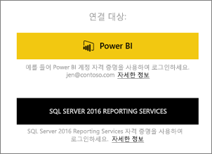
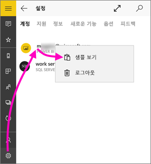
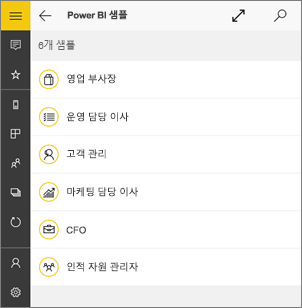
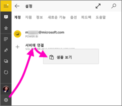
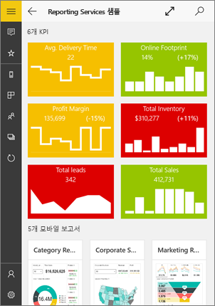
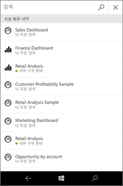
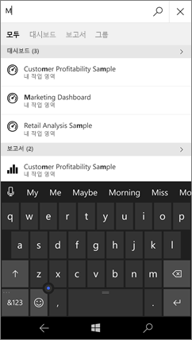
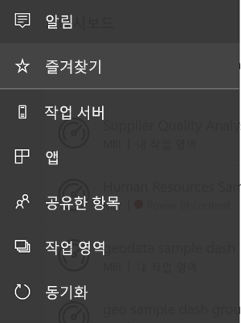
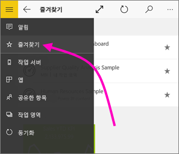
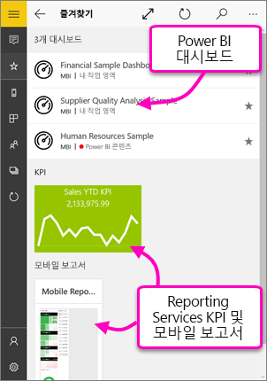

# Windows 10용 Power BI 모바일 앱 시작
Windows 10용 Power BI Mobile 앱은 태블릿이나 휴대폰으로 Power BI를 가져옵니다. 터치 사용이 가능한 최신 모바일 방식으로 비즈니스 정보에 액세스할 수 있습니다. 어디서든 [Windows 시작 화면](mobile-pin-dashboard-start-screen-windows-10-phone-app.md)에서 회사 대시보드를 보고 조작할 수 있습니다.

고유한 데이터를 사용하여 [Power BI 서비스에서 대시보드 및 보고서를 만듭니다](../../service-get-started.md). 

그런 다음 대시보드 및 보고서를 조작하고, 데이터를 탐색하고, Windows 10용 Power BI 모바일 앱과 모든 것을 공유합니다.

## 먼저 수행할 중요한 작업
* Windows 스토어에서 [**Windows 10용 Power BI 모바일 앱을 다운로드**](http://go.microsoft.com/fwlink/?LinkID=526478)합니다.
  
  디바이스에서 Windows 10을 실행해야 합니다. RAM 3GB, 내부 스토리지 8GB 이상인 디바이스에서 앱을 실행할 수 있습니다.
   
* [Power BI Mobile 앱의 새로운 기능](mobile-whats-new-in-the-mobile-apps.md)을 알아보세요.

## 웹에서 Power BI 서비스에 등록합니다.
아직 등록하지 않은 경우 [Power BI 서비스](http://powerbi.com/)로 이동합니다. 고유한 계정을 등록하여 대시보드 및 보고서를 만들고 저장한 다음, 데이터를 모읍니다. Windows 10 디바이스에서 Power BI에 로그인하여 어디서나 자신의 대시보드를 볼 수 있습니다.

1. Power BI 서비스에서 [등록](http://go.microsoft.com/fwlink/?LinkID=513879)을 눌러 Power BI 계정을 만듭니다.
2. [사용자 고유의 대시보드 및 보고서 만들기](../../service-get-started.md)를 시작합니다.

## Power BI 앱 시작
1. Windows 10 디바이스의 시작 화면에서 Power BI 앱을 엽니다.
   
   
2. Power BI 대시보드 및 보고서를 보려면 **Power BI**를 누릅니다. 웹의 Power BI 계정과 동일한 자격 증명으로 로그인합니다. 
   
   Reporting Services 모바일 보고서 및 KPI를 보려면 **SQL Server 2016 Reporting Services**를 누릅니다. SQL 16 Server Reporting Services 자격 증명을 사용하여 로그인하세요.
   
   
3. **탐색 시작**을 탭하여 자신의 대시보드를 표시합니다.

## Power BI 및 Reporting Services 샘플 시도
등록하지 않고도 Power BI 및 Reporting Services 샘플을 사용할 수 있습니다. 앱을 다운로드하면 샘플을 보거나 시작할 수 있습니다. 대시보드 홈페이지에서 원할 때마다 샘플로 돌아갑니다.

### Power BI 샘플
Power BI 대시보드 샘플을 검토하고 조작할 수 있지만, 샘플로 처리할 수 없는 몇 가지 작업이 있습니다. 즉 대시보드 뒤에 있는 보고서를 열 수 없거나, 다른 사용자와 샘플을 공유할 수 없거나, 이 샘플의 즐겨찾기를 만들 수 없습니다.

1. 왼쪽 위 모퉁이에서  전역 탐색 단추를 탭합니다.
2. **설정** 아이콘 을 탭하고 이름을 탭한 후 **샘플 보기**를 탭합니다.
   
   
3. 역할을 선택하고 해당 역할에 대한 샘플 대시보드를 탐색합니다.  
   
   

### Reporting Services 모바일 보고서 샘플
1. 왼쪽 위 모퉁이에서  전역 탐색 단추를 탭합니다.
2. **설정** 아이콘 을 탭하고 **서버에 연결**을 마우스 오른쪽 단추로 클릭하거나 탭한 채로 유지한 다음 **샘플 보기**를 탭합니다.
   
   
3. 소매 보고서 또는 판매 보고서 폴더를 열어 KPI 및 모바일 보고서를 탐색합니다.
   
   

## 대시보드, 보고서 및 앱 검색
앱의 위쪽에 있는 검색 상자에 입력하여 대시보드, 보고서 및 앱을 신속하게 찾습니다.

1. 오른쪽 상단 모퉁이에 있는 검색 아이콘을 누릅니다.
   
   
   
   Power BI는 가장 최근의 대시보드, 보고서 및 앱을 표시합니다.
   
   
2. 입력을 시작하면 Power BI는 모든 관련 결과를 표시합니다.
   
   

## Power BI 모바일 앱에서 콘텐츠 찾기
대시보드 및 보고서는 Power BI 모바일 앱에서 출처에 따라 다른 위치에 저장됩니다. [모바일 앱에서 콘텐츠 찾기](mobile-apps-quickstart-view-dashboard-report.md)에 대해 읽습니다. 또한 Power BI 모바일 앱에 있는 항목에 대해 항상 검색할 수 있습니다. 

## 즐겨찾는 대시보드, KPI 및 보고서 보기
모바일 앱의 즐겨찾기 페이지에서 Reporting Services KPI 및 모바일 보고서와 함께 즐겨 찾는 Power BI 대시보드를 볼 수 있습니다. Power BI 모바일 앱에서 대시보드를 즐겨찾기로 만들면 브라우저의 Power BI 서비스를 포함한 모든 디바이스에서 액세스할 수 있습니다. 

* **즐겨찾기**를 누릅니다.
  
   
  
   Power BI 즐겨찾기 및 Reporting Services 웹 포털의 즐겨찾기가 모두 이 페이지에 있습니다.
  
   

자세한 내용은 [Power BI 모바일 앱의 즐겨찾기](mobile-apps-favorites.md)를 읽어보세요.

## 다음 단계
다음은 Power BI의 대시보드 및 보고서나 Reporting Services 웹 포털의 Reporting Services 모바일 보고서 및 KPI를 사용하여 Windows 10 디바이스용 Power BI 앱에서 수행할 수 있는 다른 몇 가지 작업입니다.

### Power BI 대시보드 및 보고서
* [앱](../../service-create-distribute-apps.md) 보기.
* [대시보드](mobile-apps-view-dashboard.md) 보기.
* 디바이스의 시작 화면의 라이브 타일에 [대시보드 및 Power BI 타일 고정](mobile-pin-dashboard-start-screen-windows-10-phone-app.md).
* [타일 공유](mobile-windows-10-phone-app-get-started.md).
* [대시보드](mobile-share-dashboard-from-the-mobile-apps.md) 공유.

### Reporting Services 모바일 보고서 및 KPI
* Windows 10 디바이스용 Power BI 앱에서 [Reporting Services 모바일 보고서 및 KPI 보기](mobile-app-windows-10-ssrs-kpis-mobile-reports.md).
* [Reporting Services 웹 포털에서 KPI](https://msdn.microsoft.com/library/mt683632.aspx) 만들기.
* [SQL Server 모바일 보고서 게시자를 사용하여 고유한 모바일 보고서 만들기](https://msdn.microsoft.com/library/mt652547.aspx) 및 Reporting Services 웹 포털에 게시.

## 다음 단계
* Windows Store에서 [Power BI 앱 다운로드](http://go.microsoft.com/fwlink/?LinkID=526478)  
* [Power BI란?](../../power-bi-overview.md)
* 궁금한 점이 더 있나요? [Power BI 커뮤니티에 질문합니다.](http://community.powerbi.com/)

