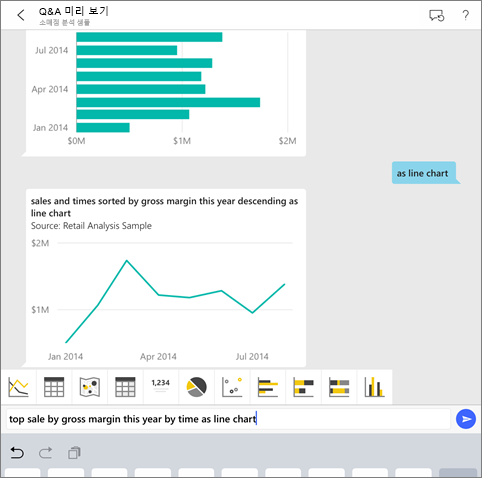
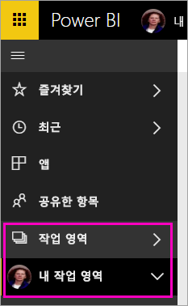
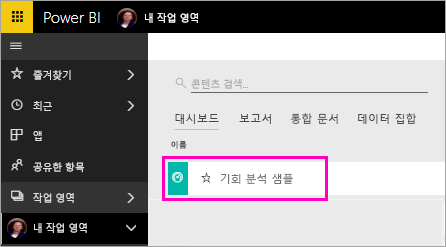
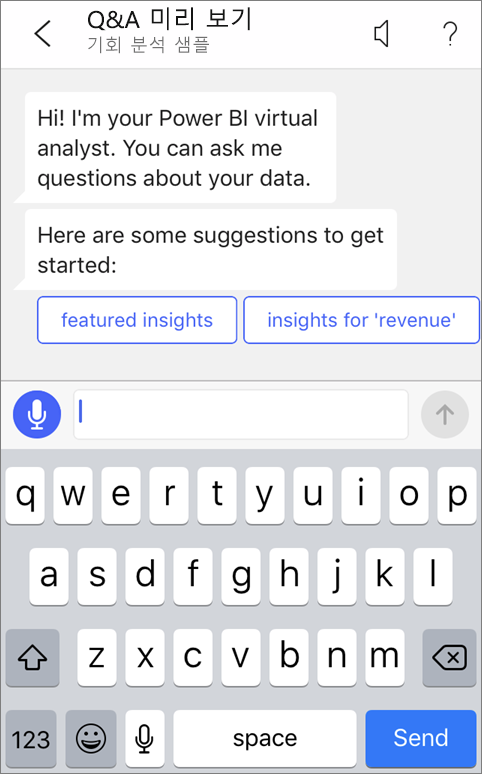
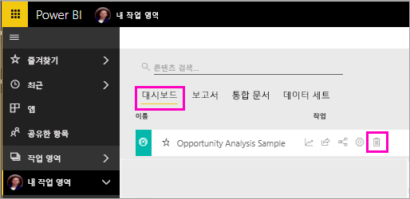

# 자습서: Power BI iOS 앱의 질문 및 답변 가상 분석가를 통해 데이터에 대해 질문하기

데이터에 대해 가장 쉽게 알 수 있는 방법은 고유한 단어로 질문하는 것입니다. 이 자습서에서는 iPad, iPhone 및 iPod Touch의 Microsoft Power BI 모바일 앱에서 질문 및 답변 가상 분석가를 통해 샘플 데이터에 대해 질문을 하고 주요 인사이트를 확인합니다. 

적용 대상:

|  |  |
|:--- |:--- |
| iPhone |iPad |

질문 및 답변 가상 분석가는 Power BI 서비스[(https://powerbi.com)](https://powerbi.com)에서 기본 질문 및 답변 데이터에 액세스하는 기존 BI 환경입니다. 이 환경이 데이터 인사이트를 제안하면 사용자가 자신만의 질문을 입력하거나 말할 수 있습니다.

이 자습서에서는 다음을 수행합니다.

> [!div class="checklist"]
> * iOS용 Power BI 모바일 앱 설치
> * Power BI 샘플 대시보드 및 보고서 다운로드
> * 모바일 앱에서 제안하는 추천 인사이트 확인

아직 Power BI에 등록하지 않은 경우 시작하기 전에 [평가판에 등록합니다](https://app.powerbi.com/signupredirect?pbi_source=web).

## 필수 조건

### iOS용 Power BI 앱 설치
Apple App Store에서 iPad, iPhone 또는 iPod Touch로 [iOS 앱 다운로드](http://go.microsoft.com/fwlink/?LinkId=522062 "iPhone 앱을 다운로드")합니다.

iOS용 Power BI 앱을 지원하는 버전은 다음과 같습니다.
- iOS 10 이상이 설치된 iPad.
- iOS 10 이상이 설치된 iPhone 5 이상. 
- iOS 10 이상이 설치된 iPod Touch.

### 기회 분석 샘플 다운로드
자습서의 첫 번째 단계는 Power BI 서비스에 기회 분석 샘플을 다운로드하는 것입니다.

1. 브라우저에서 Power BI 서비스(app.powerbi.com)를 열고 로그인합니다.

1. 전역 탐색 아이콘을 선택하여 왼쪽 탐색을 엽니다.

    

2. 왼쪽 탐색 창에서 **작업 영역** > **내 작업 영역**을 선택합니다.

    

3. 왼쪽 아래 모서리에서 **데이터 가져오기**를 선택합니다.
   
    

3. 데이터 가져오기 페이지에서 **샘플** 아이콘을 선택합니다.
   
   

4. **기회 분석 샘플**을 선택합니다.
 
    
 
8. **연결**을 선택합니다.  
  
   
   
5. Power BI가 샘플을 가져와 새 대시보드, 보고서 및 데이터 세트를 내 작업 영역에 추가합니다.
   
   

iOS 디바이스에서 샘플을 볼 준비가 되었습니다.

## 추천 정보 사용
1. iPhone 또는 iPad에서 Power BI 앱을 열고, 브라우저에서 Power BI 서비스에 사용한 것과 동일한 Power BI 계정 자격 증명으로 로그인합니다.

1.  전역 탐색 단추  > **작업 영역** > **내 작업 영역**을 탭하고 기회 분석 샘플 대시보드를 엽니다.

2. 질문 및 답변 가상 분석가 아이콘을 누릅니다.  iOS에 대한 질문 및 답변 아이콘을 누릅니다(iPad 상에서 페이지 맨 위).

     

     Power BI 질문 및 답변 가상 분석가에서는 시작하기 위한 몇 가지 제안을 제공합니다.

     
3. **추천 정보**를 탭합니다.

     질문 및 답변 가상 분석가에서 몇 가지 정보를 제안합니다.
4. 오른쪽으로 스크롤하고 **정보 2**를 탭합니다.

    

     질문 및 답변 가상 분석가에서 정보 2를 표시합니다.

    
5. 차트를 탭하여 포커스 모드에서 엽니다.

    
6. 왼쪽 위 모서리에 있는 화살표를 눌러 가상 분석가 환경으로 돌아갑니다.

## 리소스 정리

자습서를 마치면 기회 분석 샘플 대시보드, 보고서 및 데이터 세트를 삭제할 수 있습니다.

1. Power BI 서비스(app.powerbi.com)를 열고 로그인합니다.

2. 왼쪽 탐색 창에서 **작업 영역** > **내 작업 영역**을 선택합니다.

3. **대시보드** 탭에서 기회 분석 대시보드 옆에 있는 휴지통 **삭제** 아이콘을 선택합니다.

    

4. **보고서** 탭을 선택하고 기회 분석 보고서에 대해 동일한 작업을 수행합니다.

5. **데이터 집합** 탭을 선택하고 기회 분석 데이터 집합에 대해 동일한 작업을 수행합니다.

## 다음 단계

iOS용 Power BI 모바일 앱에서 질문 및 답변 가상 지원을 사용해 보았습니다. Power BI 서비스에서 질문 및 답변에 대해 자세히 알아보세요.
> [!div class="nextstepaction"]
> [Power BI 서비스에서 Q&A](../end-user-q-and-a.md)

