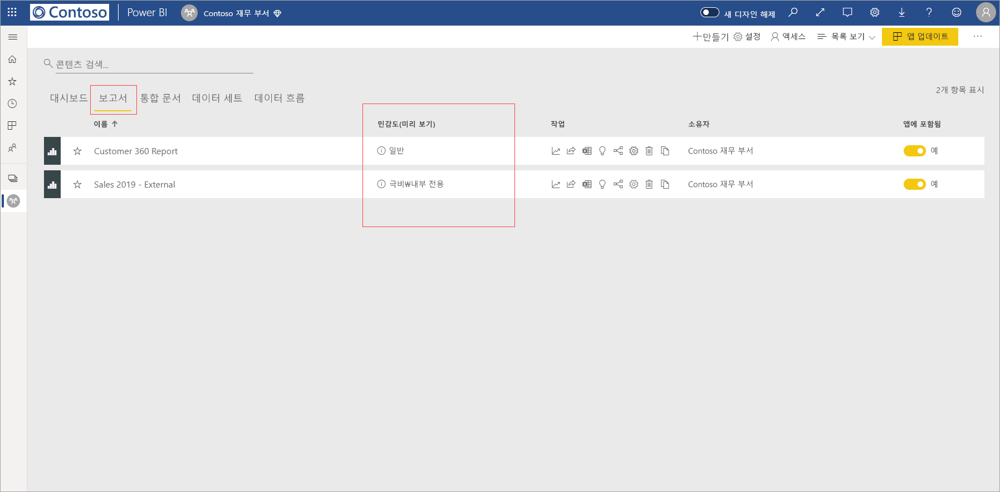
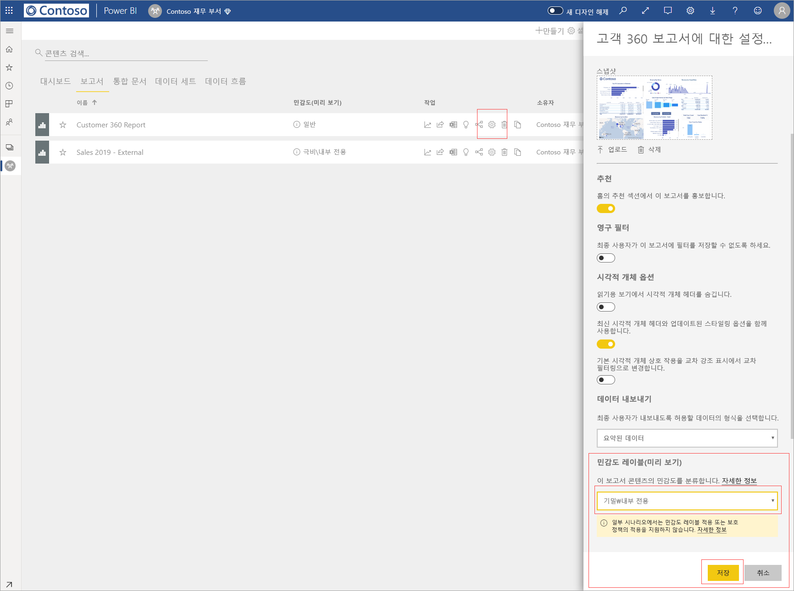
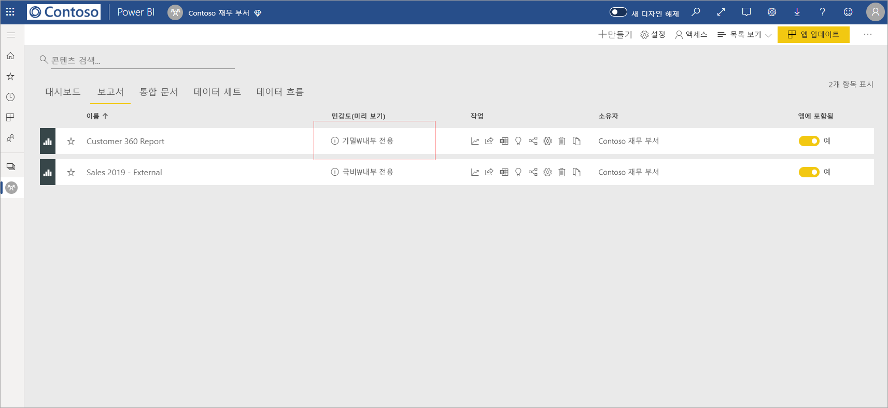
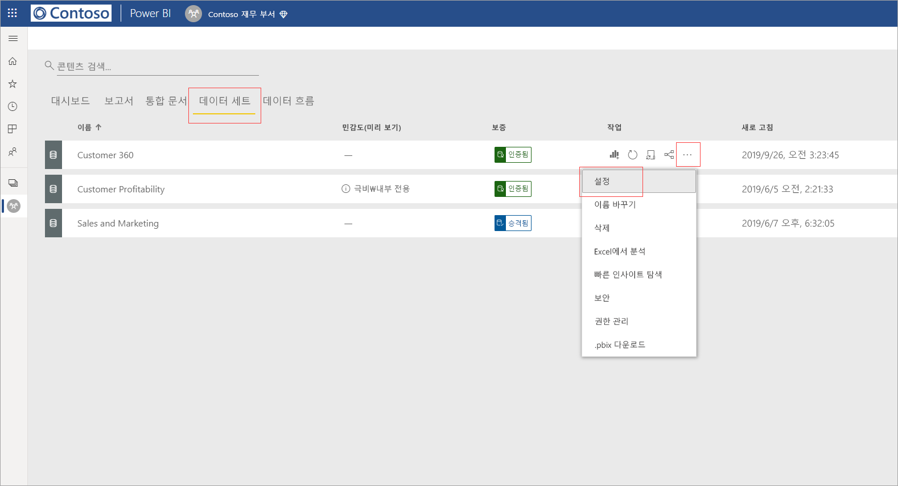
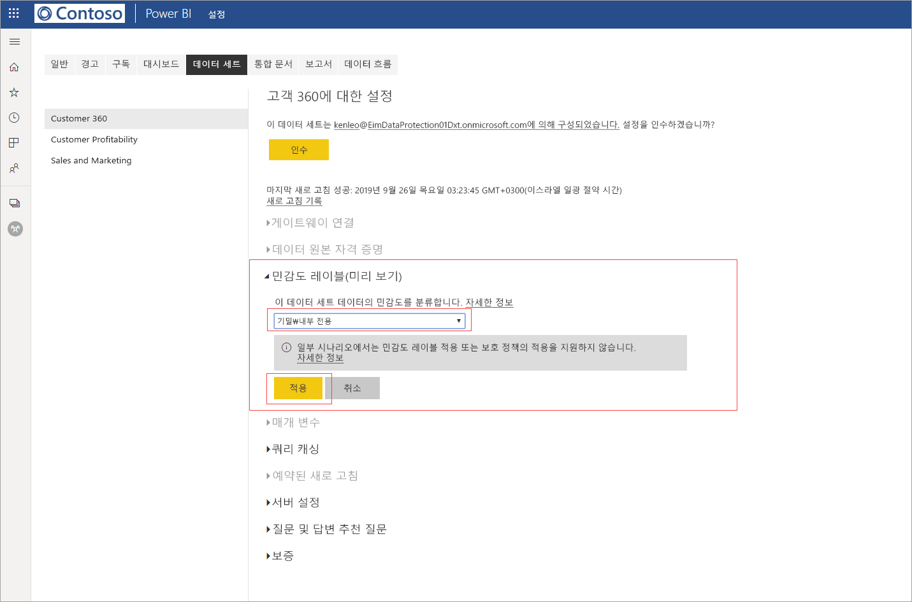
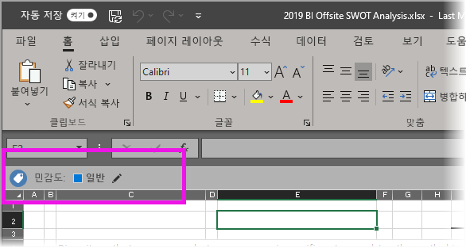

# Power BI에서 데이터 민감도 레이블 적용(미리 보기)

Power BI 서비스에서 민감도 레이블을 사용하도록 설정할 경우, 데이터 민감도 레이블을 적용하여 대시보드, 보고서, 데이터 세트 및 데이터 흐름을 무단 액세스 및 유출로부터 보호할 수 있습니다. 데이터 민감도 레이블을 사용하여 데이터에 올바른 레이블을 지정하면 권한 있는 사용자만 데이터에 액세스할 수 있습니다.

데이터 보호를 사용하도록 설정하면 대시보드, 보고서, 데이터 세트 및 데이터 흐름 목록 보기의 민감도 열에 민감도 레이블이 표시됩니다.

> [!NOTE]
> Power BI 대시보드, 보고서, 데이터 세트 및 데이터 흐름에 민감도 레이블을 적용하려면 특정 라이선스와 사용 권한이 필요합니다. 자세한 내용은 [민감도 레이블 적용](#applying-sensitivity-labels)을 참조하세요.

## 민감도 레이블 적용

Power BI에서 민감도 레이블을 적용하려면 사용자와 조직이 다음 요구 사항을 충족해야 합니다.

* 조직이 [Microsoft 365 보안 센터](https://security.microsoft.com/) 또는 [Microsoft 365 규정 준수 센터](https://compliance.microsoft.com/)에서 민감도 레이블을 정의한 상태여야 합니다.
* [Power BI에서 데이터 민감도 레이블 사용(미리 보기)](../admin/service-security-enable-data-sensitivity-labels.md#enable-data-sensitivity-labels) 문서에 설명된 대로, 데이터 민감도 레이블을 적용할 수 있는 권한이 있는 보안 그룹에 속해 있어야 합니다.
* Power BI Pro 라이선스와 레이블을 추가하려는 리소스에 대한 편집 권한이 있어야 합니다. 
* Azure Information Protection Premium P1 또는 Premium P2 라이선스가 있어야 합니다. Microsoft Azure Information Protection은 독립 실행형으로 구입하거나 Microsoft 라이선스 제품군 중 하나를 통해 구입할 수 있습니다. 자세한 내용은 [Azure Information Protection 가격 책정](https://azure.microsoft.com/pricing/details/information-protection/)을 참조하세요.

보고서에서 민감도 레이블을 적용하거나 변경하려면 작업 영역 목록 항목의 보고서 설정 아이콘을 클릭한 다음, 설정 쪽 창에 있는 데이터 민감도 섹션으로 이동합니다. 적절한 민감도 레이블을 선택하고 설정을 저장합니다.

업데이트된 민감도 레이블이 민감도 열에 표시됩니다. 

대시보드에서 민감도 레이블을 적용하거나 변경하는 경우 보고서에 대해 설명한 것과 동일한 프로세스를 따릅니다. 

데이터 세트와 데이터 흐름에 민감도 레이블을 설정할 수도 있습니다. 다음 이미지는 데이터 세트에 민감도 레이블을 설정하는 방법을 보여 줍니다. 데이터 흐름에 대한 단계도 이와 유사합니다.

데이터 세트에 민감도 레이블을 설정하려면 데이터 세트 탭을 선택하고 레이블을 적용할 데이터 세트의 세 점을 클릭한 다음, **설정**을 선택합니다.

데이터 세트의 설정 페이지에서 민감도 레이블 섹션을 열고 원하는 민감도 레이블을 선택한 다음, **적용**을 클릭합니다.

데이터 흐름에서 민감도 레이블을 적용하거나 변경하는 경우 데이터 세트에 대해 설명한 것과 동일한 프로세스를 따릅니다.

## 민감도 레이블 제거
보고서, 대시보드, 데이터 세트 또는 데이터 흐름에서 민감도 레이블을 제거하려면 [레이블을 적용하는 데 사용된 절차와 동일한 프로시저](#applying-sensitivity-labels)를 수행하되 데이터의 민감도를 분류하라는 메시지가 표시되면 **(없음)** 을 선택합니다. 

## 내보낸 파일의 데이터 보호

민감도 레이블이 포함된 [보고서에서 데이터를 내보내는](https://docs.microsoft.com/power-bi/consumer/end-user-export) 경우 생성된 파일이 민감도 레이블을 상속 받습니다(Excel, PowerPoint 및 PDF에만 해당됨. CSV는 지원되지 않음). 민감도 레이블이 파일에 표시되며, 사용 권한이 있는 사용자만 파일에 액세스할 수 있습니다.

## 고려 사항 및 제한 사항

데이터 민감도 레이블을 적용하는 경우 다음 사항을 고려해야 합니다.

* Power BI에서 Microsoft Information Protection 민감도 레이블을 적용하고 보려면 Azure Information Protection Premium P1 또는 Premium P2 라이선스가 필요합니다. Microsoft Azure Information Protection은 독립 실행형으로 구입하거나 Microsoft 라이선스 제품군 중 하나를 통해 구입할 수 있습니다. 자세한 내용은 [Azure Information Protection 가격 책정](https://azure.microsoft.com/pricing/details/information-protection/)을 참조하세요.
* 민감도 레이블은 대시보드, 보고서, 데이터 세트 및 데이터 흐름에만 적용할 수 있습니다.
* 내보낸 파일의 레이블 및 보호 제어 적용은 Excel, PowerPoint 및 PDF 파일에서만 지원됩니다. 데이터를 .CSV 파일, 메일 구독, 시각적 개체 포함 및 인쇄로 내보낼 때는 레이블 및 보호가 적용되지 않습니다.
* Power BI에서 파일을 내보내는 사용자는 민감도 레이블 설정에 따라 해당 파일에 대한 액세스 및 편집 권한을 갖습니다. 데이터를 내보내는 사용자는 파일의 소유자 권한을 얻지 못합니다. 
* 현재, [페이지를 매긴 보고서]( https://docs.microsoft.com/power-bi/paginated-reports-report-builder-power-bi)와 통합 문서에서는 민감도 레이블을 사용할 수 없습니다. 
* Power BI 자산의 민감도 레이블은 작업 영역 목록 및 계보 보기에만 표시됩니다. 현재 즐겨찾기, 공유한 항목, 최근 항목 또는 앱 보기에는 레이블이 표시되지 않습니다. 그러나 Power BI 자산에 적용된 레이블은 표시되지 않는 경우에도 Excel, PowerPoint 및 PDF 파일로 내보낸 데이터에 항상 유지됩니다.
* [Microsoft 365 보안 센터](https://security.microsoft.com/) 또는 [Microsoft 365 규정 준수 센터](https://compliance.microsoft.com/)에서 구성된 ‘파일 암호화 설정’ 민감도 레이블은 Power BI에서 ‘내보낸’ 파일에만 적용되고 Power BI ‘내부’에서는 적용되지 않습니다.   
* [HYOK 보호](https://docs.microsoft.com/azure/information-protection/configure-adrms-restrictions)는 Power BI에서 적용된 레이블에 대해 지원되지 않습니다.
* Office 앱에서 레이블을 보고 적용하려면 [라이선스 요구 사항](https://docs.microsoft.com/microsoft-365/compliance/sensitivity-labels-office-apps#subscription-and-licensing-requirements-for-sensitivity-labels)을 충족해야 합니다.
* 민감도 레이블은 글로벌(퍼블릭) 클라우드의 테넌트에만 지원됩니다. 다른 클라우드의 테넌트에서는 민감도 레이블이 지원되지 않습니다.
* 민감도 레이블은 [외부 사용자(Azure Active Directory B2B 게스트 사용자)](../service-admin-azure-ad-b2b.md)를 지원하지 않습니다. 즉, 외부 사용자는 레이블을 볼 수 없고 데이터를 Excel, PDF 및 PPTX 파일로 내보내지 못하도록 차단됩니다. 외부 사용자가 해당 파일 형식으로 데이터를 내보낼 수 있도록 하려면 [레이블을 제거](#removing-sensitivity-labels)하세요.

## 다음 단계

이 문서에서는 Power BI에서 데이터 민감도 레이블을 적용하는 방법을 설명했습니다. 다음 문서에서는 Power BI의 데이터 보호에 대해 자세히 설명합니다. 

* [Power BI의 데이터 보호 개요](../admin/service-security-data-protection-overview.md)
* [Power BI에서 데이터 민감도 레이블 사용](../admin/service-security-enable-data-sensitivity-labels.md)
* [Power BI에서 Microsoft Cloud App Security 제어 사용](../admin/service-security-using-microsoft-cloud-app-security-controls.md)