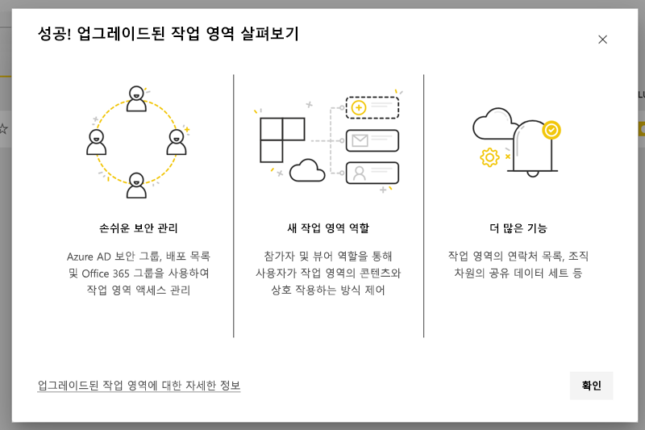
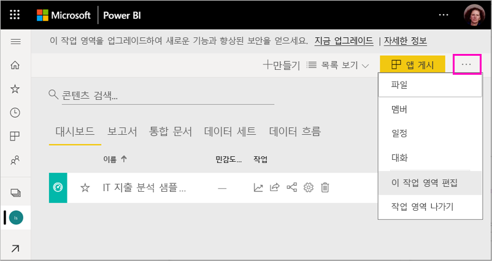
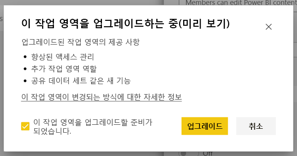
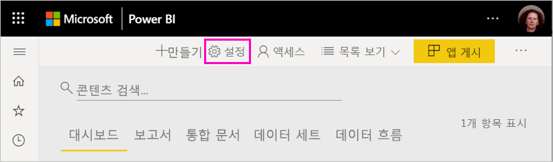
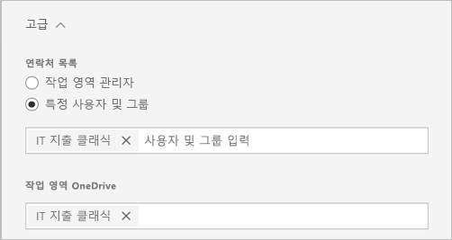
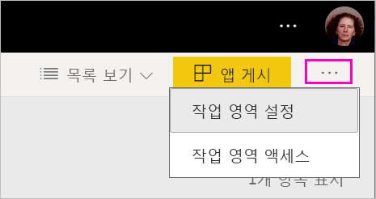
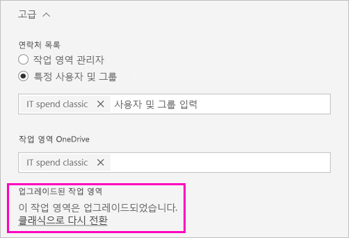
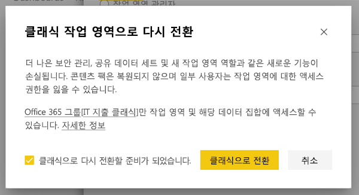
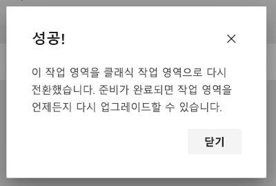

# Power BI에서 클래식 작업 영역을 새 작업 영역으로 업그레이드

이 문서에서는 클래식 작업 영역을 새 작업 영역 환경으로 업그레이드하는 방법을 설명합니다. 모든 클래식 작업 영역을 업그레이드할 수 있습니다. 새 작업 영역에는 보다 세분화된 작업 영역 역할이 있으므로 콘텐츠 액세스 권한을 보다 효율적으로 관리할 수 있습니다. 원래 Office 365 그룹에 더욱 느슨하게 연결되어 있으므로 업그레이드된 작업 영역을 보다 유연하게 관리할 수 있습니다. [새 작업 영역 환경](../service-new-workspaces.md)에 대해 알아봅니다. 

>[!NOTE]
>이 설명서는 시험판이며 아직 제공되지 않는 기능을 포함하고 있습니다. 새로운 기능에 대비하고 릴리스 전에 생길 수 있는 질문에 대한 설명을 검색할 수 있도록 이 설명서를 게시한 것입니다.  

그러나 미리 숙지하여 계획을 수립해야 하는 작업 영역 변경 사항이 있을 수 있습니다. 예를 들어 콘텐츠 팩은 새 작업 영역 환경에서 지원되지 않습니다. 이 문서의 뒷부분에 나오는 [업그레이드 고려 사항 및 제한 사항](#upgrade-considerations-and-limitations) 섹션을 참조하세요.

## 업그레이드 후 수행할 작업

업그레이드 *후에* 몇 가지 작업을 수행해야 합니다. 업그레이드 *전에* 이러한 작업을 계획하는 것이 가장 좋습니다.
- 액세스 목록을 검토하고 [업그레이드 후 사용 권한](#permissions-after-upgrade)을 이해합니다.
- [연락처 목록](#modify-the-contact-list)을 검토하고 원하는 대로 설정되었는지 확인합니다.
- 아직 수행하지 않았다면 [새 작업 영역 환경](../service-new-workspaces.md)에 대해 알아보세요.

## 클래식 작업 영역 업그레이드

모든 작업 영역 관리자는 작업 영역을 업그레이드할 수 있습니다. 클래식 작업 영역의 경우 작업 영역 관리자가 기본 Office 365 그룹의 소유자여야 합니다. 작업 영역을 업그레이드하려면 다음 단계를 수행합니다.

1. 작업 영역 콘텐츠 목록에서 **추가 옵션**( **...** ) > **이 작업 영역 편집**을 선택합니다.

    

1. **고급**을 확장하고 **지금 업그레이드**를 선택합니다.

    

1. 대화 상자 정보를 검토합니다. 작업 영역에 콘텐츠 팩을 게시했거나 설치한 경우 경고가 표시됩니다. 준비가 되면 **이 작업 영역을 업그레이드할 준비가 되었습니다.** 를 선택하고 **업그레이드**를 선택합니다.

    

2. 업그레이드하는 동안 **업그레이드 중** 메시지가 표시됩니다. 작업 영역을 업그레이드하는 데는 보통 1분 미만이 걸립니다.

1. 업그레이드가 완료되면 **성공** 대화 상자가 표시됩니다. 새 작업 영역이 클래식 작업 영역과 어떻게 다른지 익숙해지도록 [Power BI의 새 작업 영역에서 작업 구성](../service-new-workspaces.md)을 읽는 것이 좋습니다.

### 다른 작업 영역 사용자에 대한 영향

작업 영역에서 적극적으로 항목을 보거나 편집하는 사용자가 거의 없는 휴무 시간 동안 업그레이드하는 것이 좋습니다.

작업 영역을 적극적으로 사용하는 사용자에게는 브라우저를 새로 고치라는 메시지가 표시됩니다. 보고서를 편집하는 사용자에게는 새로 고치기 전에 저장할 수 있는 옵션이 제공됩니다.

## 업그레이드 고려 사항 및 제한 사항

- 작업 영역의 URL 및 ID, 작업 영역에 포함된 콘텐츠, 작업 영역에서 게시된 앱은 변경되지 않습니다. 작업 영역에 설치된 콘텐츠 팩의 콘텐츠는 개별적으로 처리됩니다. 자세한 내용은 이 문서에서 [업그레이드 도중 콘텐츠 팩](#content-packs-during-upgrade)을 참조하세요.
- 콘텐츠 팩은 새 작업 영역 환경에서 지원되지 않습니다. [게시된 콘텐츠 팩](#published-content-packs) 또는 [설치된 콘텐츠 팩](#installed-content-packs)에 대한 섹션을 참조하여 업그레이드하는 동안 콘텐츠 팩이 처리되는 방식에 대해 알아보세요. 업그레이드하기 전에 작업 영역에 설치 또는 게시된 콘텐츠 팩을 삭제하는 것이 좋습니다.
- 클래식 작업 영역에 대한 Office 365 그룹은 Power BI 작업 영역 업그레이드의 영향을 받지 않습니다. Office 365에서 관리되는 모든 팀, SharePoint 사이트, 사서함 또는 기타 리소스는 변경되지 않습니다. Power BI 작업 영역을 업그레이드한 후 그대로 유지됩니다. Office 365 그룹은 이전과 같이 계속 존재합니다.
- 업그레이드 후 작업 영역이 보호되는 방식이 변경됩니다. 자세한 내용은 [업그레이드 후 작업 영역 권한](#permissions-after-upgrade) 섹션을 참조하세요.
- 필요할 경우 **클래식 작업 영역으로 다시 전환**할 수 있는 옵션이 제공됩니다. 그러나 작업 영역을 업그레이드하기 전의 일부 측면은 완전히 복원되지 않습니다. 새 작업 영역 환경에서만 작동하는 기능을 사용하여 시작하는 경우에는 돌아갈 수 없습니다. 다시 전환 옵션은 업그레이드 후 30일 동안 사용할 수 있습니다.

## 업그레이드 후 사용 권한

작업 영역 콘텐츠 목록의 맨 위에 있는 메뉴 모음에서 **액세스 권한**을 선택하여 업그레이드 후 사용 권한을 검토합니다.

각 Office 365 그룹 소유자는 업그레이드된 작업 영역에 대한 관리자 역할에 개별적으로 추가됩니다. Office 365 그룹 자체가 작업 영역 역할에 추가됩니다. 이 역할은 클래식 작업 영역이 *읽기 전용*인지 아니면 *읽기/쓰기*인지에 따라 달라집니다.

- 작업 영역이 **구성원은 Power BI 콘텐츠를 편집할 수 있음**으로 설정된 경우 업그레이드 후에 Office 365 그룹이 **구성원** 역할로 작업 영역 액세스 목록에 추가됩니다.
- 작업 영역이 **구성원은 Power BI 콘텐츠를 읽기만 할 수 있음**으로 설정된 경우 업그레이드 후에 Office 365 그룹이 **뷰어** 역할로 작업 영역 액세스 목록에 추가됩니다.

Office 365 그룹은 작업 영역에서 역할을 부여하므로 업그레이드 후 Office 365 그룹에 추가된 모든 사용자는 작업 영역에서 해당 역할을 갖습니다. 그러나 업그레이드 후에 새 소유자를 Office 365 그룹에 추가하는 경우 이들은 작업 영역에 대한 관리자 역할이 없습니다.

### 업그레이드 전후 역할의 차이점

작업 영역 역할은 클래식 작업 영역과 새 작업 영역에서 다릅니다. 새 작업 영역 환경을 사용하면 Office 365 그룹, 보안 그룹 또는 배포 목록에 작업 영역 역할을 부여할 수 있습니다.

- **구성원**은 개별 항목을 공유하고 구성원, 참가자 또는 뷰어 역할을 통해 전체 작업 영역에 대한 액세스 권한을 제공할 수 있습니다.
- **뷰어**는 빌드 권한이 있는 경우를 제외하고는 콘텐츠를 볼 수만 있고 작업 영역 데이터 세트에 대해 기본 데이터를 내보내거나 Excel에서 분석할 수 없습니다.

공유 또는 앱 권한으로 작업 영역의 항목에 대한 액세스 권한이 있는 사용자는 계속해서 해당 항목에 액세스할 수 있습니다. 작업 영역에 대한 액세스 권한이 있는 모든 사용자는 작업 영역에 게시된 앱에도 액세스할 수 있습니다. 이러한 사용자는 앱 액세스 목록에 나열되지 않습니다.

새 참가자 역할을 사용할지 여부를 평가하는 것이 좋습니다. 업그레이드 후 액세스 창에서 Office 365 그룹이 참가자 역할을 갖도록 변경할 수 있습니다.

업그레이드 후에는 개별 사용자에 대한 역할 할당을 통해 액세스를 관리하는 대신 작업 영역 관리자에 대한 보안 또는 Office 365 그룹이나 배포 목록을 만드는 것을 고려할 수 있습니다.

[새 작업 영역의 역할](../service-new-workspaces.md#roles-in-the-new-workspaces)에 대해 자세히 알아보세요.

## 업그레이드 후 라이선스

관리자, 구성원 또는 참가자 작업 영역 역할의 사용자가 작업 영역에 액세스하려면 Power BI Pro 라이선스가 필요합니다.

작업 영역이 공유 용량에 있는 경우 뷰어 작업 영역 역할의 사용자는 작업 영역에 액세스하기 위해 Power BI Pro 라이선스도 필요합니다. 그러나 작업 영역이 프리미엄 용량에 있는 경우 뷰어 역할의 사용자는 작업 영역에 액세스하기 위해 Pro 라이선스가 필요하지 않습니다.

## 기타 새 작업 영역 기능

새 작업 영역 환경에는 클래식 작업 영역에 없는 기능이 있습니다. 한 가지 차이점은 작업 영역 관리자 또는 소유자와는 다른 연락처 목록을 설정하는 기능입니다. 한 가지 유사점은 여전히 Office 365 그룹 SharePoint 문서 라이브러리에 연결된다는 것입니다. 

### 연락처 목록 수정

1. 작업 영역 콘텐츠 목록의 맨 위에 있는 메뉴 모음에서 **설정**을 선택하여 작업 영역 설정에 액세스합니다.

    

2. **고급**에서 작업 영역 **연락처 목록**이 작업 영역을 업그레이드한 Office 365 그룹으로 구성되어 있습니다. 연락처 목록에 사용자 또는 그룹을 추가하거나 작업 영역 관리자로 전환할 수 있습니다.

    

### 작업 영역 OneDrive 

업그레이드 후 작업 영역 **OneDrive**가 Office 365 그룹 SharePoint 문서 라이브러리에 연결됩니다. 이 문서 라이브러리는 **데이터 가져오기 > 파일** 환경에서 **OneDrive** 옵션으로 표시됩니다. 일부 작업 영역 사용자는 Office 365 그룹에 포함되지 않는 경우 해당 문서 라이브러리에 대한 권한을 가질 수 없습니다.

## 업그레이드 도중 콘텐츠 팩

새 작업 영역 환경은 콘텐츠 팩을 지원하지 않습니다. 대신, 앱 및 공유 데이터 집합을 사용하여 작업 영역에 콘텐츠를 배포합니다. 업그레이드하기 전에 작업 영역에서 게시 또는 설치된 콘텐츠 팩을 제거하는 것이 좋습니다. 그러나 업그레이드할 때 게시 또는 설치된 콘텐츠 팩이 있는 경우 업그레이드 프로세스는 아래에 설명된 대로 콘텐츠를 유지하려고 시도합니다.  업그레이드 후에는 콘텐츠 팩 또는 콘텐츠와 콘텐츠 팩 간 연결을 복원할 수 있는 방법이 없습니다.

### 게시된 콘텐츠 팩

작업 영역에서 게시된 콘텐츠 팩은 업그레이드하는 동안 제거됩니다. 클래식 작업 영역으로 다시 전환하는 경우라도 업그레이드 후에는 콘텐츠 팩을 게시하거나 업데이트할 수 없습니다. 다른 사용자가 자신의 작업 영역에 콘텐츠 팩을 설치한 경우 업그레이드 후 해당 작업 영역에 콘텐츠 팩 콘텐츠의 복사본이 표시됩니다. 자세한 내용은 **설치된 콘텐츠 팩** 섹션을 참조하세요.

### 설치된 콘텐츠 팩

작업 영역을 업그레이드하거나 콘텐츠 팩을 게시한 작업 영역을 업그레이드하면 설치된 콘텐츠 팩에 중요한 변경 사항이 적용됩니다. 업그레이드 후 작업 영역에 콘텐츠 팩 콘텐츠의 복사본이 포함됩니다. 이 복사본은 원본 작업 영역의 원래 데이터 집합에 연결됩니다.

그러나 다음과 같은 중요한 변경 사항이 있습니다.

- 콘텐츠 팩이 업데이트되면 콘텐츠가 더 이상 업데이트되지 않습니다.
- URL 및 항목 식별자가 변경되고 다른 사용자와 공유한 링크를 업데이트해야 합니다.
- 작업 영역에서 원래 콘텐츠 팩에 대한 사용자 지정이 손실됩니다. 사용자 지정에는 구독, 경고, 개인 책갈피, 영구 필터 및 즐겨찾기가 포함됩니다.
- 새 사용자에게는 콘텐츠 팩에 있던 데이터 세트에 대한 액세스 권한이 없을 수 있습니다. 작업 영역 사용자가 데이터에 액세스할 수 있게 하려면 데이터 세트 소유자와 함께 작업해야 합니다.

## 클래식 작업 영역으로 다시 전환

업그레이드 환경의 일부로, 업그레이드 후 30일 동안 클래식 작업 영업으로 돌아갈 수 있습니다. 이 기능은 원래 Office 365 그룹과 작업 영역 콘텐츠 간 연결을 복원합니다. 조직에서 새로운 작업 영역 환경을 사용하다 중대한 문제를 발견한 경우에 사용할 수 있습니다. 그러나 제한 사항이 있습니다. 이 문서에서 [클래식으로 다시 전환 시 고려 사항](#considerations-for-switching-back-to-classic)을 먼저 읽으세요.

다시 전환하려면 작업 영역을 업그레이드하기 전에 연결된 Office 365 그룹의 소유자여야 합니다. 다음 단계를 수행합니다.

1. 작업 영역 콘텐츠 목록에서 **추가 옵션**( **...** ) > **작업 영역 설정**을 선택합니다.

    

1. **고급**을 확장하고 **클래식으로 다시 전환**을 선택합니다. 이 옵션을 사용할 수 없는 경우 이 문서에서 [클래식으로 다시 전환 시 고려 사항](#considerations-for-switching-back-to-classic)을 참조하세요.

    

1. 준비가 되면 **클래식으로 다시 전환할 준비가 되었습니다** 상자를 선택하고 **클래식으로 전환**을 선택합니다. 이 대화 상자에 경고 또는 차단 표시가 나타날 수 있습니다. 이러한 문제가 발생하는 경우 이 문서에서 [다시 전환 시 고려 사항](#considerations-for-switching-back-to-classic)을 참조하세요.

    

1. 전환이 완료되면 확인 대화 상자가 표시됩니다.

    

### 클래식으로 다시 전환 시 고려 사항

작업 영역에 대해 다음 중 하나라도 참인 경우 다시 전환할 수 없습니다.

- Office 365 그룹이 삭제되었습니다.
- 업그레이드 후 30일이 초과되었습니다.
- 작업 영역의 데이터 세트가 다른 작업 영역의 보고서 또는 대시보드에서 사용됩니다. 어째서 이렇게 되나요? 예를 들어 업그레이드하기 전에 작업 영역에서 콘텐츠 팩을 게시하고 다른 사용자가 다른 작업 영역에 콘텐츠 팩을 설치했습니다. 업그레이드 직후 데이터 세트가 해당 콘텐츠 팩의 보고서 및 대시보드에서 사용됩니다.
- 작업 영역이 애플리케이션 수명 주기 관리 파이프라인의 일부입니다.
- 작업 영역이 템플릿 앱에 사용됩니다.
- 작업 영역에 대규모 모델 기능이 사용됩니다.
- 작업 영역에 새로운 사용량 메트릭 기능이 사용됩니다.

클래식 작업 영역으로 다시 전환하면 원래 작업 영역의 정확한 복사본이 복원되는 것이 아닙니다. 다음과 같은 변경 사항이 발생합니다.

- 작업 영역에 대한 권한은 업그레이드된 작업 영역이 원래 연결된 Office 365 그룹에 의해 설정됩니다.
  - Office 365 그룹의 모든 관리자는 클래식 작업 영역의 관리자가 됩니다.
  - Office 365 그룹의 모든 구성원은 클래식 작업 영역의 구성원이 됩니다. 클래식 작업 영역이 **구성원은 Power BI 콘텐츠를 읽기만 할 수 있음**으로 설정된 경우 이 설정이 복원됩니다.
  - 업그레이드 완료 후 작업 영역에 추가된 모든 사용자 또는 사용자 그룹(Office 365 그룹 외부)은 작업 영역에 대한 액세스 권한을 잃게 됩니다. Office 365 그룹에 추가하여 액세스 권한을 부여합니다. Office 365 그룹에서는 구성원 자격에서 보안 또는 배포 그룹을 중첩할 수 없습니다.
  - 작업 영역의 앱에 대한 액세스 권한을 받은 사용자는 계속해서 앱에 액세스할 수 있습니다.
  - 공유를 통해 작업 영역에 있는 항목에 대한 액세스 권한을 받은 사용자는 계속해서 해당 항목에 액세스할 수 있습니다.
- 업그레이드 전에 클래식 작업 영역에서 게시한 콘텐츠 팩은 복원되지 않습니다.
- 업그레이드 전에 클래식 작업 영역에 설치한 콘텐츠 팩은 복원되지 않습니다.
- 업그레이드 후 작업 영역에서 사용자가 만든 구독은 제거됩니다. 업그레이드 전에 존재하던 구독은 계속 예상대로 작동합니다.
- 데이터 경고는 보존되지 않습니다. 제거됩니다.
- 업그레이드 후 작업 영역의 이름을 바꾼 경우 Office 365 그룹의 이름과 일치하도록 작업 영역 이름이 복원됩니다.
- 새로 고침 등의 진행 중인 작업은 작업 영역 업그레이드의 영향을 받지 않습니다.

## 테넌트의 새 작업 영역으로 마이그레이션 관리 

일부 조직에서는 여러 또는 모든 작업 영역을 새 작업 영역 환경으로 이동하고자 합니다. 작업 영역 업그레이드 도구는 작업 영역 관리자가 업그레이드하도록 하는 데 중점을 둔 것입니다. 이러한 프로세스를 관리하려는 조직의 경우에는 다음 단계를 수행할 수 있습니다.

1. Power BI 관리 포털의 작업 영역 목록과 해당 API는 Power BI의 모든 작업 영역의 목록을 제공합니다. 클래식 작업 영역은 목록에 그룹 유형으로 표시됩니다.
2. 개별 Office 365 그룹 소유자 또는 Office 365 관리자와 작업하여 이들이 작업 영역을 업그레이드하게 할 수 있습니다. 작업 영역을 업그레이드하려면 그룹의 소유자가 되어야 합니다.

작업 영역 업그레이드 기능은 대량 또는 프로그래밍 방식 업그레이드를 위한 도구를 제공하지 않습니다. 또한 조직에서 만든 새 Office 365 그룹은 Power BI에 계속 표시됩니다. 
    

## 다음 단계
* [Power BI에서 새 작업 영역 만들기](../service-create-the-new-workspaces.md)
* [클래식 작업 영역 만들기](../service-create-workspaces.md)
* 궁금한 점이 더 있나요? [Power BI 커뮤니티에 질문합니다.](https://community.powerbi.com/)
