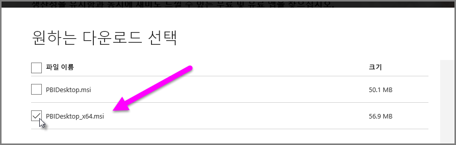

# Power BI Desktop에서 액세스 및 .XLS 파일 가져오기 문제 해결
**Power BI Desktop**에서 **Access 데이터베이스** 및 초기 버전의 **Excel 통합 문서**(Excel 97-2003 형식의 .XLS 파일)는 모두 ‘Access 데이터베이스 엔진’을 사용합니다. 액세스 데이터베이스 엔진이 제대로 작동하는 것을 방해할 수 있는 세 가지 일반적인 상황이 있습니다.

### 상황1: 설치된 액세스 데이터베이스 엔진 없음
Power BI Desktop 오류 메시지가 Access 데이터베이스 엔진이 설치되지 않았다고 나타내는 경우 Access 데이터베이스 엔진 버전을 Power BI Desktop 버전과 일치하는 32비트 또는 64비트 버전으로 설치해야 합니다. [다운로드 페이지](http://www.microsoft.com/en-us/download/details.aspx?id=13255)에서 Access 데이터베이스 엔진을 설치할 수 있습니다.

>[!NOTE]
>설치된 Access 데이터베이스 엔진 비트 버전이 Microsoft Office 설치의 비트 버전과 다른 경우 Office 응용 프로그램은 Access 데이터베이스 엔진을 사용할 수 없습니다.

### 상황2: Access 데이터베이스 엔진 비트 버전(32비트 또는 64비트)이 Power BI Desktop 비트 버전과 다름
이 상황은 설치된 Microsoft Office 버전이 32비트이고 설치된 Power BI Desktop 버전이 64비트일 때 종종 발생합니다. 반대 상황이 발생할 수도 있으며 둘 중 어느 경우에도 비트 버전 불일치가 발생할 수 있습니다(Office 365 구독을 사용하는 경우 다른 문제 및 해결의 **상황 3** 참조). 다음 솔루션은 이러한 비트 버전 불일치 오류를 해결할 수 있습니다.

1. Microsoft Office 설치의 비트 버전과 일치하도록 Power BI Desktop의 버전을 변경합니다. Power BI Desktop의 비트 버전을 변경하려면 Power BI Desktop을 제거한 다음 Office 설치와 일치하는 Power BI Desktop의 버전을 설치합니다. Power BI Desktop의 버전을 선택하려면 데스크톱에 대한 다운로드 페이지에서 **고급 다운로드 옵션**을 선택합니다.
   
   
   
   표시된 다운로드 페이지에서 언어를 선택한 다음 **다운로드** 단추를 선택합니다. 표시된 화면에서 32비트 버전에 PBIDesktop.msi 또는 64비트 버전에 PBIDesktop_x64.msi 옆에 있는 확인란을 선택합니다. 다음 화면에서 64비트 버전을 선택합니다.
   
   
   
   >[!NOTE]
   >Power BI Desktop의 32 비트 버전을 사용하면 매우 큰 데이터 모델을 만들 때 메모리 부족 문제가 발생할 수 있습니다.
2. Power BI Desktop 설치의 비트 버전과 일치하도록 Microsoft Office의 버전을 변경합니다. Microsoft Office의 비트 버전을 변경하려면 Office를 제거한 다음 Power BI Desktop 설치와 일치하는 Office의 버전을 설치합니다.
3. .XLS 파일(Excel 97-2003 통합 문서)을 열려고 시도할 때 오류가 발생하는 경우 Excel에서 .XLS 파일을 열고 .XLSX 파일 형식으로 저장하여 Access 데이터베이스 엔진의 사용을 방지할 수 있습니다.
4. 이전의 세 가지 솔루션이 최적이 아닌 경우 Access 데이터베이스 엔진의 두 가지 버전을 설치할 수 있지만 권장하는 해결 방법은 *아닙* 니다. 버전을 모두 설치하면 Excel 및 Power BI Desktop에 대한 파워 쿼리의 문제를 해결하지만 먼저 설치된 Access 데이터베이스 엔진의 비트 버전을 자동으로(기본적으로) 사용하는 응용 프로그램에 대한 오류 및 문제가 발생합니다. Access 데이터베이스 엔진의 두 가지 비트 버전을 모두 설치하려면 두 버전을 [다운로드](http://www.microsoft.com/en-us/download/details.aspx?id=13255)한 다음 */passive* 전환을 사용하여 각각을 실행합니다. 예:
   
       c:\users\joe\downloads\AccessDatabaseEngine.exe /passive
   
       c:\users\joe\downloads\AccessDatabaseEngine_x64.exe /passive

### 상황 3: Office 365 구독으로 액세스 또는 XLS 파일을 사용하는 문제
**Office 2013** 또는 **Office 2016** 등 Office 365 구독을 사용하는 경우 Access 데이터베이스 엔진 공급자는 Office 프로세스에*만* 액세스할 수 있는 가상 레지스트리 위치에 등록됩니다. 결과적으로 매시업 엔진(비 Office 365 Excel과 Power BI Desktop 실행)은 Office 프로세스가 아니기 때문에 Access 데이터베이스 엔진 공급자를 사용할 수 없습니다.

이 문제를 해결하기 위해 Power BI Desktop 설치의 비트 버전과 일치하는 [Access 데이터베이스 엔진 재배포 가능 패키지를 다운로드하고 설치](http://www.microsoft.com/en-us/download/details.aspx?id=13255)할 수 있습니다(비트 버전에 대한 자세한 내용은 이전 섹션 참조).

### 가져오기 문제가 발생하는 기타 상황
Access 또는 .XLS 파일로 할 수 있는 문제를 가능한 한 많이 처리하기 위해 노력합니다. 이 문서에서 다루지 않은 문제가 발생하는 경우 해당 문제에 대한 질문을 [Power BI 지원](https://powerbi.microsoft.com/support/)으로 제출해주세요. 당사는 많은 고객에 영향을 줄 수 있는 문제를 정기적으로 살펴보고 문서에 포함시키고 있습니다.

