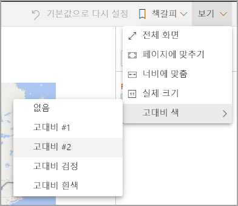
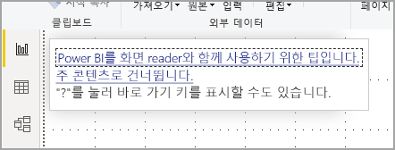
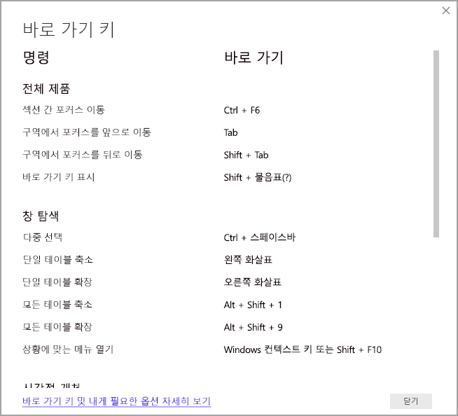
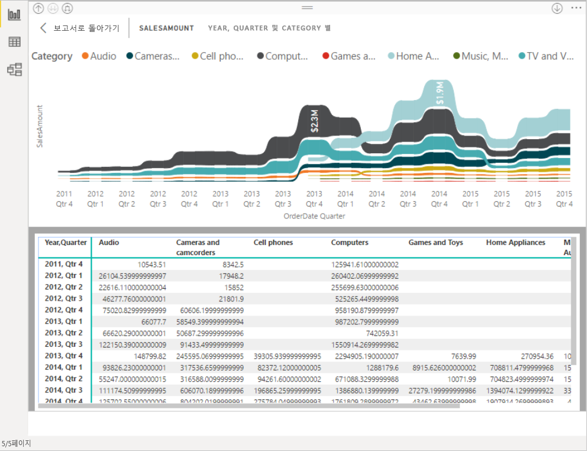

# 접근성 도구를 사용하여 Power BI에서 보고서 사용
Power BI에는 장애가 있는 사람이 Power BI 보고서를 보다 쉽게 사용하고 조작할 수 있게 해주는 여러 기본 제공 기능이 있습니다. 이러한 도구를 통해 사용자는 보조 기술을 사용하지 않는 사람과 동일한 정보를 보고서에서 얻을 수 있습니다.

이 문서를 읽기 전에 알아 두어야 하는 몇 가지 용어가 있습니다.

* **포커스**는 페이지에서 마우스가 있는 위치입니다. 포커스는 일반적으로 개체를 둘러싼 파란색 테두리로 표시됩니다.
* **캔버스**는 보고서의 페이지 영역입니다.

다음 섹션에서는 Power BI 보고서를 사용할 수 있도록 제공되는 접근성 도구를 설명합니다.

## 키보드 탐색

Power BI Desktop 또는 Power BI 서비스를 시작하는 경우, **Tab** 키를 누르는 즉시 오른쪽 위에 도구 설명이 표시됩니다. **화면 읽기 프로그램으로 Power BI를 사용하는 방법의 팁** 링크를 클릭하면 이 문서로 이동하고, 접근성 도구로 보고서를 사용하는 방법에 대한 정보가 제공됩니다. **주 콘텐츠로 건너뛰기** 링크를 클릭하면 보고서 캔버스로 이동합니다.

**?** 키를 누르면 Power BI에서 자주 사용하는 바로 가기 키가 포함된 대화 상자가 열립니다. Power BI에서 사용할 수 있는 바로 가기 키의 전체 목록을 보려면 대화 상자의 맨 아래에 있는 링크로 이동합니다. 링크를 클릭하면 [바로 가기 키](desktop-accessibility-keyboard-shortcuts.md)에 대한 Power BI 설명서로 이동합니다.

**Ctrl+F6**을 사용하여 보고서 페이지 탭이나 지정된 보고서 페이지의 개체 간에 포커스를 전환할 수 있습니다. 포커스가 로드된 보고서 페이지에 있는 경우 **Tab** 키를 사용하여 페이지의 각 개체(모든 텍스트 상자, 이미지, 셰이프 및 차트)로 포커스를 이동합니다. 

일반적으로 **Enter** 키를 사용하여 선택하거나 들어가고 **Esc** 키를 사용하여 나오는 것이 Power BI의 일반적인 명령입니다.

### 시각적 개체의 키보드 탐색

대부분의 Power BI 보고서 작성자는 많은 데이터가 포함된 보고서를 작성합니다. 시각적 개체를 탐색할 때 시각적 개체의 모든 요소를 탭 이동하는 것은 번거로울 수 있습니다. 시각적 개체의 키보드 탐색은 세 수준의 계층 구조로 설계되었습니다. 다음 단락에서는 이러한 세 가지 수준을 설명합니다.

첫 번째 수준을 탐색하려면 시각적 개체로 이동할 때 **Ctrl+오른쪽 화살표**를 눌러 시각적 개체로 들어갑니다. 시각적 개체에 들어간 후에 **Tab** 키를 누르면 시각적 개체의 주요 영역을 순환할 수 있습니다. 순환할 수 있는 주요 영역은 데이터 그림 영역, 축 범주(시각적 개체에 해당하는 경우), 범례(시각적 개체에 있는 경우)입니다.

다음 .gif는 사용자가 시각적 개체의 첫 번째 수준을 순환하는 방법을 보여 줍니다.

계층 구조의 두 번째 수준은 시각적 개체의 주요 영역(데이터 그림 영역, x축 범주, 범례) 중 하나로 들어갑니다. 보고서를 사용할 때 이러한 주요 영역 중 하나로 이동한 다음, 시각적 개체의 해당 섹션에 있는 데이터 요소 또는 범주를 순환할 수 있습니다. 추가로 탐색할 영역을 결정한 후에 **Enter** 키를 누르면 특정 영역을 순환할 수 있습니다.

계열의 모든 데이터 요소를 선택하려면 범례로 이동한 다음, **Enter** 키를 누릅니다. 범례에 들어간 후에 **Tab** 키를 누르면 범례의 여러 범주를 탐색할 수 있습니다. **Enter** 키를 눌러 특정 계열을 선택합니다.

특정 데이터 요소를 선택하려면 데이터 그림 영역으로 이동한 다음, **Enter** 키를 누릅니다. 데이터 그림 영역에 들어간 후에 **Tab** 키를 누르면 데이터 요소를 탐색할 수 있습니다. 시각적 개체에 여러 계열이 있는 경우 **위쪽 화살표** 또는 **아래쪽 화살표** 키를 눌러 다른 계열의 데이터 요소로 이동할 수 있습니다.

범주 축의 모든 데이터 요소를 선택하려면 축 레이블로 이동한 다음, **Enter** 키를 누릅니다. 축 레이블에 들어간 후에 **Tab** 키를 누르면 레이블 이름을 탐색할 수 있습니다. **Enter** 키를 눌러 레이블 이름을 선택합니다.

계층으로 이동한 경우 **Esc** 키를 누르면 해당 계층에서 나올 수 있습니다. 다음 .gif는 사용자가 시각적 개체의 수준에 들어가거나 나오고, 데이터 요소와 x축 범주 레이블을 선택하며, 다른 계열로 이동하고, 계열의 모든 데이터 요소를 선택할 수 있는 방법을 보여 줍니다.

키보드를 사용하여 개체나 시각적 개체로 이동할 수 없는 경우, 보고서 작성자가 해당 개체를 탭 순서에서 숨기도록 결정했기 때문일 수 있습니다. 보고서 작성자는 일반적으로 장식 개체를 탭 순서에서 숨깁니다. 논리적인 방식으로 보고서를 탭 이동할 수 없는 경우 보고서 작성자에게 문의해야 합니다. 보고서 작성자는 개체와 시각적 개체의 탭 순서를 설정할 수 있습니다.

### 슬라이서의 키보드 탐색

슬라이서에도 기본 제공 접근성 기능이 있습니다. 슬라이서를 선택한 경우, 슬라이서 값을 조정하려면 **Ctrl+오른쪽 화살표**를 사용하여 슬라이서 내의 다양한 컨트롤로 이동합니다. 예를 들어 처음에 **Ctrl+오른쪽 화살표**를 누르면 포커스가 지우개에 있습니다. 그런 다음, **스페이스바**를 누르는 것은 슬라이서의 모든 값을 지우는 지우개 단추를 클릭하는 것과 같습니다.

**Tab** 키를 눌러 슬라이서의 컨트롤로 이동할 수 있습니다. 포커스가 지우개에 있을 때 **Tab** 키를 누르면 드롭다운 단추로 이동합니다. 이후 **Tab** 키를 다시 누르면 첫 번째 슬라이서 값으로 이동합니다(범위와 같이 슬라이서에 대한 값이 여러 개 있는 경우).

### 페이지 전환

포커스가 보고서 페이지 탭에 있는 경우 **Tab** 키 또는 **화살표** 키를 사용하여 한 보고서 페이지에서 다음 페이지로 포커스를 이동합니다. 화면 판독기가 보고서 페이지의 제목과 현재 선택 여부를 읽습니다. 현재 포커스가 있는 보고서 페이지를 로드하려면 **Enter** 키 또는 **스페이스바**를 사용합니다.

### 시각적 개체 헤더 액세스
시각적 개체 간을 이동할 때 Alt+Shift+**F10**을 눌러 포커스를 시각적 개체 머리글로 이동할 수 있습니다. 시각적 개체 머리글에는 정렬, 차트 뒤의 데이터 내보내기 및 포커스 모드가 포함된 다양한 옵션이 있습니다. 시각적 개체 헤더에 표시되는 아이콘은 보고서 작성자가 표시하기로 결정한 옵션에 따라 달라집니다.

## 화면 읽기 프로그램

보고서를 볼 때는 스캔 모드를 꺼진 상태로 두는 것이 좋습니다. Power BI는 보다 쉽게 탐색할 수 있도록 사용자 지정 탐색으로 설정되었으므로, 문서가 아니라 애플리케이션으로 취급해야 합니다. Power BI Desktop에서 화면 읽기 프로그램을 사용하는 경우, Power BI Desktop을 열기 전에 화면 읽기 프로그램이 열려 있는지도 확인해야 합니다.

화면 읽기 프로그램은 개체를 탐색할 때 개체 유형과 개체 제목(있는 경우)을 읽습니다. 또한 보고서 작성자가 제공한 경우 해당 개체에 대한 설명(대체 텍스트)을 읽습니다.

### 데이터 표시
**Alt+Shift+F11**을 눌러 **데이터 참조** 창에 액세스할 수 있는 버전을 표시할 수 있습니다. 이 창을 통해 화면 판독기에서 일반적으로 사용하는 것과 동일한 바로 가기 키를 사용하여 HTML 테이블의 시각적 개체에 사용된 데이터를 탐색할 수 있습니다.

**데이터 표시** 기능은 이 바로 가기 키를 통해서만 화면 읽기 프로그램에서 액세스할 수 있는 HTML 테이블입니다. 시각적 개체 헤더의 옵션을 통해 **데이터 표시**를 열면, 화면 읽기 프로그램과 호환되지 ‘않는’ 테이블이 표시됩니다.   바로 가기 키를 통해 **데이터 표시**를 사용하는 경우, 화면 읽기 프로그램에서 제공하는 바로 가기 키를 모두 활용하려면 스캔 모드를 켭니다.

**데이터 표시** 뷰를 종료하고 보고서로 돌아가려면 **Esc** 키를 누릅니다.

## 고대비 모드

Power BI 서비스는 Windows에 대해 선택된 고대비 설정을 검색하려고 합니다. 검색의 유효성과 정확성은 Power BI 서비스를 표시하는 브라우저에 따라 다릅니다. Power BI 서비스에서 테마를 수동으로 설정하려면 **보기 > 고대비 색상**을 선택한 다음, 보고서에 적용할 테마를 선택할 수 있습니다.

## 다음 단계

Power BI 접근성에 대한 문서 컬렉션은 다음과 같습니다.

* [Power BI의 접근성 개요](desktop-accessibility-overview.md) 
* [접근성 있는 Power BI 보고서 만들기](desktop-accessibility-creating-reports.md) 
* [접근성 도구를 사용하여 Power BI 보고서 만들기](desktop-accessibility-creating-tools.md)
* [Power BI 보고서의 접근성 바로 가기 키](desktop-accessibility-keyboard-shortcuts.md)
* [보고서 접근성 검사 목록](desktop-accessibility-creating-reports.md#report-accessibility-checklist)

