# 접근성 도구를 사용하여 Power BI에서 보고서 만들기

접근성 도구를 사용하여 보고서를 만드는 보고서 작성자를 위해 Power BI에는 프로세스에 도움이 되는 다양한 기본 제공 기능이 있습니다.

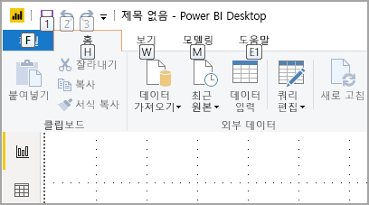

이 문서에서는 Power BI Desktop의 보고서 작성자에게 제공되는 다양한 유형의 접근성 도구를 설명합니다.

## 앱 수준 탐색
Power BI Desktop에서 탐색할 때 **Ctrl+F6**을 누르면 앱의 기본 영역으로 포커스를 이동할 수 있습니다. Power BI Desktop의 기본 영역에서 포커스를 이동하는 작업은 다음과 같은 순서로 진행됩니다.

1. 캔버스의 개체
2. 페이지 탭
3. 창(열려 있는 창을 왼쪽에서 오른쪽으로 하나씩)
4. 탐색기 보기
5. 바닥글
6. 로그인
7. 노란색 경고/오류/업데이트 표시줄

대부분의 경우 **Enter** 키를 사용하여 영역을 선택하거나 들어가고 **Esc** 키를 사용하여 나오는 것이 Power BI의 일반적인 절차입니다.

## 리본 탐색

**Alt** 키를 눌러 리본의 현재 보기에서 사용할 수 있는 각 명령의 *‘키 설명’* 이라는 작은 상자를 확인합니다. 그런 다음, 사용하려는 명령 위에 표시되는 *‘키 설명’* 에 있는 문자를 누를 수 있습니다. 

예를 들어 다음 이미지에서는 **Alt** 키를 눌러 사용 가능한 접근성 있는 명령의 문자가 포함된 키 설명을 표시했습니다. 그런 다음, **M** 키를 누르면 리본에서 **모델링** 탭이 열립니다.

누르는 문자에 따라 추가 키 설명이 표시될 수도 있습니다. 예를 들어 **홈** 탭이 활성 상태이고 **W** 키를 누르면 **보기** 리본 탭의 그룹에 대한 키 설명과 함께 **보기** 탭이 표시됩니다. 사용할 특정 명령의 문자를 누를 때까지 키 설명에 표시된 문자를 계속 누를 수 있습니다. 이전 키 설명 집합으로 이동하려면 **Esc** 키를 누릅니다. 수행 중인 작업을 취소하고 키 설명을 숨기려면 **Alt** 키를 누릅니다.

## 시각적 개체 창 탐색

**시각화** 창을 탐색하려면 먼저 해당 창에 액세스할 때까지 **Ctrl+F6**을 눌러 포커스가 창에 있도록 해야 합니다. 사용자가 시각화 창을 탐색할 때 포커스는 먼저 헤더에서 적용됩니다. 단계별 탭 순서는 다음과 같으며 이어서 나오는 이미지에도 표시되어 있습니다.

1. 헤더 제목
2. 펼치기/접기 캐럿
3. 첫 번째 시각적 개체 아이콘

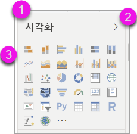

시각적 개체에 액세스할 때 화살표 키를 사용하여 특정 시각적 개체를 탐색하고 **Enter** 키를 눌러 선택할 수 있습니다. 화면 읽기 프로그램을 사용하는 경우 새 차트를 만들면 소리 내어 읽고, 차트 유형을 알리거나 특정 유형의 차트를 다른 유형의 차트로 변경했다고 알립니다. 

다음 이미지와 같이 창의 시각적 개체 섹션 이후에 포커스 순서가 창 피벗으로 이동합니다.

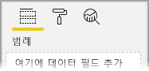

창에 포커스가 있는 경우 선택한 창의 아이콘에만 탭 이동이 적용됩니다. 다른 창으로 전환하려면 화살표 키를 사용합니다.

## 필드 웰

이전 섹션에서 설명한 대로 창 피벗에 포커스가 있는 경우 Tab 키를 다시 누르면 포커스가 **필드 웰**로 이동합니다. 

**필드 웰**에서 포커스 순서는 다음과 같이 이동합니다.

* 각 웰의 제목(첫 번째)
* 각 웰의 지정된 필드(다음)
* 필드 메뉴를 여는 드롭다운 단추(그 다음)
* 제거 단추(마지막)

다음 이미지는 이 포커스 진행 순서를 보여 줍니다.

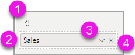

화면 읽기 프로그램은 웰의 이름과 도구 설명을 소리 내어 읽습니다. 웰의 각 필드에 대해 화면 읽기 프로그램은 필드 이름과 도구 설명을 읽습니다. 웰이 비어 있으면 포커스가 비어 있는 전체 웰로 이동해야 합니다. 화면 읽기 프로그램은 웰 이름, 도구 설명, 비어 있음을 읽어야 합니다.

필드 메뉴가 열리면 **Tab**, **Shift+Tab** 또는 **위쪽** / **아래쪽** 화살표 키를 사용하여 이동할 수 있습니다. 화면 읽기 프로그램은 옵션 이름을 소리 내어 읽습니다.

필드 웰의 한 버킷에서 다른 버킷으로 필드를 이동하려는 경우, 다음 이미지와 같이 키보드를 사용하고 필드 웰 메뉴의 옵션으로 **이동**을 사용할 수 있습니다.

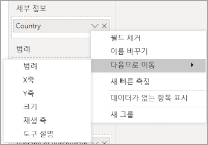

## 서식 지정 창

**서식** 창의 포커스 순서는 카드 순서대로 위에서 아래로 이동합니다. 포커스가 카드 이름으로 이동한 후 해당 **켜기/끄기** 토글 단추(있는 경우)로 이동합니다. 카드 이름에 포커스가 있는 경우, 화면 읽기 프로그램은 카드 이름과 카드가 펼쳐져 있는지 또는 접혀 있는지 여부를 소리 내어 읽습니다. **Enter** 키를 눌러 카드를 펼치거나 접을 수 있습니다. **Enter** 키를 통해 토글 단추를 **켜기** 또는 **끄기**로 설정할 수도 있습니다.

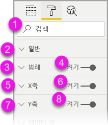

카드가 열려 있는 경우 **Tab** 키를 누르면 카드의 컨트롤로 이동한 후에 다음 카드로 이동합니다. 카드의 컨트롤에 대해 화면 읽기 프로그램은 제목, 현재 값, 컨트롤 유형을 소리 내어 읽습니다.  

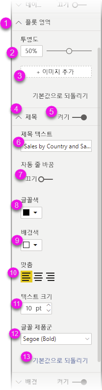

## 필드 목록 탐색

**Tab** 키를 눌러 **필드** 목록을 탐색할 수 있습니다. 서식 창과 마찬가지로, 테이블이 접혀 있는 경우 포커스 순서는 다음 순서로 진행합니다.

1. **필드** 목록 헤더
2. 검색 창
3. 각 테이블 이름

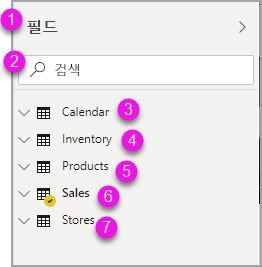

**필드** 웰의 모든 테이블을 펼치려면 **Alt+Shift+9**를 누릅니다. 모든 테이블을 접으려면 **Alt+Shift+1**을 누릅니다. 단일 테이블을 펼치하려면 **오른쪽 화살표** 키를 누릅니다. 단일 테이블을 접으려면 **왼쪽 화살표** 키를 누릅니다. 서식 창과 마찬가지로, 테이블이 펼쳐져 있는 경우 필드 목록의 탭 이동과 탐색에는 표시되는 필드가 포함됩니다. 화면 읽기 프로그램은 테이블을 펼쳤는지 또는 접었는지 여부를 소리 내어 읽습니다.

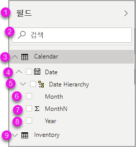

원하는 필드로 이동하고 **Enter** 키를 눌러 필드에 확인 표시를 할 수 있습니다.   화면 읽기 프로그램은 포커스가 있는 필드와 필드의 선택 여부를 소리 내어 읽습니다.

마우스 사용자는 일반적으로 필드를 캔버스나 원하는 관련 필터 버킷으로 끌어서 놓습니다. 키보드를 사용하려는 경우 **Shift+F10**을 눌러 필드의 상황에 맞는 메뉴를 시작하고 화살표 키를 사용하여 **필터에 추가**로 이동한 다음, 필드를 추가하려는 필터 유형에서 **Enter** 키를 눌러 필터 버킷에 필드를 추가할 수 있습니다.

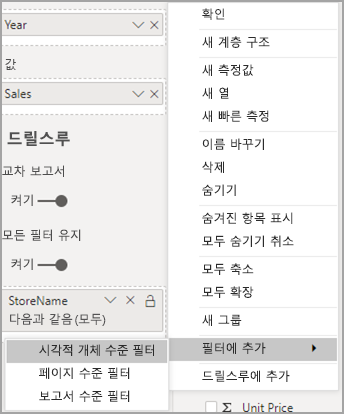

## 선택 창 탐색
**선택** 창의 포커스 순서 진행은 다음과 같습니다.

1. 헤더 제목
2. 종료 단추
3. 계층/탭 순서 전환기
4. 계층에서 위로 이동 단추
5. 계층에서 아래로 이동 단추
6. 표시 단추
7. 숨기기 단추
8. 개체

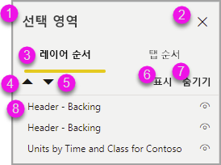

Tab 키를 눌러 포커스 순서를 이동하고 **Enter** 키를 눌러 원하는 요소를 선택할 수 있습니다.  

계층/탭 순서 전환기에 도달하면 왼쪽 및 오른쪽 화살표 키를 사용하여 계층 순서와 탭 순서 간에 전환합니다.

**선택** 창의 개체에 도달하면 **F6** 키를 눌러 **선택** 창을 활성화합니다. **선택** 창을 활성화한 후에 위쪽/아래쪽 화살표 키를 사용하여 **선택** 창의 다른 개체로 이동할 수 있습니다.
원하는 개체로 이동한 후에 다음 몇 가지 작업을 수행할 수 있습니다.

* **Ctrl+Shift+S**를 눌러 개체를 숨기거나 표시합니다.
* **Ctrl+Shift+F**를 눌러 계층 순서에서 개체를 위로 이동합니다.
* **Ctrl+Shift+B**를 눌러 계층 순서에서 개체를 아래로 이동합니다.
* **Ctrl+스페이스바**를 눌러 여러 개체를 선택합니다.

## Power BI Desktop 대화 상자

Power BI Desktop의 모든 대화 상자는 키보드 탐색을 통해 액세스할 수 있으며 화면 읽기 프로그램이 적용됩니다.

Power BI Desktop에 있는 대화 상자는 다음과 같습니다.

* 빠른 측정 대화 상자
* 조건부 서식 및 데이터 막대 대화 상자
* Q&A 탐색기 대화 상자
* 시작 대화 상자
* 파일 메뉴 및 정보 대화 상자
* 경고 막대
* 파일 복원 대화 상자
* 찡그린 얼굴 대화 상자

## 고대비 지원

Windows에서 고대비 모드를 사용하면 선택한 설정 및 팔레트가 Power BI Desktop의 보고서에도 적용됩니다.

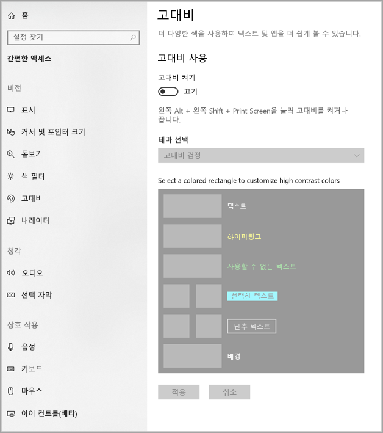

Power BI Desktop은 Windows에서 사용 중인 고대비 테마를 자동으로 검색하고 해당 설정을 보고서에 적용합니다. 이러한 고대비 색은 Power BI 서비스 또는 다른 곳에 게시될 때 보고서를 따릅니다.

## 다음 단계

Power BI 접근성에 대한 문서 컬렉션은 다음과 같습니다.

* [Power BI의 접근성 개요](desktop-accessibility-overview.md) 
* [접근성 있는 Power BI 보고서 만들기](desktop-accessibility-creating-reports.md) 
* [접근성 도구를 사용하여 Power BI에서 보고서 사용](desktop-accessibility-consuming-tools.md)
* [Power BI 보고서의 접근성 바로 가기 키](desktop-accessibility-keyboard-shortcuts.md)
* [보고서 접근성 검사 목록](desktop-accessibility-creating-reports.md#report-accessibility-checklist)

