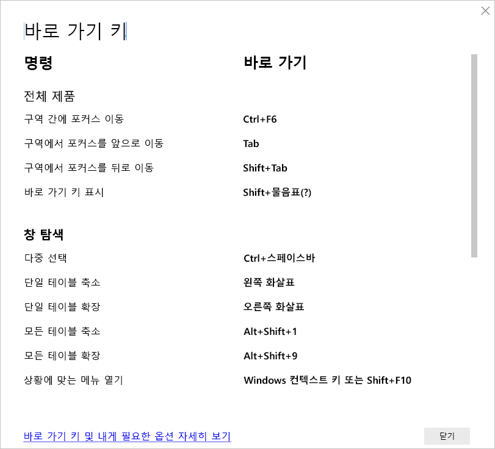

# Power BI Desktop의 바로 가기 키

바로 가기 키는 키보드를 사용하여 Power BI 보고서에서 이동하는 데 유용합니다. 이 문서의 표에서는 Power BI 보고서에서 사용할 수 있는 바로 가기를 설명합니다. 

Power BI Desktop을 사용하는 경우 **Shift+?** 를 누르면 다음 이미지와 같이 바로 가기 키가 표시됩니다.

**Power BI Desktop**에서 이 바로 가기 키를 사용할 뿐 아니라 이 바로 가기는 다음 환경에서도 작동합니다.

* **Q&A 탐색기** 대화 상자
* **시작** 대화 상자
* **파일** 메뉴 및 **정보** 대화 상자
* **경고** 막대
* **파일 복원** 대화 상자
* **찡그린 얼굴** 대화 상자

접근성을 개선하기 위한 지속적인 노력의 일환으로, 이전 환경 목록도 화면 읽기 프로그램과 고대비 설정을 지원합니다.

## 자주 사용되는 바로 가기
| 수행할 작업           | 누르기                |
| :------------------- | :------------------- |
| 구역 간에 포커스 이동  | **Ctrl+F6** |
| 구역에서 포커스를 앞으로 이동 | **Tab**         |
| 구역에서 포커스를 뒤로 이동 | **Shift+Tab** |
| 개체 선택 또는 선택 취소 | **Enter** 또는 **스페이스바** |
| 다중 선택 개체 | **Ctrl+스페이스바** |

## 시각적 개체에서
| 수행할 작업           | 누르기                |
| :------------------- | :------------------- |
| 시각적 메뉴로 포커스 이동 | **Alt+Shift+F10** |
| 데이터 표시 | **Alt+Shift+F11**  |
| 시각적 개체 입력 | **Ctrl+오른쪽 화살표** |
| 레이어 입력 | **Enter** |
| 레이어 또는 시각적 개체 종료 | **Esc** |
| 데이터 요소 선택 또는 선택 취소 | **Enter** 또는 **스페이스바** |
| 다중 선택 | **Ctrl+Enter** 또는 **Ctrl+스페이스바** |
| 마우스 오른쪽 단추 클릭 | <ul><li>Windows 키보드: **Windows 팝업 키+F10**. Windows 팝업 키는 왼쪽 Alt 키와 왼쪽 화살표 키 사이에 있습니다.</li><li>다른 키보드: **Shift+F10**</li></ul> |
| 선택 영역 지우기 | **Ctrl+Shift+C** |

## 테이블 및 행렬 탐색
| 수행할 작업          | 누르기                |
| :------------------- | :------------------- |
| 한 셀 위/아래로 포커스 이동(모든 영역의 모든 셀에서)  | **위쪽 화살표 키** / **아래쪽 화살표 키** |
| 한 셀 왼쪽/오른쪽으로 포커스 이동(모든 영역의 모든 셀에서)  | **왼쪽 화살표 키** / **오른쪽 화살표 키** |

## 창 탐색
| 수행할 작업           | 누르기                |
| :------------------- | :------------------- |
| 다중 선택 | **Ctrl+스페이스바** |
| 단일 테이블 축소 | **왼쪽 화살표 키** |
| 단일 테이블 확장 | **오른쪽 화살표 키** |
| 모든 테이블 축소 | **Alt+Shift+1** |
| 모든 테이블 확장 | **Alt+Shift+9** |
| 상황에 맞는 메뉴 열기 | <ul><li>Windows 키보드: **Windows 팝업 키+F10**.  Windows 팝업 키는 왼쪽 Alt 키와 왼쪽 화살표 키 사이에 있습니다.</li><li>다른 키보드: **Shift+F10**</li></ul> |

## 슬라이서
| 수행할 작업         | 누르기                |
| :------------------- | :------------------- |
| 슬라이서 상호 작용 | **Ctrl+오른쪽 화살표 키** |

## 선택 창
| 수행할 작업           | 누르기                |
| :------------------- | :------------------- |
| 선택 영역 창 활성화 | **F6** |
| 계층에서 위로 개체 이동 | **Ctrl+Shift+F** |
| 계층에서 아래로 개체 이동 | **Ctrl+Shift+B** |
| 개체 표시/숨기기(설정/해제) | **Ctrl+Shift+S** |

## DAX 편집기
| 수행할 작업          | 누르기                |
| :------------------- | :------------------- |
| 위로/아래로 줄 이동 | **Alt+위쪽 화살표 키** / **아래쪽 화살표 키** |
| 위로/아래로 줄 복사 | **Shift+Alt+위쪽 화살표 키** / **아래쪽 화살표 키** |
| 아래에 행 삽입 | **Ctrl+Enter** |
| 위에 행 삽입 | **Ctrl+Shift+Enter** |
| 일치하는 대괄호로 이동 | **Ctrl+Shift+** \ |
| 줄 들여쓰기/여백으로 줄 내어쓰기 | **Ctrl+]** / **[** |
| 커서 삽입 | **Alt+클릭** |
| 현재 줄 선택 | **Ctrl+I** |
| 현재 선택 사항에 일치하는 모든 항목 선택 | **Ctrl+Shift+L** |
| 현재 단어와 일치하는 항목 모두 선택 | **Ctrl+F2** |

## 데이터 입력
| 수행할 작업           | 누르기                |
| :------------------- | :------------------- |
| 편집 가능한 그리드 종료 | **Ctrl+Tab** |

## 고려 사항 및 제한 사항
접근성 기능에 대한 몇 가지 알려진 문제와 제한 사항이 있습니다. 해당 문제와 제한 사항에 대한 설명은 다음 목록에 나와 있습니다.

* **Power BI Desktop**이 있는 화면 판독기를 사용하는 경우 **Power BI Desktop**에서 모든 파일을 열기 전에 화면 판독기를 여는 것이 가장 좋습니다.
* 내레이터를 사용하는 경우 **데이터 표시**를 HTML 테이블로 탐색하는 방법에는 몇 가지 제한이 있습니다.

## 다음 단계

Power BI 접근성에 대한 문서 컬렉션은 다음과 같습니다.

* [Power BI의 접근성 개요](desktop-accessibility-overview.md) 
* [접근성 있는 Power BI 보고서 만들기](desktop-accessibility-creating-reports.md) 
* [접근성 도구를 사용하여 Power BI에서 보고서 사용](desktop-accessibility-consuming-tools.md)
* [접근성 도구를 사용하여 Power BI 보고서 만들기](desktop-accessibility-creating-tools.md)
* [보고서 접근성 검사 목록](desktop-accessibility-creating-reports.md#report-accessibility-checklist)

다음 문서에도 관심이 있을 수 있습니다.

* [Power BI Desktop에서 보고서 테마 사용](desktop-report-themes.md)

