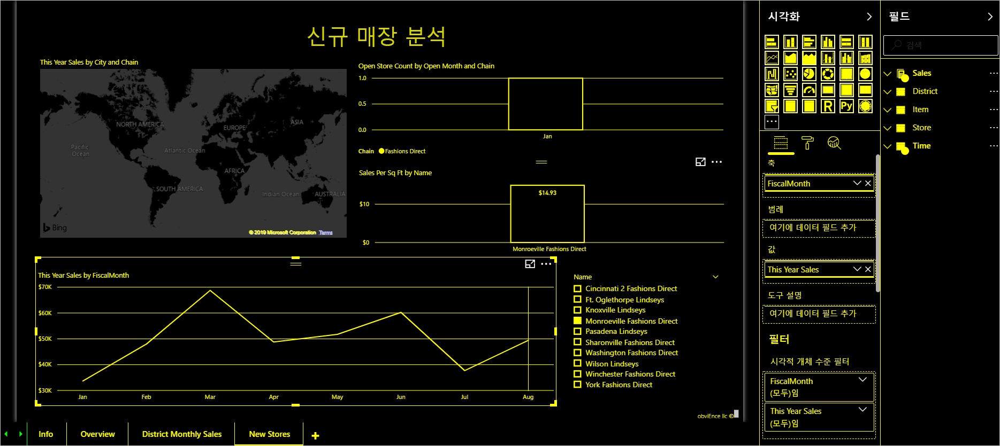

# Power BI의 접근성 개요
Power BI를 사용하는 경우, 보고서를 조작할 수 있는 다양한 유형의 사용자를 고려하는 것이 중요합니다. 키보드 또는 화면 읽기 프로그램 사용자가 쉽게 탐색하고 파악할 수 있는 보고서를 만들고 제공하면 시각 또는 신체적 장애가 있는 사용자도 동일한 정보를 받을 수 있습니다.

이 문서에서는 Power BI와 접근성에 대해 간략하게 설명합니다. 추가 문서에서는 접근성을 고려해서 유용한 보고서를 만드는 데 도움이 되는 지침과 도구를 제공합니다.

## 유니버설 디자인

유니버설 디자인은 특별한 조정이나 특수한 디자인 없이도 최대한 많은 사람이 사용할 수 있는 제품 디자인입니다. Power BI에서 보고서나 환경을 만드는 경우 사용자의 요구 사항을 고려하는 것이 중요합니다. 접근성 있는 환경을 설계하면 청각, 운동, 인지 또는 시각적 장애가 있는 최종 사용자뿐 아니라 조직의 모든 최종 사용자에게 도움이 될 수 있습니다. Power BI는 접근성 있는 보고서를 만들고 사용하기 위한 도구를 제공합니다. 보고서 작성자는 이러한 도구를 사용하여 모든 사용자의 경험을 개선할 수 있습니다.

## 접근성 표준

Power BI는 다음과 같은 접근성 표준을 준수합니다. 따라서 최대한 많은 사용자가 Power BI 환경에 액세스할 수 있게 됩니다. Power BI Mobile 앱은 C 등급의 접근성을 갖춘 것으로 인증을 받았습니다. 즉, 접근성 있는 보고서나 대시보드를 작성하면 Power BI Mobile로 해당 보고서나 대시보드를 볼 수 있는 사용자는 누구나 해당 보고서나 대시보드에 액세스할 수도 있습니다. 

### WCAG 2.1
WCAG(웹 콘텐츠 접근성)는 장애가 있는 사용자가 웹 콘텐츠를 액세스할 수 있도록 도와줍니다. WCAG의 세 가지 주요 원칙은 다음과 같습니다.

1. **감지 가능** - 정보 및 사용자 인터페이스 구성 요소를 사용자가 감지할 수 있는 방식으로 제공할 수 있어야 합니다.
2. **작동 가능** - 사용자 인터페이스 구성 요소와 탐색을 작동할 수 있어야 합니다.
3. **이해 가능** - 정보 및 사용자 인터페이스 작동을 이해할 수 있어야 합니다.

### US Section 508

US Section 508은 장애가 있는 사용자가 전자 및 정보 기술에 액세스할 수 있도록 정부 및 연방 기관에 요구하는 표준입니다.

### EN 301 549
EN 301 549는 ICT 제품 및 서비스의 접근성 요구 사항에 대한 통일 유럽 표준입니다.  

## 다음 단계

Power BI 접근성에 대한 문서 컬렉션은 다음과 같습니다.

* [접근성 있는 Power BI 보고서 만들기](desktop-accessibility-creating-reports.md) 
* [접근성 도구를 사용하여 Power BI 보고서 사용](desktop-accessibility-consuming-tools.md)
* [접근성 도구를 사용하여 Power BI 보고서 만들기](desktop-accessibility-creating-tools.md)
* [Power BI 보고서의 접근성 바로 가기 키](desktop-accessibility-keyboard-shortcuts.md)
* [보고서 접근성 검사 목록](desktop-accessibility-creating-reports.md#report-accessibility-checklist)

