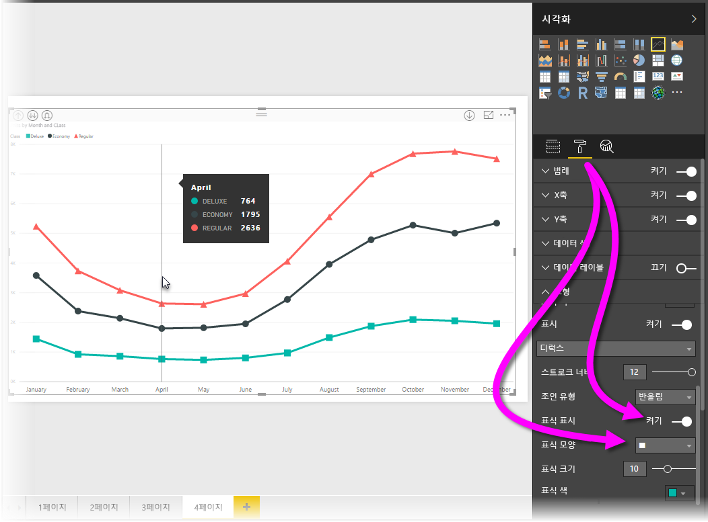
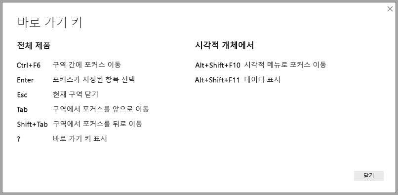
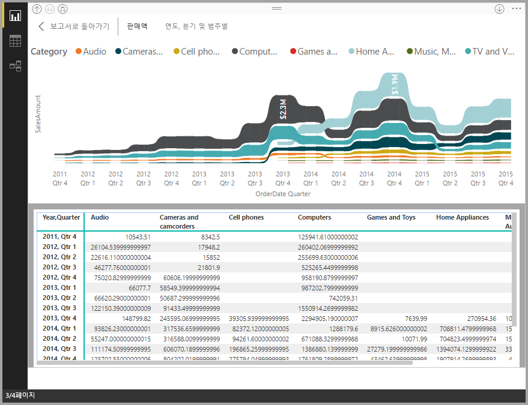
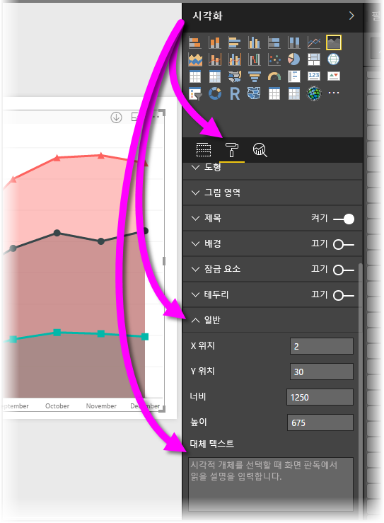

# Power BI Desktop 보고서의 내게 필요한 옵션
**Power BI Desktop**에는 장애가 있는 사람이 **Power BI Desktop** 보고서를 보다 쉽게 사용하고 상호 작용할 수 있도록 하는 기능이 있습니다. 이러한 기능에는 키보드 또는 화면 판독기를 사용하여 보고서를 이용하고 탭 키로 페이지에 있는 다양한 개체에 포커스를 이동하며 시각적 개체에 표식을 세밀하게 사용하는 기능이 있습니다.

> [!NOTE]
> 이러한 내게 필요한 옵션은 **Power BI Desktop** 2017년 6월 및 이후 릴리스에서 제공됩니다. 향후 릴리스에서도 추가적인 내게 필요한 옵션 기능이 제공될 예정입니다.
> 
> 

## 키보드 또는 화면 판독기로 Power BI Desktop 보고서 사용
**Power BI Desktop**의 2017년 9월 릴리스부터 **?** 키를 눌러 **Power BI Desktop**에서 사용할 수 있는 내게 필요한 옵션 바로 가기 키를 설명하는 창을 표시합니다.

내게 필요한 옵션 기능 향상을 통해 다음 기술과 함께 키보드 또는 화면 판독기로 **Power BI Desktop** 보고서를 사용할 수 있습니다.

**Ctrl+F6** 키를 사용하여 보고서 페이지 탭 또는 지정된 보고서 페이지의 개체 간에 **포커스를 전환**할 수 있습니다.

* 포커스가 *보고서 페이지 탭*에 있는 경우 *탭* 또는 *화살표* 키를 사용하여 한 보고서 페이지에서 다음 페이지로 포커스를 이동합니다. 보고서 페이지의 제목과 현재 선택 여부는 화면 판독기로 읽습니다. 현재 포커스가 있는 보고서 페이지를 로드하려면 *Enter* 또는 *Space* 키를 사용합니다.
* 포커스가 로드된 *보고서 페이지*에 있는 경우 *탭* 키를 사용하여 페이지의 각 개체(모든 텍스트 상자, 이미지, 셰이프 및 차트)로 포커스를 이동합니다. 화면 판독기는 개체 유형과 작성자가 제공한 개체 설명을 읽습니다. 

**Alt+Shift+F10** 키를 눌러 시각적 메뉴에 포커스를 이동할 수 있습니다.

**Alt+Shift+F11** 키를 눌러 *데이터 참조* 창에 액세스할 수 있는 버전을 나타낼 수 있습니다.

화면 판독기 및 키보드 탐색을 사용하여 사용자가 **Power BI Desktop** 보고서를 완벽하게 사용할 수 있도록 내게 필요한 옵션 추가를 생성했습니다.

## 액세스할 수 있는 보고서를 만들기 위한 팁
다음 팁은 액세스가 보다 편리한 **Power BI Desktop** 보고서를 만드는 데 도움이 될 수 있습니다.

* **선**, **영역** 및 **콤보** 시각적 개체뿐만 아니라 **분산형** 및 **거품형** 시각적 개체의 경우 표식을 켜고 각 선에 다양한 *표식 모양*을 사용합니다.
  
  * *표식*을 켜려면 **시각화** 창에서**서식** 섹션을 선택하고 **셰이프** 섹션을 확장한 후 아래로 스크롤하여 **표식** 토글을 찾아 *켜기*로 설정합니다.
  * 그런 다음 해당 **셰이프** 섹션의 드롭다운 상자에서 각 행의 이름(또는 영역을 사용 하는 경우는 **영역** 차트)을 선택합니다. 그러면 드롭다운 아래에서, 선택한 선에 사용된 표식의 다양한 부분(셰이프, 색, 크기 등)을 조정할 수 있습니다.
  
  
  
  * 각 선에 다양한 *표식 모양*을 사용하면 보고서 사용자가 선(또는 영역)을 보다 쉽게 구분할 수 있습니다.
* 이전 글머리 기호에 따라 정보를 전달하기 위해 색에 의존하지 마세요. 줄에서 셰이프(이전 글머리 기호에 설명된 대로 마커)를 사용하면 유용합니다.
* 테마 갤러리에서 고대비 및 색맹인 *테마*를 선택하고 [**테마 설정** 미리 보기 기능](desktop-report-themes.md)을 사용하여 가져옵니다.
* 보고서의 모든 개체에 대해 *대체 텍스트*를 제공합니다. 이렇게 하면 보고서 사용자는 시각적 개체, 이미지, 셰이프 또는 텍스트 상자를 볼 수 없더라도 시각적 개체와 통신하는 내용을 잘 파악할 수 있습니다. 개체(예: 시각적 개체, 셰이프 등)를 선택하고 **시각화** 창에서 **서식** 섹션을 선택하며 **일반**을 확장한 후 아래로 스크롤하고 **대체 텍스트** 텍스트 상자를 입력하여 **Power BI Desktop** 보고서의 모든 개체에 대해 *대체 텍스트*를 제공할 수 있습니다.
  
  
* 보고서에서 텍스트와 배경 색 간에 충분한 대비가 되는지 확인합니다.
* 쉽게 읽을 수 있는 텍스트 크기와 글꼴을 사용합니다. 작은 텍스트 크기 또는 읽기 어려울 수 있는 글꼴은 필요한 옵션에 도움이 되지 않습니다.
* 모든 시각적 개체에는 제목, 축 레이블 및 데이터 레이블이 포함됩니다.

## 고려 사항 및 제한 사항
다음 목록에는 접근성 기능에 대한 알려진 문제 및 제한 사항이 설명되어 있습니다.

* JAWS는 포함된 보고서를 포함하여 **Power BI 서비스**에서 볼 수 있는 보고서에서만 지원됩니다. **Power BI Desktop** 팀은 **Power BI Desktop**에서 볼 수 있는 보고서에서도 지원되도록 하기 위해 노력하고 있습니다.

## 다음 단계
* [Power BI Desktop에서 보고서 테마 사용(미리 보기)](desktop-report-themes.md)

