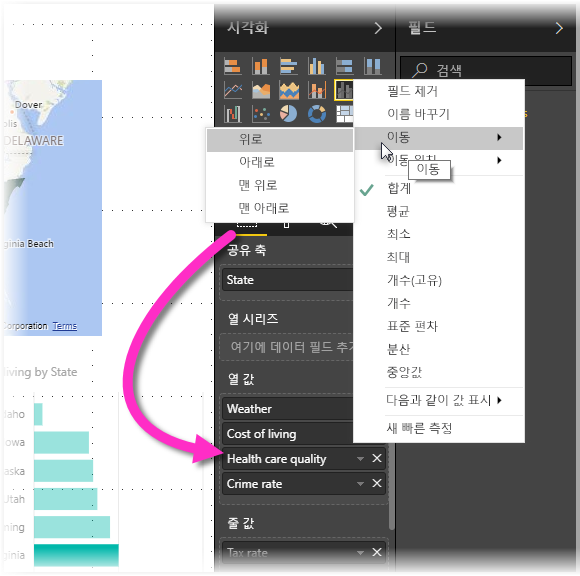

# Power BI Desktop 보고서의 내게 필요한 옵션
Power BI에는 장애가 있는 사람이 Power BI 보고서를 보다 쉽게 사용하고 상호 작용할 수 있도록 하는 기능이 있습니다. 이러한 기능에는 키보드 또는 화면 판독기를 사용하여 보고서를 이용하고 탭 키로 페이지에 있는 다양한 개체에 포커스를 이동하며 시각적 개체에 표식을 세밀하게 사용하는 기능이 있습니다.

## 키보드 또는 화면 판독기로 Power BI Desktop 보고서 사용
**Power BI Desktop**의 2017년 9월 릴리스부터 **?** 키를 눌러 **Power BI Desktop**에서 사용할 수 있는 내게 필요한 옵션 바로 가기 키를 설명하는 창을 표시합니다.

내게 필요한 옵션 기능 향상을 통해 다음 기술과 함께 키보드 또는 화면 판독기로 Power BI 보고서를 사용할 수 있습니다.

보고서를 볼 때 일반적으로 검사 모드가 껴져 있어야 합니다.

**Ctrl+F6**을 사용하여 보고서 페이지 탭 또는 지정된 보고서 페이지의 개체 간에 포커스를 전환할 수 있습니다.

* 포커스가 *보고서 페이지 탭*에 있는 경우 *탭* 또는 *화살표* 키를 사용하여 한 보고서 페이지에서 다음 페이지로 포커스를 이동합니다. 보고서 페이지의 제목과 현재 선택 여부는 화면 판독기로 읽습니다. 현재 포커스가 있는 보고서 페이지를 로드하려면 *Enter* 또는 *Space* 키를 사용합니다.
* 포커스가 로드된 *보고서 페이지*에 있는 경우 *탭* 키를 사용하여 페이지의 각 개체(모든 텍스트 상자, 이미지, 셰이프 및 차트)로 포커스를 이동합니다. 화면 판독기는 개체의 유형, 개체의 제목(있는 경우) 및 해당 개체에 대한 설명(보고서 작성자가 제공한 경우)을 읽습니다. 

시각적 개체 사이를 탐색할 때 추가적으로 상호 작용하려면 **Alt+Shift+F10**을 눌러 정렬, 차트 뒤의 데이터 내보내기 및 포커스 모드가 포함된 다양한 옵션을 포함하는 시각적 헤더로 포커스를 이동시킬 수 있습니다. 

**Alt+Shift+F11**을 눌러 *데이터 참조* 창에 액세스할 수 있는 버전을 표시할 수 있습니다. 이렇게 하면 화면 판독기에서 일반적으로 사용하는 것과 동일한 바로 가기 키를 사용하여 HTML 테이블의 시각적 개체에 사용된 데이터를 탐색할 수 있습니다. 

> [!NOTE]
> 데이터 표시 기능은 이 바로 가기 키를 통해서만 화면 판독기에 액세스할 수 있습니다. 시각적 개체 헤더에서 옵션을 통해 데이터 표시를 열면 화면 판독기에 액세스할 수 없습니다. 데이터 표시를 사용하는 경우 화면 판독기에 제공된 모든 핫 키를 활용하도록 검색 모드를 켭니다.

**Power BI Desktop**의 2018년 7월 릴리스부터 슬라이서에 대한 접근성 기능이 기본 제공됩니다. 슬라이서를 선택하는 경우 슬라이서 값을 조정하려면 Ctrl+오른쪽 화살표(Ctrl 키 및 오른쪽 화살표 키)를 사용하여 슬라이서 내에서 다양한 컨트롤로 이동합니다. 예를 들어 처음에 Ctrl+오른쪽 화살표를 누르면 포커스가 지우개에 있고 스페이스바를 누르는 것은 슬라이서의 모든 값을 지우는 지우개 단추를 클릭하는 것과 같습니다. 

Tab 키를 눌러 슬라이서에서 컨트롤로 이동할 수 있습니다. 지우개를 사용할 때 Tab 키를 누르면 드롭다운 단추로 이동합니다. 이후 Tab 키를 다시 누르면 첫 번째 슬라이서 값으로 이동합니다(범위와 같이 슬라이서에 대한 값이 여러 개 있는 경우). 

화면 판독기 및 키보드 탐색을 사용하여 사용자가 Power BI Desktop 보고서를 완벽하게 사용할 수 있도록 내게 필요한 옵션 추가를 생성했습니다.

## 액세스할 수 있는 보고서를 만들기 위한 팁
다음 팁은 액세스가 보다 편리한 **Power BI Desktop** 보고서를 만드는 데 도움이 될 수 있습니다.

### 액세스 가능한 보고서에 대한 일반 팁.

* **선**, **영역** 및 **콤보** 시각적 개체뿐만 아니라 **분산형** 및 **거품형** 시각적 개체의 경우 표식을 켜고 각 선에 다양한 *표식 모양*을 사용합니다.
  
  * *표식*을 켜려면 **시각화** 창에서**서식** 섹션을 선택하고 **셰이프** 섹션을 확장한 후 아래로 스크롤하여 **표식** 토글을 찾아 *켜기*로 설정합니다.
  * 그런 다음 해당 **셰이프** 섹션의 드롭다운 상자에서 각 행의 이름(또는 영역을 사용 하는 경우는 **영역** 차트)을 선택합니다. 그러면 드롭다운 아래에서, 선택한 선에 사용된 표식의 다양한 부분(셰이프, 색, 크기 등)을 조정할 수 있습니다.
  
  
  
  * 각 선에 다양한 *표식 모양*을 사용하면 보고서 사용자가 선(또는 영역)을 보다 쉽게 구분할 수 있습니다.
* 이전 글머리 기호에 따라 정보를 전달하기 위해 색에 의존하지 마세요. 줄 및 분산형 차트에서 셰이프를 사용하는 것 외에도 테이블 및 행렬에 정보를 제공하는 조건부 서식을 사용하지 마세요. 
* 보고서의 각 시각적 개체에 대한 의도적인 정렬 순서를 선택합니다. 화면 판독기 사용자가 차트 뒤의 데이터를 탐색할 때 시각적 개체와 같은 정렬 순서를 선택합니다.
* 테마 갤러리에서 고대비 및 색맹인 *테마*를 선택하고 [**테마 설정** 미리 보기 기능](desktop-report-themes.md)을 사용하여 가져옵니다.
* 보고서의 모든 개체에 대해 *대체 텍스트*를 제공합니다. 이렇게 하면 보고서 사용자는 시각적 개체, 이미지, 셰이프 또는 텍스트 상자를 볼 수 없더라도 시각적 개체와 통신하는 내용을 잘 파악할 수 있습니다. 개체(예: 시각적 개체, 셰이프 등)를 선택하고 **시각화** 창에서 **서식** 섹션을 선택하며 **일반**을 확장한 후 아래로 스크롤하고 **대체 텍스트** 텍스트 상자를 입력하여 **Power BI Desktop** 보고서의 모든 개체에 대해 ‘대체 텍스트’를 제공할 수 있습니다.
  
  
* 보고서에서 텍스트와 배경 색 간에 충분한 대비가 되는지 확인합니다. [색상 대비 분석기](https://developer.paciellogroup.com/resources/contrastanalyser/)와 같은 여러 도구를 사용하여 보고서 색상을 확인할 수 있습니다. 
* 쉽게 읽을 수 있는 텍스트 크기와 글꼴을 사용합니다. 작은 텍스트 크기 또는 읽기 어려울 수 있는 글꼴은 필요한 옵션에 도움이 되지 않습니다.
* 모든 시각적 개체에는 제목, 축 레이블 및 데이터 레이블이 포함됩니다.
* 모든 보고서 페이지에 의미 있는 제목을 사용합니다.
* 보고서의 탭 순서에 포함되어 있으므로 가능하면 장식 셰이프 및 이미지를 보고서에 사용하지 마세요. 보고서에 장식 개체를 포함해야 하는 경우 화면 판독기 사용자가 장식용임을 알 수 있도록 개체의 대체 텍스트를 업데이트합니다.

### 필드 버킷의 항목 정렬
2018년 10월 **Power BI Desktop** 릴리스부터는 **키보드로 필드**를 탐색하고 화면 판독기와 상호 작용할 수 있습니다. 

화면 판독기를 사용하여 보고서를 작성하는 절차를 개선하기 위해 컨텍스트 메뉴를 **필드** 목록의 위 또는 아래로 이동하거나 **범례** 또는 **값**과 같은 다른 위치로 필드를 이동하여 필드를 다른 저장소로 이동할 수 있습니다.

## 보고서에 고대비 지원

Windows에서 고대비 모드를 사용하면 선택한 설정 및 팔레트가 **Power BI Desktop**의 보고서에도 적용됩니다. 

**Power BI Desktop**은 Windows에서 어떤 고대비 테마가 사용되고 있는지 자동으로 감지하여 해당 설정을 보고서에 적용합니다. 이러한 고대비 색상은 Power BI 서비스 또는 다른 곳에 게시될 때 보고서를 따릅니다.

또한 Power BI 서비스는 Windows용으로 선택된 고대비 설정을 검색하려고 하지만, 얼마나 효과적이고 정확한지는 Power BI 서비스에 사용되는 브라우저에 따라 다릅니다. Power BI 서비스에서 테마를 수동으로 설정하려면 **보기 > 고대비 색상**을 선택한 다음, 보고서에 적용할 테마를 선택할 수 있습니다.

**Power BI Desktop**에서 **시각화** 및 **필드** 필드와 같은 일부 영역에는 고대비 Windows 색 구성표 선택이 반영되지 않습니다.

## 고려 사항 및 제한 사항
다음 목록에는 접근성 기능에 대한 알려진 문제 및 제한 사항이 설명되어 있습니다.

* **Power BI Desktop**이 있는 화면 판독기를 사용하는 경우 Power BI Desktop에서 모든 파일을 열기 전에 선택한 화면 판독기를 여는 것이 가장 좋습니다.
* 내레이터를 사용하는 경우 표시 데이터를 HTML 테이블로 탐색하는 방법에는 몇 가지 제한이 있습니다.

## 바로 가기 키
바로 가기 키는 키보드를 사용하여 Power BI 보고서에서 이동하는 데 유용합니다. 다음 표는 Power BI 보고서에서 사용 가능한 바로 가기를 설명합니다. Power BI Desktop에서 이러한 바로 가기 키 사용 외에도 이러한 바로 가기는 다음 환경에서도 작동합니다.

* Q&A 탐색기 대화 상자
* 시작 대화 상자
* 파일 메뉴 및 정보 대화 상자
* 경고 막대
* 파일 복원 대화 상자
* 찡그린 얼굴 대화 상자

접근성을 개선하기 위한 지속적인 노력의 일환으로, 이전 환경 목록도 화면 읽기 프로그램과 고대비 설정을 지원합니다.

### 자주 사용되는 바로 가기
| 수행할 작업           | 누르기                |
| :------------------- | :------------------- |
| 구역 간에 포커스 이동  | Ctrl+F6 |
| 구역에서 포커스를 앞으로 이동 | Tab         |
| 구역에서 포커스를 뒤로 이동 | Shift+Tab |
| 개체 선택 또는 선택 취소 | 입력 또는 공백 |
| 다중 선택 개체 | Ctrl+Space |

### 시각적 개체에서
| 수행할 작업           | 누르기                |
| :------------------- | :------------------- |
| 시각적 메뉴로 포커스 이동 | Alt+Shift+F10 |
| 데이터 표시 | Alt+Shift+F11  |

### 창 탐색
| 수행할 작업           | 누르기                |
| :------------------- | :------------------- |
| 팝업 메뉴 열기 | <ul><li>Windows 키보드: Windows 팝업 키+F10  Windows 팝업 키는 왼쪽 Alt 키와 왼쪽 화살표 키 사이에 있습니다.</li><li>다른 키보드: Shift+F10</li></ul> |

### 슬라이서
| 수행할 작업           | 누르기                |
| :------------------- | :------------------- |
| 슬라이서 상호 작용 | Ctrl+오른쪽 화살표 키 |

### 선택 창
| 수행할 작업           | 누르기                |
| :------------------- | :------------------- |
| 선택 영역 창 활성화 | F6 |
| 계층에서 위로 개체 이동 | Ctrl+Shift+F |
| 계층에서 아래로 개체 이동 | Ctrl+Shift+B |
| 개체 표시/숨기기(설정/해제) | Ctrl+Shift+S |

### DAX 편집기
| 수행할 작업           | 누르기                |
| :------------------- | :------------------- |
| 위로/아래로 줄 이동 | Alt+위쪽 화살표 키/아래쪽 화살표 키 |
| 위로/아래로 줄 복사 | Shift+Alt+위쪽 화살표 키/아래쪽 화살표 키 |
| 아래에 행 삽입 | Ctrl+Enter |
| 위에 행 삽입 | Ctrl+Shift+Enter |
| 일치하는 대괄호로 이동 | Ctrl+Shift+\ |
| 줄 들여쓰기/내어쓰기 | Ctrl+] / [ |
| 커서 삽입 | Alt+클릭 |
| 현재 줄 선택 | Ctrl+I |
| 현재 선택 사항에 일치하는 모든 항목 선택 | Ctrl+Shift+L |
| 현재 단어와 일치하는 항목 모두 선택 | Ctrl+F2 |

## 다음 단계
* [Power BI Desktop에서 보고서 테마 사용(미리 보기)](desktop-report-themes.md)

