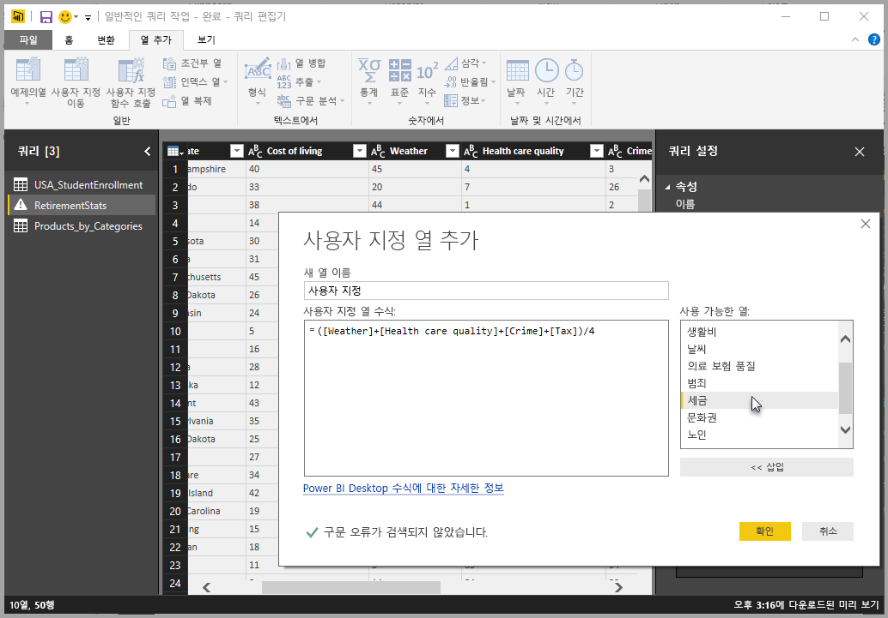
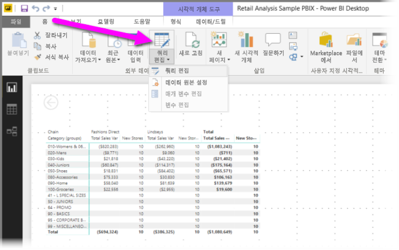
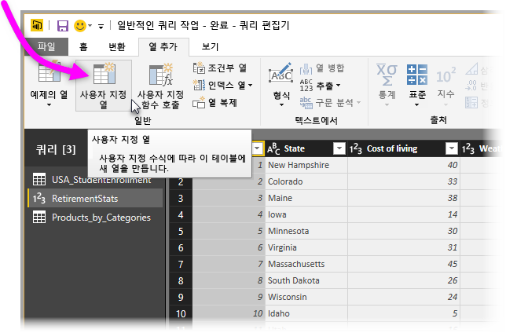
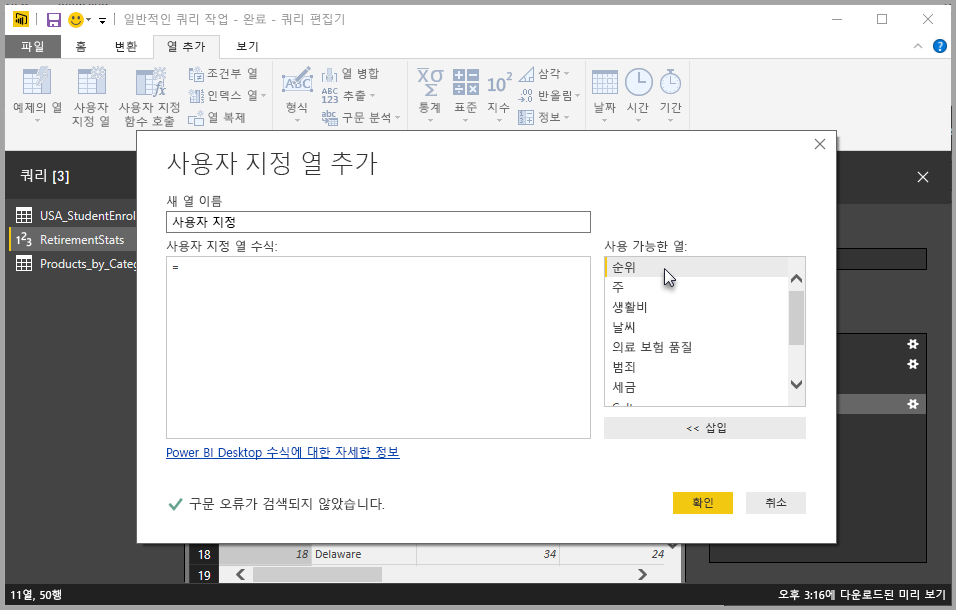
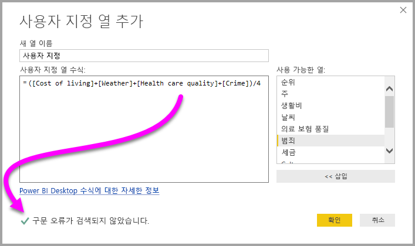
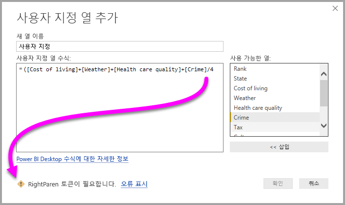
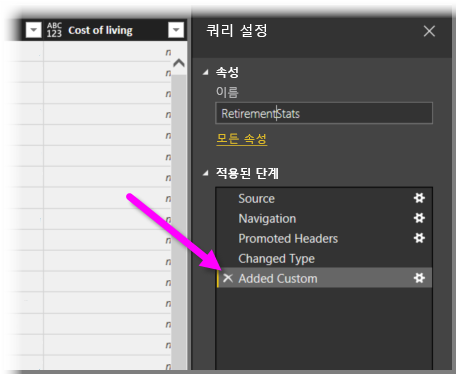
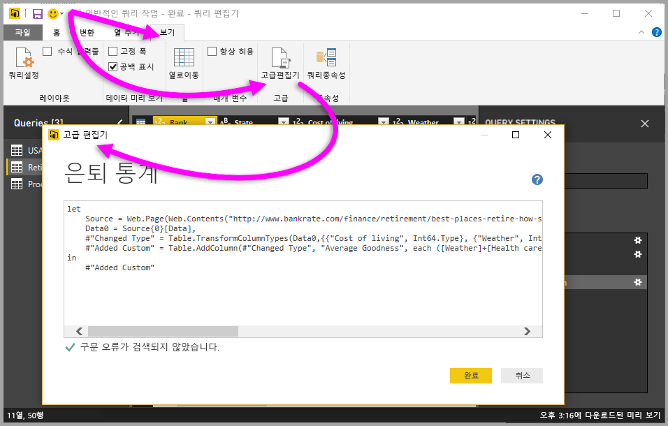

# Power BI Desktop에서 사용자 지정 열 추가
**Power BI Desktop**에서 **쿼리 편집기**를 사용하여 새 사용자 지정 데이터 열을 모델에 쉽게 추가할 수 있습니다. 사용자 지정 열을 정의하는 [M 수식](https://msdn.microsoft.com/library/mt270235.aspx)을 만들 수 있는 간편한 단추를 사용하여 사용자 지정 열을 만들거나 이름을 바꿀 수 있습니다. M 수식에는 [포괄적인 함수 참조 콘텐츠 집합](https://msdn.microsoft.com/library/mt779182.aspx)이 있습니다. 

사용자 지정 열을 만드는 작업은 **쿼리 편집기**에서 만든 쿼리에 대한 또 다른 **적용된 단계**입니다. 즉, 언제든지 변경하거나, 이전 또는 이후로 이동하거나, 수정할 수 있습니다.

## 쿼리 편집기를 사용하여 새 사용자 지정 열 추가
새 사용자 지정 열을 만들려면 **쿼리 편집기**를 실행합니다. **Power BI Desktop**의 **홈** 리본에서 **쿼리 편집**을 선택하여 이 작업을 수행할 수 있습니다.

**쿼리 편집기**를 실행하고 일부 데이터를 로드하고 나면 리본 메뉴에서 **열 추가** 탭을 선택한 후 **사용자 지정 열**을 선택하여 사용자 지정 열을 추가할 수 있습니다.

**사용자 지정 열 추가** 창이 표시되며, 이에 대해 다음 섹션에서 설명합니다.

## 사용자 지정 열 추가 창
**사용자 지정 열 추가** 창에서, 오른쪽 창에는 사용 가능한 필드 목록이 표시되고, 위쪽에는 사용자 지정 열의 이름이 표시되며(해당 텍스트 상자에 새 이름을 입력하기만 하면 이름을 바꿀 수 있음), [**M** 수식](https://msdn.microsoft.com/library/mt779182.aspx)이 표시됩니다. 이 수식은 오른쪽에서 필드를 삽입하고, 연산자를 추가하고, 그렇지 않으면 새 사용자 지정 열이 정의되는 수식을 작성하는 방법으로 만들거나 작성할 수 있습니다. 

## 사용자 지정 열의 수식 만들기
오른쪽에 있는 **사용 가능한 열:** 목록에서 필드를 선택하고 **<< 삽입**을 선택하여 사용자 지정 열 수식에 추가할 수 있습니다. 간단하게 목록에서 열을 두 번 클릭하여 추가할 수도 있습니다.

수식을 입력하고 열을 작성하면 구문 오류가 검색되는지 여부를 실시간으로(입력하는 대로) 알려주는 표시기가 창 아래쪽에 표시됩니다. 오류가 없으면 녹색 확인 표시가 표시됩니다.

그러나 구문에 몇 가지 오류가 있으면 검색된 오류와 함께 노란색 경고 아이콘과 수식에서 오류가 검색된 위치로 커서를 배치하는 링크가 표시됩니다.

**확인**을 선택하면 모델에 사용자 지정 열이 추가되고 쿼리의 **적용된 단계**에 **추가된 사용자 지정 항목** 단계가 추가됩니다.

**적용된 단계** 창에서 **추가된 사용자 지정 항목** 단계를 두 번 클릭하면 **사용자 지정 열 추가** 창이 다시 나타나는데, 사용자가 만든 사용자 지정 열 수식이 이미 로드되어 있어 필요에 따라 수정할 수 있습니다.

## 고급 편집기를 사용하여 사용자 지정 열 만들기
또한 **고급 편집기**를 사용하여 사용자 지정 열을 만들 수도 있습니다(그리고 이 경우 쿼리 단계 수정 가능). **쿼리 편집기**에서 **보기** 탭을 선택한 후 **고급 편집기**를 선택하면 **고급 편집기**가 표시됩니다.

**고급 편집기**는 쿼리에 대한 모든 권한을 제공합니다.

## 다음 단계
**쿼리 편집기**에 제공한 예제를 기준으로 열을 만드는 등 사용자 지정 열을 만드는 다른 방법도 있습니다. 예제로 사용자 지정 열을 만드는 방법에 자세한 내용은 다음 문서를 참조하세요.

* [Power BI Desktop에서 예제로 열 추가](desktop-add-column-from-example.md)
* [M 수식 언어 소개](https://msdn.microsoft.com/library/mt270235.aspx)
* [M 함수 참조](https://msdn.microsoft.com/library/mt779182.aspx)  

