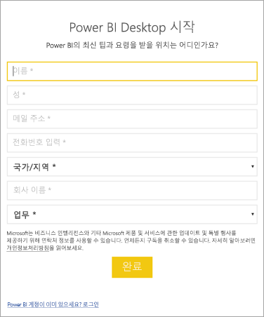

# <a name="how-administrators-can-manage-the-power-bi-desktop-sign-in-form"></a>관리자가 Power BI Desktop 로그인 양식을 관리하는 방법
Power BI Desktop이 처음 시작되면 로그인 양식이 표시됩니다. 계속하려면 정보를 입력하거나 Power BI에 로그인하십시오. 관리자는 레지스트리 키를 사용하여 이 양식을 관리 할 수 있습니다. 



관리자는 다음 레지스트리 키를 사용하여 로그인 양식을 사용하지 않도록 설정할 수 있습니다. 글로벌 정책을 사용하여 전체 조직에 밀어넣을 수도 있습니다.

```
Key: HKEY_LOCAL_MACHINE\SOFTWARE\Policies\Microsoft\Power BI Desktop
valueName: ShowLeadGenDialog
```

값 0은 대화 상자를 사용하지 않도록 설정합니다.

궁금한 점이 더 있나요? [Power BI 커뮤니티에 질문합니다.](http://community.powerbi.com/)

