# Power BI Desktop에서 집계 관리

Power BI에서 **집계**를 사용하면 이전에는 불가능했던 빅 데이터에 대한 대화형 분석을 수행할 수 있습니다. **집계**는 의사 결정에서 큰 데이터 세트의 잠금을 해제하는 비용을 크게 줄일 수 있습니다.

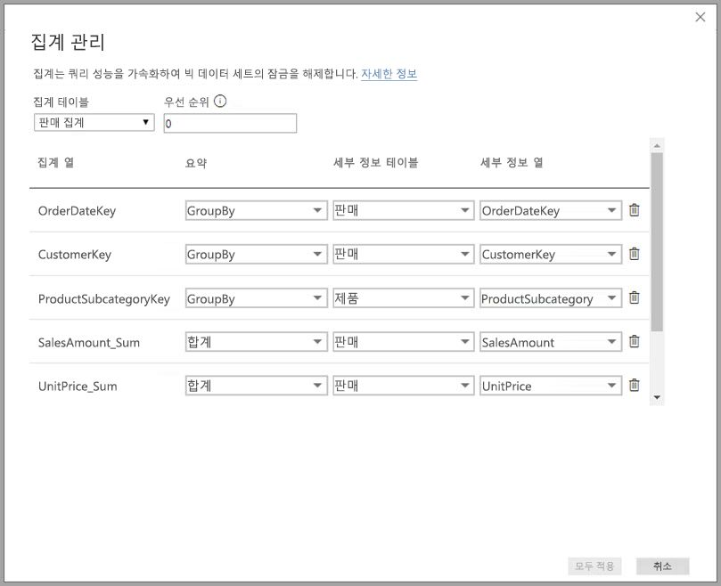

**집계**를 사용하는 이점은 다음과 같습니다.

* **빅 데이터에 대한 쿼리 성능** - 사용자가 Power BI 보고서에서 시각적 개체와 상호 작용할 때 DAX 쿼리가 데이터 세트에 제출됩니다. 세부 정보 수준에서 필요한 리소스의 일부를 사용하여 집계된 수준에서 데이터를 캐싱하여 쿼리 속도를 높입니다. 그렇지 않으면 가능하지 않았던 방법으로 빅 데이터의 잠금을 해제합니다.
* **데이터 새로 고침 최적화** - 집계된 수준에서 데이터를 캐싱하여 캐시 크기와 새로 고침 횟수를 줄입니다. 사용자가 데이터를 사용할 수 있게 하는 시간이 빨라집니다.
* **분산된 아키텍처 구현** - Power BI 메모리 내 캐시에서 집계된 쿼리를 효과적으로 처리할 수 있게 합니다. DirectQuery 모드에서 데이터 원본에 보내는 쿼리를 제한하여 동시성 제한 내에서 유지할 수 있게 합니다. 전달해야 하는 쿼리는 데이터 웨어하우스 및 빅 데이터 시스템에서 일반적으로 잘 처리하는 트랜잭션 수준 쿼리로 필터링되는 경향이 있습니다.

### 테이블 수준 스토리지
테이블 수준 스토리지는 일반적으로 집계 기능과 함께 사용됩니다. 자세한 내용은 [Power BI Desktop의 스토리지 모드](desktop-storage-mode.md) 문서를 참조하세요.

### 데이터 원본 유형
집계는 데이터 웨어하우스 및 데이터 마트, Hadoop 기반 빅 데이터 원본과 같은 차원 모델을 나타내는 데이터 원본과 함께 사용됩니다. 이 문서에서는 각 유형의 데이터 원본에 대한 Power BI의 일반적인 모델링 차이점에 대해 설명합니다.

모든 Power BI 가져오기 및 다차원이 아닌 DirectQuery 원본은 집계와 함께 작동합니다.

## 관계 기반 집계

관계를 기반으로 하는 **집계**는 일반적으로 차원 모델과 함께 사용됩니다. 데이터 웨어하우스 및 데이터 마트에서 제공하는 Power BI 데이터 세트는 차원 테이블과 팩트 테이블 간의 관계가 있는 별 모양 스키마 및 눈송이 스키마와 비슷합니다.

단일 데이터 원본으로 된 다음 모델을 고려합니다. 모든 테이블이 DirectQuery를 사용하여 시작한다고 가정해 보겠습니다. **Sales**(판매) 팩트 테이블에는 수십억 개의 행이 있습니다. 캐싱을 위해 **Sales**의 스토리지 모드를 **가져오기**로 설정하면 상당한 메모리 및 관리 오버헤드가 사용됩니다.

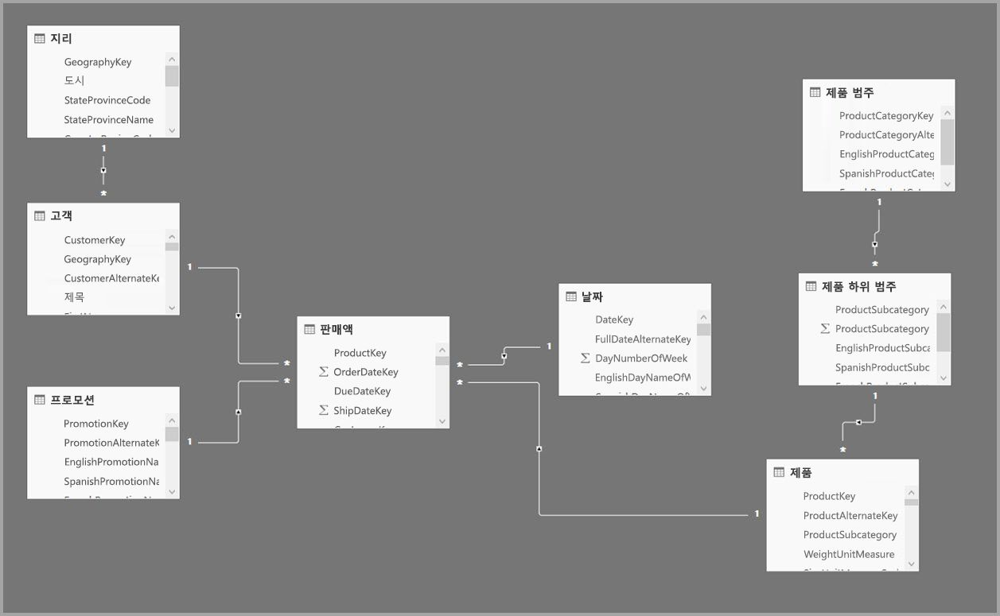

대신 **Sales Agg**(판매 집계) 테이블을 집계 테이블로 만듭니다. 세분성이 **Sales**보다 더 높으므로 행 수가 훨씬 적습니다. 행 수는 **CustomerKey**, **DateKey** 및 **ProductSubcategoryKey**별로 그룹화된 **SalesAmount**의 합계와 같아야 합니다. 수십억 개가 아닌 수백만 개의 행이 관리하기가 훨씬 더 쉬울 수 있습니다.

다음 차원 테이블은 비즈니스 가치가 높은 쿼리에 가장 일반적으로 사용되는 것으로 가정해 보겠습니다. 이러한 테이블은 *일 대 다*(또는 *다 대 일*) 관계를 사용하여 **Sales Agg**를 필터링할 수 있는 테이블입니다.

* 지리
* 고객
* 날짜
* 제품 하위 범주
* Product Category(제품 범주)

다음 이미지에서는 이 모델을 보여 줍니다.

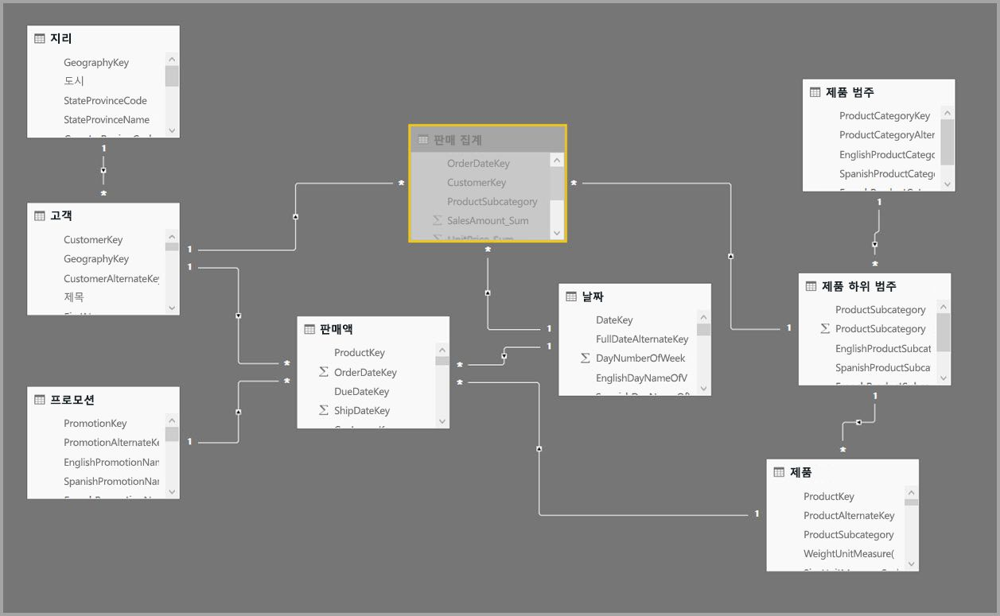

> [!NOTE]
> **Sales Agg** 테이블은 또 다른 테이블일 뿐이므로 다양한 방법으로 로드할 수 있는 유연성을 제공합니다. 예를 들어 집계는 ETL/ELT 프로세스를 사용하거나 테이블에 대한 [M 식](/powerquery-m/power-query-m-function-reference)을 통해 원본 데이터베이스에서 수행할 수 있습니다. [Power BI Premium에서 증분 새로 고침](service-premium-incremental-refresh.md)을 사용하는지 여부에 관계없이 [가져오기] 스토리지 모드를 사용하거나, [columnstore 인덱스](https://docs.microsoft.com/sql/relational-databases/indexes/columnstore-indexes-overview)를 사용하여 빠르게 쿼리하도록 최적화되는 DirectQuery를 사용할 수 있습니다. 이러한 유연성을 통해 쿼리 로드를 분산시키는 분산된 아키텍처를 가능하게 하여 병목 현상을 방지할 수 있습니다.

### 스토리지 모드 
여기서 사용하고 있는 예를 사용하여 계속 진행하겠습니다. 쿼리 속도를 높이기 위해 **Sales Agg**의 스토리지 모드를 **가져오기**로 설정했습니다.

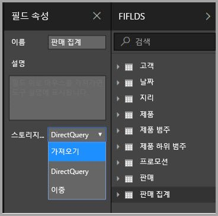

이렇게 하면 관련된 차원 테이블이 **이중** 스토리지 모드로 설정될 수 있음을 알려주는 다음 대화 상자가 표시됩니다. 

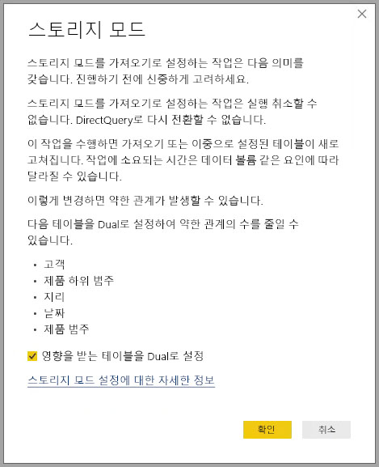

이 값을 **이중**으로 설정하면 관련 차원 테이블이 하위 쿼리에 따라 [가져오기] 또는 DirectQuery로 작동할 수 있습니다.

* **Sales Agg** 테이블(가져오기)의 메트릭을 집계하고 관련 이중 테이블의 특성별로 그룹화하는 쿼리는 메모리 내 캐시에서 반환할 수 있습니다.
* **Sales** 테이블(DirectQuery)의 메트릭을 집계하고 관련 이중 테이블의 특성별로 그룹화하는 쿼리는 DirectQuery 모드에서 반환할 수 있습니다. 그룹별 작업이 포함된 쿼리 논리는 원본 데이터베이스로 전달됩니다.

**이중** 스토리지 모드에 대한 자세한 내용은 [스토리지 모드](desktop-storage-mode.md) 문서를 참조하세요.

### 강력 관계 대 약한 관계
관계를 기반으로 하는 집계 적중은 강력한 관계가 필요합니다.

강력한 관계에는 두 테이블이 모두 ‘단일 원본’에 있는 다음과 같은 조합이 포함됩니다. 

| *다 쪽의 테이블 | ‘일’ 쪽의 테이블  |
| ------------- |----------------------| 
| 이중          | 이중                 | 
| 가져오기        | 가져오기 또는 이중       | 
| DirectQuery   | DirectQuery 또는 이중  | 

*cross-source* 관계가 강력한 것으로 간주되는 유일한 경우는 두 테이블이 모두 가져오는 경우입니다. 다 대 다 관계는 항상 약한 관계로 간주됩니다.

관계에 의존하지 않는 *cross-source* 집계 적중의 경우 아래의 group-by 열 기반 집계 섹션을 참조하세요.

### 집계 테이블에 주소를 지정할 수 없음
데이터 세트에 대한 읽기 전용 액세스 권한이 있는 사용자는 집계 테이블을 쿼리할 수 없습니다. 따라서 RLS와 함께 사용하는 경우 보안 문제가 방지됩니다. 소비자 및 쿼리는 집계 테이블이 아닌 세부 정보 테이블을 참조하며, 심지어는 집계 테이블이 있는지도 인식할 필요가 없습니다.

이와 같은 이유로 **Sales Agg** 테이블을 숨겨야 합니다. 숨겨지지 않은 경우 [집계 관리] 대화 상자에서 [모두 적용] 단추를 클릭하면 해당 테이블이 숨김으로 설정됩니다.

### 집계 관리 대화 상자
다음으로 집계를 정의합니다. 테이블을 마우스 오른쪽 단추로 클릭하여 **Sales Agg** 테이블에 대한 **집계 관리** 상황에 맞는 메뉴를 선택합니다.

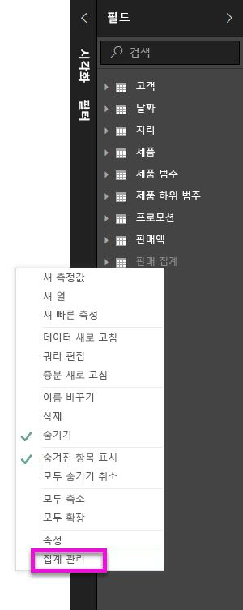

**집계 관리** 대화 상자가 표시됩니다. **Sales Agg** 테이블의 각 열에 대한 행을 표시합니다. 여기서는 집계 동작을 지정할 수 있습니다. **Sales** 테이블을 참조하는 Power BI 데이터 세트에 제출된 쿼리는 내부적으로 **Sales Agg** 테이블로 리디렉션됩니다. 데이터 세트의 소비자는 **Sales Agg** 테이블이 있는지조차 인식할 필요가 없습니다.

다음 표에는 **Sales Agg** 테이블에 대한 집계가 나와 있습니다.

#### 요약 함수

[요약] 드롭다운에서 선택할 수 있는 값은 다음과 같습니다.
* 개수
* GroupBy
* Max
* 최소
* 합계
* 테이블 행 개수

#### 유효성 검사

대화 상자에서 적용되는 주목할 만한 유효성 검사는 다음과 같습니다.

* 선택한 세부 정보 열에는 Count 및 테이블 행 수 계산 요약 함수를 제외하고는 집계 열과 동일한 데이터 형식이 있어야 합니다. Count 및 테이블 행 수 계산은 정수 집계 열에 대해서만 제공되며, 일치하는 데이터 형식은 필요하지 않습니다.
* 셋 이상의 테이블이 포함된 연결 집계는 허용되지 않습니다. 예를 들어 **테이블 C**를 참조하는 집계가 있는 **테이블 B**를 참조하는 **테이블 A**에는 집계를 설정할 수 없습니다.
* 두 항목에서 동일한 요약 함수를 사용하고 동일한 세부 정보 테이블/열을 참조하는 중복 집계는 허용되지 않습니다.
* 세부 정보 테이블은 [가져오기]가 아닌 DirectQuery여야 합니다.

대부분의 이러한 유효성 검사는 다음 이미지와 같이 드롭다운 값을 사용하지 않도록 설정하고 도구 설명에 설명 텍스트를 표시함으로써 적용됩니다.

### Group By 열

이 예에서 세 개의 GroupBy 항목은 선택 사항입니다. 집계 동작에는 영향을 미치지 않습니다(다음 이미지에 표시된 DISTINCTCOUNT 예제 쿼리 제외). 기본적으로 가독성을 위해 포함됩니다. 이러한 GroupBy 항목이 없는 경우에도 집계는 관계를 기반으로 하여 계속 적중합니다. 이는 관계가 없는 집계를 사용하는 동작과 다르며, 이 문서의 뒷부분에 나오는 빅 데이터 예제에서 다루고 있습니다.

### 비활성 관계
비활성 관계에서 사용되는 외래 키 열로 그룹화하고 집계 적중에 USERELATIONSHIP 함수를 사용하는 기능은 지원되지 않습니다.

### 쿼리에서 집계가 적중되거나 누락되었는지 검색

SQL 프로파일러를 사용하여 메모리 내 캐시(스토리지 엔진) 또는 DirectQuery(데이터 원본으로 푸시)에서 쿼리가 반환되는지 여부를 검색하는 방법에 대한 자세한 내용은 [스토리지 모드](desktop-storage-mode.md) 문서를 참조하세요. 이 프로세스를 사용하여 집계가 적중되는지 여부도 검색할 수 있습니다.

또한 SQL Profiler에서 다음과 같은 확장 이벤트가 제공됩니다.

    Query Processing\Aggregate Table Rewrite Query

다음 JSON 코드 조각에서는 집계가 사용될 때의 이벤트 출력 예를 보여 줍니다.

* **matchingResult**는 집계가 하위 쿼리에 사용되었음을 나타냅니다.
* **dataRequest**는 하위 쿼리에서 사용된 group-by 열과 집계된 열을 보여 줍니다.
* **mapping**은 매핑된 집계 테이블의 열을 보여 줍니다.

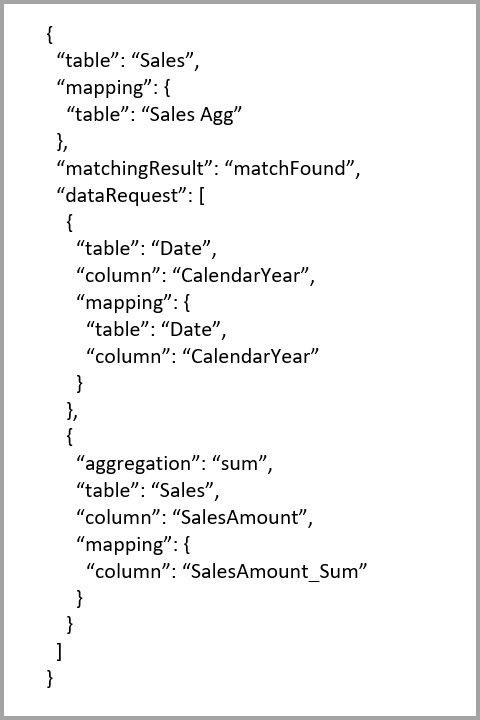

### 쿼리 예제
*Date* 테이블의 열이 집계에 도달할 수 있는 세분성을 가지기 때문에 다음 쿼리는 집계에 도달합니다. **SalesAmount**에 대한 **합계** 집계가 사용됩니다.

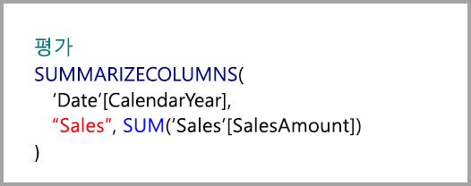

다음 쿼리는 집계에 적중하지 않습니다. **SalesAmount**의 합계를 요청했지만 **Product** 테이블의 열에서 그룹화 기준 작업을 수행하며, 집계를 적중할 수 있는 세분성이 아닙니다. 모델의 관계를 관찰하면 제품 하위 범주에 여러 개의 **Product** 행이 있을 수 있습니다. 쿼리는 집계할 제품을 결정할 수 없습니다. 이 경우 쿼리는 DirectQuery로 되돌아가고 SQL 쿼리를 데이터 원본에 제출합니다.

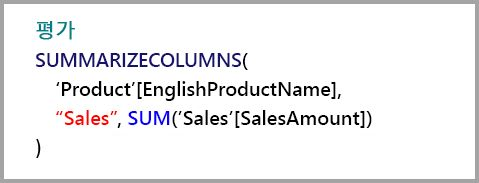

집계는 단순 합계를 수행하는 간단한 계산만을 위한 것이 아닙니다. 복잡한 계산에도 활용할 수 있습니다. 개념적으로 복잡한 계산은 각 SUM, MIN, MAX 및 COUNT에 대한 하위 쿼리로 분할되고, 집계에 적중할 수 있는지 판단하기 위해 각 하위 쿼리가 평가됩니다. 이 논리는 쿼리 계획 최적화로 인해 모든 경우에 적용되는 것은 아니지만 일반적으로 적용해야 합니다. 다음 예제는 집계에 적중합니다.

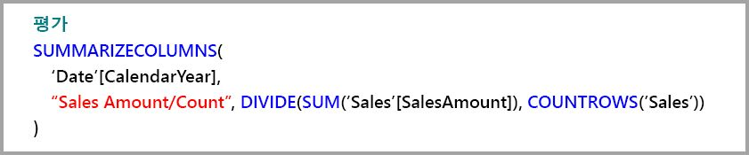

COUNTROWS 함수는 집계를 통해 이점을 얻을 수 있습니다. **Sales** 테이블에 대해 정의된 테이블 행 수 **계산** 집계가 있으므로 다음 쿼리는 집계에 적중합니다.

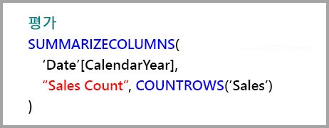

AVERAGE 함수는 집계를 통해 이점을 얻을 수 있습니다. AVERAGE가 내부적으로 COUNT로 나눈 SUM으로 접혀 있으므로 다음 쿼리는 집계에 적중합니다. **UnitPrice** 열에 SUM 및 COUNT에 대해 정의된 집계가 있으므로 집계에 적중합니다.

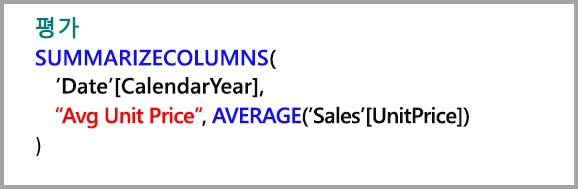

경우에 따라 DISTINCTCOUNT 함수는 집계를 통해 이점을 얻을 수 있습니다. 집계 테이블에서 **CustomerKey**의 고유성을 유지하는 **CustomerKey**에 대한 GroupBy 항목이 있으므로 다음 쿼리는 집계에 적중합니다. 이 기술은 여전히 약 200-500만 개의 고유 값이 쿼리 성능에 영향을 줄 수 있는 성능 임계값의 영향을 받습니다. 그러나 세부 정보 테이블에 수십억 개의 행이 있고 열에 200-500만 개의 고유 값이 있는 시나리오에서 유용할 수 있습니다. 이 경우 메모리에 캐시된 경우에도 수십억 개의 행이 있는 테이블을 검사하는 것보다 고유 개수 계산이 더 빨리 수행될 수 있습니다.

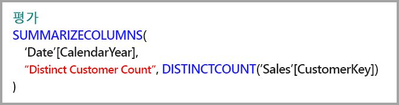

### RLS
RLS(행 수준 보안) 식이 제대로 작동하려면 집계 테이블과 세부 정보 테이블을 둘 다 필터링해야 합니다. 예제를 계속 살펴보면, **Geography** 테이블이 **Sales** 테이블 및 **Sales Agg** 테이블에 대한 관계의 필터링 쪽에 있으므로 Geography 테이블에서 RLS 식이 작동합니다. 집계 테이블에 도달하는 쿼리와 도달하지 않는 쿼리에서 RLS가 성공적으로 적용됩니다.

**Product** 테이블의 RLS 식은 **Sales** 테이블만 필터링하며 **Sales Agg** 테이블은 필터링하지 않습니다. 이 방법은 권장되지 않습니다. 이 역할을 사용하여 데이터 세트에 액세스하는 사용자가 제출한 쿼리는 집계 적중을 활용하지 않습니다. 집계 테이블은 세부 정보 테이블에 있는 동일한 데이터의 다른 표현이기 때문에 RLS 필터를 적용할 수 없으므로 집계 테이블의 쿼리에 응답하는 것은 안전하지 않습니다.

**Sales Agg** 테이블 자체의 RLS 식은 집계 테이블만 필터링하고 세부 정보 테이블을 필터링하지 않습니다. 이 기능은 허용되지 않습니다.

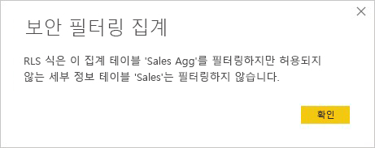

## group-by 열 기반 집계 

Hadoop 기반 빅 데이터 모델에는 차원 모델과 다른 특징이 있습니다. 큰 테이블 간의 조인을 방지하기 위해 관계에 의존하지 않는 경우가 많습니다. 대신 차원 특성이 팩트 테이블로 비정규화되는 경우가 많습니다. 이러한 빅 데이터 모델은 group-by 열을 기반으로 하는 **집계**를 사용하여 대화형 분석을 위해 잠금을 해제할 수 있습니다.

다음 표에는 집계할 **Movement**(이동) 숫자 열이 있습니다. 다른 모든 열은 그룹화할 특성입니다. 그룹화에는 IoT 데이터와 엄청난 수의 행이 포함됩니다. 스토리지 모드는 DirectQuery입니다. 전체 데이터 세트에 걸쳐 집계되는 데이터 원본에 대한 쿼리의 경우 엄청난 양으로 인해 속도가 느립니다.

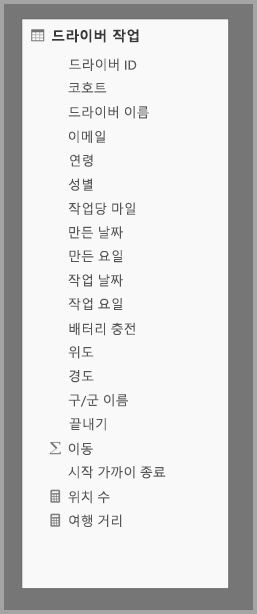

이 데이터 세트에서 대화형 분석을 사용하려면 대부분의 특성을 그룹화하지만 경도 및 위도와 같은 높은 카디널리티 특성은 제외하는 집계 테이블을 추가합니다. 이렇게 하면 행 수가 크게 줄어들고 메모리 내 캐시에 쉽게 맞출 수 있을 만큼 작습니다. **Driver Activity Agg**(운전 기사 활동 집계)의 스토리지 모드는 [가져오기]입니다.

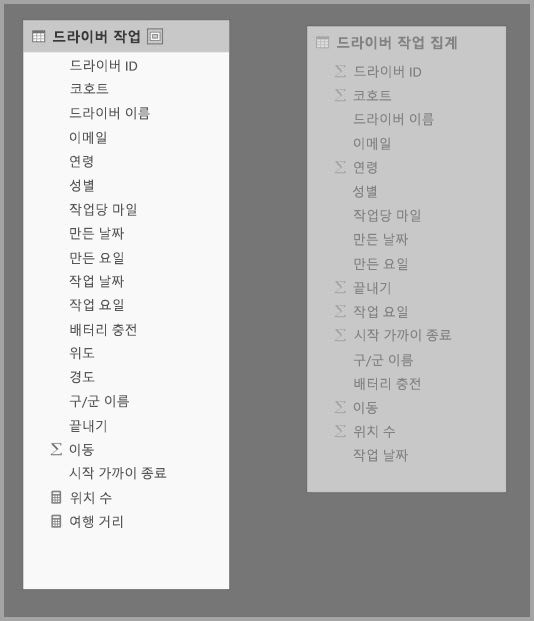

다음으로, **집계 관리** 대화 상자에서 집계 매핑을 정의합니다. **Driver Activity Agg** 테이블의 각 열에 대한 행을 표시합니다. 여기서는 집계 동작을 지정할 수 있습니다.

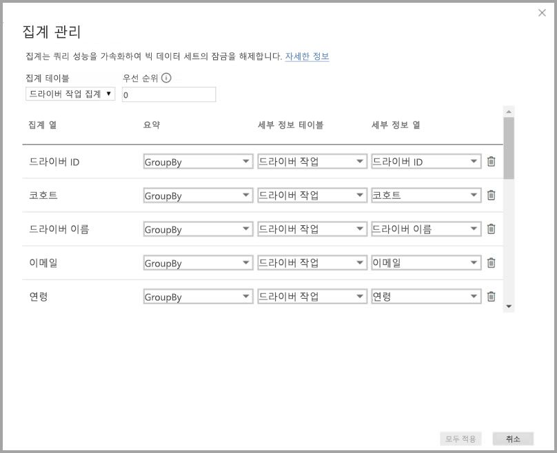

다음 표에는 **Driver Activity Agg** 테이블에 대한 집계가 나와 있습니다.

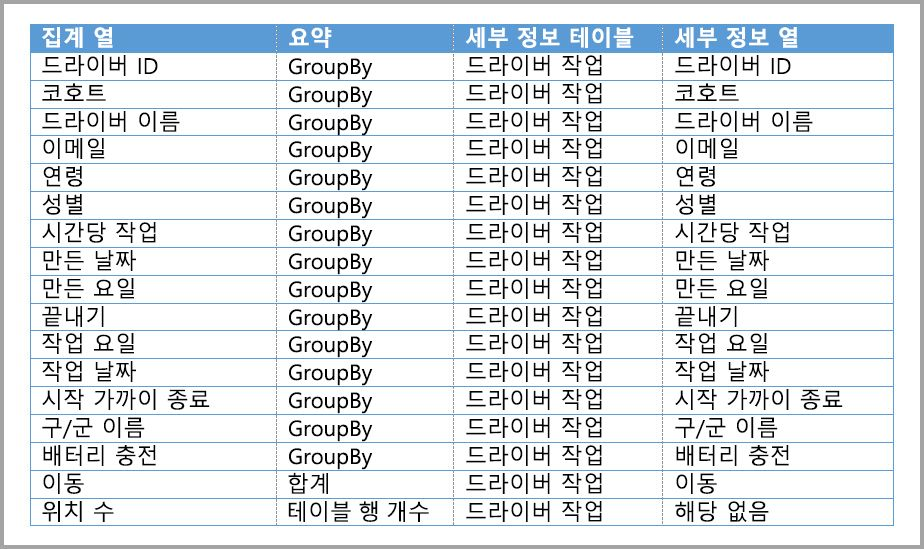

### Group By 열

이 예에서 **GroupBy** 항목은 **선택 사항이 아닙니다**. 이러한 항목이 없으면 집계에 적중하지 않습니다. 이는 관계를 기반으로 하는 집계를 사용하는 동작과 다르며, 이 문서의 앞부분에서 제공한 차원 모델 예제에서 다루고 있습니다.

### 쿼리 예제

**Activity Date**(활동 날짜) 열이 집계 테이블에 포함되어 있으므로 다음 쿼리는 집계에 적중합니다. 테이블 행 수 계산 집계는 COUNTROWS 함수에서 사용됩니다.

특히 팩트 테이블에 필터 특성이 포함된 모델의 경우 테이블 행 수 계산 집계를 사용하는 것이 좋습니다. 사용자가 명시적으로 요청하지 않은 경우 Power BI에서 COUNTROWS를 사용하여 데이터 세트에 쿼리를 제출할 수 있습니다. 예를 들어 필터 대화 상자에서는 각 값에 대한 행 수를 표시합니다.

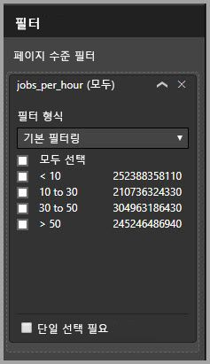

### RLS

RLS 식이 집계 테이블 또는 세부 정보 테이블을 필터링하거나 둘 다 필터링하는지에 관한 관계를 기반으로 하는 위에서 설명한 집계에 대한 동일한 RLS 규칙이 Group By 열을 기반으로 하는 집계에도 적용됩니다. 집계 테이블의 모든 Group By 열은 세부 정보 테이블에서 처리되므로 예제에서 **Driver Activity** 테이블에 적용된 RLS 식을 사용하여 **Driver Activity Agg** 테이블을 필터링할 수 있습니다. 반면, **Driver Activity Agg** 테이블의 RLS 필터는 허용되지 않으므로 **Driver Activity** 테이블에 적용할 수 없습니다.

## 집계 우선 순위

집계 우선 순위를 사용하면 단일 하위 쿼리에서 여러 집계 테이블을 고려할 수 있습니다.

다음 예제를 살펴보겠습니다. 여러 DirectQuery 원본이 포함된 [복합 모델](desktop-composite-models.md)입니다.

* group-by 특성이 적고 낮은 카디널리티이므로 **Driver Activity Agg2** 가져오기 테이블의 세분성은 높습니다. 행 수는 수천 개만큼 적을 수 있으므로 메모리 내 캐시에 쉽게 맞출 수 있습니다. 이러한 특성은 고급 프로필의 경영진 대시보드에서 사용되므로 이러한 특성을 참조하는 쿼리는 최대한 빨리 처리해야 합니다.
* **Driver Activity Agg** 테이블은 DirectQuery 모드의 중간 집계 테이블입니다. Azure SQL DW에 10억 개가 넘는 행이 포함되며, columnstore 인덱스를 사용하여 원본에서 최적화됩니다.
* **Driver Activity** 테이블은 DirectQuery이며, 빅 데이터 시스템에서 제공하는 1조 개가 넘는 IoT 데이터 행을 포함합니다. 제어된 필터 컨텍스트에서 개별 IoT 판독 값을 볼 수 있도록 드릴스루 쿼리를 제공합니다.

> [!NOTE]
> 세부 정보 테이블에 대한 다른 데이터 원본을 사용하는 DirectQuery 집계 테이블은 집계 테이블이 SQL Server, Azure SQL 또는 Azure SQL DW 원본에서 가져온 경우에만 지원됩니다.

이 모델의 메모리 공간은 비교적 작지만 큰 데이터 세트의 잠금을 해제합니다. 강점을 기반으로 하여 활용하는 아키텍처의 여러 구성 요소에 걸쳐 쿼리 로드를 분산시키므로 분산된 아키텍처를 나타냅니다.

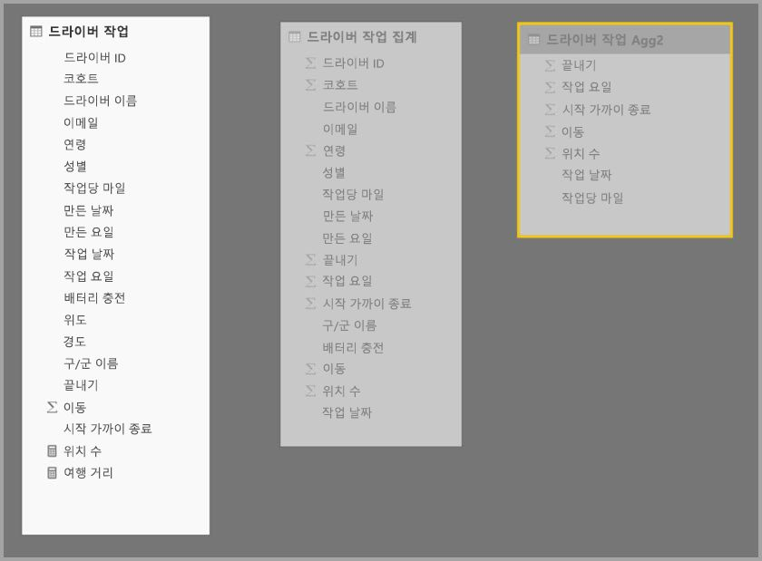

**Driver Activity Agg2**에 대한 **집계 관리** 대화 상자에서 *우선 순위* 필드가 **Driver Activity Agg**의 우선 순위보다 높은 10임을 보여 줍니다. 즉 집계를 사용하는 쿼리에서 먼저 고려된다는 의미입니다. **Driver Activity Agg2**에서 응답할 수 있는 세분성이 아닌 하위 쿼리는 **Driver Activity Agg**를 대신 고려합니다. 집계 테이블 중 하나에서 응답할 수 없는 세부 정보 쿼리는 **Driver Activity**로 지정됩니다.

연결된 집계가 허용되지 않으므로 **세부 정보 테이블** 열에 지정된 테이블은 **Driver Activity Agg**가 아니라 **Driver Activity**입니다(이 문서 앞부분의 [유효성 검사](#validations) 참조).

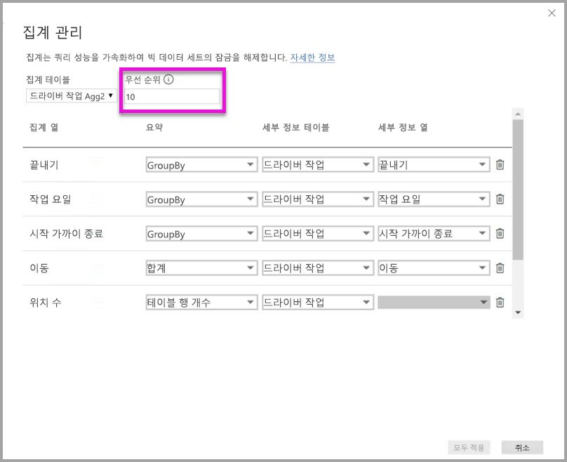

다음 표에는 **Driver Activity Agg2** 테이블에 대한 집계가 나와 있습니다.

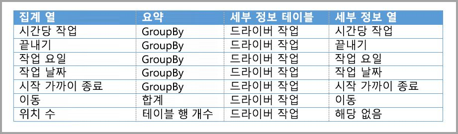

## 관계와 결합된 group-by 열 기반 집계

이 문서의 앞부분에서 설명한 집계에 대한 두 가지 기술을 결합할 수도 있습니다. 관계를 기반으로 하는 **집계**에서는 비정규화된 차원 테이블을 여러 테이블로 분할해야 할 수 있습니다. 특정 차원 테이블에 대해 비용이 많이 들거나 적절하지 않은 경우 필요한 특성을 다른 차원에 사용되는 특정 차원과 관계에 대한 집계 테이블에 복제할 수 있습니다.

다음 모델은 **Sales Agg** 테이블에서 *Month*(월), *Month*(분기), *Semester*(학기) 및 *Year*(연도)를 복제합니다. **Sales Agg**와 **Date**(날짜) 테이블 간에는 관계가 없습니다. **Customer**(고객) 및 **제품 하위 범주**에 대한 관계가 있습니다. **Sales Agg**의 스토리지 모드는 [가져오기]입니다.

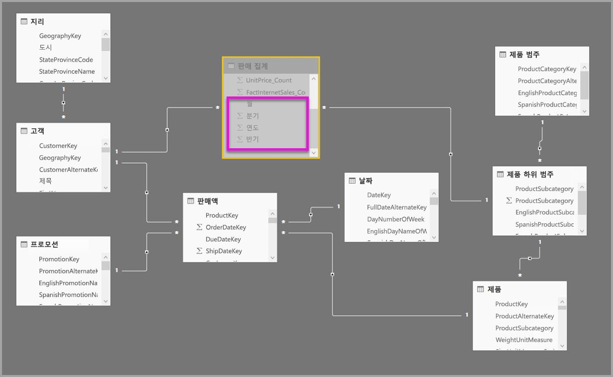

다음 표에는 **Sales Agg** 테이블에 대한 **집계 관리** 대화 상자에 설정된 항목이 나와 있습니다. **Date**가 세부 정보 테이블인 GroupBy 항목은 Date 특성별로 그룹화된 쿼리에 대한 집계에 강제로 적중해야 합니다. 앞의 예제와 같이 관계가 있으므로 CustomerKey 및 ProductSubcategoryKey에 대한 GroupBy 항목은 집계 적중 횟수에 영향을 주지 않습니다(또 다시 DISTINCTCOUNT 제외).

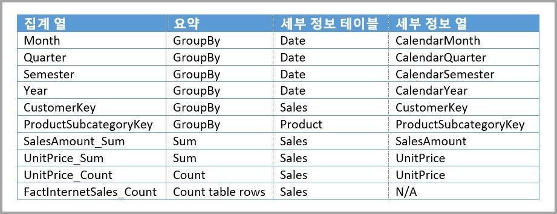

### 쿼리 예제

집계 테이블에서 CalendarMonth를 포함하고 일 대 다 관계를 통해 CategoryName에 액세스할 수 있으므로 다음 쿼리는 집계에 적중합니다. **SalesAmount**에 대한 합계 집계가 사용됩니다.

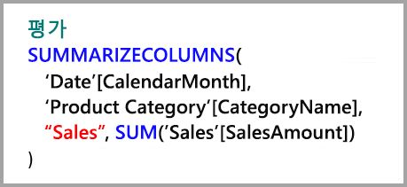

집계 테이블에서 CalendarDay를 포함하지 않으므로 다음 쿼리는 집계에 적중하지 않습니다.

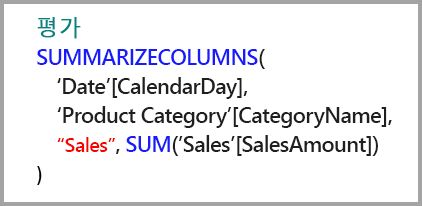

집계 테이블에서 포함하지 않는 CalendarDay 값의 테이블을 DATESYTD 함수에서 생성하므로 다음 시간 인텔리전스 쿼리는 집계에 적중하지 않습니다.

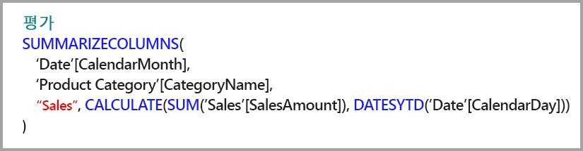

## 캐시는 동기화되어야 합니다.

메모리 내 캐시가 원본 데이터와 동기화된 상태로 유지되지 않으면 DirectQuery와 가져오기 및/또는 이중 스토리지 모드를 결합한 **집계**에서 다른 데이터가 반환될 수 있습니다. 예를 들어 쿼리 실행은 캐시된 값과 일치하도록 DirectQuery 결과를 필터링하여 데이터 문제를 마스크하려고 시도하지 않습니다. 이러한 기능은 성능 최적화이며 비즈니스 요구 사항을 충족하는 능력을 손상시키지 않는 방식으로만 사용해야 합니다. 사용자는 데이터 흐름을 알고 있어야 하므로 이에 맞게 적절하게 설계해야 합니다. 필요한 경우 원본에서 이러한 문제를 처리하는 기술이 확립되어 있습니다.

## 다음 단계

다음 문서에서는 복합 모델을 자세히 설명하고 DirectQuery도 자세히 설명합니다.

* [Power BI Desktop의 복합 모델](desktop-composite-models.md)
* [Power BI Desktop의 다 대 다 관계](desktop-many-to-many-relationships.md)
* [Power BI Desktop의 스토리지 모드](desktop-storage-mode.md)

DirectQuery 문서:

* [Power BI의 DirectQuery 사용](desktop-directquery-about.md)
* [Power BI의 DirectQuery에서 지원하는 데이터 원본](desktop-directquery-data-sources.md)
