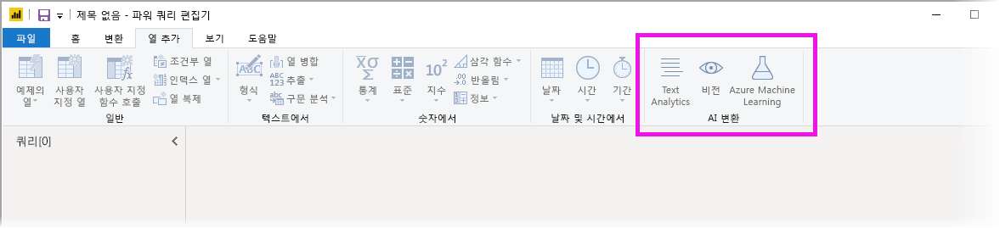
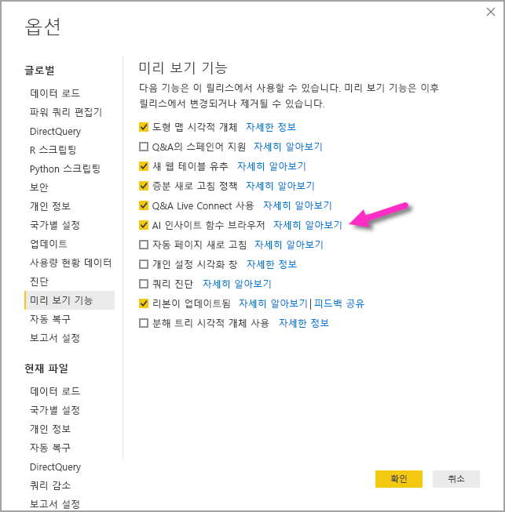
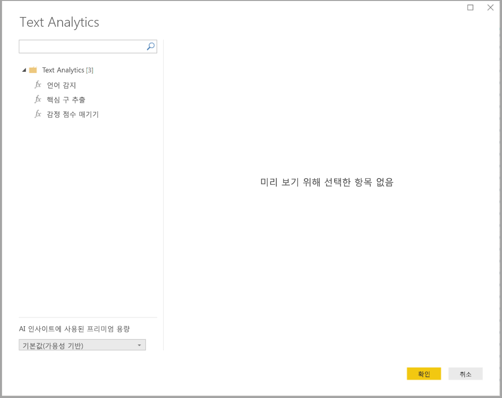
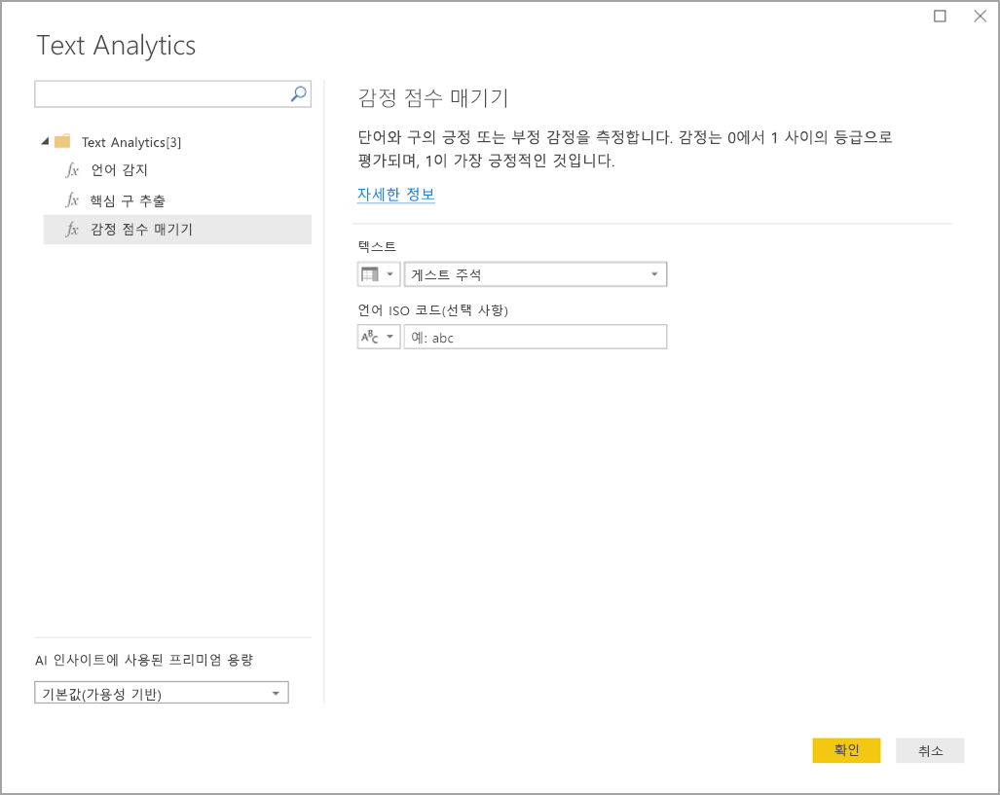
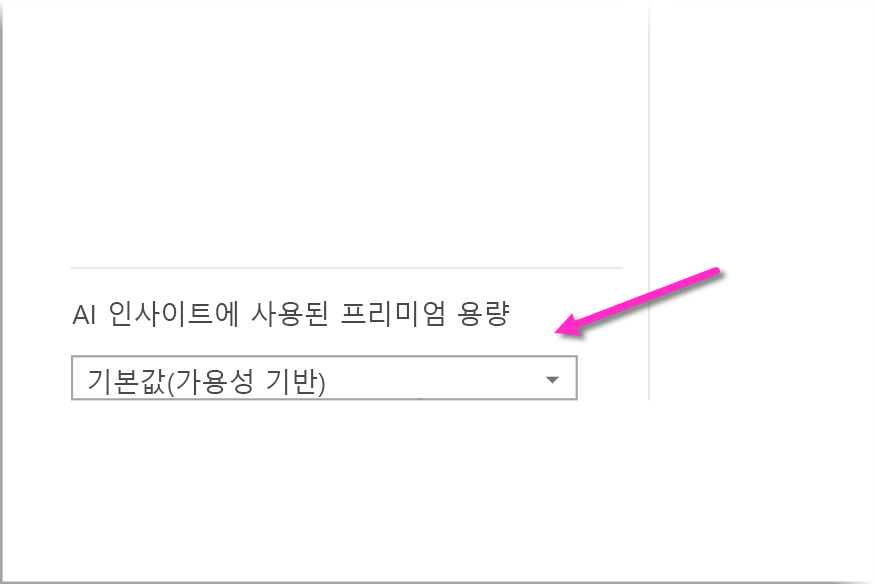
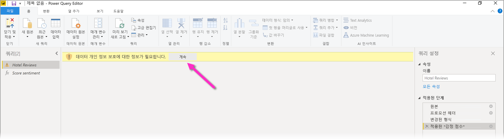
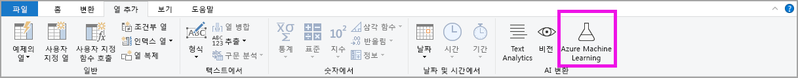
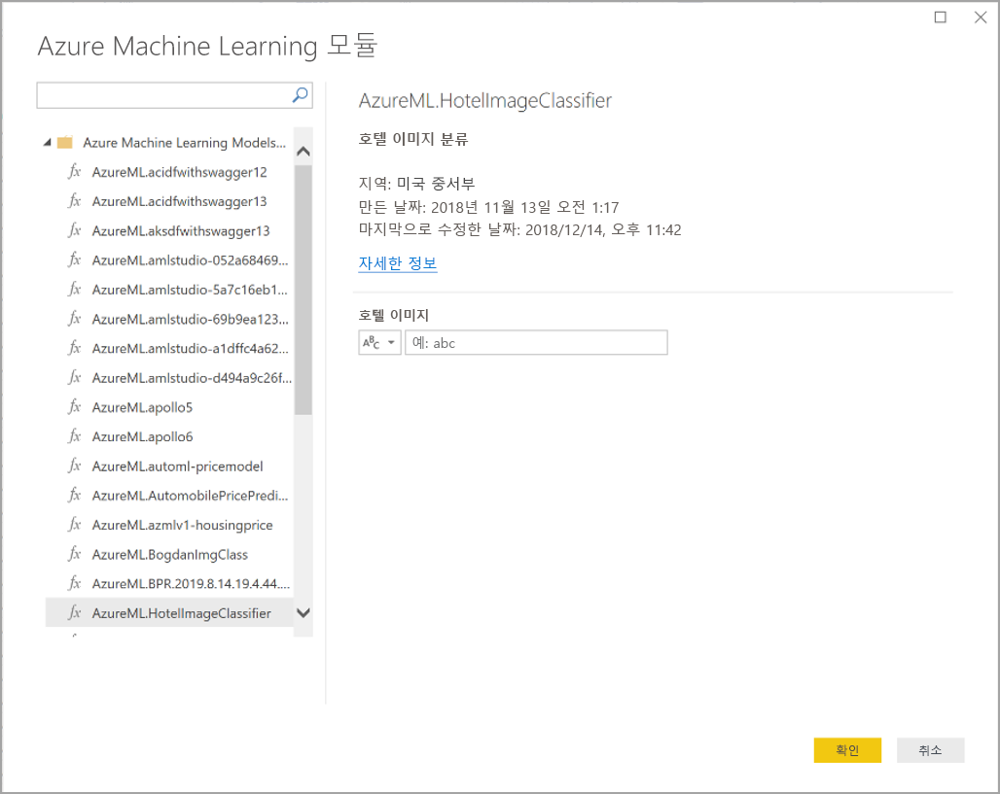

# Power BI Desktop에서 AI 인사이트 사용(미리 보기)

Power BI에서 AI 인사이트를 사용하여 데이터 준비 작업을 개선하는 미리 학습된 기계 학습 모델의 모음에 액세스할 수 있습니다. AI 인사이트는 **파워 쿼리 편집기**에서 액세스하며, 연결된 기능 및 함수는 **파워 쿼리 편집기**의 **홈** 및 **열 추가** 탭을 통해 액세스합니다. 

이 문서에서는 모두 Azure Cognitive Services에서 제공하는 Text Analytics 및 Vision 기능용 함수에 대해 설명합니다. 또한 이 문서에는 Power BI에서 사용할 수 있는 Azure Machine Learning의 사용자 지정 함수를 설명하는 섹션이 있습니다.

## AI 인사이트를 사용하도록 설정하는 방법

Power BI의 AI 인사이트는 미리 보기 기능이며 사용하도록 설정해야 합니다. 사용하도록 설정하려면 **파일 > 옵션 및 설정> 옵션**을 차례로 선택한 다음, 왼쪽 열에서 **미리 보기 기능**을 선택합니다. 오른쪽 창에는 **AI 인사이트 함수 브라우저** 선택 항목이 있습니다. **AI 인사이트 함수 브라우저** 옆의 확인란을 선택하여 미리 보기 기능을 사용하도록 설정합니다. 미리 보기 기능 변경 내용을 적용하려면 Power BI Desktop을 다시 시작해야 합니다.

## Text Analytics 및 Vision 사용

Power BI의 Text Analytics 및 Vision을 사용하면 [Azure Cognitive Services](https://azure.microsoft.com/services/cognitive-services/)가 다양한 알고리즘을 적용하여 파워 쿼리에서 데이터를 보강할 수 있습니다.

현재 지원되는 서비스는 다음과 같습니다.

* [감정 분석](https://docs.microsoft.com/azure/cognitive-services/text-analytics/how-tos/text-analytics-how-to-sentiment-analysis)
* [핵심 구 추출](https://docs.microsoft.com/azure/cognitive-services/text-analytics/how-tos/text-analytics-how-to-keyword-extraction)
* [언어 감지](https://docs.microsoft.com/azure/cognitive-services/text-analytics/how-tos/text-analytics-how-to-language-detection)
* [이미지 태그 지정](https://docs.microsoft.com/azure/cognitive-services/computer-vision/concept-tagging-images) 

변환은 Power BI 서비스에서 실행되므로 Azure Cognitive Services 구독이 필요하지 않습니다. 

> [!IMPORTANT]
> 
> Text Analytics 또는 Vision 기능을 사용하려면 Power BI Premium이 필요합니다.

### 프리미엄 용량에서 Text Analytics 및 Vision을 사용하도록 설정

Cognitive Services는 프리미엄 용량 노드 EM2, A2 또는 P1 이상에서 지원됩니다. 용량에 대한 별도의 AI 워크로드가 Cognitive Services를 실행하는 데 사용됩니다. 이러한 기능의 공개 미리 보기 기간(2019년 6월 이전)에는 기본적으로 이 워크로드가 사용 안 함으로 설정되어 있습니다. Power BI에서 Cognitive Services를 사용하려면 먼저 관리 포털의 **용량 설정**에서 AI 워크로드를 사용하도록 설정해야 합니다. **워크로드** 섹션에서 **AI 워크로드**를 설정하고 이 워크로드가 사용하도록 할 최대 메모리 양을 정의할 수 있습니다. 권장되는 메모리 제한율은 20%입니다. 이 제한을 초과하면 쿼리 속도가 저하됩니다.

### 사용 가능한 함수

이 섹션에서는 Power BI에서 사용할 수 있는 Cognitive Services의 함수를 설명합니다.

#### 언어 감지

언어 감지 함수는 텍스트 입력을 평가하고 각 필드의 언어 이름 및 ISO 식별자를 반환합니다. 이 함수는 언어가 알려지지 않은, 임의 텍스트를 수집하는 데이터 열에 유용합니다. 이 함수에는 텍스트 형식의 데이터가 입력으로 사용되어야 합니다.

Text Analytics에서는 최대 120개의 언어를 인식합니다. 자세한 내용은 [지원되는 언어](https://docs.microsoft.com/azure/cognitive-services/text-analytics/text-analytics-supported-languages)를 참조하세요.

#### 핵심 구 추출

**핵심 구 추출** 함수는 비구조적 텍스트를 평가하여 각 텍스트 필드의 핵심 구 목록을 반환합니다. 함수는 입력으로 텍스트 필드가 있어야 하며 **Culture info**에 대한 선택적 입력을 허용합니다.

핵심 구 추출은 작업하도록 제공하는 텍스트 청크의 크기가 더 큰 경우 가장 효과적으로 이루어집니다. 이와는 대조적으로 감정 분석은 텍스트 블록 크기가 작을수록 더 잘 수행됩니다. 두 작업 모두에서 최상의 결과를 얻으려면 적절하게 입력을 재구성하는 것을 고려해보세요.

#### 감정 점수 매기기

**감정 점수 매기기** 함수는 텍스트 입력을 평가하고 각 문서에 대해 0(부정)에서 1(긍정)까지의 감정 점수를 반환합니다. 이 함수는 소셜 미디어, 고객 리뷰 및 토론 포럼에서 긍정적 감정과 부정적 감정을 감지하는 데 유용합니다.

Text Analytics는 기계 학습 분류 알고리즘을 사용하여 0에서 1 사이의 감정 점수를 생성합니다. 1에 가까운 점수는 긍정적 감정을 나타내고, 0에 가까운 점수는 부정적 감정을 나타냅니다. 모델은 감정 연결을 사용하여 광범위한 텍스트 본문을 미리 학습한 상태입니다. 현재, 고유한 학습 데이터를 제공하는 것은 불가능합니다. 모델은 텍스트 분석 중에 텍스트 처리, 품사 분석, 단어 배치, 단어 연결 등이 조합된 다양한 기술을 사용합니다. 알고리즘에 대한 자세한 내용은 [Text Analytics 소개](https://blogs.technet.microsoft.com/machinelearning/2015/04/08/introducing-text-analytics-in-the-azure-ml-marketplace/)를 참조하세요.

감정 분석은 전체 입력 필드에서 수행되는 반면, 감정 추출은 텍스트의 특정 엔터티에 대해 수행됩니다. 실제로 문서에 크기가 큰 텍스트 블록이 아닌, 한 개 또는 두 개의 문장이 포함된 경우 점수 매기기 정확도가 향상되는 경향이 있습니다. 객관성 평가 단계에서는 하나의 입력 필드 전체가 객관적인지 감정이 포함되어 있는지를 모델이 결정합니다. 대부분 객관적인 입력 필드는 감정 감지 단계로 진행되지 않으며 추가 처리 없이 .50 점수를 받습니다. 파이프라인에서 계속 진행되는 입력 필드는 입력 필드에서 감지된 감정의 정도에 따라 .50을 초과 또는 미달하는 점수를 다음 단계에서 생성합니다.

현재는 영어, 독일어, 스페인어 및 프랑스어가 감정 분석에서 지원됩니다. 다른 언어는 미리 보기 상태입니다. 자세한 내용은 [지원되는 언어](https://docs.microsoft.com/azure/cognitive-services/text-analytics/text-analytics-supported-languages)를 참조하세요.

#### 이미지 태그 지정

**이미지 태그 지정** 함수는 2,000개가 넘는 인식할 수 있는 사물, 생물, 경치 및 동작을 기준으로 태그를 반환합니다. 태그가 모호하거나 누구나 알 수 있는 것이 아닌 경우 출력은 알려진 설정의 컨텍스트에서 태그의 의미를 명확히 설명하는 *힌트*를 제공합니다. 태그는 분류로 구성되지 않으며 상속 계층 구조가 존재하지 않습니다. 콘텐츠 태그 컬렉션은 완전한 문장 형식의, 사람이 읽을 수 있는 언어로 표시되는 이미지 *설명*의 토대를 구성합니다.

이미지를 업로드하거나 이미지 URL을 지정하면 Computer Vision 알고리즘이 이미지에서 식별된 사물, 생물 및 동작을 기준으로 태그를 출력합니다. 태그 지정은 주요 대상(예: 전경에 있는 인물)으로 제한되지 않으며 설정(실내 또는 옥외), 가구, 도구, 식물, 동물, 액세서리, 장치 등도 포함합니다.

이 함수는 입력으로 이미지 URL 또는 base-64 필드가 필요합니다. 현재, 이미지 태그 지정에서는 영어, 스페인어, 일본어, 포르투갈어 및 중국어 간체가 지원됩니다. 자세한 내용은 [지원되는 언어](https://docs.microsoft.com/rest/api/cognitiveservices/computervision/tagimage/tagimage#uri-parameters)를 참조하세요.

### 파워 쿼리에서 Text Analytics 또는 Vision 함수 호출

Text Analytics 또는 Vision 함수를 사용하여 데이터를 보강하려면 **파워 쿼리 편집기**를 엽니다. 이 예제에서는 텍스트의 감정 점수 매기기를 안내합니다. 동일한 단계를 사용하여 핵심 구를 추출하고, 언어를 감지하고, 이미지에 태그를 지정할 수 있습니다.

**홈** 또는 **열 추가** 리본에서 **텍스트 분석** 단추를 선택합니다. 로그인하라는 메시지가 표시됩니다.

로그인한 후 팝업 창에서 사용할 함수 및 변환할 데이터 열을 선택합니다.

Power BI는 함수를 실행할 프리미엄 용량을 선택하고 결과를 다시 Power BI Desktop으로 보냅니다. 선택한 용량은 Power BI Desktop에서 애플리케이션 및 새로 고침 동안 Text Analytics 및 Vision 함수에만 사용됩니다. 보고서가 게시되면 보고서가 게시되는 작업 영역의 프리미엄 용량에서 새로 고침이 실행됩니다. 팝업 창의 왼쪽 아래 모서리에 있는 드롭다운에서 모든 Cognitive Services에 사용되는 용량을 변경할 수 있습니다.

**Cultureinfo**는 텍스트 언어를 지정하는 선택적 입력입니다. 이 필드는 ISO 코드입니다. Cultureinfo 또는 정적 필드에 대한 입력으로 열을 사용할 수 있습니다. 이 예제에서는 전체 열의 언어가 영어(en)로 지정됩니다. 이 필드를 비워 두면 Power BI가 함수를 적용하기 전에 자동으로 언어를 감지합니다. 다음으로 **적용**을 선택합니다.

새 데이터 원본에서 AI 인사이트를 처음 사용하는 경우 데이터의 개인 정보 수준을 설정하라는 메시지가 표시됩니다.

> [!NOTE]
> Power BI의 데이터 세트 새로 고침은 개인 정보 수준이 공개 또는 조직으로 설정된 데이터 원본에 대해서만 작동합니다.

함수를 호출하면 결과가 테이블에 새 열로 추가됩니다. 변환도 쿼리의 적용 단계로 추가됩니다.

이미지 태그 지정 및 핵심 구 추출의 경우 결과는 여러 값을 반환할 수 있습니다. 각 개별 결과는 원래 행과 중복되어 반환됩니다.

### Text Analytics 또는 Vision 함수를 사용하여 보고서 게시

파워 쿼리에서 편집하고 Power BI Desktop에서 새로 고침을 수행하는 동안 Text Analytics 및 Vision은 파워 쿼리 편집기에서 선택한 프리미엄 용량을 사용합니다. Power BI에 보고서를 게시한 후에는 보고서가 게시된 작업 영역의 프리미엄 용량을 사용합니다.

Text Analytics 및 Vision 함수를 적용한 보고서는 프리미엄 용량이 아닌 작업 영역에 게시해야 합니다. 그렇지 않으면 데이터 세트를 새로 고칠 수 없습니다.

### 프리미엄 용량에 대한 영향 관리

다음 섹션에서는 용량에 대한 Text Analytics 및 Vision의 영향을 관리할 수 있는 방법에 대해 설명합니다.

#### 용량 선택

보고서 작성자는 AI 인사이트를 실행할 프리미엄 용량을 선택할 수 있습니다. 기본적으로 Power BI는 사용자가 액세스할 수 있는 처음 생성된 용량을 선택합니다.

#### 용량 메트릭 앱을 사용하여 모니터링

프리미엄 용량 소유자는 [Power BI Premium 용량 메트릭 앱](service-admin-premium-monitor-capacity.md)을 사용하여 용량에 대한 Text Analytics 및 Vision 함수의 영향을 모니터링할 수 있습니다. 이 앱은 용량 내 AI 워크로드의 상태에 대한 자세한 메트릭을 제공합니다. 상단 차트는 AI 워크로드의 메모리 사용량을 보여줍니다. 프리미엄 용량 관리자는 용량별로 AI 워크로드에 대한 메모리 제한을 설정할 수 있습니다. 메모리 사용량이 메모리 제한에 도달하면 메모리 제한을 늘리거나 일부 작업 영역을 다른 용량으로 이동하는 것을 고려할 수 있습니다.

### 파워 쿼리와 파워 쿼리 온라인 비교

파워 쿼리와 파워 쿼리 온라인에서 사용되는 Text Analytics 및 Vision 함수는 동일합니다. 환경 간의 유일한 차이점은 다음과 같습니다.

* 파워 쿼리에는 Text Analytics, Vision 및 Azure Machine Learning에 대한 별도의 단추가 있습니다. 파워 쿼리 온라인에서는 이들 항목이 한 메뉴에 결합됩니다.
* 파워 쿼리에서 보고서 작성자는 함수를 실행하는 데 사용되는 프리미엄 용량을 선택할 수 있습니다. 데이터 흐름이 이미 특정 용량에 있기 때문에 파워 쿼리 온라인에서는 필요하지 않습니다.

### Text Analytics의 고려 사항 및 제한 사항

Text Analytics를 사용하는 경우 유의해야 할 몇 가지 고려 사항 및 제한 사항이 있습니다.

* 증분 새로 고침은 지원되지만 AI 인사이트를 사용하는 쿼리에서는 성능 문제가 발생할 수 있습니다.
* 직접 쿼리가 지원되지 않습니다.

## Azure Machine Learning 사용

수많은 조직이 비즈니스에 대한 더 나은 인사이트와 예측을 얻기 위해 **Machine Learning** 모델을 사용합니다. 보고서, 대시보드 및 기타 분석에서 이러한 모델의 인사이트를 시각화하고 호출하는 기능은 인사이트를 가장 필요로 하는 비즈니스 사용자에게 인사이트를 전달하는 데 도움이 될 수 있습니다. Power BI를 사용하여 가리킨 다음 클릭하는 쉬운 동작으로 Azure Machine Learning Service에 호스트된 모델의 인사이트를 간편하게 통합할 수 있습니다.

이 기능을 사용하려면 데이터 과학자가 간단히 Azure Portal을 사용하여 BI 분석가에게 Azure ML 모델에 대한 액세스 권한을 부여합니다. 그러면 각 세션이 시작할 때 파워 쿼리가 사용자에게 액세스 권한이 있는 모든 Azure ML 모델을 검색하여 동적 파워 쿼리 함수로 표시합니다. 사용자는 파워 쿼리 편집기의 리본에서 함수에 액세스하거나 직접 M 함수를 호출하는 방법으로 해당 함수를 호출할 수 있습니다. Power BI도 성능 향상을 위해 일련의 행에 대한 Azure ML 모델을 호출할 때 자동으로 액세스 요청을 일괄 처리합니다.

이 기능은 현재 Power BI 데이터 흐름과 Power BI 서비스의 파워 쿼리 온라인에서만 지원됩니다.

데이터 흐름에 대한 자세한 내용은 [Power BI의 셀프 서비스 데이터 준비](service-dataflows-overview.md)를 참조하세요.

Azure Machine Learning에 대해 자세히 알아보려면 다음 문서를 참조하세요.

- 개요: [Azure Machine Learning Service란?](https://docs.microsoft.com/azure/machine-learning/service/overview-what-is-azure-ml)
- Azure Machine Learning 빠른 시작 및 자습서: [Azure Machine Learning 설명서](https://docs.microsoft.com/azure/machine-learning/)

### Azure Machine Learning 모델에 대한 액세스 권한 부여

Power BI에서 Azure ML 모델에 액세스하려면 사용자에게 Azure 구독에 대한 **읽기** 액세스 권한이 있어야 합니다. 또한 다음이 있어야 합니다.

- Machine Learning Studio 모델의 경우 Machine Learning Studio 웹 서비스에 대한 **읽기** 액세스 권한
- Machine Learning Service 모델의 경우 Machine Learning Service 작업 영역에 대한 **읽기** 액세스 권한

이 섹션에서는 Power BI 사용자에게 Azure Machine Learning Service에 호스트된 모델에 대한 액세스 권한을 부여하는 방법을 설명합니다. 설명된 단계를 수행하면 Power BI 사용자가 파워 쿼리 함수로 이러한 모델에 액세스할 수 있습니다. 자세한 내용은 [RBAC 및 Azure Portal을 사용하여 액세스 관리](https://docs.microsoft.com/azure/role-based-access-control/role-assignments-portal)를 참조하세요.

1. [Azure Portal](https://portal.azure.com/)에 로그인합니다.
2. **구독** 페이지로 이동합니다. **구독** 페이지는 Azure Portal의 왼쪽 탐색 메뉴에 있는 **모든 서비스** 목록에서 찾을 수 있습니다.
3. 구독을 선택합니다.
4. **액세스 제어(IAM)** 를 선택하고 **추가** 단추를 선택합니다.
5. **읽기 권한자**를 역할로 선택합니다. Azure ML 모델에 대한 액세스 권한을 부여할 Power BI 사용자를 선택합니다.
6. **저장**을 선택합니다.
7. 3단계부터 6단계까지 반복하여 특정 Machine Learning Studio 웹 서비스 ‘또는’ 모델을 호스트하는 Machine Learning Service 작업 영역 사용자에게 **읽기 권한자** 액세스 권한을 부여합니다. 

### Machine Learning Service 모델에 대한 스키마 검색

데이터 과학자는 주로 Python을 사용하여 Machine Learning Service에 대한 기계 학습 모델을 개발하고 배포합니다. 모델에 대한 스키마 파일 만들기 작업을 자동화하도록 도와주는 Machine Learning Studio와 달리, Machine Learning Service의 경우에는 데이터 과학자가 Python을 사용하여 스키마 파일을 명시적으로 생성해야 합니다.

이 스키마 파일은 Machine Learning Service 모델용으로 배포된 웹 서비스에 포함되어야 합니다. 웹 서비스용 스키마를 자동으로 생성하려면 배포된 모델의 항목 스크립트에 입/출력 샘플을 제공해야 합니다. [Azure Machine Learning Service 설명서를 사용하여 배포 모델의 (선택 사항) 자동 Swagger 스키마 생성](https://docs.microsoft.com/azure/machine-learning/service/how-to-deploy-and-where#optional-automatic-schema-generation) 하위 섹션을 참조하세요. 이 링크에는 스키마 생성을 위한 명령문이 있는 예제 항목 스크립트가 포함됩니다.

특히 항목 스크립트의 _@input\_schema_ 및 _@output\_schema_ 함수는 _input\_sample_ 및 _output\_sample_ 변수에서 입력 및 출력 샘플 형식을 참조하고, 이러한 샘플을 사용하여 배포 중에 웹 서비스에 대한 OpenAPI(Swagger) 사양을 생성합니다.

항목 스크립트를 업데이트하여 스키마 생성을 위한 이러한 지침은 Azure Machine Learning SDK를 사용하여 자동화된 기계 학습 실험을 통해 만든 모델에도 적용해야 합니다.

> [!NOTE]
> Azure Machine Learning Service 시각적 개체 인터페이스를 사용하여 만든 모델은 현재 스키마 생성을 지원하지 않지만 이후 릴리스에서는 지원됩니다.
> 
### 파워 쿼리에서 Azure Machine Learning 모델 호출

액세스 권한이 부여된 Azure Machine Learning 모델을 파워 쿼리 편집기에서 직접 호출할 수 있습니다. Azure Machine Learning 모델에 액세스하려면 파워 쿼리 편집기의 **홈** 또는 **열 추가** 리본에서 **Azure Machine Learning** 단추를 선택합니다.

액세스 권한이 있는 모든 Azure Machine Learning 모델이 여기에 파워 쿼리 함수로 나열됩니다. Azure ML 모델에 대한 입력 매개 변수도 자동으로 해당 파워 쿼리 함수의 매개 변수로 매핑됩니다.

Azure ML 모델을 호출하려면 선택한 엔터티의 열을 드롭다운에서 입력으로 지정합니다. 입력 대화 상자 왼쪽으로 열 아이콘을 전환하여 입력으로 사용할 상수 값을 지정할 수도 있습니다.

Azure Machine Learning 모델 출력 미리 보기를 엔터티 테이블에 새 열로 표시하려면 **확인**을 선택합니다. 모델 호출을 쿼리의 적용 단계로 표시할 수도 있습니다.

모델이 여러 출력 매개 변수를 반환하는 경우 해당 매개 변수가 출력 열에서 레코드로 그룹화됩니다. 이 열을 확장하여 별도의 열에 개별 출력 매개 변수를 생성할 수 있습니다.

### Azure Machine Learning의 고려 사항 및 제한 사항

Power BI Desktop에서 Azure Machine Learning에 적용되는 고려 사항 및 제한 사항은 다음과 같습니다.

* Azure Machine Learning Service 시각적 개체 인터페이스를 사용하여 만든 모델은 현재 스키마 생성을 지원하지 않습니다. 이후 릴리스에서는 지원이 예상됩니다.
* 증분 새로 고침은 지원되지만 AI 인사이트를 사용하는 쿼리에서는 성능 문제가 발생할 수 있습니다.
* 직접 쿼리가 지원되지 않습니다.

## 다음 단계

이 문서에서는 Power BI Desktop에 Machine Learning을 통합하는 방법을 간략하게 살펴봤습니다. 관심을 가질 만한 다른 유용한 문서는 다음과 같습니다.

- [자습서: Power BI에서 Machine Learning Studio 모델 호출](service-tutorial-invoke-machine-learning-model.md)
- [자습서: Power BI에서 Cognitive Services 사용](service-tutorial-use-cognitive-services.md)
- [Power BI의 Cognitive Services](service-cognitive-services.md)
- [Power BI에서 Azure Machine Learning 통합](service-machine-learning-integration.md)
- [앱을 사용하여 프리미엄 용량 모니터링](service-admin-premium-monitor-capacity.md)
- [프리미엄 용량 메트릭 앱의 AI 메트릭](https://powerbi.microsoft.com/blog/ai-metrics-now-available-in-power-bi-premium-capacity-metrics-app/)
