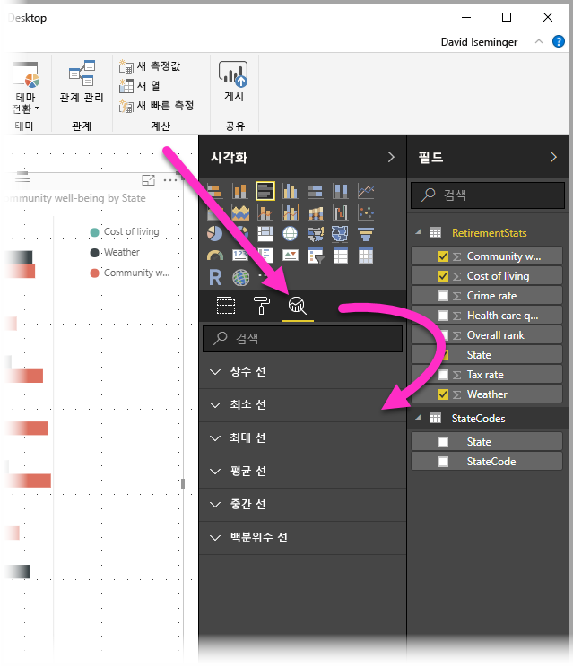
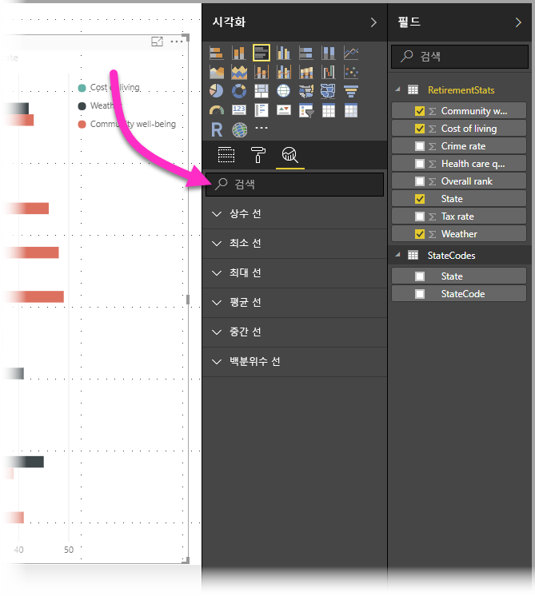
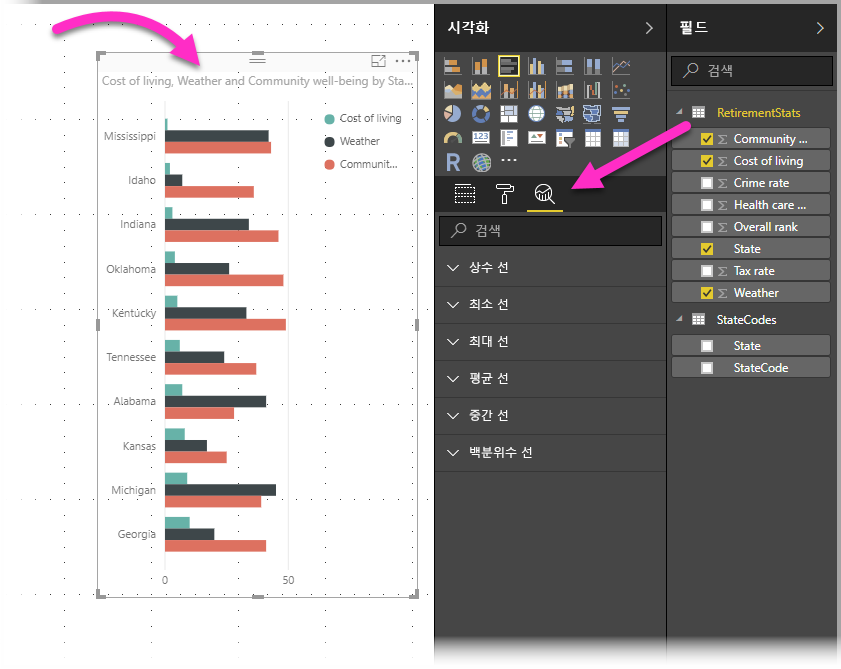
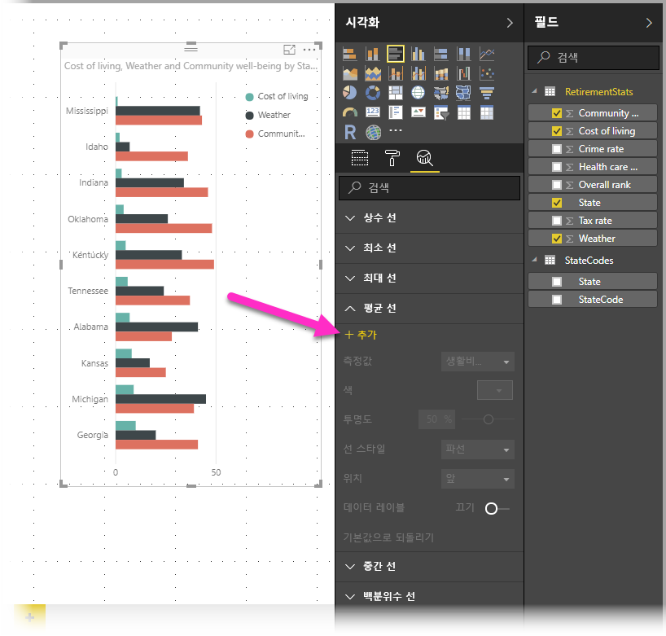
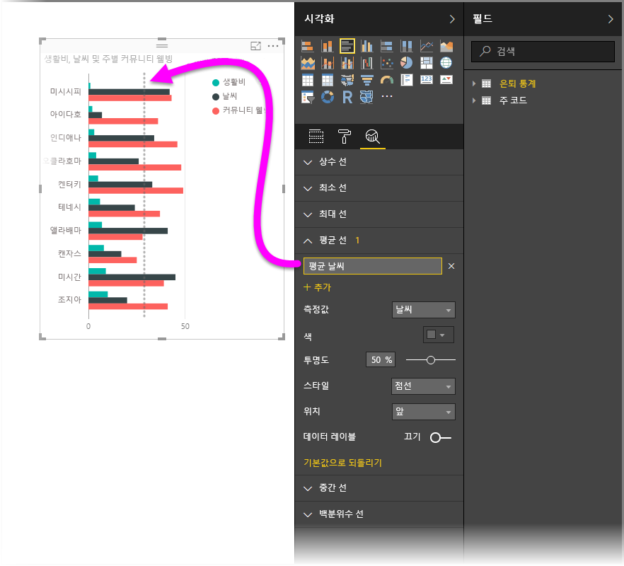
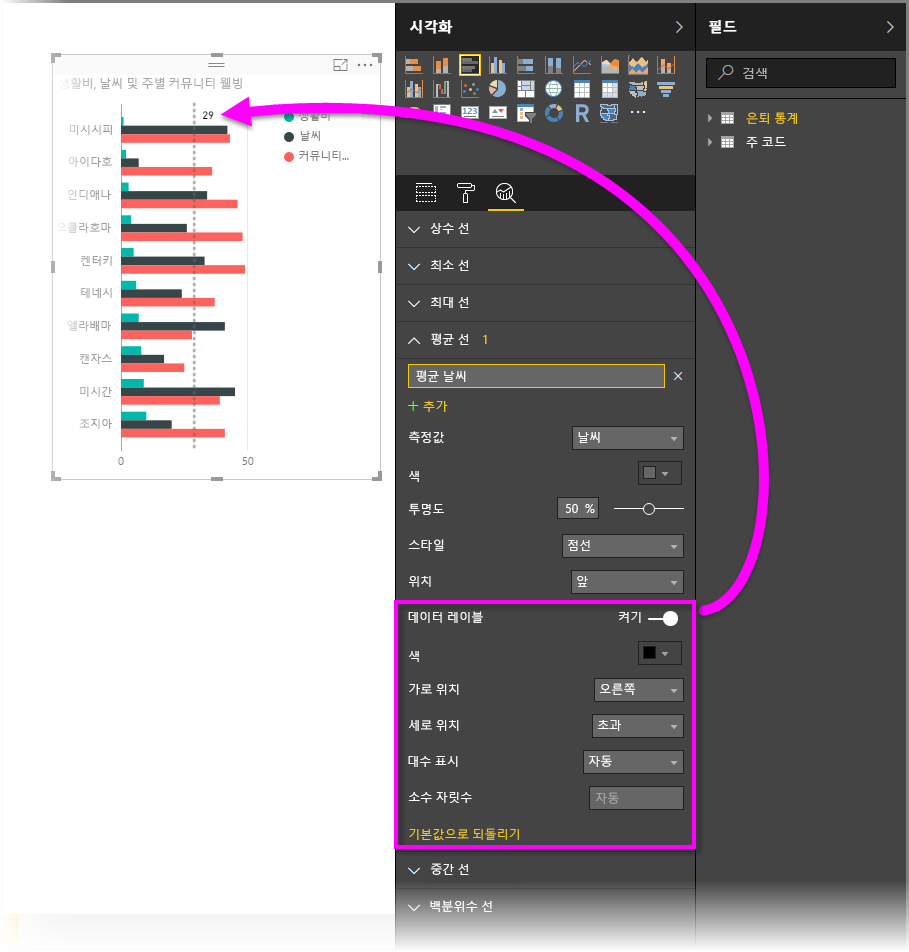
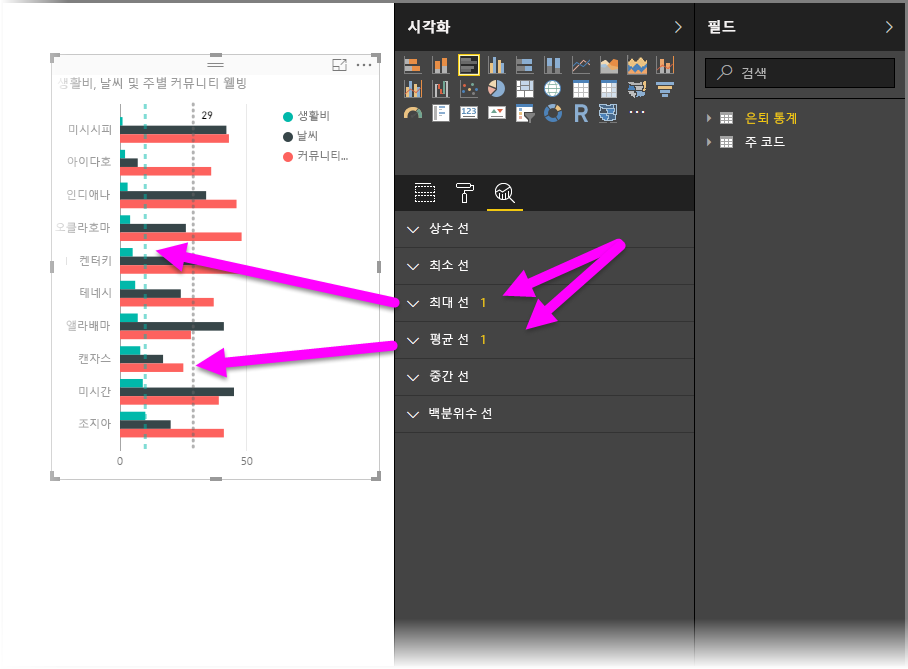
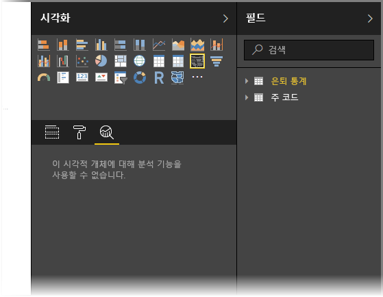
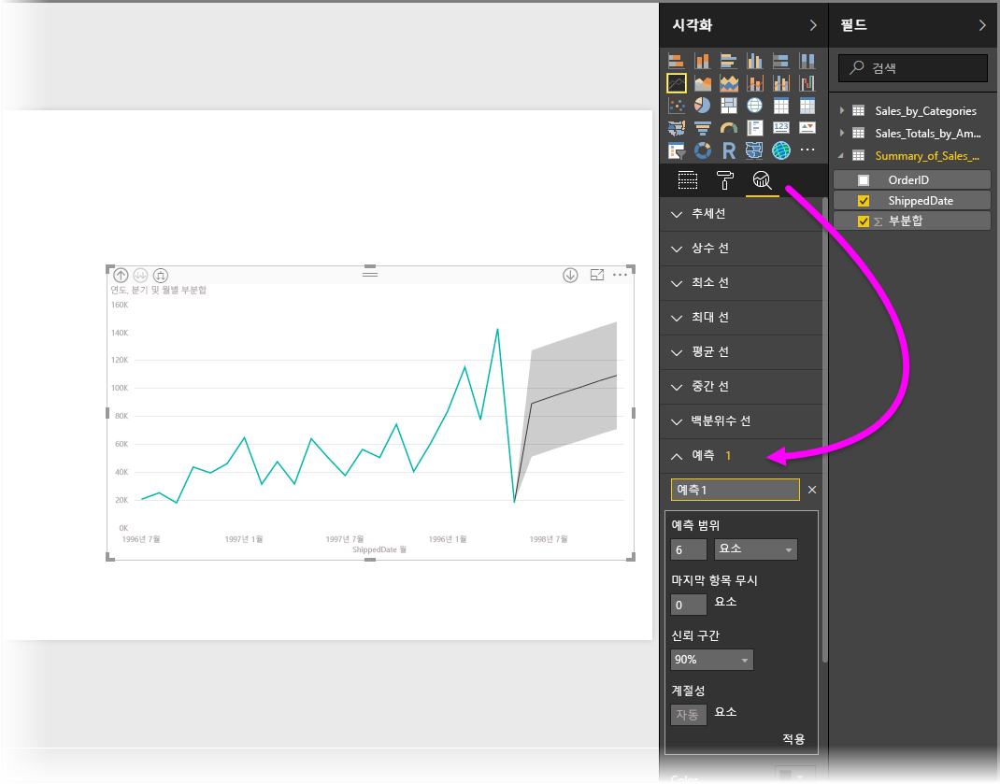

# Power BI Desktop의 분석 창 사용
**Power BI Desktop**의 **분석** 창에서 시각적 개체에 동적 참조 줄을 추가하고, 중요한 추세 또는 통찰력에 대한 포커스를 제공할 수 있습니다. **분석** 창은 Power BI Desktop의 **시각화** 영역에 있습니다.

> [!NOTE]
> **분석** 창은 Power BI Desktop 캔버스에서 시각적 개체를 선택하는 경우에만 나타납니다.

## 분석 창 내에서 검색
**Power BI Desktop**의 2018년 2월 릴리스(버전 2.55.5010.201 이상)부터 **시각화** 창의 하위 섹션인 **분석** 창 내에서 검색할 수 있습니다. 아래 이미지에 표시된 것처럼 **분석** 창을 선택하면 검색 상자가 나타납니다.

## 분석 창 사용
**분석** 창을 사용하여 다음과 같은 유형의 동적 참조 줄을 만들 수 있습니다(모든 시각적 개체 유형에 모든 줄을 사용할 수 있는 것은 아님).

* X축 상수 선
* Y축 상수 선
* 최소 선
* 최대 선
* 평균 선
* 중간 선
* 백분위수 선

다음 섹션에서는 시각화에 **분석** 창 및 동적 참조 선을 사용하는 방법을 보여 줍니다.

시각적 개체에 사용 가능한 동적 참조 선을 보려면 단계를 수행하세요.

1. 시각적 개체를 선택하거나 만든 후 **시각화** 섹션에서 **분석** 아이콘을 선택합니다.
   
   
2. 만들려는 선 유형에 대한 아래쪽 화살표를 선택하여 해당 옵션을 확장 합니다. 이 예에서는 **평균 선**을 선택하겠습니다.
   
   
3. 새 선을 만들려면 **+ 추가**를 선택합니다. 그런 다음 텍스트 상자를 두 번 클릭하고 이름을 입력하여 선의 이름을 지정할 수 있습니다.
   
   *색상*, *투명도*, *스타일*, *위치*(시각적 개체의 데이터 요소 기준), 레이블 포함 여부 등 선에 대한 모든 옵션이 제공됩니다. 뿐만 아니라 **측정값** 드롭다운을 선택하여 시각적 개체에서 선의 기준이 될 **측정값**을 선택할 수 있으며, 이 측정값은 자동으로 시각적 개체의 데이터 요소로 채워집니다. 이 예에서는 아래와 같이 측정값으로 날씨를 선택하고, 레이블을 평균 날씨로 지정하고, 기타 옵션 몇 가지를 사용자 지정하겠습니다.
   
   
4. 데이터 레이블을 표시하려면 **데이터 레이블** 슬라이더를 켭니다. 이렇게 하면 다음 이미지처럼 데이터 레이블에 대한 추가 옵션 전체가 표시됩니다.
   
   
5. **분석** 창의 **평균 선** 항목 옆에 표시되는 숫자를 잘 보세요. 현재 시각적 개체에 있는 동적 선의 수와 유형을 알려줍니다. **주거 비용**에 최대 선을 추가하고 **분석** 창을 보면 이제 이 시각적 개체에 **최대 줄** 동적 참조 선이 적용된 것을 확인할 수 있습니다.
   
   

선택한 시각적 개체에 동적 참조 선을 적용할 수 없는 경우(이 예에서는 **맵** 시각적 개체) **분석** 창을 선택하면 다음과 같이 표시됩니다.

**분석** 창을 통해 동적 참조 선을 만들어서 강조할 수 있는 온갖 종류의 흥미로운 통찰력이 있습니다.

어떤 시각적 개체가 동적 참조 선을 적용할 수 있는지 확장하는 기능을 포함하여 더 많은 기능이 추가될 예정이니, 새 기능에 대한 소식을 자주 확인하세요.

## 예측 적용
시각적 개체를 선택한 다음 **분석** 창의 **예측** 섹션을 확장하여 **예측** 기능을 사용할 수 있습니다. 예측을 수정하기 위해 *예측 길이*, *신뢰 구간* 등의 많은 입력을 지정할 수 있습니다. 다음 이미지는 예측이 적용된 기본 선 시각적 개체를 보여주지만, 상상력을 발휘해 (*예측* 기능을 온갖 방법으로 궁리하여) 자신의 모델에 어떻게 적용할 수 있는지 알아봅니다.

## 제한 사항
동적 참조 선을 사용하는 기능은 사용 중인 시각적 개체의 유형을 기반으로 합니다. 다음 목록에는 시각적 개체에 대해 현재 사용 가능한 동적 선이 나와 있습니다.

다음 시각적 개체에서는 전체 동적 선을 사용할 수 있습니다.

* 영역 차트
* 꺾은선형 차트
* 분산형 차트
* 묶은 세로 막대형 차트
* 묶은 가로 막대형 차트

다음 시각적 개체는 **분석** 창에서 상수 선만 사용할 수 있습니다.

* 누적 영역형
* 누적 가로 막대형
* 누적 세로 막대형
* 100% 기준 누적 가로 막대형
* 100% 기준 누적 세로 막대형

다음 시각적 개체에서는 현재 추세선이 유일한 옵션입니다.

* 비 누적 꺾은선형
* 묶은 세로 막대형 차트

마지막으로, 비카티전 시각적 개체는 현재 **분석** 창에서 다음과 같은 동적 선을 적용할 수 없습니다.

* 행렬
* 원형 차트
* 도넛
* 테이블

백분위수 줄은 **Power BI Desktop**에서 가져온 데이터를 사용할 경우 또는 **Analysis Service 2016** 이상, **Azure Analysis Services**를 실행하는 서버의 모델 또는 Power BI 서비스의 데이터 세트에 연결할 경우에만 사용할 수 있습니다. 

## 다음 단계
Power BI Desktop에서 모든 종류의 작업을 수행할 수 있습니다. 해당 기능에 대한 자세한 내용은 다음 리소스를 확인하세요.

* [Power BI Desktop의 새로운 기능](desktop-latest-update.md)
* [Power BI Desktop 다운로드](desktop-get-the-desktop.md)
* [Power BI Desktop이란?](desktop-what-is-desktop.md)
* [Power BI Desktop을 사용한 쿼리 개요](desktop-query-overview.md)
* [Power BI Desktop의 데이터 형식](desktop-data-types.md)
* [Power BI Desktop에서 데이터 셰이핑 및 결합](desktop-shape-and-combine-data.md)
* [Power BI Desktop의 일반적인 쿼리 작업](desktop-common-query-tasks.md)    

