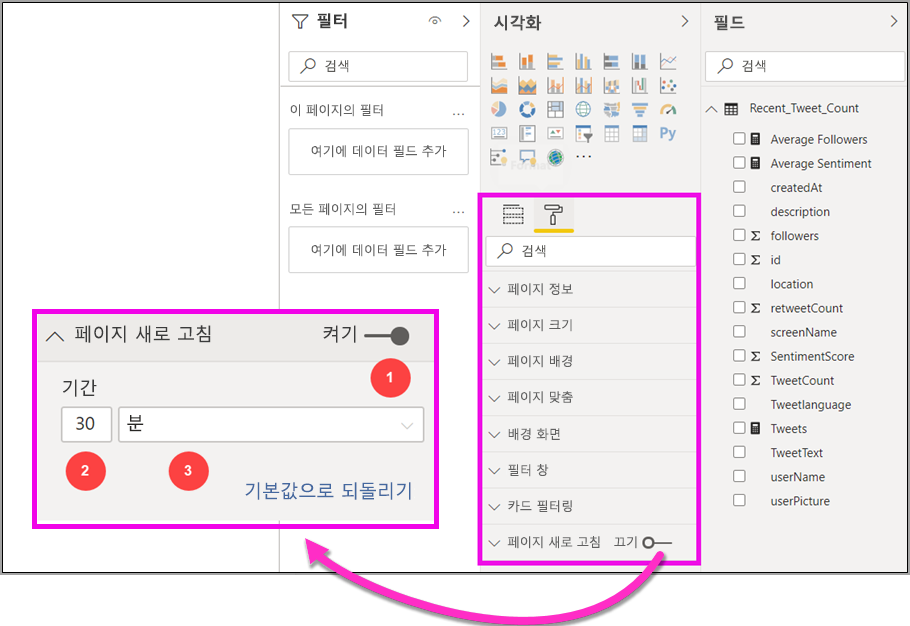
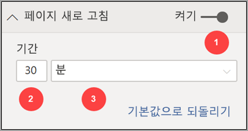
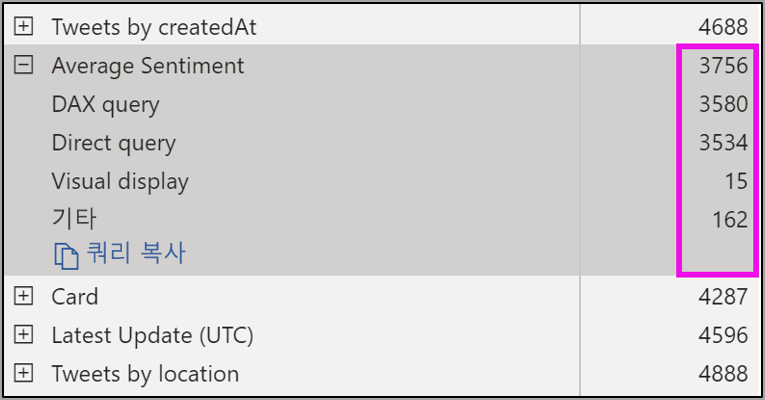
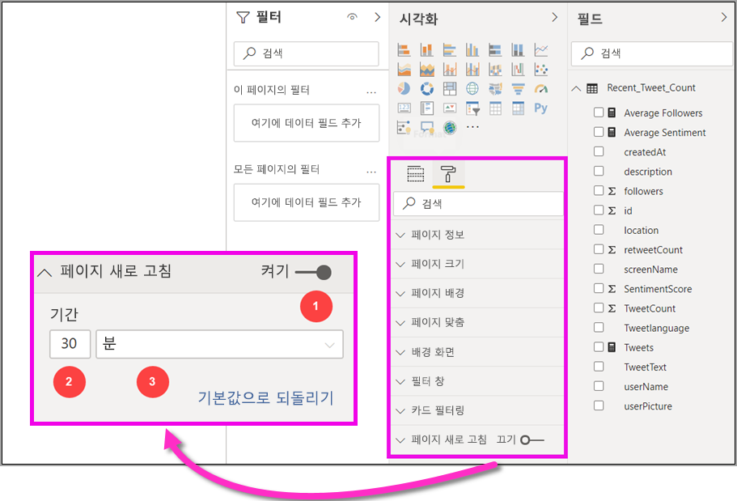

# Power BI Desktop의 자동 페이지 새로 고침(미리 보기)

중요한 이벤트를 모니터링할 때 원본 데이터가 업데이트되는 즉시 데이터를 새로 고쳐야 합니다. 예를 들어, 제조업계에서는 컴퓨터가 제대로 작동하지 않거나 거의 그런 상황인 경우를 파악하는 것은 매우 중요합니다.

Power BI의 자동 페이지 새로 고침(APR) 기능을 사용하면 활성 보고서 페이지에서 [DirectQuery 원본](https://docs.microsoft.com/power-bi/desktop-directquery-about)에 대해, 미리 정의된 주기로 새 데이터를 쿼리할 수 있습니다.

## 자동 페이지 새로 고침 사용

이 미리 보기 버전의 경우, Power BI Desktop에서 자동 페이지 새로 고침 기능을 사용하도록 설정해야 합니다. **파일 > 옵션 및 설정**으로 이동한 다음 **옵션**을 선택하고, 왼쪽 창에서 **미리 보기 기능**을 선택합니다. *자동 페이지 새로 고침* 옆에 있는 확인란을 선택하여 기능을 사용하도록 설정합니다. 자동 페이지 새로 고침은 DirectQuery 데이터 원본에 대해서만 사용할 수 있습니다.

자동 페이지 새로 고침을 사용하려면, 새로 고침을 사용하도록 설정하려는 보고서 페이지를 선택합니다. **시각화** 창에서 **서식** 아이콘(페인트 롤러)을 선택하고 창 아래쪽 근처에서 **페이지 새로 고침**을 찾습니다. 

다음 그림은 **페이지 새로 고침** 카드를 보여줍니다. 번호가 매겨진 요소에 대한 설명은 다음 몇 단락에서 설명합니다.

1.  자동 페이지 새로 고침 슬라이더 - 페이지 새로 고침을 설정하거나 해제합니다
2.  페이지 새로 고침 간격 값 - 새로 고침 간격에 대한 숫자 값
3.  페이지 새로 고침 간격 단위 - 페이지 새로 고침에 대한 간격 단위

여기에서 페이지 새로 고침을 설정하고 새로 고침 기간을 선택할 수 있습니다. 기본값은 30분이며, 최소 새로 고침 간격은 1초입니다. 설정한 간격에 따라 보고서가 새로 고침을 시작합니다. 

## 페이지 새로 고침 간격 확인

자동 페이지 새로 고침을 사용하도록 설정된 경우 Power BI Desktop은 계속 DirectQuery 원본에 쿼리를 보냅니다. 전송 중인 쿼리와 반환된 데이터를 가져오는 사이에 지연이 발생하므로, 짧은 새로 고침 간격의 경우 쿼리가 구성된 간격 내에 쿼리된 데이터를 성공적으로 반환하고 있는지 확인해야 합니다. 데이터가 간격 내에 반환되지 않는 경우, 시각적 개체가 구성된 것보다 덜 자주 업데이트되는 상황이 발생합니다.

모범 사례를 들자면 새로 고침 간격이 예상되는 새 데이터 도착률과 일치해야 합니다.

* 새 데이터가 20분마다 원본에 도착한다면, 새로 고침 간격은 20분 미만일 수 없습니다. 

* 새 데이터가 매초마다 도착한다면, 간격이 1초로 설정되어야 합니다. 

1초처럼 낮은 새로 고침 간격의 경우 직접 쿼리 데이터 원본의 유형, 쿼리가 이것에 대해 생성하는 로드, 용량의 데이터 센터로부터 보고서 뷰어의 거리 등을 고려해야 합니다. 

Power BI Desktop의 성능 분석기를 사용하여 이를 예측할 수 있습니다. 그러면 각 시각적 쿼리가 원본 및 시간이 소요된 위치로부터 결과를 가지고 다시 돌아올 충분한 시간이 있는지 확인할 수 있습니다. 성능 분석기의 결과를 기반으로, 데이터 원본을 조정하고 변경할 수 있습니다. 또는 보고서의 다른 시각적 개체 및 측정값으로 실험할 수 있습니다.

다음 그림은 성능 분석기에서 DirectQuery의 결과를 보여줍니다.

이 데이터 원본에 대한 몇 가지 다른 특징을 고려해봅시다. 

1.  데이터가 2초 속도로 도착합니다. 
2.  성능 분석기는 최대 쿼리 + 시간 표시를 약 4.9초(4688밀리초)로 표시합니다. 
3.  데이터 원본은 초당 약 1000개의 동시 쿼리를 처리하도록 구성됩니다. 
4.  약 10명의 사용자가 동시에 보고서를 볼 것으로 예상됩니다.

따라서 다음과 같은 결과가 나타납니다.

* **5개의 시각적 개체 x 10명의 사용자 = 약 50개의 쿼리**

이 계산에 따르면 데이터 원본에서 지원할 수 있는 것보다 훨씬 더 많은 부하가 발생합니다. 데이터가 2초 속도로 도착하므로, 새로 고침 빈도도 그러해야 합니다. 하지만 쿼리는 완료하는 데 약 5초 정도 걸리므로 5초 이상으로 설정해야 합니다. 

보고서는 클라우드에 호스팅되는 Analysis Services 인스턴스를 사용하므로, 보고서를 서비스에 게시할 때는 이 결과가 달라질 수 있다는 점도 유념하시기 바랍니다. 그에 따라 새로 고침 빈도를 조정할 수 있습니다. 

쿼리 및 새로 고침 타이밍을 고려하기 위해, Power BI는 나머지 모든 새로 고침 쿼리가 완료될 때만 다음 새로 고침 쿼리를 실행합니다. 따라서 새로 고침 간격이 쿼리가 처리되는 데 걸리는 시간보다 짧은 경우에도, 나머지 쿼리가 완료되어야만 Power BI가 다시 새로 고쳐집니다. 

그 다음으로는, 용량 관리자로서 성능 문제를 잠재적으로 감지하고 진단할 수 있는 방법을 살펴보겠습니다. 또한 성능 및 문제 해결에 대한 추가 질문과 대답은 이 문서의 뒷부분에 **자동 페이지 새로 고침 FAQ** 섹션을 확인할 수 있습니다.

## Power BI 서비스의 자동 페이지 새로 고침

또한 Power BI Desktop에서 작성되고 Power BI 서비스에 게시된 보고서에 대한 자동 페이지 새로 고침 간격을 설정할 수도 있습니다. 

Power BI 서비스의 보고서에 대한 자동 페이지 새로 고침은 Power BI Desktop의 구성과 비슷한 단계로 구성됩니다. 다음 그림은 Power BI 서비스에 대한 **페이지 새로 고침** 구성을 보여줍니다.

1.  자동 페이지 새로 고침 슬라이더 - 페이지 새로 고침을 설정하거나 해제합니다
2.  페이지 새로 고침 간격 값 - 새로 고침 간격에 대한 숫자 값은 정수여야 합니다
3.  페이지 새로 고침 간격 단위 - 페이지 새로 고침에 대한 간격 단위

### 페이지 새로 고침 간격

Power BI 서비스에서 허용되는 페이지 새로 고침 간격은 보고서의 작업 영역 형식의 영향을 받습니다. 이는 다음과 같은 보고서에 모두 적용됩니다.

* 자동 페이지 새로 고침을 사용하도록 설정된 작업 영역에 보고서 게시
* 작업 영역에서 이미 페이지 새로 고침 간격 편집
* 서비스에서 직접 보고서 만들기

Power BI Desktop에는 새로 고침 간격에 대한 제한이 없습니다. 새로 고침 간격은 매초로 설정할 정도로 빈번할 수 있습니다. 하지만 보고서가 Power BI 서비스에 게시되는 경우에는 특정 제한 사항이 적용됩니다. 이에 대해서는 다음 섹션에서 설명합니다.

### 새로 고침 간격에 대한 제한 사항

Power BI 서비스에서 자동 페이지 새로 고침 제한 사항은 작업 영역과 같은 요인과 프리미엄 서비스가 사용되고 있는지 여부에 기반하여 적용됩니다.

이 작동 방식을 명확하게 설명하기 위해, [용량 및 작업 영역](whitepaper-powerbi-premium-deployment.md#capacities)에 대한 일부 배경으로 시작하겠습니다

**용량**은 Power BI 콘텐츠를 호스트하고 전달하는 데 사용되는 리소스(스토리지, 프로세서 및 메모리) 집합을 나타내는 핵심적인 Power BI 개념입니다. 용량은 공유 또는 전용입니다. **공유 용량**은 다른 Microsoft 고객과 공유되는 반면, **전용 용량**은 한 명의 고객에게만 전적으로 사용됩니다. 전용 용량은 [프리미엄 용량](whitepaper-powerbi-premium-deployment.md#capacities) 문서에 소개되어 있습니다.

공유 용량에서는 워크로드가 다른 고객과 공유된 계산 리소스에서 실행됩니다. 용량이 리소스를 공유해야 하므로, 최대 모델 크기(1GB) 및 최대 일일 새로 고침 빈도(하루 8회) 설정과 같은 *공정한 실행*을 보장하기 위해 제한 사항이 적용됩니다.

Power BI **작업 영역**은 용량 내에 상주하며 보안, 협업 및 배포 컨테이너를 나타냅니다. 각 Power BI 사용자는 **내 작업 영역**이라는 개인 작업 영역을 갖습니다. 협업 및 배포를 지원하기 위해 추가 작업 영역을 만들 수 있으며 이를 **앱 작업 영역**이라고 합니다. 기본적으로 개인 작업 영역을 포함한 작업 영역은 **공유 용량**에서 생성됩니다.

다음은 두 가지 작업 영역 시나리오에 대한 일부 세부 정보입니다.

**공유 작업 영역** - 일반 작업 영역(프리미엄 용량의 일부가 아닌 작업 영역)의 경우, 자동 페이지 새로 고침의 최소 간격은 30분입니다(가장 낮은 간격 허용).

**프리미엄 작업 영역** - 프리미엄 작업 영역의 자동 페이지 새로 고침 가용성은 프리미엄 관리자가 Power BI Premium 용량에 대해 설정한 워크로드 설정에 따라 달라집니다. 자동 페이지 새로 고침을 설정할 수 있는 기능에 영향을 줄 수 있는 두 개의 변수가 있습니다.

 1. *기능 설정/해제*: 용량 관리자가 기능을 사용하지 않기로 결정한 경우, 게시된 보고서에서 어떤 유형의 페이지 새로 고침도 설정할 수 없습니다.

 2. *최소 새로 고침 간격*: 기능을 사용하도록 설정하려면, 용량 관리자가 최소 새로 고침 간격을 설정해야 합니다. 간격이 최소값보다 낮을 경우, Power BI 서비스가 용량 관리자가 설정한 최소 간격을 준수하기 위해 간격을 재정의합니다.

아래 표에 이 기능을 사용할 수 있는 위치와 각 용량 유형 및 [스토리지 모드](whitepaper-powerbi-premium-deployment.md#model-storage-modes)에 대한 제한 사항이 자세히 설명되어 있습니다

| 스토리지 모드 | 전용 용량 | 공유 용량 |
| --- | --- | --- |
| 직접 쿼리 | **지원됨** – 예.  **최소 새로 고침 간격** – 1초  **용량 관리자 재정의** – 예. | **지원됨** – 예.  **최소 새로 고침 간격** - 30분  **용량 관리자 재정의** – 아니요. |
| 가져오기 | **지원됨** – 아니요.  **최소 새로 고침 간격** - 해당 없음.  **용량 관리자 재정의** – 해당 없음. | **지원됨** – 아니요.  **최소 새로 고침 간격** - 해당 없음.  **용량 관리자 재정의** – 해당 없음. |
| 혼합 모드 (DQ + 기타) | **지원됨** – 예.  **최소 새로 고침 간격** – 1초  **용량 관리자 재정의** – 예. | **지원됨** – 예.  **최소 새로 고침 간격** - 30분  **용량 관리자 재정의** – 아니요. |
| 라이브 연결 AS | **지원됨** – 아니요.  **최소 새로 고침 간격** - 해당 없음.  **용량 관리자 재정의** – 해당 없음. | **지원됨** – 아니요.  **최소 새로 고침 간격** - 해당 없음.  **용량 관리자 재정의** – 해당 없음. |
| 라이브 연결 PBI | **지원됨** – 아니요.  **최소 새로 고침 간격** - 해당 없음.  **용량 관리자 재정의** – 해당 없음. | **지원됨** – 아니요.  **최소 새로 고침 간격** - 해당 없음.  **용량 관리자 재정의** – 해당 없음. |

> [!NOTE]
> Power BI Desktop에서 자동 페이지 새로 고침 사용 보고서를 서비스에 게시할 때, 데이터 집합 설정 메뉴에서 DirectQuery 데이터 원본에 대한 자격 증명을 제공해야 합니다.

## 고려 사항 및 제한 사항

Power BI Desktop 또는 Power BI 서비스에서, 자동 페이지 새로 고침을 사용할 때 염두에 두어야 할 몇 가지 사항이 있습니다.

* 가져오기, LiveConnect 및 푸시 스토리지 모드는 자동 페이지 새로 고침에서 지원되지 않습니다.  
* DirectQuery 데이터 원본이 적어도 하나 이상 있는 복합 모델은 지원됩니다.
* Power BI Desktop에는 새로 고침 간격에 대한 제한이 없으며, 새로 고침 간격은 매초로 설정할 정도로 빈번할 수 있습니다. 보고서가 Power BI 서비스에 게시되는 경우에는 특정 제한 사항이 적용됩니다. 이에 대해서는 다음 섹션에서 설명합니다.

### 성능 진단

자동 페이지 새로 고침은 시나리오를 모니터링하고 빠른 변경 데이터를 탐색하는 데 유용 합니다. 그러나, 때때로 이로 인해 용량 또는 데이터 원본에 과도한 부하가 발생할 수 있습니다.

데이터 원본에 대한 과도한 부하를 방지하기 위해 Power BI에는 다음과 같은 보호 기능이 있습니다.

1. 모든 자동 페이지 새로 고침 쿼리는 대화형 쿼리(예: 페이지 부하 및 교차 필터링 시각적 개체)가 우선 적용되도록 **더 낮은** 우선 순위로 실행됩니다.
2. 다음 새로 고침 주기 전에 쿼리가 완료되지 않은 경우, Power BI는 이전 쿼리가 완료될 때까지 새로운 새로 고침 쿼리를 실행하지 않습니다. 예를 들어, 새로 고침 간격이 1초이고 쿼리가 평균 4초 걸리는 경우 Power BI는 효율적으로 매 4초마다 쿼리를 실행합니다.

그래도 성능 병목 현상이 발생할 수 있는 두 가지 영역이 있습니다.

1. **용량:** 이 쿼리는 먼저 보고서 시각화에서 원본 쿼리에 생성된 DAX 쿼리를 접고 평가하는 프리미엄 용량에 도달합니다.
2. **직접 쿼리 데이터 원본:** 그러면 이전 단계에서 번역된 쿼리가 원본을 대상으로 실행됩니다. 이것은 SQL Server, SAP Hana 원본 등일 수 있습니다.

관리자가 사용할 수 있는 [프리미엄 메트릭 앱](service-admin-premium-monitor-capacity.md)을 사용하여 낮은 우선 순위 쿼리에서 사용되고 있는 용량이 얼마만큼인지 시각화할 수 있습니다.

낮은 우선 순위 쿼리는 자동 페이지 새로 고침 쿼리 및 모델 새로 고침 쿼리로 구성됩니다. 현재 자동 페이지 새로 고침의 부하와 모델 새로 고침 쿼리의 부하를 구분할 수 있는 방법은 없습니다.

다음은 낮은 우선 순위 쿼리로 인해 용량이 오버로드되고 있는 경우에 취할 수 있는 몇 가지 작업입니다.

1. 더 큰 프리미엄 SKU를 요청합니다.
2. 보고서 소유자에게 연락하여 새로 고침 간격을 낮추도록 요청합니다.
3. 용량 관리자 포털에서 다음을 수행할 수 있습니다.
  1. 해당 용량에 대한 자동 페이지 새로 고침을 해제합니다
  2. 해당 용량의 모든 보고서에 영향을 주는 최소 새로 고침 간격을 올립니다.

### 질문과 대답

이 섹션에서는 다음에 대한 일반적인 질문과 대답을 제공합니다 

1. 저는 보고서 작성자입니다. Desktop에서 보고서 새로 고침 간격을 1초로 정의했는데, 게시 후에 서비스에서 보고서가 새로 고쳐지지 않습니다.

    * 페이지에 대해 자동 페이지 새로 고침이 설정되어 있는지 확인하세요. 이 설정은 페이지마다 별개이므로, 새로 고치려는 보고서의 각 페이지에 대해 설정되어 있는지 확인해야 합니다.
    * 새로 고침 간격이 30분에서 잠겨지지 않을 경우, 연결된 프리미엄 용량이 있는 작업 영역에 업로드했는지 확인하세요.
    * 보고서가 프리미엄 작업 영역에 있는 경우, 관리자에게 연결된 용량에 대해 이 기능을 사용하도록 설정했는지 확인하세요. 또한 용량에 대한 최소 새로 고침 간격이 보고서와 동일하거나 낮은지 확인하세요.

2. 저는 용량 관리자입니다. 자동 페이지 새로 고침 간격 설정을 변경했지만 반영되지 않고 있습니다. 다시 말해서, 보고서가 변경된 설정이 아닌 빈도로 계속 새로 고쳐지고 있거나, 이 기능을 켰는데도 새로 고쳐지지 않고 있습니다.

    * 용량 관리자 UI에서 적용된 자동 페이지 새로 고침 설정 변경이 보고서에 전파되는 데는 최대 5분까지 소요됩니다.
    * 용량에 대해서 자동 페이지 새로 고침을 켜야 할 뿐만 아니라, 보고서를 보려는 보고서의 페이지에 대해서도 이 기능을 켜야 합니다.

3. 보고서가 혼합 모드(DQ + 가져오기)에서 작동하고 있습니다. 모든 시각적 개체가 새로 고쳐지는 것은 아닙니다.

    * 시각적 개체가 가져오기 테이블을 참조하는 경우에 이런 일이 예상됩니다. 가져오기에는 자동 페이지 새로 고침이 지원되지 않습니다.
    * 이 섹션의 1번 질문을 참조하세요.

4. 서비스에서 보고서의 새로 고침이 잘 실행되고 있었는데 갑자기 중지되었습니다.

    * 페이지 새로 고침을 시도하여 저절로 문제가 해결되는지 확인하세요.
    * 용량 관리자에게 연락하여 기능을 끄거나 최소 새로 고침 간격을 올렸는지 확인하세요(2번 질문 참조)

5. 저는 보고서 작성자입니다. 시각적 개체가 제가 지정한 주기로 새로 고쳐지지 않고, 더 느린 빈도로 새로 고쳐지고 있습니다.

    * 쿼리를 실행하는 데 시간이 더 오래 걸리는 경우 새로 고침 간격이 지연됩니다. 자동 페이지 새로 고침은 새 쿼리를 실행하기 전에 모든 쿼리가 실행을 완료할 때까지 기다립니다.
    * 용량 관리자가 귀하가 보고서에 대해 설정한 것보다 더 높은 최소 새로 고침 간격을 설정했을 수 있습니다. 용량 관리자에게 연락하여 이 간격을 낮추도록 요청하세요.

6. 자동 페이지 새로 고침 쿼리는 캐시에서 서비스되나요?

    * 아니요. 모든 자동 페이지 새로 고침 쿼리는 캐시된 데이터를 무시합니다.

## 다음 단계

자세한 내용은 다음 아티클을 참조하세요.

* [Power BI의 DirectQuery 사용](desktop-directquery-about.md)
* [성능 분석기를 사용하여 보고서 요소 성능 검사](desktop-performance-analyzer.md)
* [Power BI Premium 용량 배포 및 관리](whitepaper-powerbi-premium-deployment.md)
* [Power BI Desktop의 데이터 원본](desktop-data-sources.md)
* [Power BI Desktop에서 데이터 셰이핑 및 결합](desktop-shape-and-combine-data.md)
* [Power BI Desktop에서 Excel 통합 문서에 연결](desktop-connect-excel.md)   
* [Power BI Desktop에 데이터 직접 연결](desktop-enter-data-directly-into-desktop.md)   
