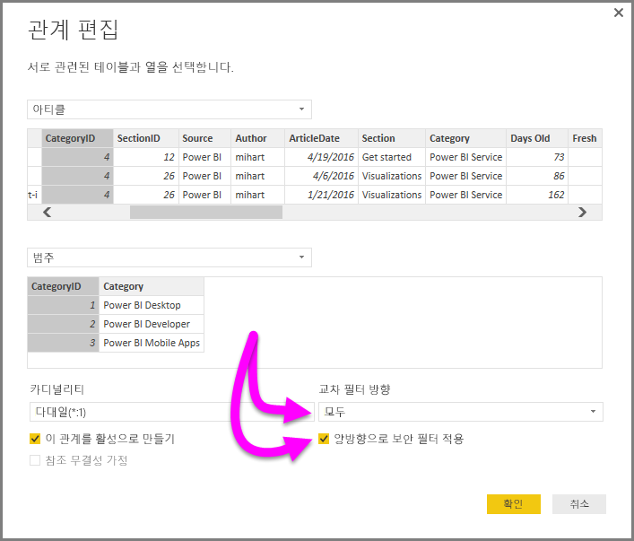

# Power BI Desktop에서 DirectQuery를 사용하여 양방향 교차 필터링 사용

테이블 필터링으로 적절한 데이터 보기가 생성되면 보고서 작성자(및 데이터 모델러)는 보고서에 필터링을 어떻게 적용할지 결정할 때 문제에 직면합니다. 테이블의 필터 컨텍스트가 관계의 한쪽에만 유지되거나 원하는 결과를 얻기 위해 복잡한 DAX 수식을 자주 요청해야 합니다.

양방향 교차 필터링을 사용할 경우 보고서 작성자(및 데이터 모델러)는 관련 테이블로 작업할 때 필터가 적용되는 방식을 효과적으로 제어하여 이러한 필터가 테이블 관계의 양쪽에 적용되도록 할 수 있습니다.  테이블 관계의 다른 쪽에서 두 번째 관련 테이블에 필터 컨텍스트를 전파하여 이를 수행할 수 있습니다.

## 양방향 교차 필터링에 대한 자세한 백서
Power BI Desktop에서 양방향 교차 필터링에 대해 설명하는 [자세한 백서](https://download.microsoft.com/download/2/7/8/2782DF95-3E0D-40CD-BFC8-749A2882E109/Bidirectional%20cross-filtering%20in%20Analysis%20Services%202016%20and%20Power%20BI.docx)가 제공됩니다(이 백서에서는 SQL Server Analysis Services 2016에 대해서도 다루며 둘 다 동작은 동일합니다).

* [Power BI Desktop에서 양방향 교차 필터링](https://download.microsoft.com/download/2/7/8/2782DF95-3E0D-40CD-BFC8-749A2882E109/Bidirectional%20cross-filtering%20in%20Analysis%20Services%202016%20and%20Power%20BI.docx) 백서 다운로드

## DirectQuery에 대해 양방향 교차 필터링 사용

교차 필터링을 활성화하려면 관계에 대한 **관계 편집** 대화 상자에서 다음을 선택해야 합니다.

* **교차 필터 방향**은 **모두**로 설정되어야 합니다.
* **보안 필터 양방향으로 적용**도 선택해야 합니다.

  

> [!NOTE]
> Power BI Desktop에서 교차 필터링 DAX 수식을 만들 때는 *UserName* 대신 *UserPrincipalName*(<em>joe@contoso.com</em>처럼 보통 사용자 로그인과 동일)을 사용합니다. 따라서 *UserName*(또는 예를 들어 EmployeeID)을 *UserPrincipleName*에 매핑하는 관련 테이블을 만들어야 할 수 있습니다.

양방향 교차 필터링이 작동하는 예와 자세한 내용은 이 문서의 앞부분에서 언급한 [백서](https://download.microsoft.com/download/2/7/8/2782DF95-3E0D-40CD-BFC8-749A2882E109/Bidirectional%20cross-filtering%20in%20Analysis%20Services%202016%20and%20Power%20BI.docx)를 확인하세요.

