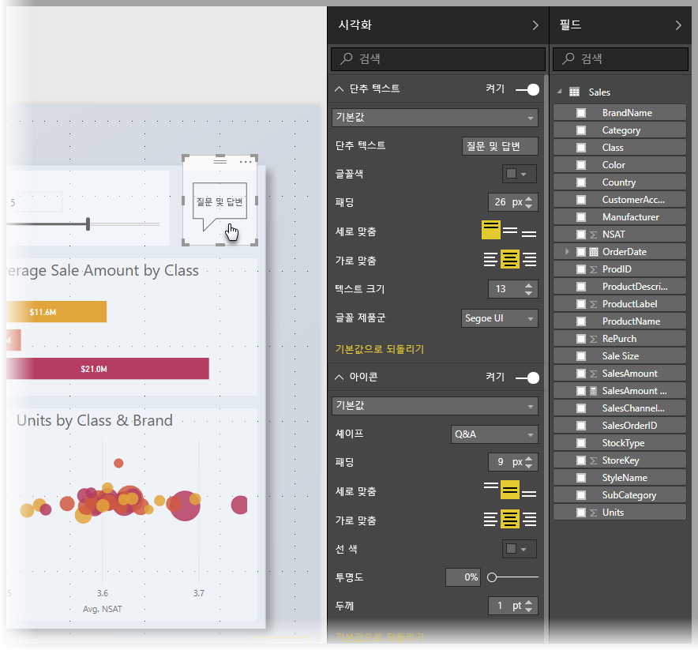
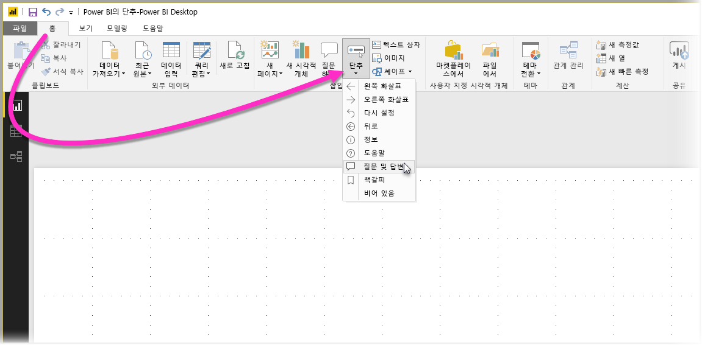
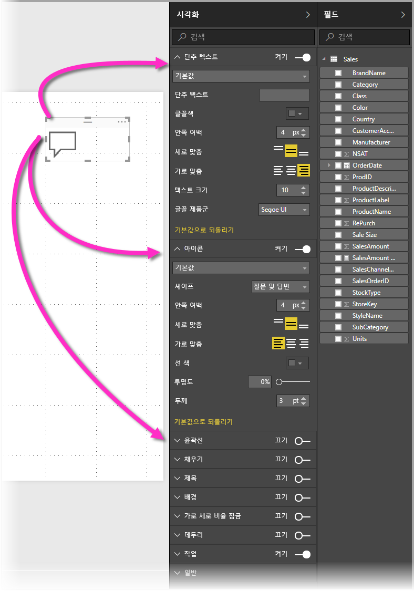
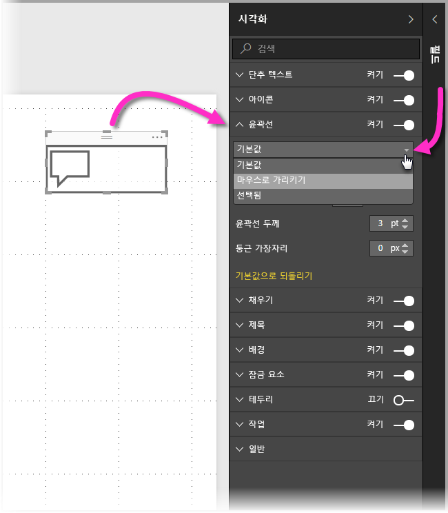
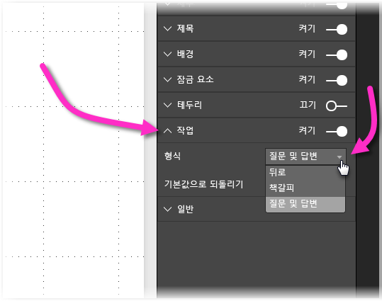

# Power BI에서 단추 사용
Power BI의 **단추**를 사용하여 보고서 및 대시보드가 앱과 유사하게 동작하도록 만들고, 매력적인 환경을 만들어 사용자가 Power BI 콘텐츠를 마우스로 가리키고, 클릭하고, 추가로 상호 작용할 수 있습니다. **Power BI Desktop**의 보고서에 단추를 추가하고, 해당 보고서를 Power BI 서비스에 공유하거나 게시하여 사용자에 대해 앱과 유사한 동작을 제공하는 대시보드를 만들 수 있습니다.

**Power BI Desktop**에서 만든 단추는 **Power BI 서비스**에 게시된 보고서 또는 대시보드에서 사용하도록 지원됩니다.

## 보고서에서 단추 만들기
**Power BI Desktop** 보고서에서 단추를 만들려면 **홈** 리본에서 **단추**를 선택하면 드롭다운 메뉴가 나타납니다. 여기서는 다음 이미지에 나와 있는 대로 옵션의 컬렉션에서 원하는 단추를 선택할 수 있습니다. 

보고서 캔버스에서 단추를 만들고 선택하는 경우 **시각화** 창은 요구 사항에 맞게 단추를 사용자 지정할 수 있는 여러 가지 방법을 표시합니다. 예를 들어 **시각화** 창의 카드에서 슬라이더를 설정/해제하여 **단추 텍스트**를 켜거나 끌 수 있습니다. 다른 속성과 함께 단추의 아이콘, 단추 채우기, 제목 및 사용자가 보고서 또는 대시보드에서 단추를 클릭할 때 수행되는 동작을 변경할 수 있습니다.

## 유휴 상태이거나, 마우스로 가리키거나, 선택된 경우 단추 속성 설정

Power BI의 단추에는 기본(마우스로 가리키거나 선택하는 경우 표시되는 방법), 마우스로 가리키는 경우 또는 선택되는 경우(*클릭됨*이라고도 함)라는 세 가지 상태가 있습니다. 이러한 세 가지 상태에 따라 **시각화** 창에서 많은 카드를 개별적으로 수정하여 단추를 사용자 지정하기 위한 많은 유연성을 제공할 수 있습니다.

**시각화** 창의 다음과 같은 카드를 통해 세 가지 상태에 따라 서식 지정 또는 단추의 동작을 조정할 수 있습니다.

* 단추 텍스트
* 아이콘
* 윤곽선
* 채우기

각 상태에 대해 단추가 표시되는 방법을 선택하려면 해당 카드 중 하나를 확장하고 카드의 맨 위쪽에 나타나는 드롭다운을 선택합니다. 다음 이미지에서는 다음과 같은 세 가지 상태를 표시하도록 선택한 드롭다운 목록에서 **윤곽선** 카드가 확장됩니다.

## 단추에 대한 작업 선택

사용자가 Power BI에서 단추를 선택할 때 수행되는 작업을 선택할 수 있습니다. **시각화** 창의 **작업** 카드에서 단추 작업에 대한 옵션에 액세스할 수 있습니다.

단추 작업에 대한 옵션은 다음과 같습니다.

* 뒤로
* 책갈피
* 질문 및 답변

**뒤로**를 선택하면 보고서의 이전 페이지로 사용자를 반환합니다. 드릴다운 페이지에 특히 유용합니다.

**책갈피**를 선택하면 현재 보고서에 대해 정의된 책갈피와 연결된 보고서 페이지를 표시합니다. [Power BI에서 책갈피에 대해 자세히 알아](desktop-bookmarks.md)볼 수 있습니다. 

드롭다운에서 **질문 및 답변**을 선택하면 **질문 및 답변 탐색기** 창을 표시합니다. 

특정 단추는 기본 동작을 자동으로 선택합니다. 예를 들어 **질문 및 답변** 단추 형식은 자동으로 **질문 및 답변**을 기본 동작으로 선택합니다. [이 블로그 게시물](https://powerbi.microsoft.com/blog/power-bi-desktop-april-2018-feature-summary/#Q&AExplorer)을 확인하여 **질문 및 답변 탐색기**에 대해 자세히 알아볼 수 있습니다.

사용하려는 *CTRL+클릭* 단추를 사용하여 보고서에 만들 단추를 사용하거나 테스트할 수 있습니다. 

## 다음 단계
단추와 유사하거나 상호 작용하는 기능에 대한 자세한 내용은 다음 아티클을 살펴보겠습니다.

* [Power BI Desktop에서 드릴스루 사용](desktop-drillthrough.md)
* [포커스 모드에서 대시보드 타일 또는 보고서 시각적 개체 표시](service-focus-mode.md)
* [책갈피를 사용하여 Power BI에서 정보 공유 및 스토리 빌드](desktop-bookmarks.md)

