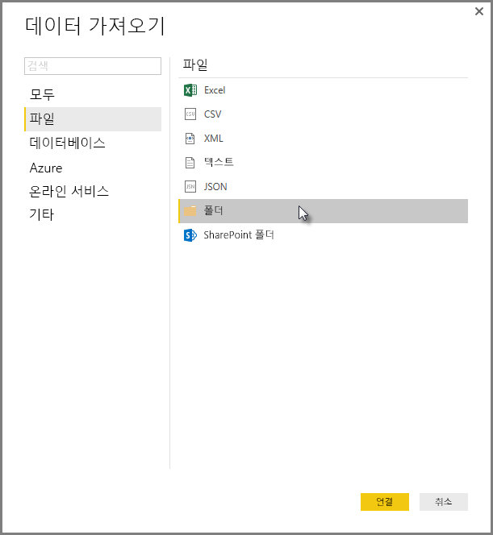
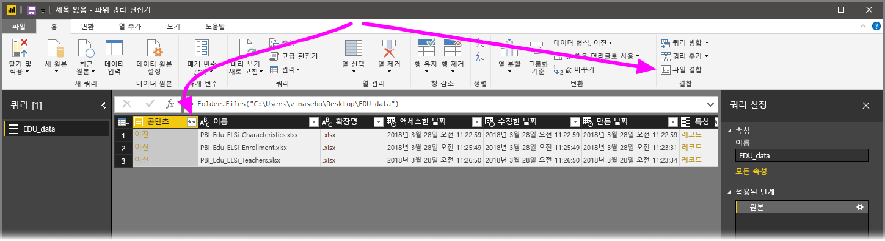
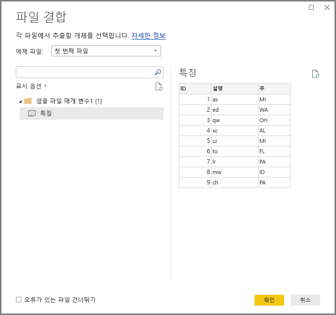
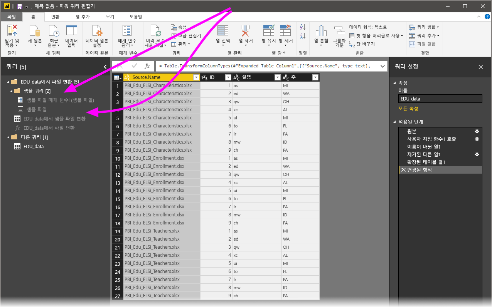

# Power BI Desktop에서 파일(이진) 병합
**Power BI Desktop**에 데이터를 가져오기 위한 한 가지 강력한 접근 방식은 동일한 스키마의 여러 파일을 단일 논리 테이블로 결합하는 것입니다. 이 편리하고 널리 사용되는 방법은 이 문서에서 설명하는 바와 같이 더 편리해지고 더 확장되었습니다.

동일한 폴더에서 파일을 병합하는 프로세스를 시작하려면 **데이터 가져오기 > 파일 > 폴더**를 선택합니다.

## 파일 병합 동작
**쿼리 편집기**의 **홈** 리본 탭에서 또는 열 자체에서 **파일 병합**을 선택하여 **파일(바이너리)을 병합**할 수 있습니다.

**파일 병합** 변환은 다음과 같이 동작합니다.

* **파일 병합** 변환에서는 입력된 각각의 파일을 분석하고 ‘텍스트’, ‘Excel 통합 문서’ 또는 ‘JSON’ 파일 등 사용할 올바른 파일 형식을 결정합니다.   
* 변환을 사용하면 첫째 파일, 예를 들어 추출할 Excel 통합 문서에서 특정 개체를 선택할 수 있습니다. 
  
  
* 그런 다음, **파일 병합**은 다음 쿼리를 자동으로 수행합니다.
  
  * 단일 파일에 모든 필수 추출 단계를 수행하는 예제 쿼리를 만듭니다.
  * exemplar 쿼리에 파일/이진 파일 입력을 매개 변수화하는 함수 쿼리를 만듭니다.   Exemplar 쿼리 및 함수 쿼리는 연결되어 exemplar 쿼리 변경 내용이 함수 쿼리에 반영됩니다.
  * 입력 이진 파일(예: *폴더* 쿼리)로 함수 쿼리를 원래 쿼리에 적용하면 이진 파일 입력에 대한 함수 쿼리를 각 행에 적용한 후 결과 데이터 추출을 최상위 열로 확장합니다. 
    
    

> [!NOTE]
> Excel 통합 문서의 선택 범위는 병합된 바이너리의 동작에 영향을 줍니다. 예를 들어, 특정 워크시트를 선택하여 해당 워크시트를 병합하거나 루트를 선택하여 전체 파일을 병합할 수 있습니다. 폴더를 선택하면 해당 폴더에 있는 파일들이 병합됩니다. 

**파일 병합**의 동작으로, 지정된 폴더 내 모든 파일의 파일 형식 및 구조가 동일(예: 동일한 열)하다면 해당 파일을 쉽게 병합할 수 있습니다.

또한 추가 ‘함수 쿼리’ 단계를 수정하거나 만들 걱정을 하지 않고도 자동으로 생성된 ‘exemplar 쿼리’를 수정하여 추가 변환이나 추출 단계를 손쉽게 적용할 수 있습니다.   ‘exemplar 쿼리’의 모든 변경 내용은 연결된 ‘함수 쿼리’에서 자동으로 생성됩니다.  

## 다음 단계
Power BI Desktop을 사용하여 연결할 수 있는 모든 종류의 데이터가 있습니다. 데이터 원본에 대한 자세한 내용은 다음 리소스를 확인하세요.

* [Power BI Desktop이란?](desktop-what-is-desktop.md)
* [Power BI Desktop의 데이터 원본](desktop-data-sources.md)
* [Power BI Desktop에서 데이터 셰이핑 및 결합](desktop-shape-and-combine-data.md)
* [Power BI Desktop에서 CSV 파일에 연결](desktop-connect-csv.md)   
* [Power BI Desktop에 데이터 직접 연결](desktop-enter-data-directly-into-desktop.md)   

