# Power BI Desktop의 일반적인 쿼리 작업
Power BI Desktop의 **쿼리 편집기** 창에서 작업하는 경우 일반적으로 사용되는 소수의 작업이 있습니다. 이 문서에서는 이러한 일반적인 작업을 보여 주고, 추가 정보 링크를 제공합니다. 

여기에 표시되는 일반적인 쿼리 작업은 다음과 같습니다.

* 데이터에 연결
* 데이터 모양 지정 및 결합
* 행 그룹화
* 열 피벗
* 사용자 지정 열 만들기
* 쿼리 수식

몇 개의 데이터 연결을 사용하여 이러한 작업을 완료하겠습니다. 이러한 작업을 직접 단계별로 수행하려는 경우 데이터를 다운로드하거나 연결할 수 있습니다.

첫 번째 데이터 연결은 Excel 통합 문서입니다. 다른 데이터 연결은 다음 위치에서 액세스할 수 있는 웹 리소스(Power BI Desktop 도움말 내용에서도 사용됨)입니다.

[*http://www.bankrate.com/finance/retirement/best-places-retire-how-state-ranks.aspx*](http://www.bankrate.com/finance/retirement/best-places-retire-how-state-ranks.aspx)

두 데이터 소스에 연결하는 데 필요한 단계에서 일반적인 쿼리 작업이 시작됩니다.

## 데이터에 연결
Power BI Desktop의 데이터에 연결하려면 리본의 **홈** 탭에서 **데이터 가져오기** 단추를 선택합니다. Power BI Desktop에서 가장 일반적인 데이터 소스가 포함된 메뉴를 표시합니다. Power BI Desktop에서 연결할 수 있는 데이터 소스의 전체 목록을 보려면 메뉴 맨 아래에 있는 **자세히...** 단추를 선택합니다. 자세한 내용은 [Power BI Desktop의 데이터 소스](https://docs.microsoft.com/en-us/power-bi/desktop-data-sources)를 참조하세요.

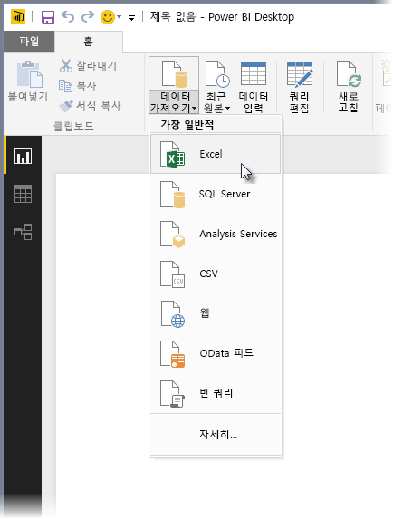

먼저 **Excel** 을 선택하고 통합 문서로 이동한 다음 선택합니다. 쿼리가 통합 문서를 검사한 다음 찾은 데이터를 **탐색기** 창에 표시합니다.

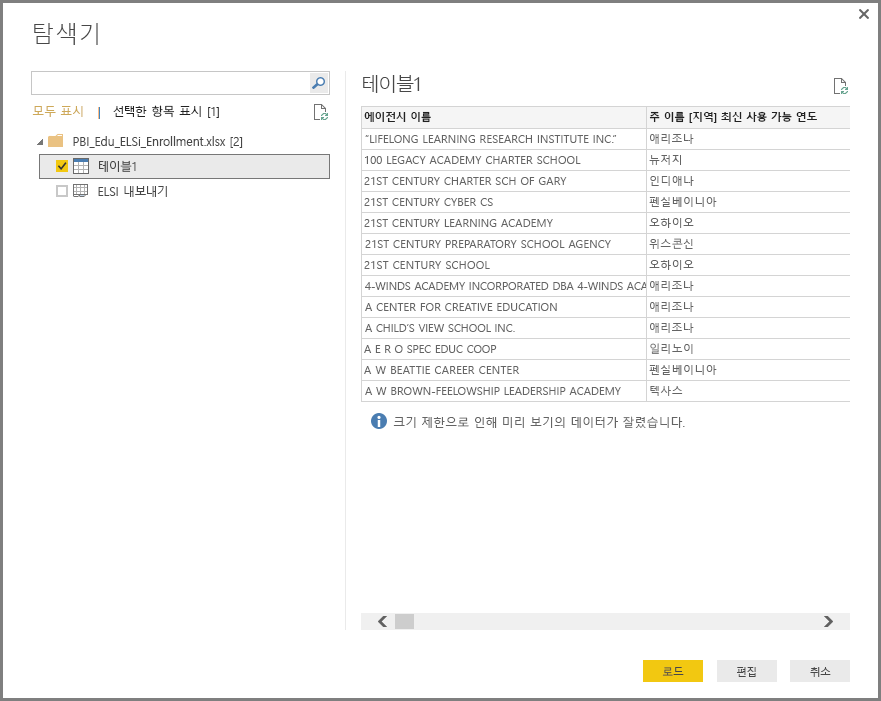

데이터를 Power BI Desktop에 로드하기 전에 **편집** 을 선택하여 데이터를 조정하거나 *구체화* 할 수 있습니다. 로드 전에 쿼리를 편집하는 기능은 로드 전에 축소하려는 큰 데이터 집합으로 작업할 때 특히 유용합니다. 이렇게 하기 위해 **편집**을 선택합니다.

다양한 형식의 데이터에 연결하는 것도 그만큼 용이합니다. 웹 리소스에도 연결하려고 합니다. **데이터 가져오기 \> 자세히...** 를 선택한 다음 **기타 \> 웹**을 선택합니다.

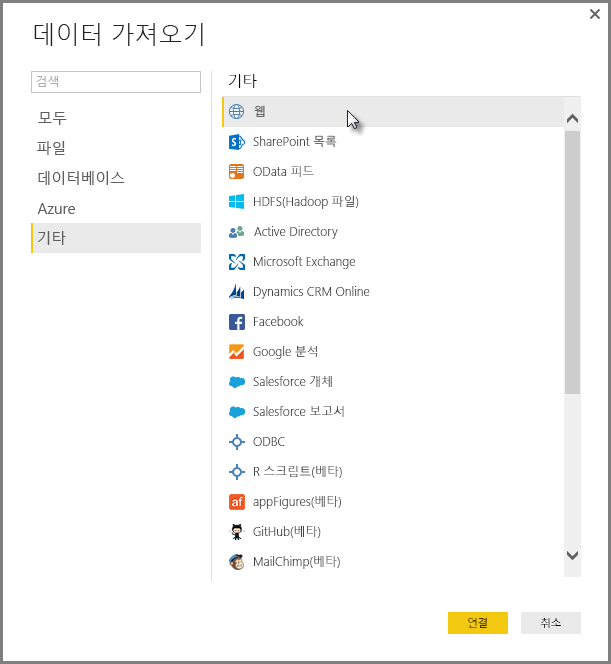

웹 페이지의 URL을 입력할 수 있는 **웹** 창이 나타납니다.

**O확인**,을 선택하면, 이전처럼 Power BI Desktop이 통합 문서를 검사하고 찾은 데이터를 **탐색기** 창에 표시합니다.

다른 데이터 연결도 비슷합니다. 데이터 연결에 인증이 필요한 경우 Power BI Desktop이 적절한 자격 증명을 묻는 메시지를 표시합니다.

Power BI Desktop에서 데이터에 연결하는 단계별 데모를 보려면 [Power BI Desktop에서 데이터에 연결](https://docs.microsoft.com/en-us/power-bi/desktop-connect-to-data)을 참조하세요.

## 데이터 모양 지정 및 결합
쉽게 데이터 모양을 지정하고 쿼리 편집기와 결합할 수 있습니다. 이 섹션에는 데이터 모양을 지정할 수 있는 방법의 몇 가지 예가 포함되어 있습니다. 데이터를 셰이핑하고 결합하는 방법의 전체 데모를 보려면 **[Shape and Combine Data with Power BI Desktop](https://docs.microsoft.com/en-us/power-bi/desktop-shape-and-combine-data)**(Power BI Desktop을 사용하여 데이터 셰이핑 및 결합)을 참조하세요.

이전 섹션에서는 두 개의 데이터 집합, 즉 Excel 통합 문서와 웹 리소스를 연결했습니다. 쿼리 편집기에 로드된 후 선택된 웹 페이지의 쿼리를 사용하여 다음과 같이 표시됩니다([쿼리 편집기] 창 왼쪽의 **쿼리** 창에 나열된 사용 가능한 쿼리에서 가져옴).

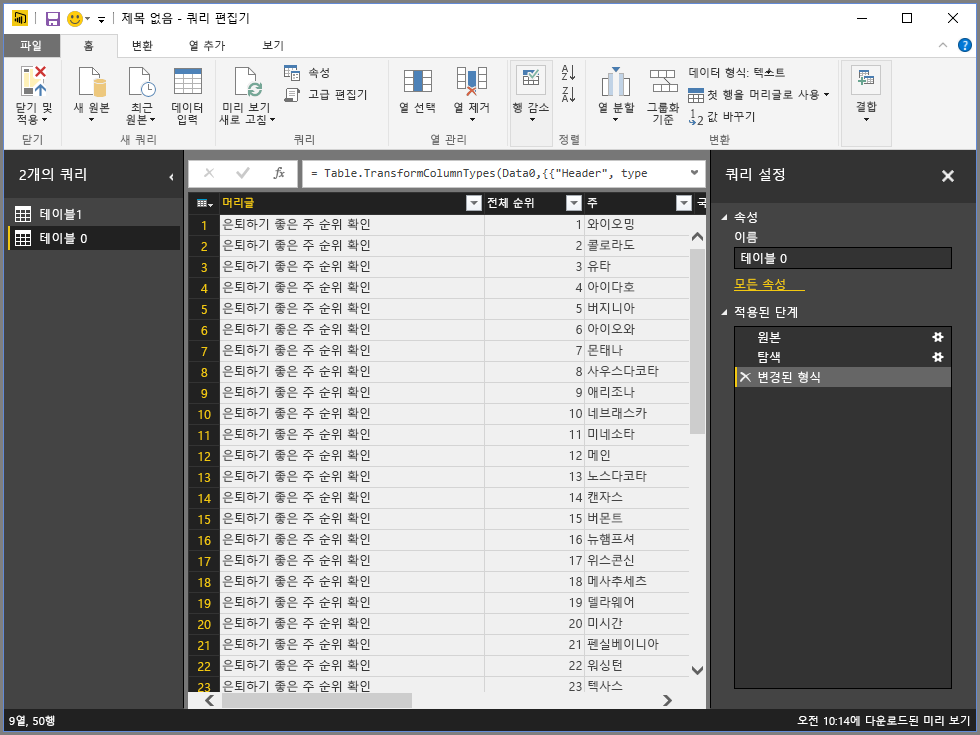

데이터 모양을 지정하는 경우 요구 사항에 맞는 형태와 형식으로 데이터 소스를 변환합니다. 이 경우 *헤더*라는 첫 번째 열이 필요하지 않으므로 제거하겠습니다.

**쿼리 편집기**에서 리본 메뉴와 상황에 맞는 오른쪽 클릭 메뉴를 통해 많은 명령을 사용할 수 있습니다. 예를 들어 *Header* 열을 마우스 오른쪽 단추로 클릭할 때 나타나는 메뉴를 사용하여 열을 제거할 수 있습니다. 열을 선택한 다음, 리본에서 **열 제거** 단추를 선택할 수도 있습니다.

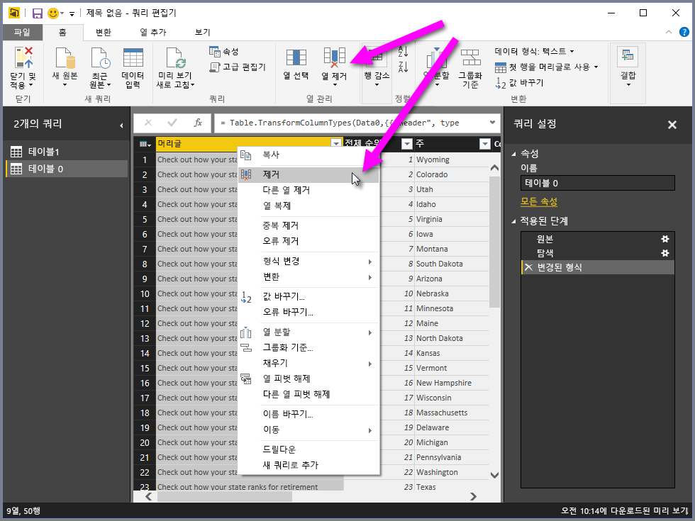

여러 가지 다른 방법으로 이 쿼리의 데이터의 모양을 지정할 수 있습니다. 맨 위나 맨 아래에서 행을 원하는 개수만큼 제거하고 열 추가, 열 분할, 값 바꾸기 및 기타 모양 지정 작업을 수행하여 쿼리 편집기가 원하는 데이터를 가져오도록 할 수 있습니다.

## 행 그룹화
쿼리 편집기에서 여러 행의 값을 단일 값으로 그룹화할 수 있습니다. 이 기능은 제공된 제품 수, 총 판매액 또는 학생 수를 요약하는 경우에 유용할 수 있습니다.

이 예제에서는 교육 등록 데이터 집합의 행을 그룹화합니다. Excel 통합 문서에서 데이터를 가져오며, 필요한 열만 가져오도록 쿼리 편집기에서 모양을 지정하고, 테이블 이름을 바꾸고, 몇 가지 다른 변환을 수행했습니다.

각 주에 있는 기관 수(학군 및 지역 서비스 구역 등의 기타 교육 기관 포함)를 알아보겠습니다. *State Abbr* (주 약어) 열을 선택한 다음 리본의 **변환** 탭 또는 **홈** 탭에서 **그룹화 방법** 단추를 선택합니다(**그룹화 방법** 은 두 탭에서 모두 제공함).

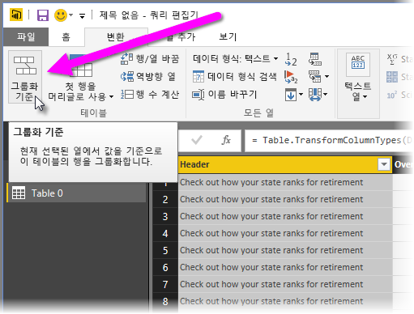

**그룹화 방법...** 창이 나타납니다. 쿼리 편집기는 행을 그룹화할 때 **그룹화 방법** 결과를 배치할 새 열을 만듭니다. 다음과 같은 방법으로 **그룹화 방법** 작업을 조정할 수 있습니다.

1. ‘그룹화’ – 그룹화할 열입니다. 쿼리 편집기가 선택된 열을 선택하지만 이 창의 열을 테이블의 임의 열로 변경할 수 있습니다.
2. *새 열 이름* – 쿼리 편집기가 그룹화되는 열에 적용하는 작업에 따라 새 열의 이름을 제안하지만 새 열의 이름을 원하는 대로 지정할 수 있습니다.
3. *작업* – 여기서 쿼리 편집기가 적용하는 작업을 지정합니다.
4. ‘그룹화 추가’ 및 ‘집계 추가’ - **고급** 옵션을 선택한 후 이 옵션이 표시됩니다. 여러 열에 대해 그룹화 작업(**그룹화** 작업)을 수행하고, 모두 **그룹화** 창 내에서 하나의 작업으로 여러 집계를 수행할 수 있습니다. 쿼리 편집기가 여러 열에서 작동하는 새 열(이 창에서 선택한 항목 기반)을 만듭니다. 

**그룹화 추가** 또는 **집계 추가** 단추를 선택하여 **그룹화 기준** 작업에 다른 그룹화 또는 집계를 추가합니다. **...** 아이콘을 선택하고 **삭제**를 선택하여 그룹화 또는 집계를 제거할 수 있으므로 시도해 보고 어떻게 표시되는지 확인합니다.
   
   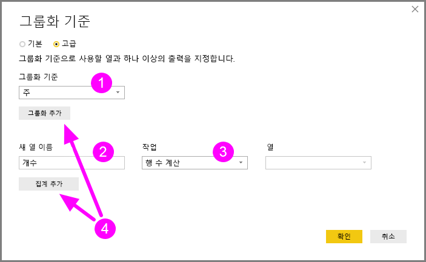

**확인**을 선택하면 쿼리가 **그룹화 방법** 작업을 수행하고 결과를 반환합니다. 이제 Ohio, Texas, Illinois, California에 각각 교육 기관이 1000개 이상 있습니다.

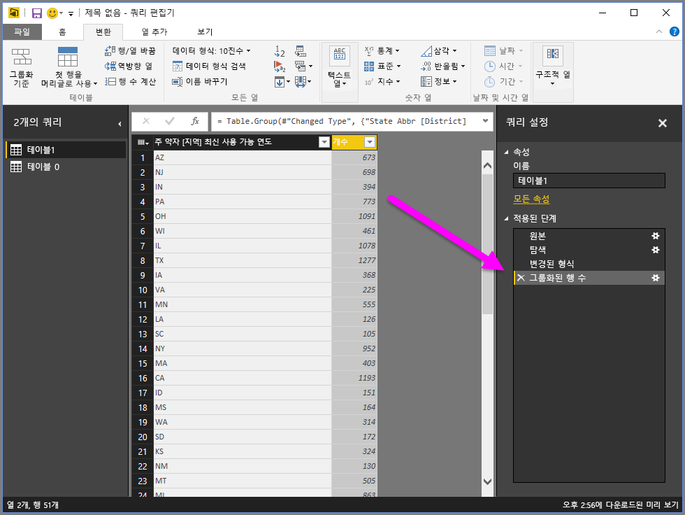

또한 쿼리 편집기를 사용하면 언제든지 방금 완료한 단계 옆에 있는 **X** 를 선택하여 마지막 셰이핑 작업을 제거할 수 있습니다. 계속해서 시도해 보고, 결과가 만족스럽지 않을 경우 쿼리 편집기에서 데이터가 원하는 모양으로 지정될 때까지 단계를 다시 실행합니다.

## 열 피벗
Power BI Desktop을 사용하면 열을 피벗하고, 열의 각 고유 값에 대해 집계된 값을 포함하는 테이블을 만들 수 있습니다. 예를 들어 각 제품 범주에 있는 제품 수를 알아야 하는 경우 이 작업을 정확하게 수행하는 테이블을 신속하게 만들 수 있습니다.

예를 살펴보겠습니다. 다음 **제품** 테이블은 각 고유 제품(이름) 및 각 제품이 속하는 범주만 표시하도록 모양이 지정되었습니다. *CategoryName* 열을 기반으로 하여 각 범주에 대한 제품 개수를 표시하는 새 테이블을 만들려면 열을 선택한 다음 리본 메뉴의 **변환** 탭에서 **열 피벗** 을 선택합니다.

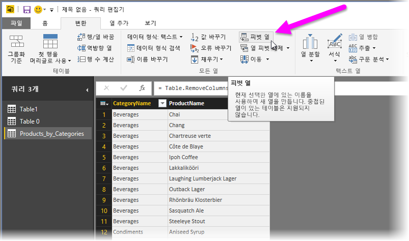

**열 피벗** 창이 표시되어 새 열을 만드는 데 사용되는 열 값을 알리고(1), **고급 옵션** 을 확장하면(2) 집계 값에 적용될 함수를 선택할 수 있습니다(3).

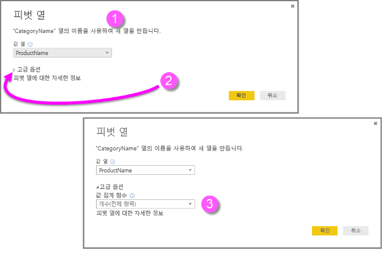

**확인**을 선택하면 쿼리가 **열 피벗** 창에 제공된 변환 지침에 따라 테이블을 표시합니다.

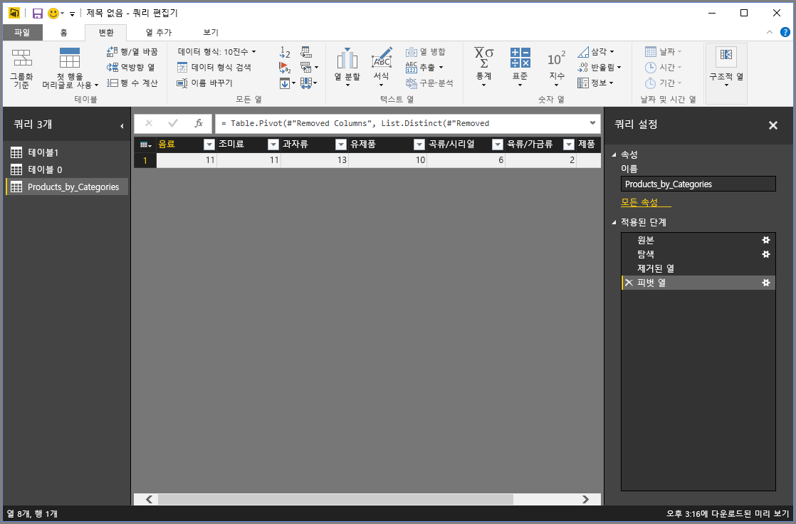

## 사용자 지정 열 만들기
쿼리 편집기에서 테이블의 여러 열에 대해 작동하는 사용자 지정 수식을 만든 다음 이러한 수식의 결과를 새(사용자 지정) 열에 배치할 수 있습니다. 쿼리 편집기를 사용하면 사용자 지정 열을 쉽게 만들 수 있습니다.

쿼리 편집기에서 리본의 **열 추가** 탭에 있는 **사용자 지정 열**을 선택합니다.

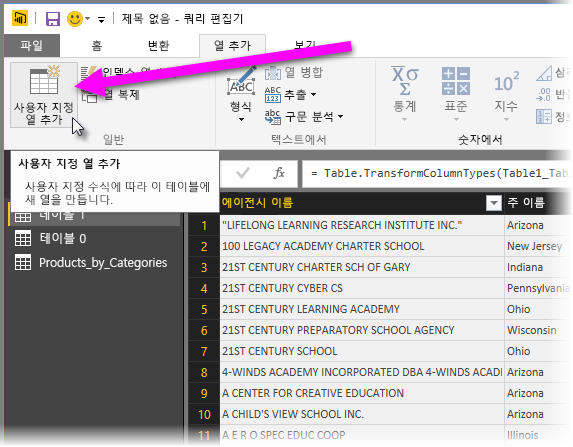

다음과 같은 창이 나타납니다. 다음 예제에서는 ELL(영어 수강생)인 총 학생의 백분율을 계산하는 *Percent ELL* 이라는 사용자 지정 열을 만듭니다.

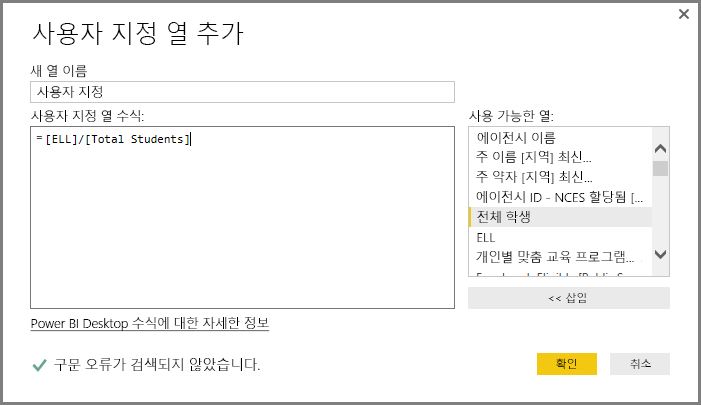

쿼리 편집기의 다른 적용된 단계와 마찬가지로 새 사용자 지정 열이 찾고 있는 데이터를 제공하지 않는 경우 **추가 사용자 지정** 단계 옆에 있는 **X** 를 선택하여 **쿼리 설정** 창의 **적용된 단계** 섹션에서 단계를 삭제할 수 있습니다.

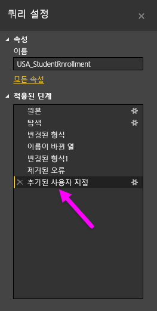

## 쿼리 수식
쿼리 편집기에서 생성되는 단계를 편집할 수 있으며, 사용자 지정 수식을 만들어 데이터 연결 및 셰이핑을 정확하게 제어할 수 있습니다. 쿼리 편집기에서 데이터에 관한 작업이 수행될 때마다 작업과 연결된 수식이 **수식 입력줄**에 표시됩니다. **수식 입력줄**을 보려면 리본 메뉴의 **보기** 탭에서 **수식 입력줄** 옆에 있는 확인란을 선택합니다.

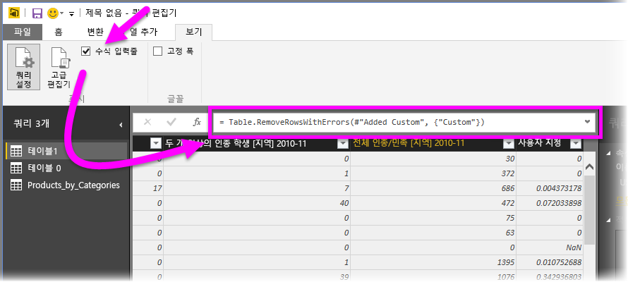

쿼리 편집기 각 쿼리에 대한 모든 적용된 단계를 사용자가 보거나 수정할 수 있는 텍스트로 유지합니다. 리본 메뉴의 **보기**탭에서 **고급 편집기** 를 선택할 때 표시되는 **고급 편집기** 를 사용하여 임의 쿼리에 대한 텍스트를 보거나 수정할 수 있습니다.

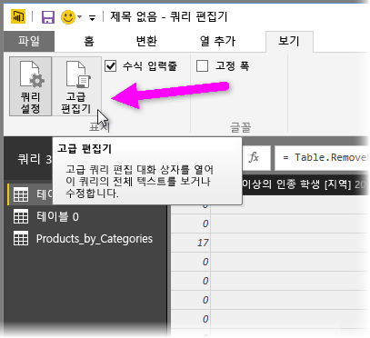

여기서는 **USA\_StudentEnrollment** 쿼리와 연결된 쿼리 단계가 표시된 **고급 편집기**를 살펴보겠습니다. 이러한 단계는 **M**이라고도 하는 파워 쿼리 수식 언어로 생성됩니다. 자세한 내용은 [파워 쿼리 수식에 대한 자세한 정보](https://support.office.com/article/Learn-about-Power-Query-formulas-6bc50988-022b-4799-a709-f8aafdee2b2f?ui=en-US&rs=en-US&ad=US)를 참조하세요. 언어 사양 자체를 보려면 [Microsoft Excel용 파워 쿼리 수식 언어 사양](http://go.microsoft.com/fwlink/?linkid=320633)을 참조하세요.

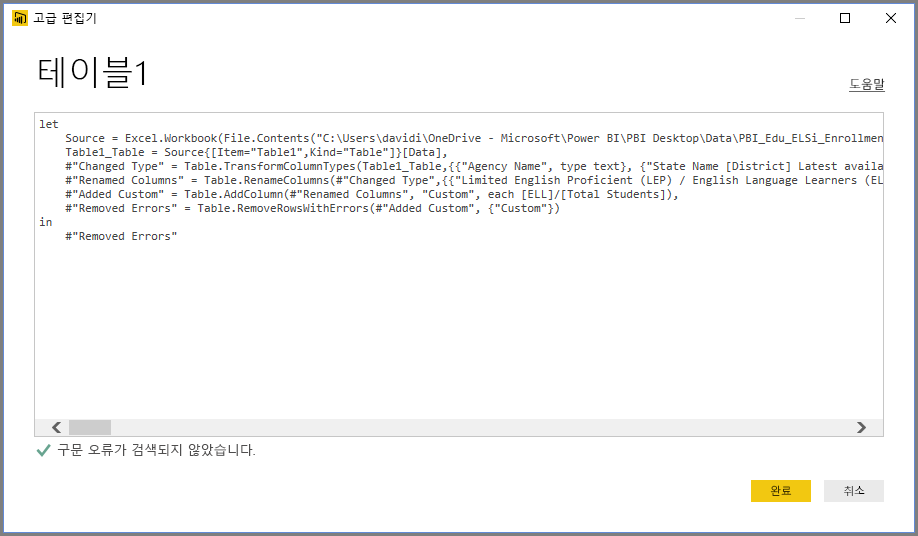

Power BI Desktop은 광범위한 수식 범주 집합을 제공합니다. 자세한 내용 및 모든 쿼리 편집기 수식의 전체 참조를 보려면 [파워 쿼리 수식 범주](https://support.office.com/en-in/article/Power-Query-formula-categories-125024ec-873c-47b9-bdfd-b437f8716819)를 참조하세요.

쿼리 편집기에 대한 수식 범주는 다음과 같습니다.

* 숫자
  * 상수
  * 정보
  * 변환 및 형식 지정
  * 형식
  * 반올림
  * 작업
  * 임의
  * 삼각 함수
  * 바이트
* 텍스트
  * 정보
  * 텍스트 비교
  * 추출
  * 수정
  * 멤버 자격
  * 변환
* 논리
* 날짜
* 시간
* 날짜/시간
* DateTimeZone
* 기간
* 레코드
  * 정보
  * 변환
  * 선택 영역
  * 직렬화
* 목록
  * 정보
  * 선택 영역
  * 변환
  * 멤버 자격
  * 작업 설정
  * 순서 지정
  * 평균
  * 더하기
  * 숫자
  * 생성기
* 테이블
  * 테이블 생성
  * 변환
  * 정보
  * 행 작업
  * 열 작업
  * 멤버 자격
* 값
* 산술 연산
* 매개 변수 형식
* 메타데이터
* 데이터 액세스
* URI
* 이진 형식
  * 숫자 읽기
* 이진
* 줄
* 식
* 함수
* 오류
* 비교자
* 분할자
* 조합기
* 치환
* 형식

## 다음 단계
Power BI Desktop에서 모든 종류의 작업을 수행할 수 있습니다. 해당 기능에 대한 자세한 내용은 다음 리소스를 확인하세요.

* [Power BI Desktop 시작](desktop-getting-started.md)
* [Power BI Desktop을 사용한 쿼리 개요](desktop-query-overview.md)
* [Power BI Desktop의 데이터 원본](desktop-data-sources.md)
* [Power BI Desktop에서 데이터에 연결](desktop-connect-to-data.md)
* [Power BI Desktop에서 데이터 셰이핑 및 결합](desktop-shape-and-combine-data.md)

