# 테이블에서 조건부 서식 지정 사용 

Power BI Desktop에서 테이블에 조건부 서식 지정을 사용하면 필드 값을 기반으로 하는 색 그라데이션을 비롯하여 사용자 지정 셀 색을 지정할 수 있습니다. 데이터 막대 또는 KPI 아이콘을 사용하거나 활성 웹 링크로 셀 값을 나타낼 수도 있습니다. 숫자, 색 이름 또는 16진수 코드, 웹 URL 값이 있는 필드를 서식 지정의 기반으로 사용하는 한 모든 텍스트 또는 데이터 필드에 조건부 서식 지정을 적용할 수 있습니다. 

조건부 서식 지정을 적용하려면 Power BI Desktop에서 **테이블** 또는 **행렬** 시각화를 선택합니다. **시각화** 창의 **필드** 섹션에서 마우스 오른쪽 단추를 클릭하거나 서식을 지정하려는 **값**의 필드 옆에 있는 아래쪽 화살표를 선택합니다. **조건부 서식 지정**을 선택하고 적용할 서식 지정 유형을 선택합니다.

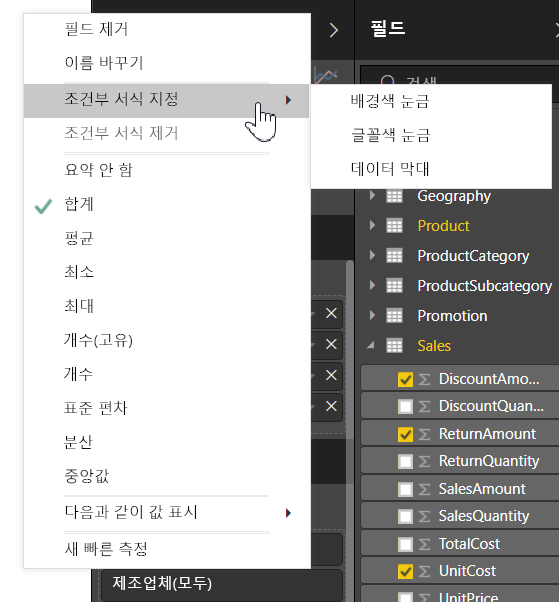

> [!NOTE]
> 조건부 서식 지정은 조건부로 서식 지정된 셀에 적용하는 모든 사용자 지정 배경색이나 글꼴 색을 재정의합니다.

시각화에서 조건부 서식 지정을 제거하려면 필드의 드롭다운 메뉴에서 **조건부 서식 지정 제거**를 선택하고 제거할 서식 지정 유형을 선택합니다.

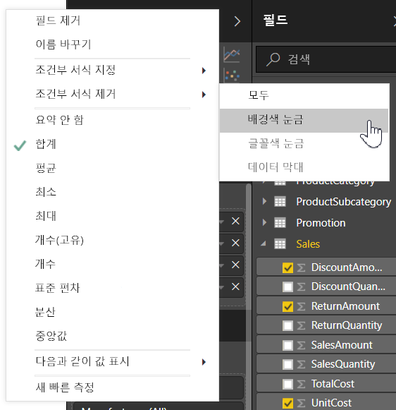

다음 섹션에서는 각각의 조건부 서식 지정 옵션에 대해 설명합니다. 하나의 테이블 열에서 두 개 이상의 옵션을 결합할 수 있습니다.

## 배경색 또는 글꼴 색 서식 지정

셀 배경색 또는 글꼴 색의 서식을 지정하려면 필드의 **조건부 서식 지정**을 선택하고 드롭다운 메뉴에서 **배경색** 또는 **글꼴 색**을 선택합니다. 

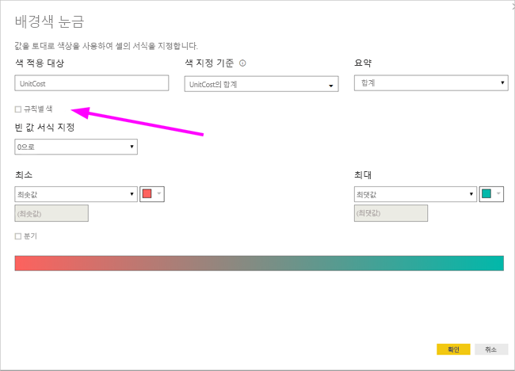

서식을 지정하는 필드의 이름이 제목에 포함되어 있는 **배경색** 또는 **글꼴 색** 대화 상자가 열립니다. 조건부 서식 지정 옵션을 선택한 후 **확인**을 선택합니다. 

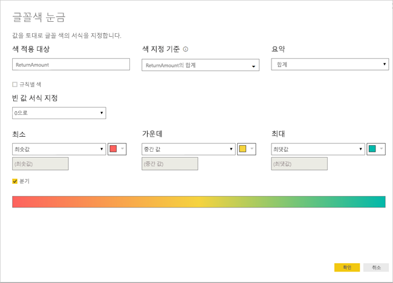

**배경색** 및 **글꼴 색** 옵션은 동일하지만 각각 셀 배경색과 글꼴 색에 영향을 줍니다. 필드의 글꼴 색과 배경색에 동일한 조건부 서식 지정을 적용할 수도 있고 서로 다른 조건부 서식 지정을 적용할 수도 있습니다. 필드의 글꼴과 배경을 동일한 색으로 지정하면 글꼴이 배경에 혼합되어 테이블 열에 색만 나타납니다.

## 색 눈금 기준 색 지정

색 눈금을 기준으로 셀 배경색 또는 글꼴 색을 서식 지정하려면 **배경색** 또는 **글꼴 색** 대화 상자의 **서식 지정 기준** 필드에서 **색 눈금**을 선택합니다. **필드 기준**에서 서식 지정 기준이 되는 필드를 선택합니다. 현재 필드 또는 숫자나 색 데이터가 있는 모델의 모든 필드를 서식 지정 기준으로 사용할 수 있습니다. 

선택한 필드에 사용할 집계 유형을 **요약**에서 지정합니다. **기본 서식 지정**에서 빈 값에 적용할 서식 지정을 선택합니다. 

**최소** 및 **최대**에서는 최저 및 최고 필드 값이나 입력한 사용자 지정 값을 기준으로 색 구성표를 적용할 것인지 여부를 선택합니다. 최소 및 최대 값에 적용할 색 견본을 드롭다운하여 선택합니다. **분기** 확인란을 선택하여 **중앙** 값 및 색도 지정합니다. 

**경제성** 열에 색 눈금 배경 서식 지정이 있는 예제 테이블은 다음과 같습니다.

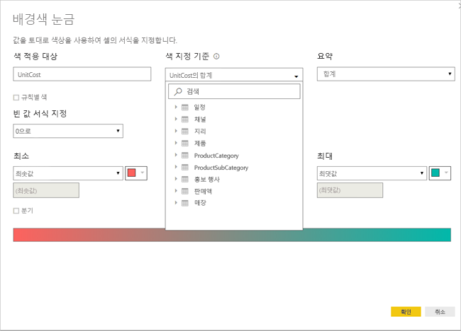

**경제성** 열에 색 눈금 글꼴 서식 지정이 있는 예제 테이블은 다음과 같습니다.

## 규칙별 색

규칙에 따라 셀 배경색 또는 글꼴 색을 서식 지정하려면 **배경색** 또는 **글꼴 색** 대화 상자의 **서식 지정 기준** 필드에서 **규칙**을 선택합니다. 다시 **필드 기준**에는 서식 지정 기준이 되는 필드가 표시되고 **요약**에는 필드의 집계 유형이 표시됩니다. 

**규칙**에서 값 범위를 하나 이상 입력하고 각 값 범위에 대해 색을 설정합니다. 각 값 범위에는 ‘If 값’ 조건, ‘and’ 값 조건 및 색이 있습니다.   각 값 범위의 셀 배경 또는 글꼴은 지정된 색으로 표시됩니다. 다음 예제에는 세 가지 규칙이 있습니다.

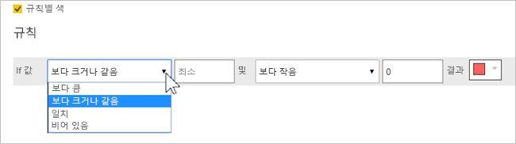

**경제성** 열에 규칙 기반 배경색 서식 지정이 있는 예제 테이블은 다음과 같습니다.

## 색 값 기준 색 지정

색 이름 또는 16진수 값 데이터가 포함된 필드나 측정값이 있는 경우 조건부 서식 지정을 사용하여 해당 색을 열 배경색이나 글꼴 색에 자동으로 적용할 수 있습니다. 사용자 지정 논리를 사용하여 글꼴 또는 배경에 색을 적용할 수도 있습니다.

필드는 [https://www.w3.org/TR/css-color-3/](https://www.w3.org/TR/css-color-3/)에 있는 CSS 색 사양에 나열된 모든 색 값을 사용할 수 있습니다. 해당 색 값에는 다음이 포함될 수 있습니다.
- 3, 6 또는 8자리 16진수 코드(예: #3E4AFF). 코드의 시작 부분에 # 기호를 포함해야 합니다. 
- RGB 또는 RGBA 값. 예를 들어 RGBA(234, 234, 234, 0.5)가 있습니다.
- HSL 또는 HSLA 값. 예를 들어 HSLA(123, 75%, 75%, 0.5)가 있습니다.
- 색 이름. Green, SkyBlue 또는 PeachPuff가 있습니다. 

다음 테이블에는 각 상태와 연결된 색 이름이 있습니다. 

해당 필드 값에 따라 **색** 열을 서식 지정하려면 **색** 필드의 **조건부 서식 지정**을 선택하고 **배경색** 또는 **글꼴 색**을 선택합니다. 

**배경색** 또는 **글꼴 색** 대화 상자에서 **서식 지정 기준** 드롭다운 필드의 **필드 값**을 선택합니다.

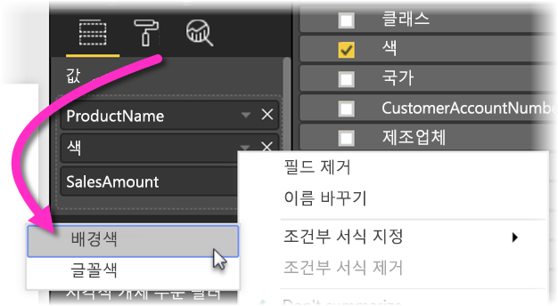

**색** 필드에 색 필드 값을 기준으로 한 **배경색** 서식 지정이 있는 예제 테이블은 다음과 같습니다.

**필드 값**을 사용하여 열 **글꼴 색**도 서식 지정하는 경우 **색** 열이 단색이 됩니다.

## 계산 기반 색 지정

선택한 비즈니스 논리 조건에 따라 서로 다른 값을 출력하는 DAX 계산을 만들 수 있습니다. DAX 수식을 만드는 것은 일반적으로 조건부 서식 지정 대화 상자에서 여러 규칙을 만드는 것보다 빠릅니다. 

예를 들어 다음 DAX 수식은 기존 **경제성** 열 값에 따라 새 **경제성 순위** 열에 16진수 색 값을 적용합니다.

색을 적용하려면 **경제성** 열에 대해 **배경색** 또는 **글꼴 색** 조건부 서식 지정을 선택하고 **경제성 순위** 열의 **필드 값**을 서식 지정 기준으로 사용합니다. 

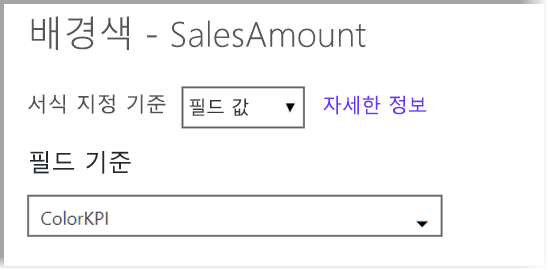

계산된 **경제성 순위**를 기반으로 **경제성** 배경색이 사용되는 예제 테이블은 다음과 같습니다.

상상력과 약간의 DAX만 사용하면 더 많은 변형을 만들 수 있습니다.

## 데이터 막대 추가

셀 값을 기반으로 데이터 막대를 표시하려면 **경제성** 필드에 대해 **조건부 서식 지정**을 선택하고 드롭다운 메뉴에서 **데이터 막대**를 선택합니다. 

**데이터 막대** 대화 상자의 **막대만 표시** 옵션은 기본적으로 선택 취소되어 있으므로 테이블 셀에 막대 및 실제 값이 둘 다 표시됩니다. 데이터 막대만 표시하려면 **막대만 표시** 확인란을 선택합니다.

**최소** 및 **최대** 값, 데이터 막대 색 및 방향, 축 색을 지정할 수 있습니다. 

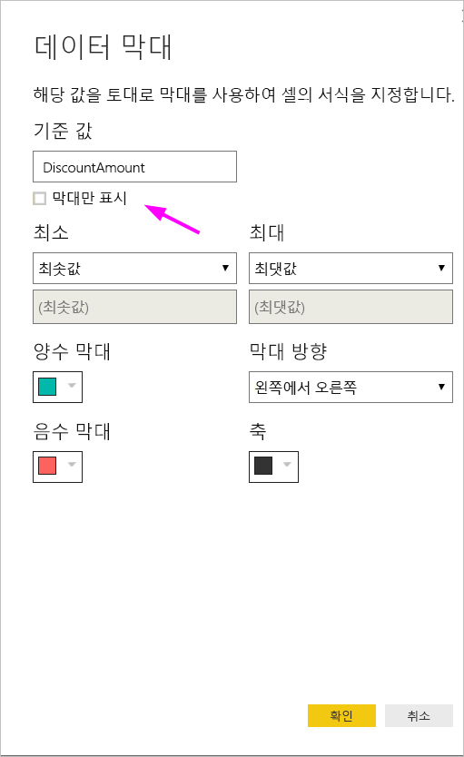

**경제성** 열에 데이터 막대가 적용된 예제 테이블은 다음과 같습니다.

## 아이콘 추가

셀 값을 기준으로 아이콘을 표시하려면 해당 필드에 대해 **조건부 서식 지정**을 선택하고 드롭다운 메뉴에서 **아이콘**을 선택합니다. 

**아이콘** 대화 상자의 **서식 지정 기준**에서 **규칙** 또는 **필드 값**을 선택합니다. 

규칙에 따라 서식 지정하려면 **필드 기준**, **요약** 방법, **아이콘 레이아웃**, **아이콘 정렬**, 아이콘 **스타일** 및 하나 이상의 **규칙**을 선택합니다. **규칙**에서 ‘If 값’ 조건과 ‘and’ 값 조건이 포함된 규칙을 하나 이상 입력하고 각 규칙에 적용할 아이콘을 선택합니다.   

필드 값에 따라 서식 지정하려면 **필드 기준**, **요약** 방법, **아이콘 레이아웃** 및 **아이콘 정렬**을 선택합니다.

다음 예제에서는 세 가지 규칙에 따라 아이콘을 추가합니다.

**확인**을 선택합니다. 규칙에 따라 **경제성** 열에 아이콘이 적용되는 예제 테이블은 다음과 같습니다.

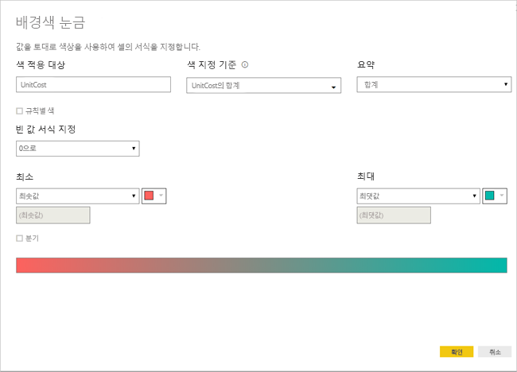

## 웹 URL로 서식 지정

웹 사이트 URL이 포함된 열 또는 측정값이 있는 경우 조건부 서식 지정을 사용하여 해당 URL을 필드에 활성 링크로 적용할 수 있습니다. 예를 들어 다음 테이블에는 각 상태에 대한 웹 사이트 URL이 포함된 **웹 사이트** 열이 있습니다.

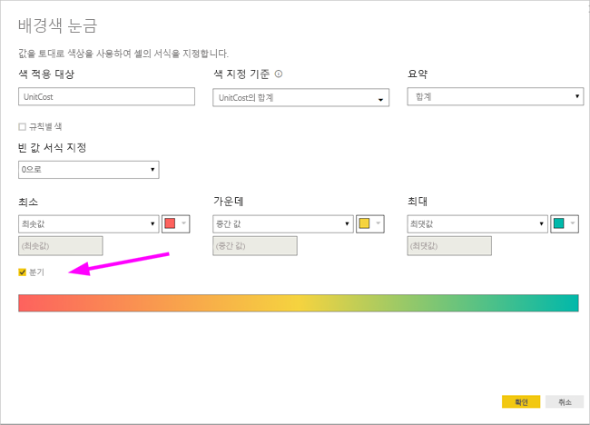

각 상태 이름을 해당 웹 사이트에 대한 라이브 링크로 표시하려면 **상태** 필드에 대해 **조건부 서식 지정**을 선택하고 **웹 URL**을 선택합니다. **웹 URL** 대화 상자의 **필드 기준**에서 **웹 사이트**를 선택하고 **확인**을 선택합니다. 

**상태** 필드에 **웹 URL** 서식 지정이 적용되면 각 상태 이름이 해당 웹 사이트에 대한 활성 링크가 됩니다. 다음 예제 테이블에서는 **상태** 열에 **웹 URL** 서식 지정이 적용되었고 **경제성** 열에 조건부 **데이터 막대** 및 **배경 서식 지정**이 적용되었습니다. 

## 고려 사항 및 제한 사항
조건부 테이블 형식으로 작업하는 경우 유의해야 하는 몇 가지 고려 사항이 있습니다.

- 조건부 서식 지정은 테이블 또는 행렬 시각적 개체의 값에만 적용되며 소계, 총합계 또는 **합계** 행에는 적용되지 않습니다. 
- 그룹화가 없는 테이블은 모두 조건부 서식 지정이 지원되지 않는 단일 행으로 표시됩니다.
- 데이터에 *NAN* 값이 포함되어 있으면 자동 최대/최소 값을 사용하는 그라데이션 서식 지정이나 백분율 규칙을 사용하는 규칙 기반 서식 지정을 적용할 수 없습니다. NAN은 “숫자가 아님”을 의미하며, 0으로 나누기 오류에 의해 발생하는 경우가 가장 많습니다. 이 오류를 피하기 위해 [DIVIDE() DAX 함수](https://docs.microsoft.com/dax/divide-function-dax)를 사용할 수 있습니다.
- 조건부 서식 지정에는 값에 적용할 집계 또는 측정값이 있어야 합니다. 그래서 **값 기준 색 지정** 예제에 ‘첫 번째’ 또는 ‘마지막’이 표시됩니다. 분석 서비스 다차원 큐브에 대해 보고서를 작성하는 경우 큐브 소유자가 값을 제공하는 측정값을 작성했어야 조건부 서식 지정에 특성을 사용할 수 있습니다.

## 다음 단계

색 서식 지정에 대한 자세한 내용은 [Power BI의 색 서식 지정을 위한 팁과 요령](visuals/service-tips-and-tricks-for-color-formatting.md)을 참조하세요.  

