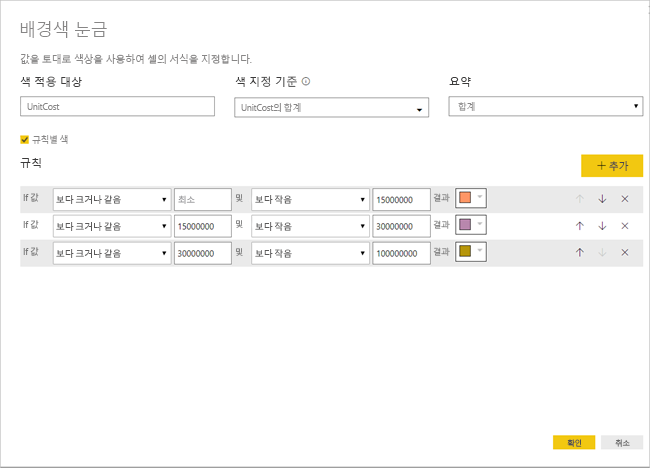

# 테이블에서 조건부 서식 지정 
테이블에 조건부 서식을 사용하면 셀 값을 기반으로 하거나 다른 값 또는 필드를 기반으로 하여 그라데이션 색을 사용하는 등 사용자 지정된 셀 색을 지정할 수 있습니다. 데이터 막대를 사용하여 셀 값을 표시할 수도 있습니다. 

조건부 서식 지정에 액세스하려면 Power BI Desktop에서 **시각화** 창의 **필드**에서 서식을 지정하려는 **값**의 값 옆에 있는 아래쪽 화살표를 선택합니다(또는 필드를 마우스 오른쪽 단추로 클릭). 필드에 대한 조건부 서식은 **필드**의 **값** 영역에서만 관리할 수 있습니다.

다음 섹션에서는 이러한 세 개의 조건부 서식 지정 옵션을 각각 설명합니다. 단일 테이블 열에 하나 이상의 옵션을 결합할 수 있습니다.

> [!NOTE]
> 테이블에 적용되는 경우 조건부 서식 지정은 조건에 따라 서식 지정된 셀에 적용된 사용자 지정 테이블 스타일을 재정의합니다.

시각화에서 조건부 서식 지정을 제거하려면 필드를 다시 마우스 오른쪽 단추로 클릭하고, **조건부 서식 지정 제거**를 선택한 다음, 제거할 서식 지정 형식을 선택합니다.

## 배경색 눈금

**조건부 서식 지정** 및 **배경색 눈금**을 차례로 선택하면 다음과 같은 대화 상자가 나타납니다.

해당 필드에 **기준 색**을 설정하여 색을 기준으로 할 데이터 모델의 필드를 선택할 수 있습니다. 또한 **요약** 값을 포함한 선택된 필드의 집계 형식을 지정할 수 있습니다. **색 적용 대상** 필드에서 색이 지정된 필드를 지정하므로 일관성을 유지할 수 있습니다. 숫자 값을 서식 지정 기준으로 선택하면 텍스트 및 날짜 필드에 조건부 서식 지정을 적용할 수 있습니다.

지정된 값 범위에 불연속 색상 값을 사용하려면 **규칙별 색**을 선택합니다. 색 스펙트럼을 사용하려면 **규칙별 색**을 선택하지 않은 채로 둡니다. 

### 규칙별 색

**규칙별 색**을 선택하는 경우 설정된 색에서 각각 하나 이상의 값 범위를 입력할 수 있습니다.  각 값 범위는 *If 값* 조건, *and* 값 조건 및 색으로 시작합니다.

각 범위의 값이 있는 테이블 셀은 지정된 색으로 채워집니다. 다음 그림에는 세 가지 규칙이 있습니다.

이제 예제 테이블은 다음과 같습니다.

### 색 최소값에서 최대값

*최소* 및 *최대* 값 및 해당 색을 구성할 수 있습니다. **분기** 상자를 선택하면 선택적인 *가운데* 값도 구성할 수 있습니다.

이제 예제 테이블은 다음과 같습니다.

## 글꼴색 눈금

**조건부 서식 지정** 및 **글꼴 색 눈금**을 차례로 선택하면 다음과 같은 대화 상자가 나타납니다. 이 대화 상자는 **배경 색 눈금** 대화 상자와 비슷하지만 셀 배경색이 아니라 글꼴 색을 변경합니다.

이제 예제 테이블은 다음과 같습니다.

## 데이터 막대

**조건부 서식 지정** 및 **데이터 막대**를 차례로 선택하면 다음과 같은 대화 상자가 나타납니다. 

기본적으로 **막대만 표시** 옵션을 선택하지 않으므로 테이블 셀은 막대 및 실제 값을 모두 보여줍니다.

**막대만 표시** 옵션이 선택되어 있으면 테이블 셀은 막대만을 표시합니다.

