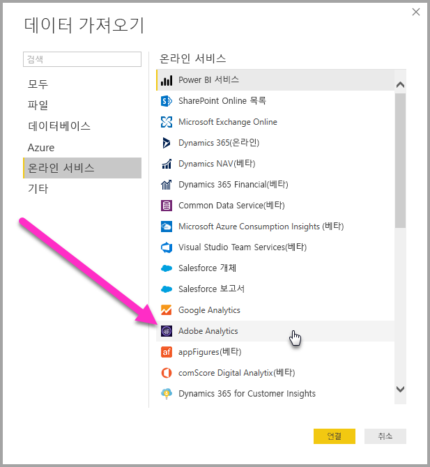
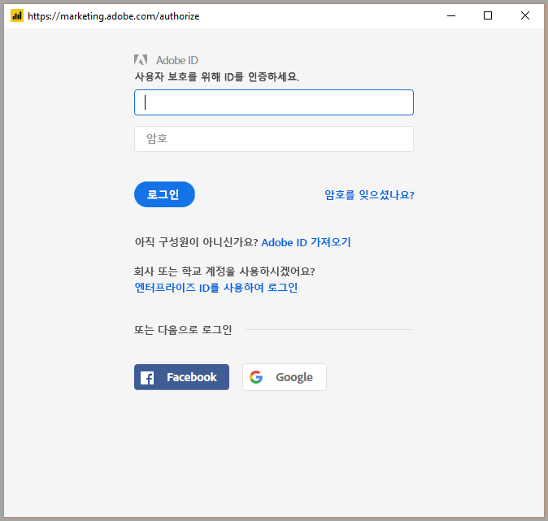
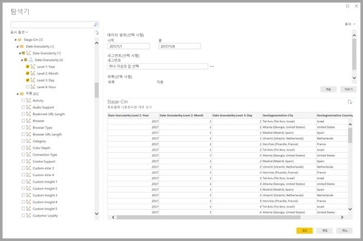
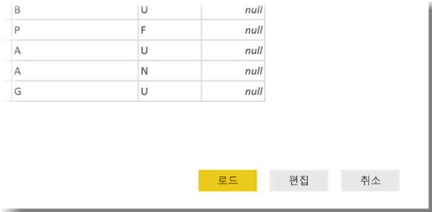

# Power BI Desktop(미리 보기)에서 Adobe Analytics에 연결
**Power BI Desktop**에서 **Adobe Analytics**에 연결하고 Power BI Desktop의 다른 데이터 원본처럼 기본 데이터를 사용할 수 있습니다. 

## Adobe Analytics 커넥터 미리 보기 사용 
**Adobe Analytics** 커넥터는 현재 미리 보기 상태이므로, **데이터 가져오기** 창에서 커넥터를 사용할 수 있도록 미리 보기 기능을 활성화해야 합니다. 커넥터 미리 보기를 사용하려면 Power BI Desktop에서 **파일 > 옵션 및 설정 > 옵션 > 미리 보기 기능**을 선택한 다음, **책갈피** 옆에 있는 확인란을 선택합니다. 

Adobe Analytics 커넥터 미리 보기를 사용하도록 선택한 후 **Power BI Desktop**을 다시 시작해야 합니다.

## Adobe Analytics 데이터에 연결
**Adobe Analytics** 데이터에 연결하려면 Power BI Desktop의 **홈** 리본 메뉴에서 **데이터 가져오기**를 선택합니다. 왼쪽에 있는 범주에서 **온라인 서비스**를 선택하면 **Adobe Analytics 커넥터**가 표시됩니다.

**Adobe Analytics** 창이 표시되면 **로그인** 단추를 선택하고 Adobe Analytics 계정에 로그인하기 위한 자격 증명을 제공합니다. 다음 이미지와 같이 Adobe 로그인 창이 나타납니다.

메시지가 표시되면 사용자 이름 및 암호를 입력합니다. 연결이 설정되면 Power BI **탐색기** 대화 상자 내에서 여러 차원과 측정값을 미리 보고 선택하여 단일 표 출력을 만들 수 있습니다. 선택한 항목에 필요한 모든 필수 입력 매개 변수를 제공할 수도 있습니다. 

선택된 테이블을 **로드**하여 전체 테이블을 **Power BI Desktop**에 가져오거나 쿼리를 **편집**하여 **쿼리 편집기**를 열고 사용하려는 데이터의 집합을 필터링하고 재정의한 후 조정된 데이터 집합을 **Power BI Desktop**에 로드할 수 있습니다.

## 다음 단계
Power BI Desktop을 사용하여 연결할 수 있는 모든 종류의 데이터가 있습니다. 데이터 원본에 대한 자세한 내용은 다음 리소스를 확인하세요.

* [Power BI Desktop 시작](desktop-getting-started.md)
* [Power BI Desktop의 데이터 원본](desktop-data-sources.md)
* [Power BI Desktop에서 데이터 셰이핑 및 결합](desktop-shape-and-combine-data.md)
* [Power BI Desktop에서 Excel 통합 문서에 연결](desktop-connect-excel.md)   
* [Power BI Desktop에 데이터 직접 연결](desktop-enter-data-directly-into-desktop.md)   

