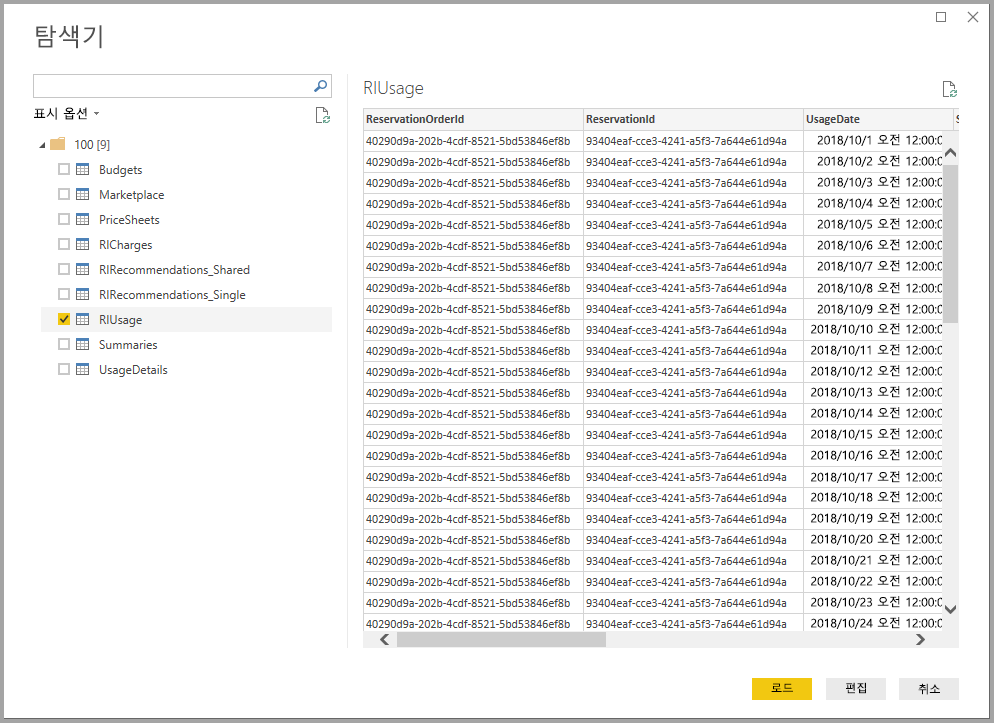

# Power BI Desktop(베타)의 Azure Consumption Insights에 연결
**Azure Consumption Insights** 커넥터에서 **Power BI Desktop**을 사용하여 Azure에 연결하고 조직의 Azure 서비스 사용에 대한 심층 분석 데이터 및 정보를 가져옵니다. 또한 측정값, 사용자 지정 열, 시각적 개체를 만들어 조직의 Azure 사용에 대해 보고하고 공유할 수 있습니다. **Azure Consumption Insights** 커넥터의 이 릴리스는 베타 상태이며 변경될 수 있습니다.

이 문서에서는 **Azure Consumption Insights** 커넥터를 사용하여 연결하고 필요한 데이터를 가져오는 방법, Azure 엔터프라이즈 커넥터를 사용하여 마이그레이션하는 방법을 알아봅니다. 그러면 **ACI**(Azure Consumption Insights) API 매핑에서 사용할 수 있는 *사용 정보 열*을 매핑할 수 있습니다.

## Azure Consumption Insights에 연결
**Azure Consumption Insights** 커넥터를 사용하여 성공적으로 연결하려면 Azure Portal 내에서 엔터프라이즈 기능에 액세스해야 합니다.

**Azure Consumption Insights** 커넥터를 사용하여 연결하려면 **Power BI Desktop**의 **홈** 리본에서 **데이터 가져오기**를 선택합니다. 왼쪽에 있는 범주에서 **온라인 서비스**를 선택하면 **Microsoft Azure Consumption Insights(베타)** 가 표시됩니다. **연결**을 선택합니다.

나타나는 대화 상자에서 *등록 번호*를 제공합니다.

* 다음 이미지에 표시된 위치에서 [Azure Enterprise Portal](https://ea.azure.com)의 등록 번호를 가져올 수 있습니다.
  
  
  
  이 버전의 커넥터는 https://ea.azure.com 에서 엔터프라이즈 등록을 지원합니다. 중국 등록은 현재 지원되지 않습니다.

다음으로 연결할 *선택키*를 제공합니다.

* [Azure Enterprise Portal](https://ea.azure.com)에서 등록을 위한 선택키를 찾을 수 있습니다.
  
  

‘액세스 키’를 제공하고 **연결**을 선택하면 **탐색기** 창이 나타나고 사용할 수 있는 9개의 테이블이 표시됩니다. 
* **예산**: 예산 세부 정보를 제공하여 기존 예산 목표 대비 실제 비용 및 사용을 봅니다. 
* **MarketPlace**: 사용량 기반 Azure Marketplace 요금을 제공합니다.
* **PriceSheets**: 등록에 적용되는 미터별 요금을 제공합니다.
* **RICharges**: 지난 24개월 동안 예약 인스턴스와 관련된 요금을 제공합니다.
* **RIRecommendations_Single**: 지난 7일, 30일 또는 60일 동안 단일 구독에서 사용량 추세를 기반으로 예약 인스턴스 구매 권장 사항을 제공합니다.
* **RIRecommendations_Shared**: 지난 7일, 30일 또는 60일 동안 모든 구독에서 사용량 추세를 기반으로 예약 인스턴스 구매 권장 사항을 제공합니다.
* **RIUsage**: 지난 한 달 동안 기존 예약 인스턴스에 대한 소비 세부 정보를 제공합니다.
* **Summaries**: 잔액, 새 구매, Azure Marketplace 서비스 요금, 조정, 초과분 요금에 대한 월별 요약을 제공합니다.
* **UsageDetails**: 등록에 대해 사용한 수량 및 예상 요금 내역을 제공합니다.

테이블 옆에 있는 확인란을 선택하여 미리 보기를 확인할 수 있습니다. 해당 이름 옆에 있는 확인란을 선택하여 하나 이상의 테이블을 선택한 다음 **부하**를 선택할 수 있습니다.

> [!NOTE]
> *요약* 및 *가격표* 테이블은 등록 수준 API 키에 사용할 수 있습니다. 또한 이러한 테이블의 데이터에는 기본적으로 *사용량* 및 *PriceSheet*의 현재 달의 데이터가 있습니다. *요약* 및 *MarketPlace* 테이블은 현재 월에 제한되지 않습니다.
> 
> 

**부하**를 선택하는 경우 데이터는 **Power BI Desktop**으로 로드됩니다.  커넥터는 테이블의 기본 기간에 따라 데이터를 로드합니다.  기간을 사용자 지정해야 하는 경우 [사용자 지정 쿼리를 설정할 수 있습니다](https://docs.microsoft.com/power-bi/desktop-connect-azure-consumption-insights#using-azure-consumption-insights).

선택한 데이터가 로드되면 선택한 테이블 및 필드를 **필드** 창에서 볼 수 있습니다.

## Azure Consumption Insights 사용
**Azure Consumption Insights** 커넥터를 사용하려면 Azure Portal 내에서 엔터프라이즈 기능에 액세스해야 합니다.

**Azure Consumption Insights** 커넥터를 사용하여 데이터를 성공적으로 로드하면 **쿼리 편집기**를 사용하여 고유한 사용자 지정 측정값 및 열을 만들 수 있고 **Power BI 서비스**에서 공유할 수 있는 시각적 개체, 보고서 및 대시보드를 만들 수 있습니다.

Azure에는 비어 있는 쿼리를 사용하여 검색할 수 있는 샘플 사용자 지정 쿼리의 컬렉션이 포함되어 있습니다. 이렇게 하려면 **Power BI Desktop**의 **홈** 리본에서 **데이터 가져오기**의 드롭다운 화살표를 선택한 후 **빈 쿼리**를 선택합니다. 왼쪽에서 **쿼리** 창을 마우스 오른쪽 단추로 클릭하고 나타나는 메뉴에서 **새 쿼리 > 빈 쿼리**를 선택하여 **쿼리 편집기**에서 이 작업을 수행할 수 있습니다.

**수식 입력줄**에 다음을 입력합니다.

    = MicrosoftAzureConsumptionInsights.Contents

다음 이미지에 나와 있는 대로 샘플의 컬렉션이 나타납니다.

보고서를 사용하고 쿼리를 만드는 경우 다음을 사용합니다.

* 현재 날짜부터 시작하여 개월 수를 정의하려면 *numberOfMonth*를 사용합니다.
  * 1~36 사이의 값을 사용하여 현재 날짜에서 가져오려는 개월 수를 나타냅니다. 임계값을 방지하기 위해 Power BI에서 쿼리에 허용되는 가져오기 제약 및 데이터 볼륨을 조건으로 12개월 이하의 데이터를 가져오는 것이 좋습니다.
* 기록 시간 창에서 일정 기간을 정의하려면 *startBillingDataWindow* 및 *endBillingDataWindow*를 사용합니다.
* *startBillingDataWindow* 또는 *endBillingDataWindow*와 함께 *numberOfMonth*를 사용하지 *않습니다*.

## Azure 엔터프라이즈 커넥터에서 마이그레이션
일부 고객이 *Azure 엔터프라이즈 커넥터(베타)* 를 사용하여 만든 시각적 개체는 결국 중단될 예정이며 **Azure Consumption Insights** 커넥터로 바뀝니다. **Azure Consumption Insights** 커넥터에는 다음을 포함하여 기능 및 향상된 기능이 있습니다.

* *균형 요약* 및 *Marketplace 구매*에 사용할 수 있는 추가 데이터 원본
* *startBillingDataWindow* 및 *endBillingDataWindow*와 같은 새 고급 매개 변수
* 성능 및 응답성 향상

최신 **Azure Consumption Insights** 커넥터에 대한 고객 전환을 도와 사용자 지정 대시보드 또는 보고서를 만드는 작업을 유지하기 위해 다음 단계에서는 새 커넥터로 이동하는 방법을 보여줍니다.

### 1단계: 새 커넥터를 사용하여 Azure에 연결
첫 번째 단계는 이 문서의 앞부분에서 자세히 설명한 **Azure Consumption Insights** 커넥터를 사용하여 연결하는 것입니다. 이 단계에서 **Power BI Desktop**의 **홈** 리본에서 **데이터 가져오기 > 빈 쿼리**를 선택합니다.

### 2단계: 고급 편집기를 사용하여 쿼리 만들기
**쿼리 편집기**에 있는 **홈** 리본의 **쿼리** 섹션에서 **고급 편집기**를 선택합니다. **고급 편집기** 창이 나타나면 다음 쿼리를 입력합니다.

    let    
        enrollmentNumber = "100",
        optionalParameters = [ numberOfMonth = 6, dataType="DetailCharges" ],
        data = MicrosoftAzureConsumptionInsights.Contents(enrollmentNumber, optionalParameters)   
    in     
        data

물론, [Azure Enterprise Portal](https://ea.azure.com)에서 가져올 수 있는 등록 번호로 *enrollmentNumber* 값을 대체해야 합니다. *numberOfMonth* 매개 변수는 현재 데이터에서 돌아가려는 데이터 개월 수입니다. 이번 달에 0을 사용합니다.

**고급 편집기** 창에서 **완료**를 선택하면 미리 보기가 새로 고쳐지고 테이블에서 지정된 개월 범위의 데이터를 확인합니다. **닫기 및 적용**을 선택하고 반환합니다.

### 3단계: 새 보고서에 측정값 및 사용자 지정 열 이동
다음으로 사용자 지정 열이나 만든 측정값을 새로운 세부 정보 테이블로 이동해야 합니다. 단계는 다음과 같습니다.

1. 메모장(또는 다른 텍스트 편집기)을 엽니다.
2. 이동하려는 측정값을 선택하고 *수식* 필드에서 텍스트를 복사하고 메모장에 붙여넣습니다.
   
   
3. *Query1*을 원래 세부 정보 테이블 이름으로 바꿉니다.
4. 테이블을 마우스 오른쪽 단추로 클릭하고 **새 측정값**을 선택하여 테이블에 새 측정값 및 사용자 지정 열을 만들고 모두 완료할 때까지 저장소 측정값과 열을 잘라 붙여넣습니다.

### 4단계: 관계 있는 테이블 다시 연결
여러 대시보드에는 날짜 테이블 또는 사용자 지정 프로젝트에 사용되는 테이블과 같이 조회나 필터링에 사용되는 추가 테이블이 있습니다. 이러한 관계를 다시 설정하면 대부분의 나머지 문제가 해결됩니다. 방법은 다음과 같습니다.

- **Power BI Desktop**의 **모델링** 탭에서 **관계 관리**를 선택하면 모델 내에서 관계를 관리할 수 있는 창이 표시됩니다. 필요에 따라 테이블을 다시 연결합니다.
   
    

### 5단계: 시각적 개체 확인 및 필요에 따라 필드 서식 조정
여기까지 오면 대부분의 원본 시각적 개체, 테이블 및 드릴다운은 예상 대로 작동해야 합니다. 그러나 원하는 모양으로 서식을 지정하기 위해 몇 가지 사소한 변경이 필요할 수 있습니다. 각 대시보드 및 시각적 개체를 원하는 모양으로 표시하려면 조회하는 데 잠시 시간이 걸립니다.

## ACI(Azure 소비 및 정보) API를 사용하여 소비 데이터 가져오기
또한 Azure는 [**ACI(Azure 소비 및 정보) API**](https://azure.microsoft.com/blog/announcing-general-availability-of-consumption-and-charge-apis-for-enterprise-azure-customers/)를 제공합니다. ACI API를 사용하여 Azure 사용량 정보를 수집, 보고 및 시각화하도록 고유한 사용자 지정 솔루션을 만들 수 있습니다.

### 포털, 커넥터 및 API 간에 이름 및 사용 세부 정보 매핑
Azure Portal의 열 및 세부 정보 이름은 API 및 커넥터와 유사하지만 항상 동일하지는 않습니다. 명확히 하기 위해 다음 표에서는 Azure Portal에 표시되는 API, 커넥터 및 열 간에 매핑을 제공합니다. 또한 열이 사용되지 않았는지 여부를 표시합니다. 자세한 내용과 이러한 용어의 정의는 [Azure 청구 데이터 사전](https://docs.microsoft.com/azure/billing/billing-enterprise-api-usage-detail)을 살펴보세요.

| ACI 커넥터/ContentPack ColumnName | ACI API 열 이름 | EA 열 이름 | 사용되지 않음/이전 버전과의 호환성 표시 |
| --- | --- | --- | --- |
| AccountName |accountName |계정 이름 |아니요 |
| AccountId |accountId | |예 |
| AcccountOwnerId |accountOwnerEmail |AccountOwnerId |아니요 |
| AdditionalInfo |additionalInfo |AdditionalInfo |아니요 |
| AdditionalInfold | | |예 |
| 사용한 수량 |consumedQuantity |사용한 수량 |아니요 |
| 사용한 서비스 |consumedService |사용한 서비스 |아니요 |
| ConsumedServiceId |consumedServiceId | |예 |
| 비용 |cost |ExtendedCost |아니요 |
| 비용 센터 |costCenter |비용 센터 |아니요 |
| 날짜 |날짜 |날짜 |아니요 |
| 일 | |일 |아니요 |
| DepartmentName |departmentName |부서 이름 |아니요 |
| DepartmentID |departmentId | |예 |
| Instance ID | | |예 |
| InstanceId |instanceId |Instance ID |아니요 |
| 위치 | | |예 |
| 미터 범주 |meterCategory |미터 범주 |아니요 |
| 미터 ID | | |예 |
| 미터 이름 |meterName |미터 이름 |아니요 |
| 미터 지역 |meterRegion |미터 지역 |아니요 |
| 미터 하위 범주 |meterSubCategory |미터 하위 범주 |아니요 |
| MeterId |meterId |미터 ID |아니요 |
| 월 | |월 |아니요 |
| 제품 |제품 |제품 |아니요 |
| ProductId |productId | |예 |
| 리소스 그룹 |resourceGroup |리소스 그룹 |아니요 |
| 리소스 위치 |resourceLocation |리소스 위치 |아니요 |
| ResourceGroupId | | |예 |
| ResourceLocationId |resourceLocationId | |예 |
| ResourceRate |resourceRate |ResourceRate |아니요 |
| ServiceAdministratorId |serviceAdministratorId |ServiceAdministratorId |아니요 |
| ServiceInfo1 |serviceInfo1 |ServiceInfo1 |아니요 |
| ServiceInfo1Id | | |예 |
| ServiceInfo2 |serviceInfo2 |ServiceInfo2 |아니요 |
| ServiceInfo2Id | | |예 |
| 저장소 서비스 식별자 |storeServiceIdentifier |저장소 서비스 식별자 |아니요 |
| StoreServiceIdentifierId | | |예 |
| 구독 이름 |subscriptionName |구독 이름 |아니요 |
| 태그 |tags |태그 |아니요 |
| TagsId | | |예 |
| 측정 단위 |unitOfMeasure |측정 단위 |아니요 |
| 연도 | |연도 |아니요 |
| SubscriptionId |subscriptionId |SubscriptionId |예 |
| SubscriptionGuid |subscriptionGuid |SubscriptionGuid |아니요 |

## 다음 단계
Power BI Desktop을 사용하여 연결할 수 있는 모든 종류의 데이터가 있습니다. 데이터 원본에 대한 자세한 내용은 다음 리소스를 확인하세요.

* [Power BI Desktop이란?](desktop-what-is-desktop.md)
* [Power BI Desktop의 데이터 원본](desktop-data-sources.md)
* [Power BI Desktop에서 데이터 셰이핑 및 결합](desktop-shape-and-combine-data.md)
* [Power BI Desktop에서 Excel 통합 문서에 연결](desktop-connect-excel.md)   
* [Power BI Desktop에 데이터 직접 연결](desktop-enter-data-directly-into-desktop.md)   

