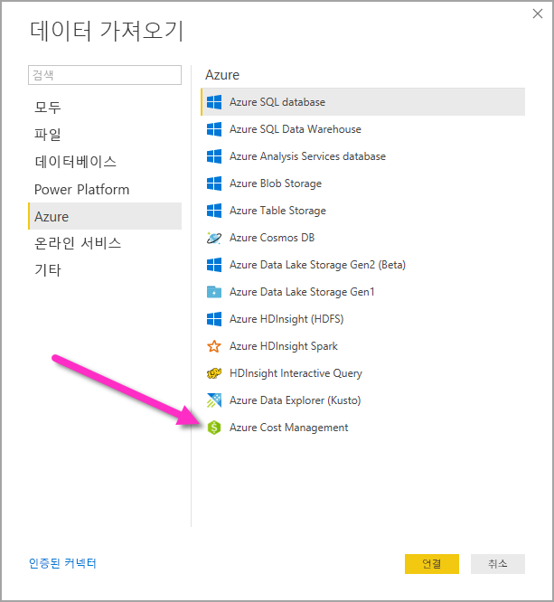
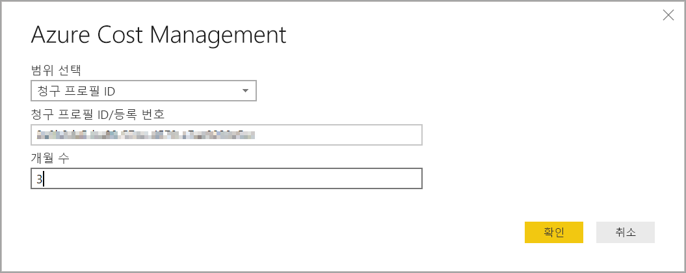
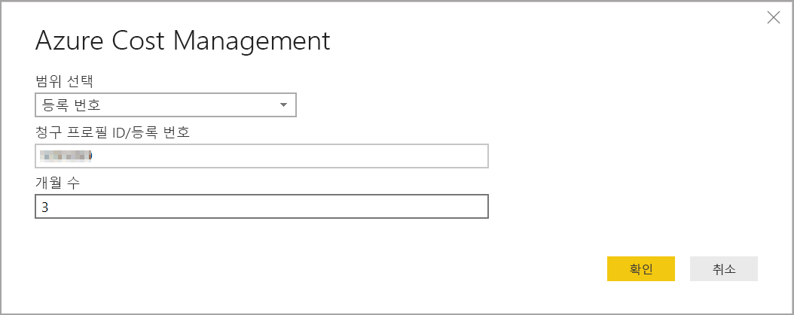

# Power BI Desktop에서 Azure Cost Management에 연결

Power BI Desktop용 Azure Cost Management 커넥터를 사용하여 Azure 지출을 보다 잘 이해할 수 있는 사용자 지정된 강력한 시각화와 보고서가 가능해집니다. Azure Cost Management 커넥터는 현재 [Microsoft 고객 계약](https://azure.microsoft.com/pricing/purchase-options/microsoft-customer-agreement/) 또는 [기업계약(EA)](https://azure.microsoft.com/pricing/enterprise-agreement/)으로 고객을 지원합니다.  

Azure Cost Management 커넥터는 Azure 인증에 OAuth 2.0을 사용하며, 커넥터를 사용하려는 사용자를 확인합니다. 이 프로세스에서 생성된 토큰은 일정 기간 동안 유효합니다. Power BI는 다음 로그인을 위해 토큰을 유지합니다. OAuth 2.0은 이러한 사용 권한을 안전하게 처리하기 위해 백그라운드에서 실행되는 프로세스의 표준입니다. 연결하기 위해, 기업계약을 위한 [엔터프라이즈 관리자](https://docs.microsoft.com/azure/billing/billing-understand-ea-roles) 계정 또는 Microsoft 고객 계약을 위한 [청구 계정 소유자](https://docs.microsoft.com/azure/billing/billing-understand-mca-roles)를 사용해야 합니다. 

> [!NOTE]
> 이 커넥터는 이전에 제공된 [Azure Consumption Insights 및 Azure Cost Management(베타)](desktop-connect-azure-consumption-insights.md) 커넥터를 대체합니다. 이전 커넥터를 사용하여 만든 모든 보고서는 이 커넥터를 사용하여 다시 만들어야 합니다.

## Azure Cost Management를 사용하여 연결

Power BI Desktop에서 **Azure Cost Management 커넥터**를 사용하려면 다음 단계를 수행합니다.

1.  **홈** 리본에서 **데이터 가져오기**를 선택합니다.
2.  데이터 범주 목록에서 **Azure**를 선택합니다.
3.  **Azure Cost Management**를 선택합니다.

    

4. 표시되는 대화 상자에서 **Microsoft 고객 계약**용 **청구 프로필 ID** 또는 **기업계약(EA)** 용 **등록 번호**를 입력합니다. 

## Microsoft 고객 계약 계정에 연결 

**Microsoft 고객 계약** 계정에 연결하려면 Azure 포털에서 **청구 프로필 ID**를 가져올 수 있습니다.

1.  [Azure Portal](https://portal.azure.com/)에서 **Cost Management + 청구**로 이동합니다.
2.  청구 프로필을 선택합니다. 
3.  메뉴의 **설정** 아래에 사이드바에서 **속성**을 선택합니다.
4.  **청구 프로필**에서 **ID**를 복사합니다. 
5.  **범위 선택**에 대해 **청구 프로필 ID**를 선택하고 이전 단계의 청구 프로필 ID를 붙여넣습니다. 
6.  개월 수를 입력하고 **확인**을 선택합니다.

    

7.  메시지가 표시되면 Azure 사용자 계정 및 암호를 사용하여 로그인합니다. 

## 기업계약 계정에 연결

기업계약(EA) 계정에 연결하기 위해 Azure 포털에서 등록 ID를 가져올 수 있습니다.

1.  [Azure Portal](https://portal.azure.com/)에서 **Cost Management + 청구**로 이동합니다.
2.  청구 계정을 선택합니다.
3.  **개요** 메뉴에서 **청구 계정 ID**를 복사합니다.
4.  **범위 선택**에 대해 **등록 번호**를 선택하고 이전 단계의 청구 계정 ID를 붙여넣습니다. 
5.  개월 수를 입력한 다음 **확인**을 선택합니다.

    

6.  메시지가 표시되면 Azure 사용자 계정 및 암호를 사용하여 로그인합니다. 

## 커넥터를 통해 사용할 수 있는 데이터

성공적으로 인증되면 다음과 같은 사용 가능한 데이터 테이블과 함께 **탐색기** 창이 나타납니다.

| **테이블** | **설명** |
| --- | --- |
| **잔액 요약** | 기업계약(EA)에 대한 잔액 요약입니다. |
| **청구 이벤트** | 새 송장, 크레딧 구매 등의 이벤트 로그입니다. Microsoft 고객 계약에만 해당합니다. |
| **Budgets** | 기존 예산 목표 대비 실제 비용 또는 사용량을 보기 위한 예산 정보입니다. |
| **요금** | Azure 사용량, 마켓플레이스 요금 및 개별 청구 요금의 월별 요약입니다. Microsoft 고객 계약에만 해당합니다. |
| **크레딧 로트** | 제공된 청구 프로필에 대한 Azure 크레딧 로트 구매 정보입니다. Microsoft 고객 계약에만 해당합니다. |
| **Pricesheets** | 제공된 청구 프로필 또는 EA 등록에 적용 가능한 미터 요율입니다. |
| **RI 요금** | 지난 24개월 동안 예약 인스턴스와 관련된 요금입니다. |
| **RI 권장 사항(공유)** | 지난 7일, 30일 또는 60일 동안의 모든 구독 사용량 추세를 기반으로 하는 예약 인스턴스 구매 권장 사항입니다. |
| **RI 권장 사항(단일)** | 지난 7일, 30일 또는 60일 동안의 단일 구독 사용량 추세를 기반으로 하는 예약 인스턴스 구매 권장 사항입니다. |
| **RI 사용량 세부 정보** | 지난 한 달 동안의 기존 예약 인스턴스 소비 정보입니다. |
| **RI 사용량 요약** | 일별 Azure 예약 사용 백분율. |
| **사용량 세부 정보** | EA 등록에서 지정된 청구 프로필에 대해 사용한 수량 및 예상 요금 내역입니다. |
| **사용량 세부 정보 분할 상환** | EA 등록에서 지정된 청구 프로필에 대해 사용한 수량 및 분할 상환된 요금 내역입니다. |

테이블을 선택하여 미리 보기 대화 상자를 볼 수 있습니다. 해당 이름 옆에 있는 확인란을 선택하여 하나 이상의 테이블을 선택한 다음 **로드**를 선택할 수 있습니다.

**로드**를 선택하면, 데이터가 Power BI Desktop에 로드됩니다. 

선택한 데이터가 로드되면, 데이터 테이블 및 필드가 **필드** 창에 표시됩니다.

## 다음 단계

Power BI Desktop을 사용하여 다양한 데이터 원본에 연결할 수 있습니다. 자세한 내용은 다음 아티클을 참조하세요.

* [Power BI Desktop이란?](desktop-what-is-desktop.md)
* [Power BI Desktop의 데이터 원본](desktop-data-sources.md)
* [Power BI Desktop에서 데이터 셰이핑 및 결합](desktop-shape-and-combine-data.md)
* [Power BI Desktop에서 Excel 통합 문서에 연결](desktop-connect-excel.md)   
* [Power BI Desktop에 데이터 직접 연결](desktop-enter-data-directly-into-desktop.md)   
