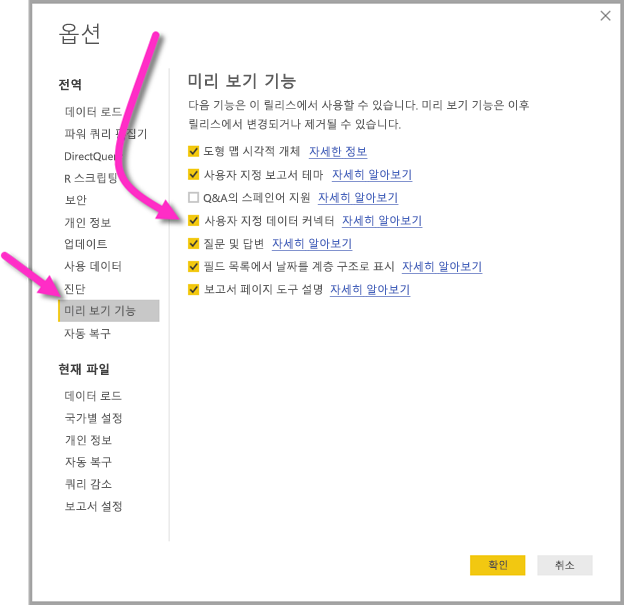

# Power BI Desktop에서 Power BI 데이터 흐름을 통해 만든 데이터에 연결(미리 보기)
**Power BI Desktop**에서 Power BI Desktop의 다른 데이터 원본처럼 **Power BI 데이터 흐름**에서 만든 데이터에 연결할 수 있습니다.

**Power BI 데이터 흐름(미리 보기)** 커넥터를 사용하면 Power BI 서비스의 데이터 흐름으로 만든 엔터티에 연결할 수 있습니다. 데이터 흐름이 미리 보기로 있으므로 시스템에서 데이터 흐름 커넥터를 사용하려면 몇 가지 단계를 수행해야 합니다. 

## Power BI 데이터 흐름 커넥터 다운로드 및 사용 설정(미리 보기)

**Power BI 데이터 흐름** 커넥터의 복사본을 다운로드하여 컴퓨터의 특정 위치에 복사해야 합니다. Power BI Desktop에 대한 향후의 월간 업데이트에서 커넥터는 데이터 커넥터 목록에 자동으로 포함되며 이때에는 이러한 단계가 필요하지 않습니다.

[Power BI 데이터 흐름 커넥터](https://visuals.azureedge.net/cds-analytics/PublicPreview/CDSA.mez) 위치에서 **Power BI 데이터 흐름 커넥터**를 다운로드할 수 있습니다.

컴퓨터에서 **Power BI 데이터 흐름** 커넥터(미리 보기)를 사용할 수 있게 하려면 다음 단계를 수행합니다.

1. .MEZ 파일(데이터 커넥터 파일)의 복사본을 다운로드합니다. 비공개 미리 보기 고객은 Microsoft에서 .MEZ 파일에 대한 다운로드 정보를 직접 받게 됩니다.

2. 다운로드한 데이터 커넥터 파일을 컴퓨터의 **문서 > Power BI Desktop> 사용자 지정 커넥터 폴더**에 저장합니다.

3. Power BI Desktop에서 **파일 > 옵션 및 설정> 옵션**을 차례로 선택한 다음, 왼쪽 창에서 **미리 보기 기능**을 선택합니다.

    

4. 선택되지 않은 경우 **사용자 지정 데이터 커넥터** 상자를 선택합니다. 

5. 커넥터를 표시하기 위해 **Power BI Desktop**을 다시 시작합니다.

## Power BI 데이터 흐름 커넥터(미리 보기) 사용
**Power BI Desktop**을 다시 시작하면 커넥터가 사용 가능한 데이터 원본으로 표시됩니다. 데이터 풀에 연결하려면 다음 이미지와 같이 **데이터 가져오기 > 온라인 서비스 > Power BI 데이터 흐름(베타)** 을 차례로 선택합니다.

## 고려 사항 및 제한 사항

이 미리 보기 버전의 **Power BI 데이터 흐름 커넥터**를 사용하려면 최신 버전의 **Power BI Desktop**을 실행해야 합니다. [Power BI Desktop](desktop-get-the-desktop.md)은 언제든지 다운로드하고 컴퓨터에 설치하여 가장 최신 버전인지 확인할 수 있습니다.  

참고: Power BI 데이터 흐름 커넥터가 **Power BI Desktop**의 월간 업데이트에 표시되면 충돌을 방지하기 위해 **문서 > Power BI Desktop> 사용자 지정 커넥터** 폴더에서 이 다운로드한 .MEZ 파일을 *삭제해야 합니다*. 

## 다음 단계
Power BI 데이터 연결을 통해 수행할 수 있는 흥미로운 모든 종류의 항목뿐만 아니라 **Power BI Desktop**에 대한 유용한 문서가 있습니다.

* [Power BI Desktop의 데이터 원본](desktop-data-sources.md)
* [Power BI Desktop에서 데이터 셰이핑 및 결합](desktop-shape-and-combine-data.md)
* [Power BI Desktop에 데이터 직접 연결](desktop-enter-data-directly-into-desktop.md)   

