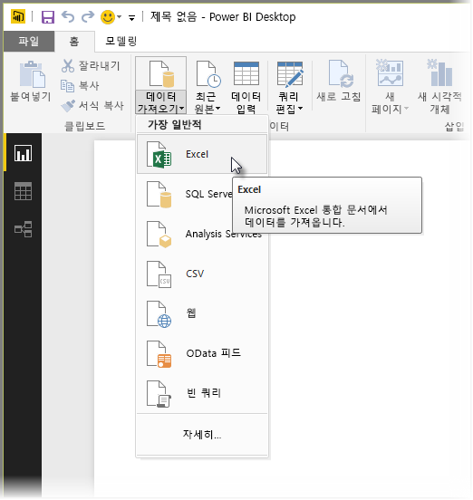
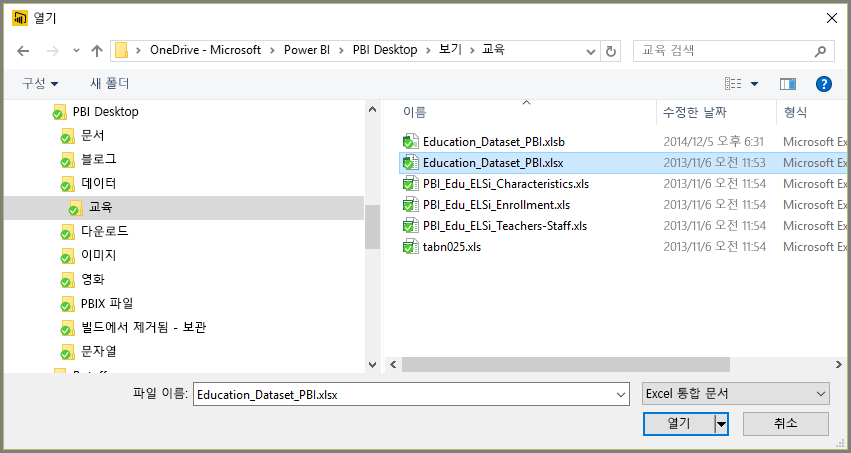
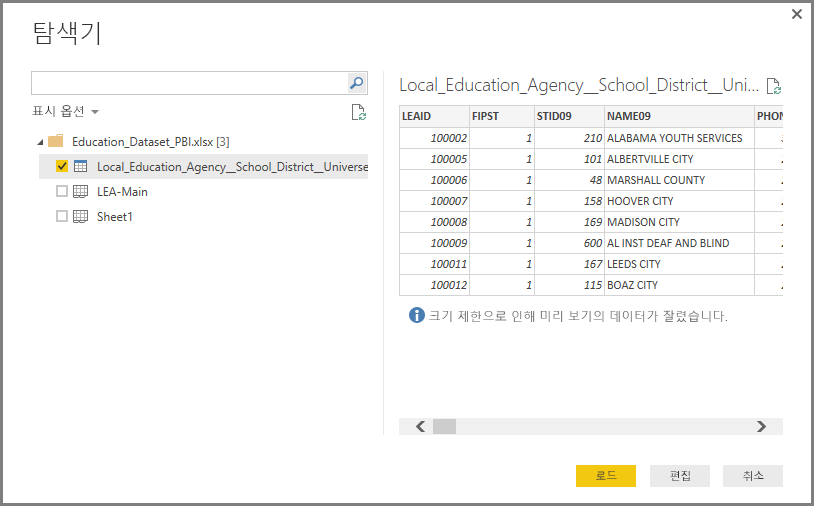
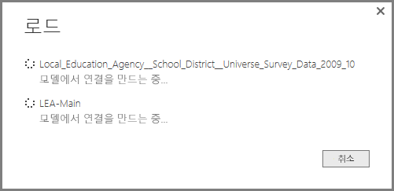
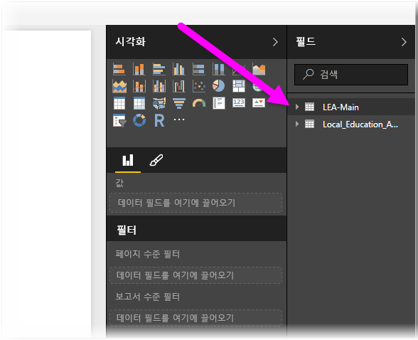

# Power BI Desktop에서 Excel에 연결
Power BI Desktop에서 Excel 통합 문서에 연결하는 것은 간단하며 이 문서에서는 이에 대한 단계를 안내합니다.

Power BI Desktop의 **홈** 리본에서 **데이터 가져오기 > Excel**을 선택합니다.

나타나는 **열기** 대화 상자에서 통합 문서를 선택합니다.

Power BI Desktop에 **탐색기** 창의 통합 문서에서 가져온 다른 데이터 요소에 대한 테이블이 표시됩니다. 왼쪽 창에서 테이블을 선택하면 데이터 미리 보기가 오른쪽 창에 나타납니다.

로드 단추를 선택하여 데이터를 가져오거나 Power BI Desktop으로 데이터를 가져오기 전에 **쿼리 편집기**를 사용하여 데이터를 편집하는 경우 **편집** 단추를 선택합니다.

데이터를 로드하면 Power BI Desktop에 **로드** 창이 표시되고 데이터 로딩과 관련된 활동이 표시됩니다.  

완료되면 Power BI Desktop에 **필드** 창의 Excel 통합 문서에서 가져온 테이블 및 필드가 Desktop의 오른쪽에 표시됩니다.

이것으로 끝입니다!

이제 Excel 통합 문서에서 가져온 데이터를 Power BI Desktop에서 사용하여 시각적 개체, 보고서를 만들거나 기타 Excel 통합 문서, 데이터베이스 또는 기타 데이터 원본처럼 연결 및 가져오려는 다른 모든 데이터를 조작할 수 있습니다.

## 다음 단계
Power BI Desktop을 사용하여 연결할 수 있는 모든 종류의 데이터가 있습니다. 데이터 원본에 대한 자세한 내용은 다음 리소스를 확인하세요.

* [Power BI Desktop이란?](desktop-what-is-desktop.md)
* [Power BI Desktop의 데이터 원본](desktop-data-sources.md)
* [Power BI Desktop에서 데이터 셰이핑 및 결합](desktop-shape-and-combine-data.md)
* [Power BI Desktop에서 CSV 파일에 연결](desktop-connect-csv.md)   
* [Power BI Desktop에 데이터 직접 연결](desktop-enter-data-directly-into-desktop.md)   

