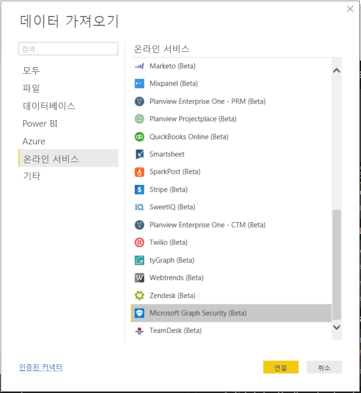
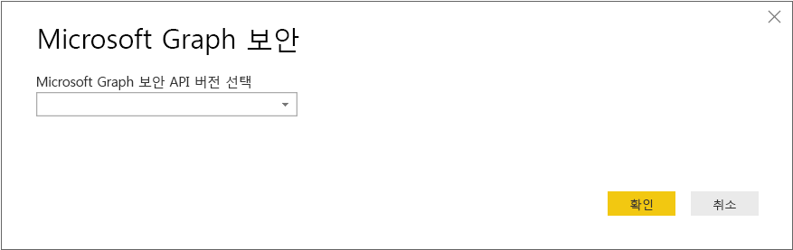
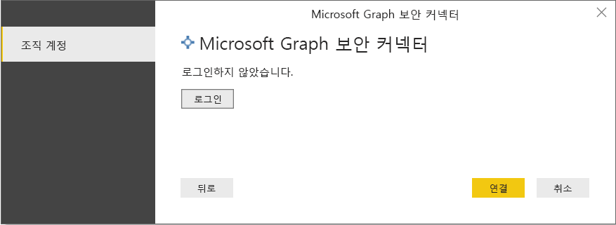
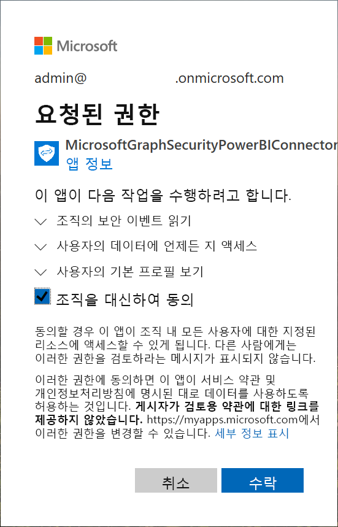
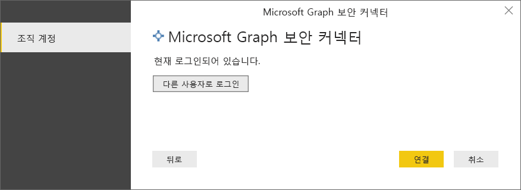
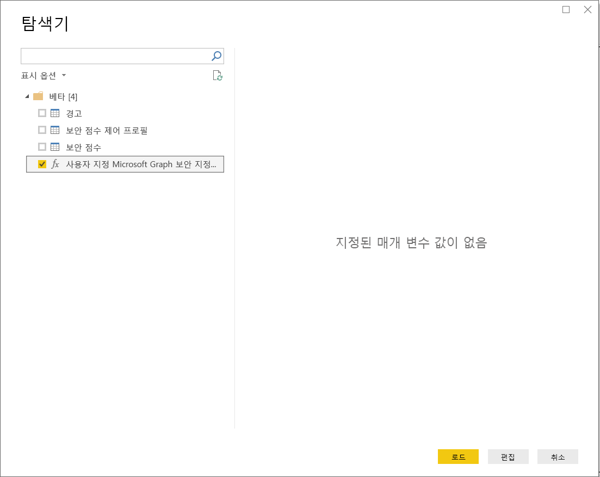
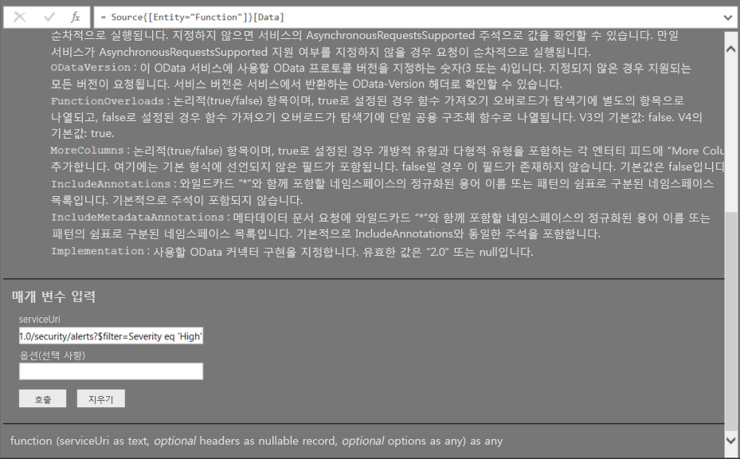
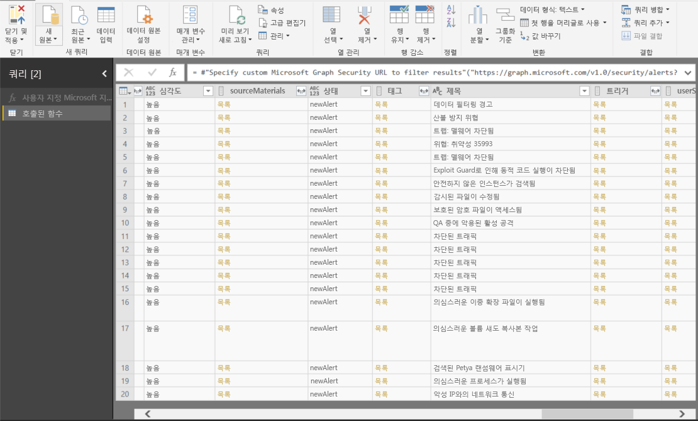

# Power BI Desktop에서 Microsoft Graph Security API에 연결

Power BI Desktop의 Microsoft Graph Security 커넥터를 사용하여 [Microsoft Graph Security API](https://aka.ms/graphsecuritydocs)에 연결합니다. 그런 다음, 대시보드 및 보고서를 빌드하여 보안 관련 [경고](https://docs.microsoft.com/graph/api/resources/alert?view=graph-rest-1.0) 및 [보안 점수](https://docs.microsoft.com/graph/api/resources/securescores?view=graph-rest-beta)에 대한 인사이트를 얻을 수 있습니다.

Microsoft Graph Security API는 Microsoft 및 해당 에코 시스템 파트너의 [여러 보안 솔루션](https://aka.ms/graphsecurityalerts)을 연결하여 경고의 상관 관계를 쉽게 설정합니다. 이 조합은 풍부한 컨텍스트 정보에 대한 액세스 권한을 제공하고 자동화를 간소화합니다. 이를 통해 조직은 비용과 복잡성을 줄이면서 여러 보안 제품에 대한 인사이트와 동작을 신속하게 얻을 수 있습니다.

## Microsoft Graph 보안 커넥터를 사용하기 위한 필수 구성 요소

Microsoft Graph 보안 커넥터를 사용하려면 Azure AD(Azure Active Directory) 테넌트 관리자가 *명시적으로* 동의해야 합니다. [Microsoft Graph 보안 인증 요구 사항](https://aka.ms/graphsecurityauth)을 참조하세요.
동의에는 다음에 인용된 [Azure Portal](https://portal.azure.com)에서 사용할 수 있는 커넥터의 애플리케이션 ID 및 이름이 필요합니다.

| 속성 | 값 |
|----------|-------|
| **애플리케이션 이름** | `MicrosoftGraphSecurityPowerBIConnector` |
| **애플리케이션 ID** | `cab163b7-247d-4cb9-be32-39b6056d4189` |
|||

커넥터에 대한 동의를 얻기 위해 Azure AD 테넌트 관리자는 다음 방법 중 하나를 사용할 수 있습니다.

* [Azure AD 애플리케이션 대한 동의 부여](https://docs.microsoft.com/azure/active-directory/develop/v2-permissions-and-consent)

* [애플리케이션-동의 환경](https://docs.microsoft.com/azure/active-directory/develop/application-consent-experience)을 통해 처음 실행하는 동안 논리 앱이 제출한 요청에 응답합니다.
   
사용자가 *보안 관리자* 역할의 구성원이 **아닌 경우** Microsoft Graph 보안 커넥터에 로그인하는 사용자 계정에 Azure AD 보안 읽기 권한자 역할을 할당해야 합니다. [사용자에게 Azure AD 역할 할당](https://docs.microsoft.com/graph/security-authorization#assign-azure-ad-roles-to-users)을 참조하세요.

## Microsoft Graph 보안 커넥터 사용

커넥터를 사용하려면 다음 단계를 수행합니다.

1. Power BI Desktop의 **홈** 리본에서 **데이터 가져오기** > **추가**를 선택합니다.
2. 창의 왼쪽에 있는 범주 목록에서 **온라인 서비스**를 선택합니다.
3. **Microsoft Graph 보안(베타)** 을 선택합니다.

    
    
4. **Microsoft Graph 보안** 창에서 쿼리할 Microsoft Graph API 버전(**v1.0** 또는 **베타**)을 선택합니다.

    
    
5. 메시지가 표시되면 Azure Active Directory 계정에 로그인합니다. 이 계정은 이전 섹션에서 언급한 대로 *보안 Reader* 또는 *보안 관리자* 역할이 있어야 합니다.

     
    
6. 테넌트 관리자*이고* 아직 Microsoft Graph Security Power BI 커넥터(애플리케이션)에 동의하지 않은 경우, 다음 대화 상자가 표시됩니다. **조직을 대신하여 동의**를 선택합니다.

    
    
7. 로그인하면 인증되었음을 나타내는 다음 대화 상자가 표시됩니다. **연결**을 선택합니다.

    
    
8. 연결하면 4단계에서 선택한 버전에 대한 [Microsoft Graph Security API](https://aka.ms/graphsecuritydocs)에서 사용할 수 있는 경고, 보안 점수 및 기타 엔터티가 **Navigator** 창에 표시됩니다. Power BI Desktop에서 가져오고 사용할 하나 이상의 엔터티를 선택합니다. 그런 다음, **로드**를 선택하여 9단계 이후에 표시되는 결과 보기를 가져옵니다.

    
    
9. Microsoft Graph Security API에서 고급 쿼리를 사용하려면 **사용자 지정 Microsoft Graph Security URL을 지정하여 결과 필터링**을 선택합니다. 이 함수를 사용하여 [OData.Feed](https://docs.microsoft.com/power-bi/desktop-connect-odata) 쿼리를 필요한 권한이 있는 Microsoft Graph Security API에 발급합니다.

   다음 예제에서는 `https://graph.microsoft.com/v1.0/security/alerts?$filter=Severity eq 'High'` *serviceUri*를 사용합니다. 가장 최근 결과를 필터링, 순서 지정 또는 검색하기 위해 쿼리를 빌드하는 방법을 보려면 [OData 시스템 쿼리 옵션](https://docs.microsoft.com/graph/query-parameters)을 참조하세요.

   
    
   **Invoke**를 선택하면 **OData.Feed** 함수가 API를 호출하여 쿼리 편집기를 엽니다. 사용할 데이터 세트를 필터링하고 구체화합니다. 그런 다음, 해당 데이터를 Power BI Desktop으로 로드합니다.

쿼리한 Microsoft Graph 보안 엔터티의 결과 창은 다음과 같습니다.

   
    

이제 Power BI Desktop의 Microsoft Graph 보안 커넥터에서 가져온 데이터를 사용할 준비가 되었습니다. 그래픽 또는 보고서를 만들 수 있습니다. 또는 Excel 통합 문서, 데이터베이스 또는 다른 데이터 원본에서 가져오는 다른 데이터와 상호 작용할 수 있습니다.

## 다음 단계
* [Microsoft Graph Security GitHub Power BI 샘플](https://aka.ms/graphsecuritypowerbiconnectorsamples)에서 이 커넥터를 사용하는 Power BI 샘플 및 템플릿을 확인합니다.

* 사용자 시나리오 및 추가 정보는 [이 Microsoft Graph Security Power BI 커넥터 블로그 게시물](https://aka.ms/graphsecuritypowerbiconnectorblogpost)을 참조하세요.

* Power BI Desktop을 사용하여 모든 종류의 데이터에 연결할 수 있습니다. 자세한 내용은 다음 리소스를 확인하세요.

    * [Power BI Desktop이란?](desktop-what-is-desktop.md)
    * [Power BI Desktop의 데이터 원본](desktop-data-sources.md)
    * [Power BI Desktop에서 데이터 셰이핑 및 결합](desktop-shape-and-combine-data.md)
    * [Power BI Desktop에서 Excel 통합 문서에 연결](desktop-connect-excel.md)
    * [Power BI Desktop에 데이터 직접 연결](desktop-enter-data-directly-into-desktop.md)
