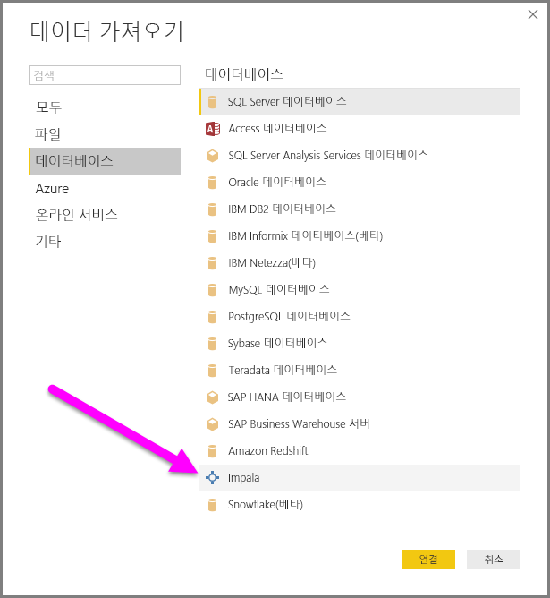
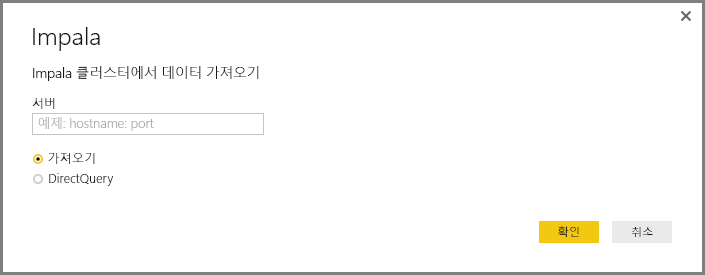
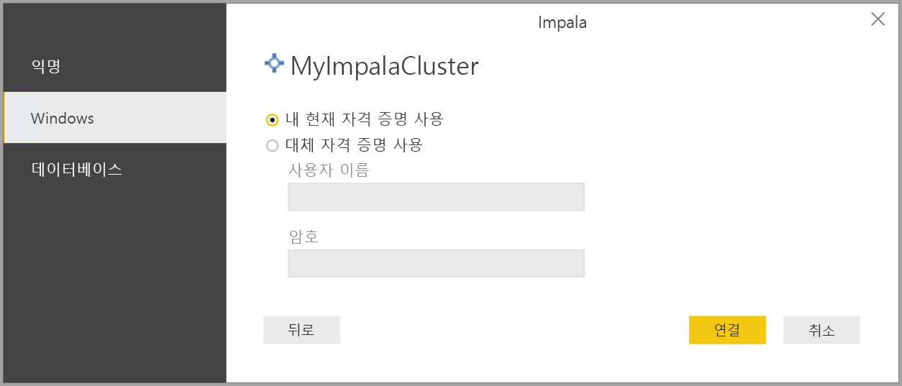
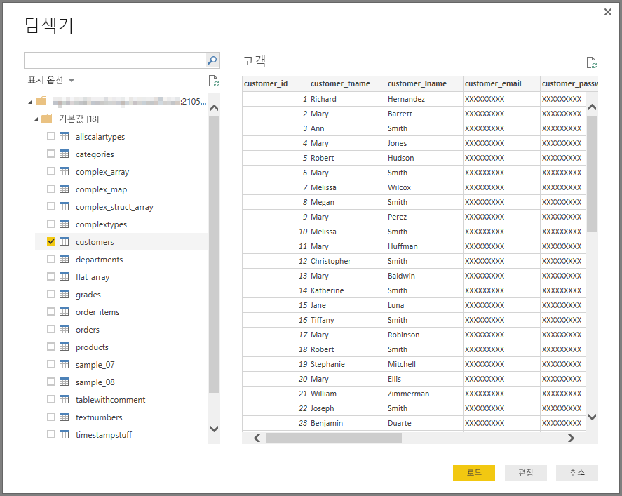

# Power BI Desktop에서 Impala 데이터베이스에 연결
Power BI Desktop에서 **Impala** 데이터베이스에 연결하고 Power BI Desktop의 다른 데이터 원본을 사용하는 것처럼 기본 데이터를 사용할 수 있습니다.

## Impala 데이터베이스에 연결
**Impala** 데이터베이스에 연결하려면 다음 단계를 수행합니다. 

1. Power BI Desktop의 **홈** 리본에서 **데이터 가져오기**를 선택합니다. 

2. 왼쪽 범주에서 **데이터베이스**를 선택합니다. 그러면 **Impala**가 표시됩니다.

    

3. **Impala** 창이 나타나면 상자에 Impala 서버 이름을 입력하거나 붙여넣습니다. 그런 다음, **확인**을 선택합니다. Power BI로 직접 데이터를 **가져오거나** **DirectQuery**를 사용할 수 있습니다. [DirectQuery 사용](desktop-use-directquery.md)에 대해 자세히 알아보세요.

    

4. 메시지가 표시되면 자격 증명을 입력하거나 익명으로 연결합니다. Impala 커넥터는 익명, 기본(사용자 이름 + 암호) 및 Windows 인증을 지원합니다.

    

    > [!NOTE]
    > 특정 **Impala** 서버에 사용자 이름 및 암호를 입력하면 Power BI Desktop에서 후속 연결을 시도할 때에도 동일한 자격 증명을 사용합니다. **파일 > 옵션 및 설정 > 데이터 원본 설정**으로 이동하여 해당 자격 증명을 수정할 수 있습니다.

5. 연결한 후 **탐색기** 창이 나타나고 서버에서 사용 가능한 데이터가 표시됩니다. 이 데이터의 요소를 선택하여 **Power BI Desktop**에 가져오고 사용합니다.

    

## 고려 사항 및 제한 사항
**Impala** 커넥터에서 유의해야 하는 몇 가지 제한 사항 및 고려 사항이 있습니다.

* Impala 커넥터는 세 가지 지원되는 인증 메커니즘 중 하나를 사용하여 온-프레미스 데이터 게이트웨이에서 지원됩니다.

## 다음 단계
Power BI Desktop을 사용하여 연결할 수 있는 다양한 데이터 원본이 있습니다. 데이터 원본에 대한 자세한 내용은 다음 리소스를 참조하세요.

* [Power BI Desktop이란?](desktop-what-is-desktop.md)
* [Power BI Desktop의 데이터 원본](desktop-data-sources.md)
* [Power BI Desktop에서 데이터 셰이핑 및 결합](desktop-shape-and-combine-data.md)
* [Power BI Desktop에서 Excel 통합 문서에 연결](desktop-connect-excel.md)   
* [Power BI Desktop에 데이터 직접 연결](desktop-enter-data-directly-into-desktop.md)   

