# Power BI Desktop에서 LinkedIn Sales Navigator에 연결

**Power BI Desktop**에서 **LinkedIn Sales Navigator**에 연결하여 Power BI Desktop의 다른 데이터 원본과 마찬가지로 관계를 찾아 빌드하고 진행 상황에 대한 미리 만들어진 보고서를 만들 수 있습니다.

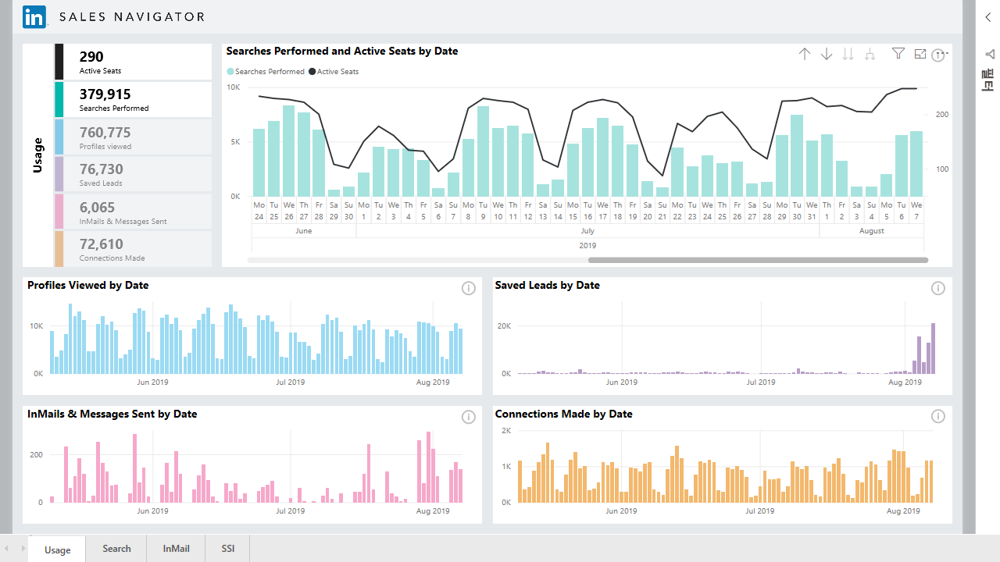

**LinkedIn Sales Navigator**를 사용하여 LinkedIn 데이터에 연결하려면 LinkedIn Sales Navigator Enterprise 요금제가 있어야 하며 Sales Navigator 계약에 대한 관리자 또는 보고 사용자여야 합니다.

다음 비디오에서는 [이 문서의 뒷부분](#using-the-linkedin-sales-navigator-template-app)에서 자세히 설명하는 **LinkedIn Sales Navigator** 템플릿 앱을 사용하기 위한 간략한 둘러보기 및 자습서를 제공합니다. 

> [!VIDEO https://www.youtube.com/embed/ZqhmaiORLw0]

## LinkedIn Sales Navigator에 연결

**LinkedIn Sales Navigator** 데이터에 연결하려면 Power BI Desktop의 **홈** 리본 메뉴에서 **데이터 가져오기**를 선택합니다. 왼쪽에 있는 범주에서 **온라인 서비스**를 선택한 다음 **LinkedIn Sales Navigator(베타)** 가 표시될 때까지 스크롤합니다.

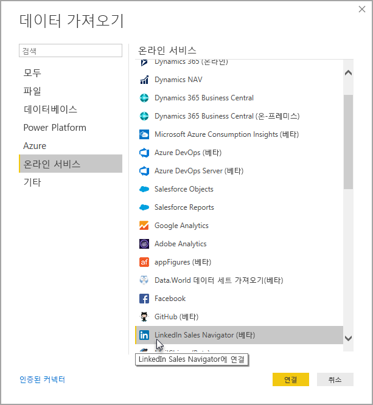

아직 개발 중인 타사 커넥터에 연결 중이라는 메시지가 표시됩니다. 

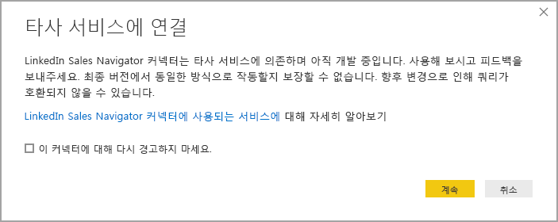

**계속**을 선택하면 원하는 데이터를 지정하라는 메시지가 표시됩니다.

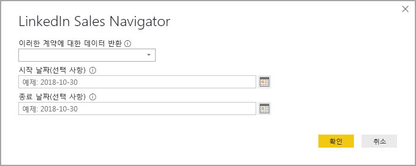

표시되는 **LinkedIn Sales Navigator** 창의 첫 번째 드롭다운 선택기에서 반환하려는 데이터, 즉 *모든 연락처* 또는 *선택한 연락처*를 선택합니다. 그런 다음 시작 및 종료 날짜를 지정하여 수신하는 데이터를 특정 기간으로 제한할 수 있습니다.

정보를 제공하면 Power BI Desktop는 LinkedIn Sales Navigator 계약과 연결된 데이터에 연결됩니다. 웹 사이트를 통해 LinkedIn Sales Navigator에 로그인하는 데 사용하는 것과 동일한 이메일 주소를 사용합니다. 

성공적으로 연결되면 **탐색기** 창에서 LinkedIn Sales Navigator 계약에서 데이터를 선택하라는 메시지가 표시됩니다.

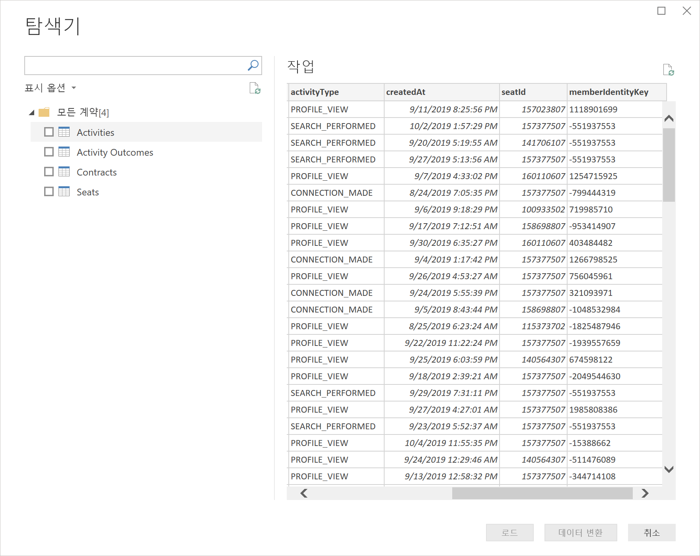

LinkedIn Sales Navigator 데이터를 사용하여 원하는 모든 보고서를 만들 수 있습니다. 작업을 더 쉽게 수행할 수 있도록 이미 샘플 데이터가 들어 있는 LinkedIn Sales Navigator .PBIX 파일을 다운로드할 수도 있습니다. 그러면 처음부터 시작하지 않아도 데이터 및 보고서에 익숙해질 수 있습니다.

다음 위치에서 PBIX 파일을 다운로드할 수 있습니다.
* [LinkedIn Sales Navigator용 PBIX](service-template-apps-samples.md)

.PBIX 파일 외에도 LinkedIn Sales Navigator에는 다운로드하여 사용할 수 있는 템플릿 앱도 있습니다. 다음 섹션에서는 이 템플릿 앱에 대해 자세히 설명합니다.

## LinkedIn Sales Navigator 템플릿 앱 사용

**LinkedIn Sales Navigator**를 최대한 쉽게 사용하려면 LinkedIn Sales Navigator 데이터에서 미리 만들어진 보고서를 자동으로 만드는 [템플릿 앱](service-template-apps-overview.md)을 사용할 수 있습니다.

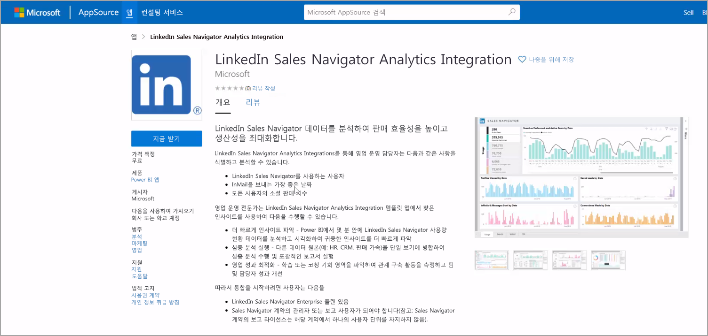

앱을 다운로드할 때 데이터에 연결할지 아니면 샘플 데이터를 사용하여 앱을 탐색할지 선택할 수 있습니다. 샘플 데이터를 탐색한 후 다시 돌아가서 자신의 LinkedIn Sales Navigator 데이터에 연결할 수 있습니다. 

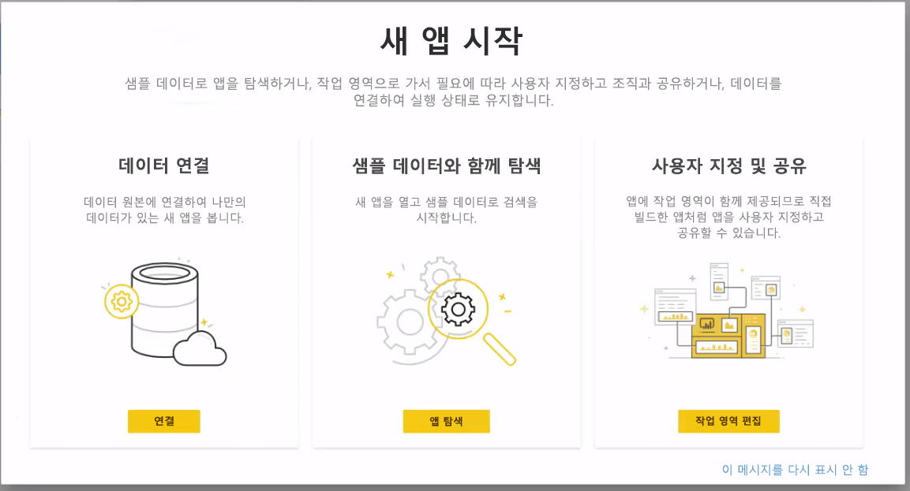

다음 링크에서 **LinkedIn Sales Navigator** 템플릿 앱을 가져올 수 있습니다.
* [LinkedIn Sales Navigator 템플릿 앱](https://appsource.microsoft.com/product/power-bi/pbi-contentpacks.linkedin_navigator-preview?flightCodes=17ad4c68-fbc5-4925-a351-139fd384ec33)

이 템플릿 앱은 정보를 분석하고 공유하는 데 도움이 되는 4개의 탭을 제공합니다.

* 사용
* 검색
* InMail
* SSI

**사용량** 탭은 전체 LinkedIn Sales Navigator 데이터를 표시합니다.

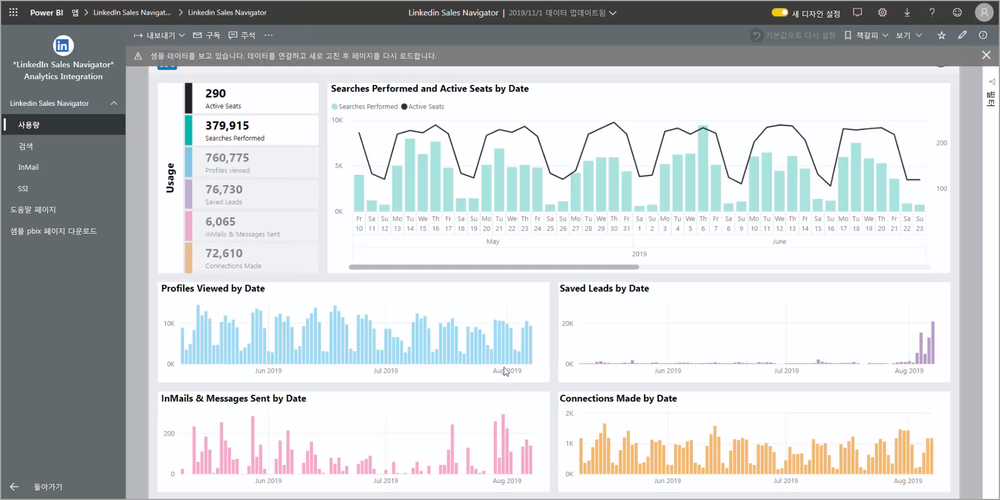

**검색** 탭을 사용하여 검색 결과를 심층적으로 드릴할 수 있습니다.

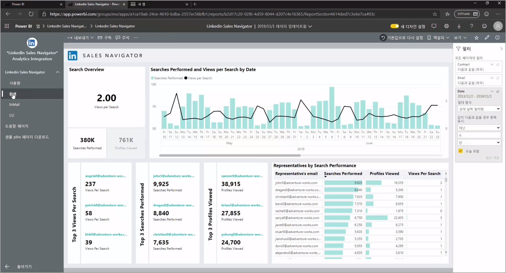

**InMail**은 보낸 InMail 수, 수락률 및 기타 유용한 정보를 포함하여 InMail 사용량에 대한 정보를 제공합니다.

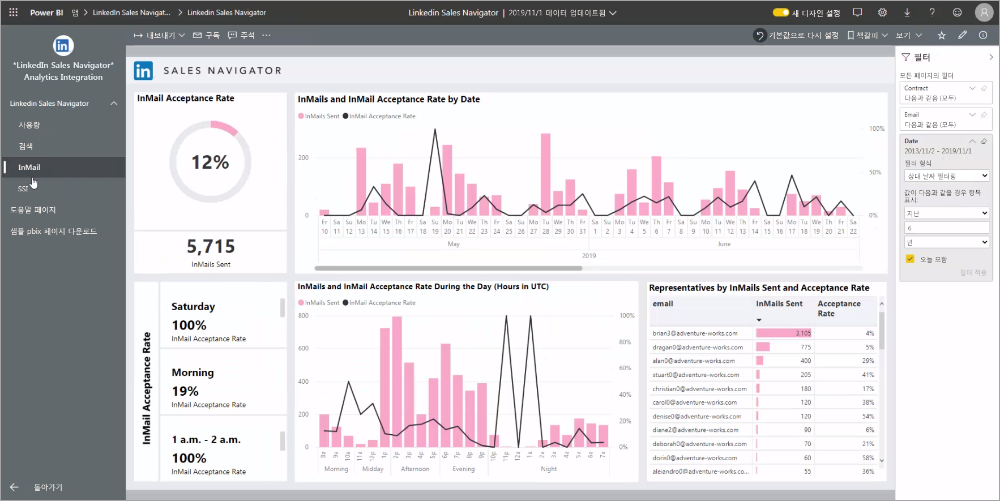

**SSI** 탭은 다음과 같이 SSI(소셜 판매 지수)에 추가 세부 정보를 제공합니다.

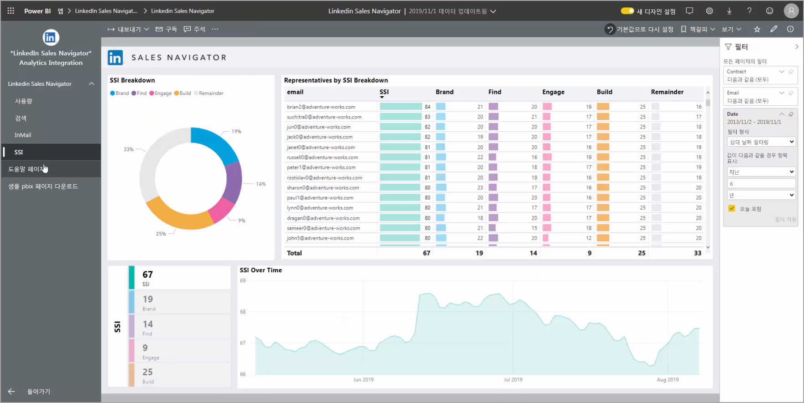

샘플 데이터에서 자체 데이터로 이동하려면 오른쪽 위 모서리에서 **앱 편집**(연필 아이콘)을 선택한 다음, 표시되는 화면에서 **데이터 연결**을 선택합니다.

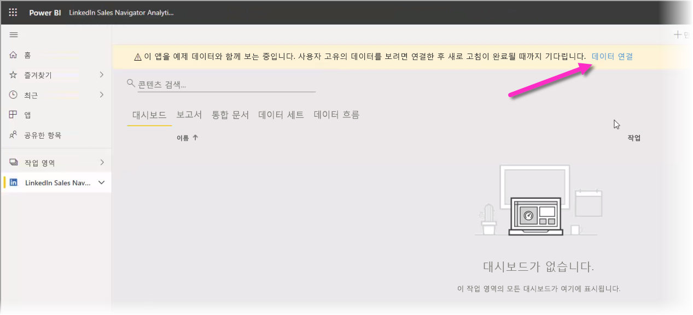

그런 다음 자신의 데이터를 연결하고 며칠간 데이터를 로드할지 선택할 수 있습니다. 최대 365일간 데이터를 로드할 수 있습니다. 웹 사이트를 통해 LinkedIn Sales Navigator에 로그인하는 데 사용하는 것과 동일한 이메일 주소를 사용하여 로그인해야 합니다. 

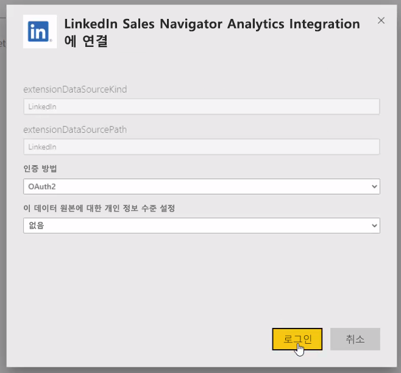

그러면 템플릿 앱이 사용자 데이터를 사용하여 앱 데이터를 새로 고칩니다. 또한 예약된 새로 고침을 설정할 수도 있습니다. 그러면 새로 고침 빈도에서 지정한 대로 앱 데이터가 최신 상태로 유지됩니다. 

데이터가 업데이트되면 사용자 자체 데이터로 채워진 앱을 볼 수 있습니다.

## 도움말 가져오기

데이터에 연결할 때 문제가 발생하는 경우 https://www.linkedin.com/help/sales-navigator 에서 LinkedIn Sales Navigator 지원에 문의할 수 있습니다. 

## 다음 단계
Power BI Desktop을 사용하여 연결할 수 있는 모든 종류의 데이터가 있습니다. 데이터 원본에 대한 자세한 내용은 다음 리소스를 확인하세요.

* [Power BI Desktop이란?](desktop-what-is-desktop.md)
* [Power BI Desktop의 데이터 원본](desktop-data-sources.md)
* [Power BI Desktop에서 데이터 셰이핑 및 결합](desktop-shape-and-combine-data.md)
* [Power BI Desktop에서 Excel 통합 문서에 연결](desktop-connect-excel.md)   
* [Power BI Desktop에 데이터 직접 연결](desktop-enter-data-directly-into-desktop.md)   

