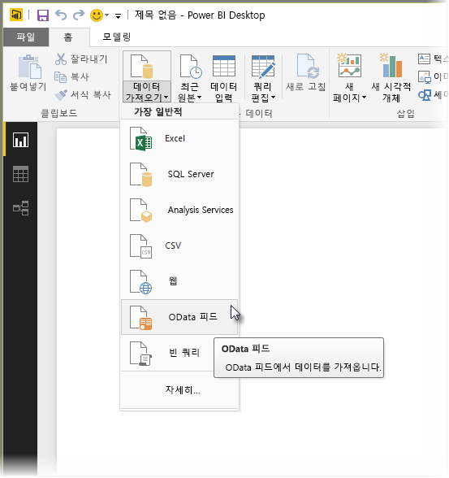
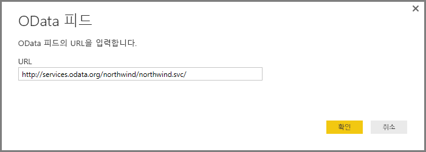
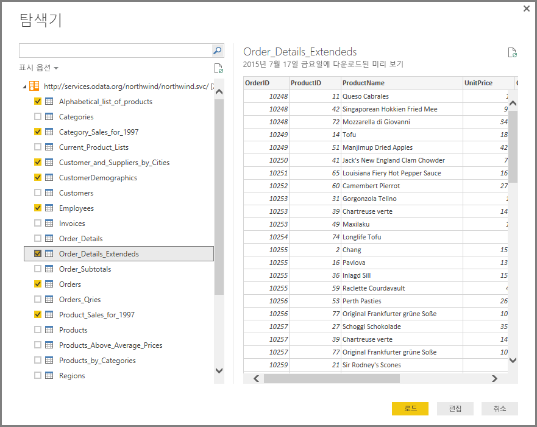
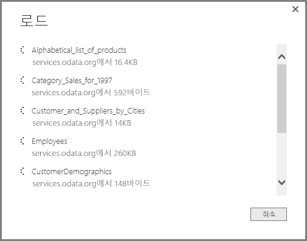
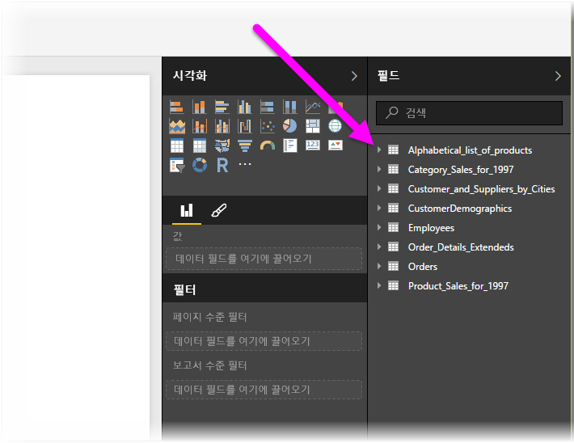

# Power BI Desktop에서 OData 피드에 연결
Power BI Desktop에서 **OData 피드**에 연결하고 Power BI Desktop의 다른 데이터 원본처럼 기본 데이터를 사용할 수 있습니다.

OData 피드에 연결하려면 Power BI Desktop의 **홈** 리본에서 **데이터 가져오기 > OData 피드**를 선택합니다.

나타나는 **OData 피드** 창에서 입력란에 OData 피드 URL을 입력하거나 붙여넣고 **확인**을 선택합니다.

Power BI Desktop이 OData 피드에 연결되고 **탐색기** 창에 사용 가능한 테이블 및 기타 데이터 요소가 표시됩니다. 요소를 선택하면 **탐색기** 창의 오른쪽에 데이터 미리 보기가 표시됩니다. 가져올 만큼 많은 테이블을 선택할 수 있습니다. **탐색기** 창에 현재 선택한 테이블의 미리 보기가 표시됩니다.

**편집** 단추를 선택하면 **쿼리 편집기**가 실행되며 여기에서 데이터를 Power BI Desktop으로 가져오기 전에 OData 피드 데이터의 모양을 지정하고 변환할 수 있습니다. 또는 **로드** 단추를 선택하고 왼쪽 창에서 선택한 모든 데이터 요소를 가져올 수 있습니다.

**로드**를 선택하면 Power BI Desktop에서 선택한 항목을 가져오고 가져오기 진행 상태의 **로드** 창이 표시됩니다.

완료되면 Power BI Desktop에서 선택한 테이블 및 기타 데이터 요소를 Power BI Desktop의 *보고서* 보기 오른쪽에 있는 **필드** 창에서 사용할 수 있습니다.

이것으로 끝입니다!

이제 OData 피드에서 가져온 데이터를 Power BI Desktop에서 사용하여 시각적 개체, 보고서를 만들거나 기타 Excel 통합 문서, 데이터베이스 또는 기타 데이터 원본처럼 연결 및 가져오려는 다른 모든 데이터를 조작할 수 있습니다.

### 다음 단계
Power BI Desktop을 사용하여 연결할 수 있는 모든 종류의 데이터가 있습니다. 데이터 원본에 대한 자세한 내용은 다음 리소스를 확인하세요.

* [Power BI Desktop 시작](desktop-getting-started.md)
* [Power BI Desktop의 데이터 원본](desktop-data-sources.md)
* [Power BI Desktop에서 데이터 셰이핑 및 결합](desktop-shape-and-combine-data.md)
* [Power BI Desktop에서 Excel 통합 문서에 연결](desktop-connect-excel.md)   
* [Power BI Desktop에 데이터 직접 연결](desktop-enter-data-directly-into-desktop.md)   

