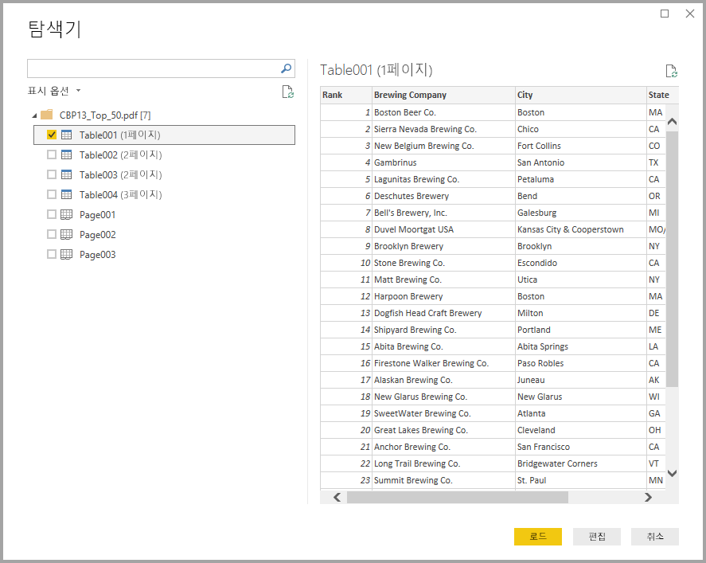
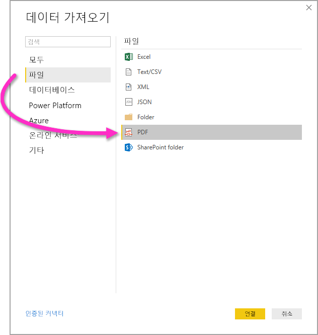

# Power BI Desktop에서 PDF 파일에 연결
Power BI Desktop에서 Power BI Desktop의 다른 데이터 원본처럼 **PDF 파일**에 연결하여 파일에 포함된 데이터를 사용할 수 있습니다.

다음 섹션에서는 **PDF 파일**에 연결하고, 데이터를 선택하고, 해당 데이터를 **Power BI Desktop**으로 가져오는 방법에 대해 설명합니다.

[Power BI Desktop 가져오기](desktop-get-the-desktop.md)의 링크에서 설치할 수 있는 **Power BI Desktop**의 최신 릴리스로 업그레이드하는 것이 좋습니다. 

## PDF 파일에 연결
**PDF** 파일에 연결하려면 Power BI Desktop의 **홈** 리본에서 **데이터 가져오기**를 선택합니다. 왼쪽의 범주에서 **파일**을 선택하면 **PDF**가 표시됩니다.

사용하려는 PDF 파일의 위치를 제공하도록 요구하는 메시지가 표시됩니다. 파일 위치를 제공하고 PDF 파일이 로드되면 **탐색기** 창이 나타나고, 파일에서 사용 가능한 데이터를 표시합니다. 여기서 하나 이상의 요소를 선택하여 **Power BI Desktop**에 가져오고 사용할 수 있습니다.

PDF 파일에서 검색된 요소 옆의 확인란을 선택하면 오른쪽 창에 해당 요소가 표시됩니다. 가져올 준비가 되면 **로드** 단추를 선택하여 **Power BI Desktop**으로 데이터를 가져옵니다.

**Power BI Desktop**의 2018년 11월 릴리스부터 PDF 연결에 대한 선택적 매개 변수로 **Start page** 및 **End Page**를 지정할 수 있습니다. 다음 형식을 사용하여 M 수식 언어로 이러한 매개 변수를 지정할 수도 있습니다.

`Pdf.Tables(File.Contents("c:\sample.pdf"), [StartPage=10, EndPage=11])`

## 다음 단계
Power BI Desktop을 사용하여 연결할 수 있는 모든 종류의 데이터가 있습니다. 데이터 원본에 대한 자세한 내용은 다음 리소스를 확인하세요.

* [Power BI Desktop이란?](desktop-what-is-desktop.md)
* [Power BI Desktop의 데이터 원본](desktop-data-sources.md)
* [Power BI Desktop에서 데이터 셰이핑 및 결합](desktop-shape-and-combine-data.md)
* [Power BI Desktop에서 Excel 통합 문서에 연결](desktop-connect-excel.md)   
* [Power BI Desktop에 데이터 직접 연결](desktop-enter-data-directly-into-desktop.md)   

